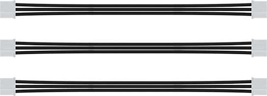
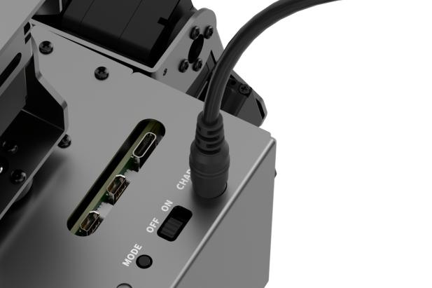
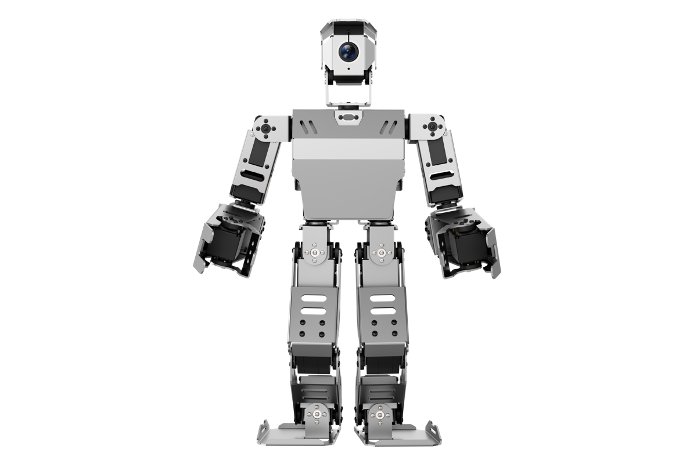
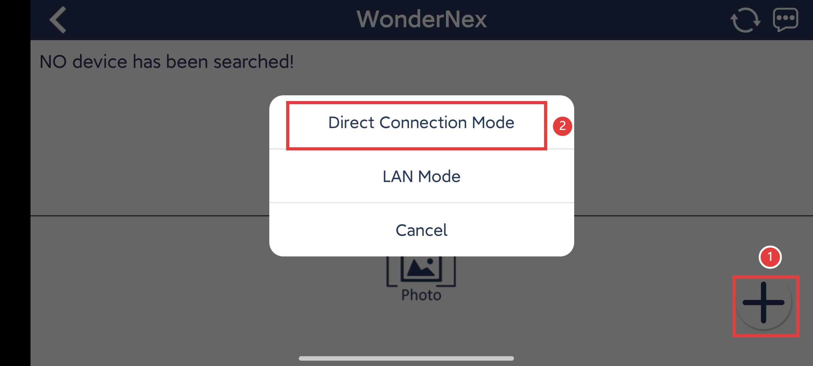
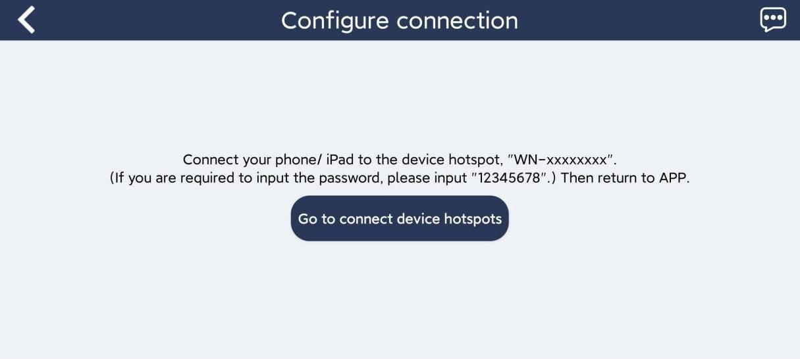
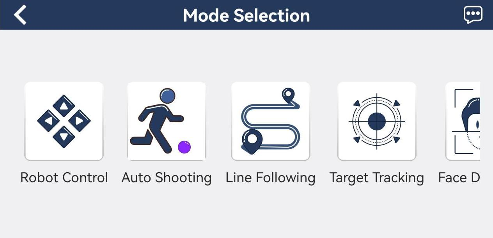
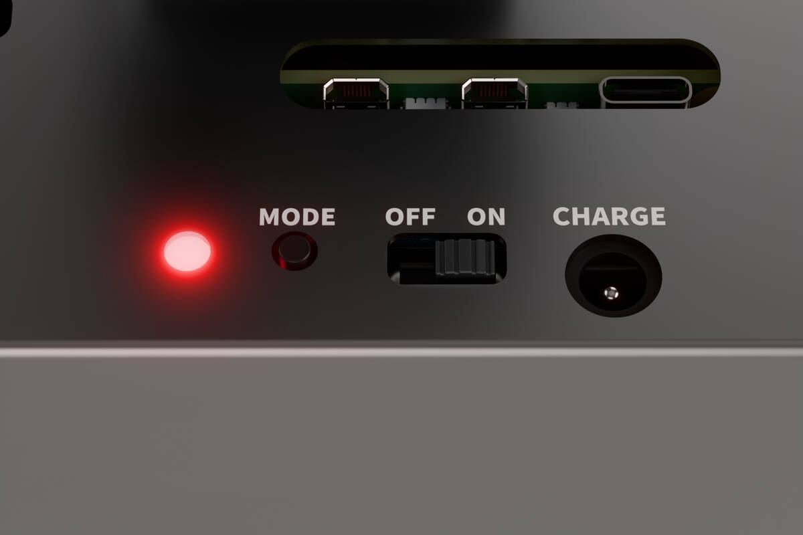

# 1. ROS Robot Introductory Course

## 1.1 Introduction to the ROSMan Humanoid Robot

### 1.1.1 Introduction

The ROSMan intelligent vision humanoid robot is a competition robot developed based on the Raspberry Pi 5B platform. The robot features 24 degrees of freedom (DOF) across its entire body, including axially-moving hip joints. It is powerful and highly flexible, capable of performing complex actions such as walking straight, in-place turning, climbing stairs, hurdling, and object grasping.
The robot's head is equipped with a high-definition wide-angle camera module with 2 degrees of freedom. It also has two 4-DOF robotic arms, each with motorized hands that open and close, enabling intelligent functions such as object grasping, sorting, pouring, and transportation. A protective bracket is installed to safeguard the camera on the head.
The robot's controller runs the Raspberry Pi Debian 12 operating system and features the ROS Noetic framework within a Docker container.
Image recognition is powered by OpenCV, and PID algorithms are used for rapid object position tracking. The robot is capable of autonomous tasks such as auto shooting, autonomous line following, and self-driven object transportation.

### 1.1.2 Notes

Please observe the following guidelines when using and storing ROSMan:

(1) ROSMan contains small parts and sharp pins, making it unsuitable for children under 12 years old.

(2) Minors must use this product under the supervision and guidance of an adult.
Small and pointed components may pose a choking or injury risk. Do not put them in your mouth or apply pressure.

(3) ROSMan includes conductive components. Do not touch it with metal objects while powered on.

(4)  Do not forcefully twist the robot after it is powered on, as this may cause damage to the robot.

(5)  If the product will not be used for an extended period, fully charge the battery, remove it, and store it in a cool, dry place.

### 1.1.3 Copyright Notice

This manual is the intellectual property of Shenzhen Hiwonder Technology Co., Ltd. No part of this document may be copied, reproduced, translated, or distributed without prior written permission.

Any unauthorized use or infringement will be subject to legal action.

### 1.1.4 Disclaimer

The products described in this manual are provided on an "**as-is**" basis, including hardware, software, etc. While every effort has been made to ensure the accuracy of the content at the time of writing, we do not guarantee that the manual is completely free of errors or omissions. The material will be periodically reviewed, and we encourage users to provide feedback for improvements.
As the product is updated with new versions, its features and specifications may change. Please contact customer service at the time of purchase for the latest product information. 
Furthermore, Hiwonder is not responsible for any malfunctions or damages caused by using the product in extreme conditions unless explicitly stated by Hiwonder as suitable for such use.

## 1.2 Packing List

After receiving your ROSMan robot, please refer to the packing list below to verify that all components are included. If you find that any parts are missing, feel free to contact our customer support team for assistance. 

| NO.  | Components                          | Quantity | Picture                                                    |
| ---- | ----------------------------------- | -------- | ---------------------------------------------------------- |
| 1    | ROSMan                              | 1        |  |
| 2    | 12.6V 2A charger（DC 5.5*2.5 male） | 1        |  |
| 3    | Wireless Controller                 | 1        |  |
| 4    | Card reader                         | 1        |  |
| 5    | Purple ball（6.3cm）                | 1        |  |
| 6    | Servo cable（10cm）                 | 3        |  |
| 7    | Servo cable（20cm）                 | 3        |  |
| 8    | Sensor cable（10cm）                | 3        |  |
| 9    | Accessory bag                       | 1        |  |

<p id="anchor_1_3"></p>

## 1.3 Preparation

### 1.3.1 Charging Instruction

ROSMan robot is powered by an 11.1V lithium battery. Please use the dedicated charger provided with the kit. Due to the need to power off the robot during transportation and limitations on fully charging the battery, users are required to charge the battery using the provided dedicated charger before the initial startup.

It typically takes around 1 hours to reach a full charge. Additionally, to maintain the optimal performance of the robot, please charge the battery promptly when the voltage is ≤10.3V.

The operations for charging are as follow:

(1) Turn **OFF** the robot.


(2) Connect battery wires, ensuring that each wire matches its corresponding color.


(3) Connect the provided charger to the DC power port of the Raspberry Pi expansion board as pictured:




(4) If the indicator is in red, it means that the battery is being charged. When the indicator turns green, the battery is fully charged. The charging time is about 3 hours.

### 1.3.2 Precaution for the Use of LiPo Battery

Due to the need to power off the robot during transportation and limitations on fully charging the battery, users are required to charge the battery using the provided dedicated charger before the initial startup.

(1) Before charging or using the robot, make sure to connect the battery using the red-to-red and black-to-black wiring configuration. If the robot will not be used for an extended period, disconnect the battery connector. Do not pull on the wires directly when unplugging, which may damage the connectors.

(2) Only use the included charger for charging. Make sure the robot is powered off during charging. Do not use the robot while it is charging.

(3) When the battery is connected with power supplied, a red indicator light means charging is in progress. When the light turns green, charging is complete. Once charging is finished, promptly unplug the charging cable and turn off the power to prevent overcharging.

(4) Do not connect the battery directly if the battery cable is not plugged into the Raspberry Pi expansion board. This may cause a short circuit due to reversed polarity and pose a safety hazard.

(5) To ensure stable robot performance, recharge the battery when the voltage drops below 10V. You can check the current battery level on the voltage display module located on the back of the robot.


Solemn Declaration: Our company shall not bear any responsibility for any product damage, economic losses, safety accidents, or other consequences caused by failure to follow the above "**Precaution for the Use of LiPo Battery**" .

## 1.4 Robot Hardware Structure

Introduction to Hardware

This section mainly introduces the robot's hardware, including the main control system, bus servos, high-definition camera, and OLED display module.


### 1.4.1 Introduction to Main Controller

The Raspberry Pi 5 uses a 64-bit quad-core Arm Cortex-A76 processor with a clock frequency of 2.4GHz. It provides 2 to 3 times the CPU performance compared to the Raspberry Pi 4. In addition to a significantly improved 800MHz VideoCore VII GPU for graphics performance, it supports dual 4Kp60 display output via HDMI, as well as advanced camera support with a redesigned Raspberry Pi image signal processor. This can provide smooth desktop experience and open up new applications for you.

This is the first full-size Raspberry Pi computer using chips built internally by Raspberry Pi. RP1 provides most of the I/O functions for the Raspberry Pi 5 and achieves a leap in peripheral performance and functionality. The total USB bandwidth has increased by more than twice, accelerating the transfer speed to external UAS drives and other high-speed peripherals. The dedicated dual-channel 1Gbps MIPI camera and display interfaces on early models have been replaced by a pair of four-channel 1.5Gbps MIPI transceivers, increasing the total bandwidth by three times and supporting any combination of up to two cameras or displays. The peak SD card performance is doubled by supporting SDR104 high-speed mode. For the first time, this platform introduces a single-channel PCIExpress 2.0 interface, providing support for high-bandwidth peripherals.

For more information about the Raspberry Pi mainboard, please refer to "**4. Raspberry Pi Baord and Expansion Board**".


### 1.4.2 HD Camera

In daily life, cameras are generally used to perform basic functions such as taking photos and recording videos.

With the advent of artificial intelligence, there is a growing demand for obtaining more intelligent results from cameras. That is, by analyzing the changes in the environment through the camera's field of view, making judgments, and feeding the results back to the terminal or cloud processors, to serve richer applications.

Its advantages lie in its simple sensors, low cost, ease of calibration, and recognition. Its disadvantage is that it cannot determine the real size of an object. It may be a large object far away or a small object nearby.


The specific parameters of the camera used in ROSMan robot can be referred to in the following table:

<table  class="docutils-nobg" border="1">
<colgroup>
<col style="width: 27%" />
<col style="width: 72%" />
</colgroup>
<tbody>
<tr>
<td style="text-align: center;"><strong>Parameter</strong></td>
<td style="text-align: center;"><strong>Description</strong></td>
</tr>
<tr>
<td style="text-align: center;">FOV</td>
<td style="text-align: left;">170°</td>
</tr>
<tr>
<td style="text-align: center;">Focal length</td>
<td style="text-align: left;">3.2mm</td>
</tr>
<tr>
<td style="text-align: center;"><p>Dimension</p>
<p>（Unit：mm）</p></td>
<td style="text-align: left;">30*25*25.0 ±0.5mm</td>
</tr>
<tr>
<td style="text-align: center;">Storage temperature</td>
<td style="text-align: left;">-30℃~70℃</td>
</tr>
<tr>
<td style="text-align: center;">Operating temperature</td>
<td style="text-align: left;">0℃~50℃</td>
</tr>
<tr>
<td style="text-align: center;">Focus Point</td>
<td style="text-align: left;">Fixed</td>
</tr>
<tr>
<td style="text-align: center;">Focusing</td>
<td style="text-align: left;">Manual lens focusing by twisting</td>
</tr>
<tr>
<td style="text-align: center;">Object Distance</td>
<td style="text-align: left;">30cm to infinity</td>
</tr>
<tr>
<td style="text-align: center;">Center Sharpness</td>
<td style="text-align: left;">600LW/PH（CENTER）</td>
</tr>
<tr>
<td style="text-align: center;">Data Transmission</td>
<td style="text-align: left;">USB2.0</td>
</tr>
<tr>
<td style="text-align: center;">Power Supply</td>
<td style="text-align: left;">USB bus end</td>
</tr>
<tr>
<td style="text-align: center;">Power Supply Voltage</td>
<td style="text-align: left;">DC 5V±5%</td>
</tr>
<tr>
<td style="text-align: center;">Maximum Power Consumption</td>
<td style="text-align: left;">40mW</td>
</tr>
<tr>
<td style="text-align: center;">System</td>
<td style="text-align: left;">Support Win XP/win 7、8 / vista /android 4.0/ mac /Linux with uvc</td>
</tr>
<tr>
<td style="text-align: center;">Maximum Effective Pixels</td>
<td style="text-align: left;">640（H）*480（V）</td>
</tr>
<tr>
<td style="text-align: center;">Sensitivity</td>
<td style="text-align: left;">2.5v / (lux-sec)</td>
</tr>
<tr>
<td style="text-align: center;">Pixel Size</td>
<td style="text-align: left;">3.4µm x 3.4µm</td>
</tr>
<tr>
<td style="text-align: center;">Resolutions and Frame Rates</td>
<td style="text-align: left;"><p>YUY2 160x120 30FPS</p>
<p>YUY2 176x144 30FPS</p>
<p>YUY2 320x240 30FPS</p>
<p>YUY2 352x288 30FPS</p>
<p>YUY2 640x480 30FPS</p></td>
</tr>
<tr>
<td style="text-align: center;">Signal-to-Noise Ratio</td>
<td style="text-align: left;">42db</td>
</tr>
<tr>
<td style="text-align: center;">Dynamic Range</td>
<td style="text-align: left;">58db</td>
</tr>
<tr>
<td style="text-align: center;">Shutter Type</td>
<td style="text-align: left;">Electronic rolling shutter</td>
</tr>
<tr>
<td style="text-align: center;">Automatic Exposure Control (AEC)</td>
<td rowspan="3" style="text-align: left;">Support</td>
</tr>
<tr>
<td style="text-align: center;">Automatic White Balance (AEB)</td>
</tr>
<tr>
<td style="text-align: center;">Automatic Gain Control (AGC)</td>
</tr>
<tr>
<td style="text-align: center;">Output Image Format</td>
<td style="text-align: left;">YUY2/MJPEG</td>
</tr>
<tr>
<td style="text-align: center;">Lens Structure</td>
<td style="text-align: left;">4E+IR</td>
</tr>
<tr>
<td style="text-align: center;">Aperture</td>
<td style="text-align: left;">2.4</td>
</tr>
<tr>
<td style="text-align: center;">Distortion</td>
<td style="text-align: left;">＜7.6%</td>
</tr>
</tbody>
</table>

### 1.4.3 HV Bus Servo

ROSMan's body consists of 3 types of bus servos, totaling 24 in number, namely HX-12H, HX-35H, and HX-35HM.

Bus servos utilize serial communication, connecting multiple servos to the control system via a single bus. Compared to digital servos, bus servos can be daisy-chained through a single I/O port, providing strong load capacity, high stability, and ease of maintenance and use. For more details, you can refer to [Appendix->Servo Data](resources_download.md).

Regarding the pinout and explanation of the interface pins, taking the HX-35H servo as an example, it is illustrated in the following diagram:


| **Pin** |                       **Instruction**                        |
| :-----: | :----------------------------------------------------------: |
|   \-    |                         Power ground                         |
|   \+    |                         Power input                          |
|    S    | Signal terminal (half-duplex UART asynchronous serial interface) |

<p id="anchor_1_5"></p>

## 1.5 First Start & Examination

### 1.5.1 Notes

(1) To enable the robot to operate steadily, please fully charge the robot when the battery voltage drops below 10V. For instructions on charging the robot, please refer to [1. ROS Robot Introductory Course->1.3 Preparation](#anchor_1_3).

(2) Keep your face and eyes away from the robot when it is moving.

(3) Never put your finger near the robot's joints to prevent any risk of pinching.

(4) Keep an eye on edge to protect robot from falling.

(5) Continuous operation can cause servos to heat up. Please allow servos to cool down through a period of rest before resuming operation.

(6) Get servo changed after prolonged or excessive use.

### 1.5.2 Start the Robot

(1) Prior to initiating the robot, ensure that the battery cable and USB cable are firmly connected.


(2) Gently place the robot in a natural kneeling position, as shown in the diagram below..


(3) Turn on the expansion board. After waiting for around 1 minute, you will hear the "Di" sound from buzzer, and then the robot stands up. When MODE indicator turns green, it indicates that the robot is boot up successfully.




(4) The robot will enter the default AP direct connection mode, and generate a WiFi starting with "**WN**" after it boots up successfully, and the password is "**12345678**".


## 1.6 APP & Wireless Controller Control

<p id="anchor_1_6_1"></p>

### 1.6.1 App Installation & Connection

* **Preparation**

(1) App Installation

**Android:** transfer the app installation pack stored in [WonderNex](https://play.google.com/store/apps/details?id=com.hiwonder.wondernex) folder. Please ensure all the permissions are allowed for this app, otherwise the app functions will be affected!

**iOS:** download [WonderNex](https://apps.apple.com/us/app/wondernex/id6474991135) app from App Store.

Please enable location service and WiFi before using the app.

(2) Start the Robot

Start the robot according to the robot according to the instructions provided in [1. ROS Robot Introductory->1.5 First Start & Examination](#anchor_1_5)

* **Device Connection**

After a successful boot-up, the robot will enter AP direct connection mode and create a WiFi network with the name starting with '**WN**.' Simply connect your phone to this '**WN**' WiFi network to begin the features.

Two network modes are available: direct connection mode and LAN mode.

(1) Introduction to Connection Mode

There are two network modes:

**AP direct connection mode:** the controller generates a WiFi which can be connected by phones. This WiFi has no internet access.

**STA LAN mode:** the controller actively connects to specific WiFi. You can access Internet in this mode.

Enabling LAN mode or direct connection mode may not be successful. ROSMan will default to AP direct connection mode. Whether you select AP direct connection mode or STA LAN mode, the robot will function in the same manner.

However, it is recommended to experience robot games under **Direct Connection Mode** first.

(2) Direct Connection (Must Read)

Take the instructions on Android app as example. The instructions are also applicable to iOS app.

Prior to operations, please turn on the robot.

① Open "**WonderNex**" app, then tap-on "**ROSMan**".


② Click "**+**" button, and select "**Direct Connection Mode**".



③ Follow the on-screen instructions to go to your phone's settings and connect to the Wi-Fi network starting with "**WN**". The password is "**12345678**".



:::{Note}

For iOS user, please do not return back to the app until the WiFi icon  appears above, otherwise the robot cannot be searched. If the robot cannot be searched, please click  to refresh.

:::

④ After successfully connecting to the robot WiFi, app automatically connects to the robot. When the robot icon appears, it means the connection is successful.


If you are informed of "No Internet Connection. Whether to keep connection", please select "Keep Connection".

(3) LAN Mode (Optional)

Take the instructions on Android app as example. The instructions are also applicable to iOS app.

① Join the local WiFi. Take "**hiwonder_5G**" as example.


② Open "**WonderNex**" app and select "**ROSMan**".


③ After successful network connection, return to the app. Then tap-on "**+**" button at lower right corner and select "**LAN mode**".


④ Enter the Wi-Fi password. Having entered the password, click-on "**OK**" button. Please ensure the password you enter is correct.


⑤ Click "**Go to connect device hotspots**". Join the WiFi starting with **WN**, and input the password "**12345678**". After connection, return to the app interface.


⑥ Then, WonderNex app is connecting to the robot automatically.


⑦ After a while, the interface will automatically return to the device list and begin searching for available devices. The device starting with "**ROSMan**" is your robot.


⑧ Press ROSMan robotic icon to check the IP and ID assigned to the robot.


⑨ If you need to revert to AP direct connection mode, press the robot icon again and click-on "**Set to direct connection mode**" until the LED light flashes.


### 1.6.2  App Control

* **Preparation**

Install WonderNex app and connect the robot to the app according to the tutorial saved in [1. ROS Robot Introductory Course->1.6 APP & Wireless Controller Control->1.6.1 App Installation & Connection](#anchor_1_6_1).

* **Start the Game**

Click-on ROSMan robotic icon to enter the mode selection interface.



(1) Robot Control

① Click the "**robot control**" icon to enter the game interface. Upon entering the game interface, ROSMan will reset to its initial posture.


| **Icon** | **Function** |
|:--:|:--:|
|  | Drag the joystick to control the robot to go forward or backward, and move left and right. |
|  | "**Action**" button enables the robot to execute predefined action groups, while the "**Attention**" button is used to guide the robot back to its initial posture. Additionally, the "**Get up**" button is employed to command the robot to recover from a fall and stand up |
|  | Live camera feed |
|  | Adjust robot's speed |
|  | Control robot's head movements |
|  | Adjust robot's body height |
|  | Control the robot turn left and right |
|  | Double click the screen to reset the robot's head back to the middle. |

② If you want to go back to the mode selection interface, click-on .

(2) Auto Shooting

:::{Note}

* Please operate in the well-lit indoor and avoid direct exposure to intense sunlight.

* To prevent misrecognition, kindly remove objects that are the same color as the target.

* If the recognition performance falls below the standard, you should adjust the color threshold based on the file saved in "**ROS+OpenCV Vision Recognition & Tracking\\ Lesson 2 Color Threshold Adjustment**".

:::

Click "**Auto Shooting**" to enter the feature's interface, which consists of two parts:

① The left side is control area of the feature.

② The right side is live camera feed.


**Icon function**

| **Icon** | **Function** |
|:--:|:--:|
|  | Start/ stop the feature |
|  | Adjust color threshold range from 0.05 to 1.00 |
|  | Extract the color of the designated area on the live camera feed |
|  | Display the extracted color |
|  | Display the live camera feed |

**Instructions:**

① Click-on "**Pick**" button, then drag the red circle onto the target object to pick the color.


② Tap-on "**Ok**" button, then the selected color will be displayed in the box.


③ Tap on "Start" button to enable the feature, then, the robot will determine the location of the target for shooting and kicking the ball.


④ If you want to go back to the mode selection interface, tap-on the blank area to make the navigation bar pop up. Then tap-on .

* **Autonomous Line Following**

:::{Note}

* Please operate in the well-lit indoor and avoid direct exposure to intense sunlight.

* To prevent misrecognition, kindly remove objects that are the same color as the target.

* If the recognition performance falls below the standard, you should adjust the color threshold based on the file saved in [6.ROS+OpenCV Vision Recognition & Tracking/ 6.2 Color Threshold Adjustment](6.ROS+OpenCV_Vision_Recognition_Tracking.md#color-threshold-adjustment).

:::

Click "**Line Following**" to enter the feature's interface, which consists of two parts:

① The left side is the control area of the feature.

② The right side is live camera feed.


**Icon function**

<table  class="docutils-nobg" border="1">
<colgroup>
<col style="width: 43%" />
<col style="width: 56%" />
</colgroup>
<tbody>
<tr>
<td style="text-align: center;"><strong>Icon</strong></td>
<td style="text-align: center;"><strong>Function</strong></td>
</tr>
<tr>
<td style="text-align: center;"></td>
<td style="text-align: center;">Start/ stop the game</td>
</tr>
<tr>
<td style="text-align: center;"></td>
<td style="text-align: center;"><p>Adjust color threshold range from 0.05 to 1.00.</p>
<p><strong>Note:</strong> The selected color range should be set appropriately. If the range is too narrow, the target color may not be detected. If the range is too wide, other colors may be mistakenly recognized, affecting the accuracy of color detection.</p></td>
</tr>
<tr>
<td style="text-align: center;"></td>
<td style="text-align: center;">Extract the color of the designated area on the live camera feed</td>
</tr>
<tr>
<td style="text-align: center;"></td>
<td style="text-align: center;">Display the extracted color</td>
</tr>
<tr>
<td style="text-align: center;"></td>
<td style="text-align: center;">Display the live camera feed</td>
</tr>
</tbody>
</table>

**Instructions**：

① Tap-on "**Pick**" color, then drag the red circle onto the target object to pick the color.


② Tap-on "**OK**" button, then the selected color will be displayed in the box.


③ Tap on "Start" button to enable the feature, then, the robot will determine the location of the target for line following.


④ If you want to go back to the mode selection interface, tap-on the blank area to make the navigation bar pop up. Then tap-on .

* **Target Tracking**

:::{Note}

* Please operate in the well-lit indoor and avoid direct exposure to intense sunlight.

* To prevent misrecognition, kindly remove objects that are the same color as the target.

* If the recognition performance falls below the standard, you should adjust the color threshold based on the file saved in [6. ROS+OpenCV Vision Recognition & Tracking->6.2 Color Threshold Adjustment](6.ROS+OpenCV_Vision_Recognition_Tracking.md#color-threshold-adjustment).

:::

Click "**Target Tracking**" to enter the feature's interface, which consists of two parts:

The left side is the control area of the feature.

The right side is live camera feed.


**Function**:

|                             **Icon**                              | **Function** |
|:-----------------------------------------------------------------:|:--:|
|  | Start/ stop the game |
|  | Adjust color threshold range from 0.05 to 1.00 |
|  | Extract the color of the designated area on the live camera feed |
|  | Display the extracted color |
|  | Display the live camera feed |

**Instructions:**

① Tap-on "**Pick**" color, then drag the red circle onto the target object to pick the color.


② Tap-on "**OK**" button, then the selected color will be displayed in the box.


③ Tap on "**Start**" button to enable the feature, then, the robot will determine the location of the target for movement tracking.


④ If you want to go back to the mode selection interface, tap-on the blank area to make the navigation bar pop up. Then tap-on .

* **Face Detection**

:::{Note}

the robot is capable of recognizing faces even when individuals are wearing masks and can simultaneously recognize multiple faces.

:::

Click "**Face Detection**" to enter the feature's interface, which consists of two parts:

① The left side is the control area of the feature.

② The right side is live camera feed.


Tap-on "**Start**" button. The robot can detect human face within 1 meter. Once detecting human face, the robot will execute "**waving**" action.

| **Icon** | **Function** |
|:--:|:--:|
|  | Start/ stop the game |

If you want to go back to the mode selection interface, tap-on the blank area to make the navigation bar pop up. Then tap-on .

### 1.6.3 Wireless Controller Control

* **Notes**

(1) Check whether the controller's receiver has been properly inserted. Typically, the receiver is inserted before delivery.

(2) Insert two AAA batteries ensuring the connection of the positive and negative terminals is correct.


(3) Whenever the robot is turned on, app auto-start service will be enabled. If the app auto-start service is not disabled, you can directly control the robot using wireless controller.

(4) Due to potential signal interference between controllers, we recommend not using this feature when operating multiple robots in the same area, to avoid accidental pairing or control issues.

(5) If the controller doesn't connect to the robot within 30s or there is no operation on the controller within 5 minutes after turning on, it will enter sleep mode. And you can press "**START**" to activate the controller.

* **Device Connection**

(1) Turn ON the wireless controller. Then, two LED lights (red and green) will flash simultaneously.

(2) After a few seconds, the robot will pair with the wireless controller automatically. When the controller pairs with the controller successfully, green LED light will keep lighting up, while red LED light will go off.


* **Instructions**

The mapping between the wireless controller buttons and the robot's actions is shown in the table below. The movement is based on the robot's own orientation.

:::{Note}

The left and right joysticks can be used together to enable more complex movement patterns.

:::

|          **Button**          |      **Function**       |
|:----------------------------:|:-----------------------:|
|  Move left joystick upward   |       Go forward        |
| Move left joystick downward  |       Go backward       |
|   Move left joystick left    |        Move left        |
|   Move left joystick right   |       Move right        |
|  Move right joystick upward  |    Raise body height    |
| Move right joystick downward |    Lower body height    |
|   Move right joystick left   | Rotate counterclockwise |
|  Move right joystick right   | Rotate counterclockwise |

## 1.7 Auto Shooting & Line Following Quick Start

To enable the robot to execute auto shooting and line following, you only need to press MODE button.

###  1.7.1 Preparation

(1) Ensure the camera cable is connected to USB port.

(2\) ROSMan completes auto shooting and line following through color recognition, which defaults to recognize blue ball and black line. If the recognition performance falls below the standard, you need to adjust the color threshold according to the the file saved in [6. ROS+OpenCV Vision Recognition & Tracking-> 6.2 Color Threshold Adjustment](6.ROS+OpenCV_Vision_Recognition_Tracking.md#color-threshold-adjustment).

(3) Verify whether the app's auto-start service is enabled, typically enabled by default.

If the auto-start service is disabled, you can connect to robot's remote system desktop and enter the following command to enable the auto-start service for app.

```
sudo systemctl restart start_node.service
```

Regarding remote connection, please refer to [3. ROS Robot Motion Basic Control Course -\> 3.1.1 Remote Desktop Tool Installation and Connection](3.ROS_Robot_Motion_Basic_Control_Course.md#remote-desktop-tool-installation-and-connection).

###  1.7.2 Instructions

After booting up, you can change robot's working mode by press "**MODE**" button. ROSMan has three modes: **Normal mode, Auto Shooting mode and Line-following mode**.

Press "**MODE**" button to switch mode for the robot. After you hear a "**Di**" sound, the mode is switched successfully. At the same time, RGB light will display in corresponding color, indicating the corresponding mode.

The specific instructions are listed below:

| **Mode** | **RGB light** | **Function** |
|:--:|:--:|:--:|
| Normal mode (default) | Green | App/ wireless controller control |
| Auto Shooting mode | Blue | Automatically track the purple ball and kick it away. |
| Line-following mode | Red | Autonomously follow black line |

:::{Note}

* APP control and wireless controller control need to be performed in normal mode, corresponding to the green RGB light. Do not remotely control the robot using a wireless controller when it functions in shooting mode or line- following mode, which will lead to program crashes and affect the subsequent use of the robot.

* Long pressing the "**MODE**" button will shut down the Raspberry Pi, and the buzzer will emit a long beep. It is important to note that this method performs a soft shutdown on the Raspberry Pi. Since the expansion board is still powered, the RGB and indicator lights on the expansion board will remain on. To completely power off, push the switch on the expansion board to "**OFF**".

:::

* **Normal Mode**

The robot will enter normal mode by default after booting up, indicated by a green illumination of the RGB light. Under normal mode, you can control the robot using app and wireless handle. For detailed instructions, please refer to the tutorials saved in "**App Control**" and "**Wireless Controller Control**".

:::{Note}

When in auto shooting and line following modes, avoid using the app and wireless controller to control the robot, as doing so may result in damage to the robot.

:::

* **Auto Shooting Mode**

The RGB light will change to blue when the robot enters auto shooting mode. Subsequently, the robot's head will rotate left and right to lock onto the blue ball. After identifying the ball, the robot's head and body will track its movements, approach it, and then execute the shooting action.


* **Intelligent Line Following**

In Line-following mode, RGB light turns red. The robot will lower its head to recognize the black line, then go forward following the black line.



### 1.7.3 Open Live Camera Feed

In both Auto Shooting mode and Line-following mode, you can view the camera feed in a browser via the **web_video_server** service. This service starts automatically when the mode is activated.

(1) Enter "**192.168.149.1:8080**" on the search bar of the browser to the backend of the **web_video_server** service.


(2) Click-on "**/color_detection/image_result**" to access to the live camera feed.


:::{Note}

If no video feed appears after click-on "**/color_detection/image_result**", it may be due to a loose camera connection or the auto-start service not being properly enabled. The specific troubleshooting steps are as follows:

* Replug the camera connection cable, and then follow the above steps to open the live camera feed and check the effect.

* Restart the robot's auto-start service by connecting to the remote desktop and entering the restart command in the terminal.

```
sudo systemctl restart start_node.service
```

Regarding the remote connection lesson, please refer to [3. ROS Robot Motion Basic Control Course->3.1.1 Remote Desktop Tool Installation and Connection](3.ROS_Robot_Motion_Basic_Control_Course.md#remote-desktop-tool-installation-and-connection).

:::