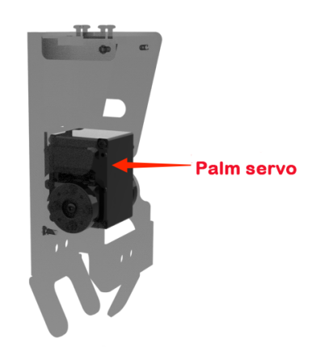

# 10. AI Vision Griping

## 10.1 Introduction to Movable Mechanical Hands

### 10.1.1 Introduction to ROSMan Arm

Before delving into the details of movable mechanical hands, let's start with a brief introduction to the ROSMan robotic arm. This robot arm is designed with inspiration from the human arm and is primarily comprised of three main parts: the upper arm, lower arm, and palm, making a total of three components with five degrees of freedom. The palm itself can be further divided into two sections: the palm's center and the back of the hand, and the gripping motion is accomplished through the use of the palm servo motor.


### 10.1.2 Introduction to Mechanical Hands

The movable mechanical hands are primarily composed of three parts: the back-of-the-hand bracket, the palm-center bracket, and the palm servo motor. The back-of-the-hand bracket is connected to the lower arm, and the palm servo motor drives the palm-center bracket to achieve the grasping of objects. Here, we illustrate this with the example of the left palm, as shown in the diagram below:





### 10.1.3 Distinguish Left and Right Arm

The movable mechanical palms are categorized as the left palm and the right palm, respectively, corresponding to the left arm and right arm. Adjust the robot's position so that the robot is facing away from you, using the robot's first-person perspective as a reference to differentiate between the left and right palms as shown in the diagram below.


## 10.2 Intelligent Color Sorting

In this task, the robot identifies color blocks using its camera and responds differently based on the detected color.

### 10.2.1 Project Process

The program first defines the color detection area and the colors to be recognized. Based on these, it generates color recognition parameters and publishes them to the detection node.

In the recognition callback function, it retrieves the detection results and executes corresponding actions—grabbing and placing the blocks using either the left or right hand—depending on the color detected. Different actions are performed for different colors to achieve sorting. To keep the logic organized, the program defines various states. Each state corresponds to a specific detection and action process.

The program functions as a ROS node and communicates with other nodes through ROS topics and services. Overall, this program demonstrates how to combine the robot's perception, manipulation, and ROS-based communication to implement a color-sorting application.

### 10.2.2 Enabling and Disabling the Feature

:::{Note}
*   Command input is case-sensitive and space-sensitive.
*   Since this feature conflicts with system services, please make sure to disable the system services before starting the feature. If you need to restart the system services after ending the feature, strictly follow the steps provided in the experiment instructions.
*   The program defaults to sort red and blue blocks. If you need to detect a different color, please refer to the instructions of [10.2.6 Feature Extensions -\> Change the Default Sorting Color](#anchor_10_2_6)  in this document.
:::

(1) To start the ROSMan robot, refer to [3. ROS Robot Motion  Basic Control Course -\> 3.1.1 Remote Desktop Tool Installation and Connection](3.ROS_Robot_Motion_Basic_Control_Course.md#remote-desktop-tool-installation-and-connection), and connect the robot to the VNC remote control software.

(2) Open the command-line terminal, enter the command and press Enter to disable ros service.

```
~/.stop_ros.sh
```

(3) Then enter the command in this directory to start the feature.

```
roslaunch rosman_example color_sort_node.launch
```

(4) To exit the feature, press **Ctrl+C** in the terminal. If the feature does not exit immediately, press **Ctrl+C** multiple times.

(5) When disabled the feature, open a terminal on the robot and enter the command to start the auto-start service. Then restart the mobile app and wait for the service to fully initialize.

```
sudo systemctl start start_node.service
```

### 10.2.3 Access Live Camera Feed (Optional)

:::{Note}
*   Command input is case-sensitive and space-sensitive.
*   Before starting the camera feed, make sure the Intelligent Color Sorting feature is running properly. Otherwise, the camera feed may fail to launch.
:::

After the feature is activated, you can view the camera feed in a browser by enabling the **"web_video_server"** service.

(1) Open the system browser and enter `192.168.149.1:8080` in the address bar. Press **Enter** to access the **"web_video_server"** backend.


(2) Then, click the `/color_detection/image_result` button to open the camera feed interface for the intelligent color sorting feature, as shown in the figure below.


### 10.2.4 Project Outcome

Place the robot in front of the workstation. When it detects a red color block, it will grab the block and place it on the right. When it detects a blue block, it will place it on the left. Upon detecting green, the robot will shake its head. If any other color is detected, the robot will remain idle.

### 10.2.5 Program Brief Analysis

The source code for the program is located at: [/home/ubuntu/ros_ws/src/rosman_example/scripts/color_sort/color_sort_node.py](../_static/source_code/color_sort.zip)

Based on the effects of the feature, the process logic has been outlined as shown in the diagram below:


* **Program Initialization**

First, Python libraries and ROS-related modules need to be imported. The `ColorSortNode` class is then defined, inheriting from the `Common` class. Within the constructor `__init__`, variable initialization and node startup are performed. The main steps include:

(1) Importing necessary libraries, such as: `rospy` for creating ROS nodes and handling ROS messages, `signal` for handling Unix signals.

{lineno-start=}
```python
import time
import copy
import rospy
import signal
from rosman_sdk import common
from rosman_example.color_common import Common
from rosman_interfaces.srv import SetString
from rosman_interfaces.msg import ObjectsInfo, ColorDetect
```

(2) Defining constants, including names of picking action groups to be executed, image processing dimensions.

{lineno-start=16}
```python
    # y_min, y_max, x_min, x_max分别表示占图像的比例(y_min, y_max, x_min, and x_max represent respectively the proportions of the image)
    # 定义颜色块区域(define color block region)
    block_roi = [5/8, 7/8, 3/8, 5/8]
    # 定义放块动作名字(define name for the action of putting down block)
    right_hand_put_block_action_name = 'right_hand_put_block'   # 右手放块动作(put down block with right hand)
    left_hand_put_block_action_name = 'left_hand_put_block'     # 左手放块动作(put down block with left hand)

    # 图像处理时缩放到这个分辨率(When process the image, scale it to this resolution)
    image_process_size = [160, 120]
```

(3) Initializing the ROS node, as well as setting initial values for state and flag variables.

{lineno-start=26}
```python
    def __init__(self, name):
        # 定义放块动作名字(define name for the action of putting down block)
        rospy.init_node(name)
        self.name = name
        self.count = 0          # 计数器(counter)
        self.running = True
        self.objects_info = []  # 存储识别结果(store recognition result)
        self.current_state = 'color_sort'   # 定义状态机(define state machine)
```

(4) Subscribing to the `/object/pixel_coords` topic to receive color detection results.

{lineno-start=46}
```python
        # 订阅颜色识别结果(subscribe to color recognition result)
        rospy.Subscriber('/object/pixel_coords', ObjectsInfo, self.get_color_callback)
        rospy.Service('~set_color', SetString, self.set_color_srv_callback)  # 设置颜色(set color)
```

The `set_color_srv_callback` function is used to set the color recognition parameters, specifically configuring the robot to recognize red, green, and blue color blocks.

* **Main Function**

The main function runs the `ColorSortNode` node and uses the `run()` method as the main loop to perform state checks and invoke functions like tracking and searching to accomplish the color sorting task.

{lineno-start=128}
```python
    def run(self):
        while self.running:
            if self.start:      # 根据状态机执行(execute based on the state machine)
                if self.state[self.current_state][2] == False:
                    self.state[self.current_state][2] = True
                    # 设置头部姿态(set head posture)
                    self.init_action(self.state[self.current_state][0][0], self.state[self.current_state][0][1])  # 头部姿态(head posture)
                    param = self.state[self.current_state][1][3](self.state[self.current_state][1][0],
                                                                 self.state[self.current_state][1][1],
                                                                 self.state[self.current_state][1][2])
                    self.detect_pub.publish(param)  # 颜色检测设置(set color detection)

                # 获取识别结果(obtain recognition result)
                blocks_data = None
                for object_info in self.objects_info:
                    if object_info.type == 'circle':
                        blocks_data = object_info
                # 调用处理函数(call processing function)
                if self.current_state == 'color_sort':
                    self.color_sort_process(blocks_data)
                
                time.sleep(0.01)
            else:
                time.sleep(0.01)
        # 当前状态完成后关闭节点(close node after the current state is completed)
        self.init_action(self.head_pan_init, self.head_tilt_init)
        self.stop_srv_callback(None)
        rospy.signal_shutdown('shutdown')
```

First, the program checks the current state of the robot, using `self.state` to store and update this state. Based on the current state, it sets the head pose using the head pose parameters from `self.init_action`.

Then, `self.state[self.current_state][1][3]` generates the parameters for color detection, which are published via `self.detect_pub.publish(param)` to start the detection process.

The program iterates through `self.objects_info` to obtain detection results. If the current state is **"color_sort"**, it calls the `self.color_sort_process(blocks_data)` function to handle the sorting operation.

After completing the task, the node shuts down, the head pose is reset to its initial position. And `self.stop_srv_callback` is called, finally, the ROS node is terminated using `rospy.signal_shutdown('shutdown')`.

* **Color Recognition and Sorting**


The robot first uses the `start_srv_callback` service to recognize colored blocks. After obtaining the recognition result from `get_color_callback`, the program enters the `color_sort_process` function to process the corresponding result.

If the recognized color is red, the robot executes the `right_hand_put_block` action group to place the block on the right side. If the recognized color is green, the robot's servos perform a head-shaking motion as programmed. If the recognized color is blue, it executes the `left_hand_put_block` action group to place the block on the left side.

For more information on color recognition, please refer to [6. ROS+OpenCV Vision Recognition & Tracking->6.3 Color Recognition](6.ROS+OpenCV_Vision_Recognition_Tracking.md#color-recognition).

<p id="anchor_10_2_6"></p>

### 10.2.6 Feature Extensions

* **Change the Default Sorting Color**

As previously described, the default program is set to sort red and blue blocks. When a green block is detected, the robot shakes its head. If any other color is detected, the robot remains idle.

In this section, we will change the sorting behavior so that: Green and blue blocks are sorted, while red blocks trigger the head-shaking motion. **Modification Steps:**

(1) First, navigate to the directory where the behavior script is located. If you're not already in that directory, run the following command:

```
roscd rosman_example/scripts/color_sort/
```

(2) Use the `vim` editor to open the feature's program:

```
vim color_sort_node.py
```

(3) Type `98` and press **Shift + G** to quickly jump to line 97, which is near the section you need to modify.


(4)Press the key **i** to enter edit mode, then swap **"red"** and **"green"**.


(5)After editing, press **Esc** to exit insert mode, then enter the command **":wq"** to save and exit: First type a colon using English input, then type `wq`.

* **Add New Colors for Sorting**

In addition to the three default colors, the system supports six built-in recognizable colors: red, yellow, blue, green, white, and black.

If you wish to add a new color, please refer to the tutorial in [6. ROS+OpenCV Vision Recognition & Tracking->6.2 Color Threshold Adjustment](6.ROS+OpenCV_Vision_Recognition_Tracking.md#color-threshold-adjustment), and add your custom color. The example below demonstrates how to add the color yellow:

(1)First, navigate to the directory where the behavior script is located. If you're not already in that directory, run the following command:

```
roscd rosman_example/scripts/color_sort/
```

(2)Use the `vim` editor to open the feature's program:

```
vim color_sort_node.py
```

(3)Type `36` and press **Shift + G** to quickly jump to line 36, which is near the section you need to modify.


(4)Press **i** to enter edit mode. In this section, you will see a dictionary storing the color recognition parameters. Locate the color list, which looks like `['red', 'green', 'blue']`. Replace one of the existing colors with the new one—e.g., change it to `['yellow', 'green', 'blue']` to replace red with yellow.


(5)Press **Esc** to exit insert mode, then type the following command to save and exit: First type a colon using English input, then type `wq`.

```
:wq
```

## 10.3 Line Following and Color Block Pickup

This task involves the robot recognizing green color blocks on both sides of the line during line following, picking them up, and placing them down upon reaching a crossroad.

### 10.3.1 Project Process

The program defines four states: `visual_patrol` (line following), `crawl_left` (left-hand pickup), `crawl_right` (right-hand pickup), and `place_block` (placement). The main state is line following, which subscribes to the `/object/pixel_coords` topic to receive color recognition results for identifying the target line and color blocks.

Three ROI (Region of Interest) areas are defined to detect the black line and obtain its position and width.

**An ROI (Region of Interest) is a specific area in an image selected for processing. By focusing the algorithm on this area, image processing can be made faster and more accurate.**

Next, the visual line-following processing function is called to control the robot's movement based on the line's position and width. When green color blocks are detected, the robot transitions into the pickup state. When a crossroad is detected, it switches to the placement state.

### 10.3.2 Enabling and Disabling the Feature

:::{Note}
*   Command input is case-sensitive and space-sensitive.
*   Since this feature conflicts with system services, please make sure to disable the system services before starting the feature. If you need to restart the system services after ending the feature, strictly follow the steps provided in the experiment instructions.
*   The default target color for color block pickup is green. If you need to detect a different color, please refer to the instructions of section * **[Change the Default Color Block to Pick Up](#anchor_10_3_5)** in this document.
:::

(1)To start the ROSMan robot, refer to [3. ROS Robot Motion Basic Control Course->3.1 Set Development Environment->3.1.1 Remote Desktop Tool Installation and Connection](3.ROS_Robot_Motion_Basic_Control_Course.md#remote-desktop-tool-installation-and-connection), and connect the robot to the VNC remote control software.

(2)Open the command-line terminal, enter the command and press Enter to disable ros service.

```
~/.stop_ros.sh
```

(3)Then enter the command in this directory and press Enter to start the feature.

```
roslaunch rosman_example visual_patrol_pick_up_node.launch
```

(4)To exit the feature, press **Ctrl+C** in the terminal. If the feature does not exit immediately, press **Ctrl+C** multiple times.

(5)After disabling the feature, you need to restart the system services. Otherwise, some ROSMan functions may malfunction. Enter the following command in the terminal to start the system services.

```
sudo systemctl restart start_node.service
```

### 10.3.3 Access Live Camera Feed (Optional)

:::{Note}
*   Command input is case-sensitive and space-sensitive.
*   Before starting the camera feed, make sure the Line Following and Color Block Pickup feature is running properly. Otherwise, the camera feed may fail to launch.
:::

After the feature is activated, you can view the camera feed in a browser by enabling the **"web_video_server"** service.

(1)Open the system browser and enter `192.168.149.1:8080` in the address bar. Press **Enter** to access the **"web_video_server"** backend.


(2)Then, click the `/color_detection/image_result` button to open the camera feed interface for the Intelligent Line Following feature, as shown in the figure below.


### 10.3.4 Project Outcome

You can use electrical tape to lay out black lines on the ground. Once the robot is placed on the black line, it will move forward following the direction of the black line.

During the line-following process, when the robot detects the green block for the first time, it will execute an action group to squat in place and pick up the block on the left with its left hand. If it detects a green block a second time while continuing to follow the line, it will execute an action group to squat in place and pick up the block on the right with its right hand.

Then, upon reaching the crossroad, the robot will move forward a bit further, squat down, and place both blocks down.

<p id="anchor_10_3_5"></p>

### 10.3.5 Feature Extensions

* **Change the Default Color Block to Pick Up**

The default color block to pick up is green. **To change it to red as an example. The modification steps are as follows:**

(1)First, navigate to the directory where the gameplay program is located. If you are not already in the directory, enter the following command and press Enter:

```
roscd rosman_example/scripts/visual_patrol_pick_up
```

(2)Use the `vim` editor to open the feature's program:

```
vim visual_patrol_pick_up_node.py
```

(3)Type `57` and press **Shift + G** to quickly jump to line 57, which is near the section you need to modify.


(4)Press the key **i** to enter edit mode, then change **"green"** to **"red"**.


(5)Press **Esc** to exit insert mode, then type the following command to save and exit: First type a colon using English input, then type `wq`.

```
:wq
```

* **Add New Colors for Sorting**

In addition to the three built-in basic colors for line-following, you can also configure other recognizable colors. First, refer to the tutorial in [6. ROS+OpenCV Vision Recognition & Tracking->6.2 Color Threshold Adjustment](6.ROS+OpenCV_Vision_Recognition_Tracking.md#color-threshold-adjustment), and add your custom color. Then, as the steps shown in  [Change the Default Color Block to Pick Up](#anchor_10_3_5) to change the color.

### 10.3.6 Program Brief Analysis

The source code of the program is located at: [/home/ubuntu/ros_ws/src/rosman_example/scripts/visual_patrol_pick_up/visual_patrol_pick_up_node.py](../_static/source_code/visual_patrol_pick_up.zip)

Based on the effects of the feature, the process logic has been outlined as shown in the diagram below:


* **Program Initialization**

{lineno-start=16}
```python
class VisualPatrolPickUp(Common):
    # 按顺序检测三个roi，如果检测到黑线立刻跳出(check three ROIs in order, and immediately exit if a black line is detected)
    line_roi = [(5 / 12, 6 / 12, 1 / 4, 3 / 4),
                (6 / 12, 7 / 12, 1 / 4, 3 / 4),
                (7 / 12, 8 / 12, 1 / 4, 3 / 4)
                ]

    block_roi = [0, 2 / 3, 0, 1]
    intersection_roi = [100 / 480, 340 / 480, 0, 1]
    # 向左左行走状态下的目标位置阈值(Threshold values for target position in walking left phase)
    enter_crawl_left_y = 290 / 480 # 当检测到的标识像素坐标y值占图像的比例大于此值时进入此阶段(When the detected object's y-coordinate in the image is greater than this value, it enters this phrase)
    crawl_left_x_stop = 265 / 640  # 左行走的x轴目标位置范围可在ApproachObject里设置)时停止前后移动(The target range of the x-axis position for walking left (can be set in ApproachObject); when the robot reaches this range, it stops moving forward or backward)
    crawl_left_y_stop = 290 / 480  # 左行走的y轴目标位置(范围可在ApproachObject里设置)时停止横向移动(The target range of the y-axis position for walking left (can be set in ApproachObject); when the robot reaches this range, it stops moving horizontally)
    crawl_left_yaw_stop = 0        # 当检测到的标识角度在此值附近(范围可在ApproachObject里设置)时停止旋转移动(The target range of the detected object's angle (can be set in ApproachObject); when the detected object's angle is within this range, the robot stops rotating)
    # 向左左行走状态下的目标位置阈值，原理同上(Threshold values for target position in walking right phase)
    enter_crawl_right_y = 280 / 480
    crawl_right_x_stop = 390 / 640
    crawl_right_y_stop = 272 / 480
    crawl_right_yaw_stop = 0
    # 放块状态下的目标位置阈值(Threshold values for target position in block placing phase)
    enter_place_block_y = 320 / 480
    place_block_x_stop = 320 / 640
    place_block_y_stop = 350 / 480
    place_block_yaw_stop = 0

    crawl_left_action_name = 'crawl_left'   # 左行走动作名称(name of the walking left action)
    crawl_right_action_name = 'crawl_right' # 右行走动作名称(name of the walking right action)
    place_block_action_name = 'place_block' # 放置方块动作名称(name of the block placing action)

    image_process_size = [160, 120]
```

First, Python libraries and ROS-related modules need to be imported. The `VisualPatrolPickUp` class is then defined, inheriting from the `Common` class. Within the constructor `__init__`, variable initialization and node startup are performed. The main steps include:

(1) Importing libraries, such as the `rospy` library for creating ROS nodes and handling ROS messages, the `signal` library for handling Unix signals, and libraries for color detection and ROI detection.

(2) Defining constants, including names of picking action groups to be executed, image processing dimensions, and the target colors for detection under different states.

(3) Initializing the ROS node, as well as setting initial values for state and flag variables.

(4) Initializing the gait manager (`gait_manager`) and motion manager (`motion_manager`), as well as the visual patrol node (`visual_patrol`) and approach object node (`approach_object`).

(5) Subscribing to the `/object/pixel_coords` topic to receive color detection results.

(6) Using the `set_color_srv_callback` function to set the color callback, which configures the visual patrol color as black and the intersection color also as black.

* **Main Function**

The main function runs the `VisualPatrolPickUp` node, and then enters the main loop through the `run()` function. In this loop, the robot performs line following, object pickup, and placement based on the current state.


(1)First, the program calls the `get_color_callback` function to obtain the results of color recognition, extracting data about the line, color blocks, and crossroads.

(2)By default, the program starts in the line-following state. While following the line, if a color block is detected on the left side of the line, the robot switches to the approaching state to move closer to the color block. Once certain conditions are met, the robot picks up the block and then switches back to the line-following state.

(3)The same logic applies to color blocks on the right side of the line. However, note that the robot must first complete the action of picking up the left-side block before it can recognize, approach, and pick up the right-side block on the next detection.

(4)After picking up the color blocks, the robot returns to the line-following state. When an intersection is detected, the robot switches to the approaching state again to move toward it. Once the set conditions are met, the robot places down the blocks and stops the program.

* **Color Block Pickup**

{lineno-start=171}
```python
    def enter_crawl_left(self, block_data):
        if block_data is not None:
            # 如果色块的y坐标大于高度的1/4,说明有一部分进入ROI区域(If the y-coordinate of the block is greater than 1/4 of its height, part of it is in the ROI area)
            if block_data.y > block_data.height / 4:
                self.count += 1
                if self.count > 5:  # 连续检测到满足条件,切换到左行走状态(If the condition is satisfied continuously for more than 5 times, switch to the walking left phase)
                    self.count = 0
                    self.gait_manager.disable()
                    self.motion_manager.run_action('hand_back')  # 手往后，防止遮挡(Move the hand back to prevent obstruction)
                    return True
            else:
                self.count = 0
        else:
            self.count = 0
        return False
```

This section explains how the robot picks up a color block on the left side. The process for picking up a right-side block is similar and can be referenced accordingly.

(1) When the robot detects a color block during line following, it checks whether the block falls within the defined ROI. If it does, a counter increases by 1. Once the block has been continuously detected in the ROI for a sufficient number of times, the robot switches from the line-following state to the approaching state and gradually moves closer to the block.

{lineno-start=216}
```python
    # 退出左行走判断函数(Exit the walking left judgment function)
    def exit_crawl_left(self, block_data):
        if block_data is not None:
            if self.approach_object.process(block_data.y, block_data.x, block_data.angle, 
                                            self.crawl_left_y_stop*block_data.height, self.crawl_left_x_stop*block_data.width, self.crawl_left_yaw_stop, block_data.width, block_data.height):
                self.gait_manager.disable()
                common.loginfo('crawl_left')
                self.motion_manager.run_action(self.crawl_left_action_name)
                self.visual_patrol.update_go_gait(arm_swap=0)
                self.visual_patrol.update_turn_gait(arm_swap=0)
                return True
        return False
```

(2) When the robot is close enough, it executes the **"crawl_left"** action group to pick up the left-side block. After the action is completed, the robot exits the approaching state and returns to the line-following state. Meanwhile, in the background, the counter records that a left-side block has already been picked up, so the next time a green block is detected on the right, the robot will use its right hand to pick it up.

* **Placement at Intersection**


{lineno-start=214}
```python
    def exit_place_block(self, line_data):
        if line_data is not None:
            if self.approach_object.process(max(line_data.y, line_data.left_point[1], line_data.right_point[1]), line_data.x, line_data.angle, 
                                            self.place_block_y_stop*line_data.height, self.place_block_x_stop*line_data.width, self.place_block_yaw_stop, line_data.width, line_data.height):
                self.gait_manager.disable()  # 关闭步态控制(close gait control)
                walking_param = self.gait_manager.get_gait_param()  # 获取当前的步态参数(get the current gait parameters)
                walking_param['body_height'] = 0.015                # 设置身体高度,单位米(set the body height in meters)
                walking_param['pelvis_offset'] = 7                  # 设置骨盆位置的前后偏移量,单位度(set the front and rear offset of the pelvis position in degrees)
                walking_param['step_height'] = 0.02                 # 设置步高,单位米(set the step height in meters)
                walking_param['hip_pitch_offset'] = 20              # 设置髋关节角度偏移量,单位度(set the hip joint angle offset in degrees)
                walking_param['z_swap_amplitude'] = 0.006           # 设置左右足高度交替时的振幅,单位米(set the amplitude of the left and right foot height alternation in meters)
                # 调用set_step 设置步态参数,包括步长、步频等(Call set_step to set the gait parameters, including step length, step frequency, etc)
                self.gait_manager.set_step([500, 0.2, 0.035], 0.02, 0, 0, walking_param, 0, 3)           
                common.loginfo('place_block')
                self.motion_manager.run_action(self.place_block_action_name)
                return True
```

After picking up both blocks, the robot continues line following. When it detects an intersection, it enters the intersection-handling function. Within this function, the red-boxed condition checks whether the robot has fully entered the intersection. If this condition is met repeatedly over multiple detections, it confirms that the robot is in position. Then, the robot walks forward using preset gait parameters. After moving to the correct position, it executes the **"place_block"** action group to place down the blocks.

## 10.4 Intelligent Dual-Arm Transport

In this feature, the robot identifies specific color blocks on the map and transports them to designated locations.

### 10.4.1 Project Process

The program defines four states—`track_block`, `pick_block`, `place_block`, and `track_tag`—to control the robot's behavior when tracking, picking up, and placing color blocks, as well as tracking destination tags.

During the tracking phase, the robot subscribes to the `/object/pixel_coords` topic to obtain color detection results. If no target block is detected, the robot will rotate in place to search for the target. Once the block is recognized, the robot identifies the sponge block based on the predefined color sequence and approaches it accordingly.

When the robot reaches the specified distance, it transitions to the **"pick"** state. In this state, it picks up the block and lifts it above its head.

Next, the state switches to **"track_tag"**, where the robot subscribes to the `/tag_detections` topic to obtain tag recognition results. And the robot moves toward the detected tag based on its position.

Once it arrives at the designated location, the robot transitions to the **"place_block"** state to place the block down. After completing the action, it returns to the initial state to continue tracking the next color block.

### 10.4.2 Enabling and Disabling the Feature

:::{Note}
*   Command input is case-sensitive and space-sensitive.
*   Since this feature conflicts with system services, please make sure to disable the system services before starting the feature. If you need to restart the system services after ending the feature, strictly follow the steps provided in the experiment instructions.
*   The program defaults to detect colors in the order of red, green, and blue. To change the handling sequence, refer to [Change the Default Transport Order](#anchor_10_4_5) in this document.
*   By default, red blocks are placed at Tag 1, green at Tag 2, and blue at Tag 3. To modify this setting, see section [Change Default Placement Locations](#anchor_10_4_5_2) in this document.
:::

(1) To start the ROSMan robot, refer to [3. ROS Robot Motion Basic Control Course -\> 3.1.1 Remote Desktop Tool Installation and Connection](3.ROS_Robot_Motion_Basic_Control_Course.md#remote-desktop-tool-installation-and-connection), and connect the robot to the VNC remote control software.

(2) Lay the provided map flat on a level surface, then place the ROSMan robot and the three sponge blocks of different colors randomly in the designated item placement area on the map, as shown in the image below.


(3) Open the command-line terminal, enter the command and press Enter to disable ros service.

```
~/.stop_ros.sh
```

(4) Then enter the command and press Enter to start the feature.

```
roslaunch rosman_example autonomous_transport_node.launch
```

(5) To exit the feature, press **Ctrl+C** in the terminal. If the feature does not exit immediately, press **Ctrl+C** multiple times.

(6) After disabling the feature, you need to restart the system services. Otherwise, some ROSMan functions may malfunction. Enter the following command in the terminal to start the system services.

```
sudo systemctl restart start_node.service
```

### 10.4.3 Access Live Camera Feed (Optional)

:::{Note}
*   Command input is case-sensitive and space-sensitive.
*   Before starting the camera feed, make sure the Intelligent Line Following feature is running properly. Otherwise, the camera feed may fail to launch.
:::

After the feature is activated, you can view the camera feed in a browser by enabling the **"web_video_server"** service.

(1) After the program starts successfully, open the system browser and enter `192.168.149.1:8080` in the address bar. Press **Enter** to access the **"web_video_server"** backend.


(2) Then, click the `/color_detection/image_result` button to open the camera feed interface for the Intelligent Line Following feature, as shown in the figure below.


### 10.4.4 Project Outcome

The robot will first transport the sponge blocks from the detection area and place them at the corresponding tag locations—red to Tag 1, green to Tag 2, and blue to Tag 3.

After placing a block, it will return to the detection area to search for the next sponge block and continue transporting them in the preset order.

<p id="anchor_10_4_5"></p>

### 10.4.5 Feature Extensions

* **Change the Default Transport Order**

The default transport order of the colors is red, green, and blue. **To change it, for example, to green, red, and blue, follow the steps below:**

(1) First, navigate to the directory where the behavior script is located. If you're not already in that directory, run the following command:

```
roscd rosman_example/scripts/autonomous_transport/
```

(2) Use the `vim` editor to open the feature's program:

```
vim autonomous_transport_node.py
```

(3) Type `37` and press **Shift + G** to quickly jump to line 35, which is near the section you need to modify.


(4) Press **i** to enter insert mode, and then swap **'red'** and **'green'** in the list `['red', 'green', 'blue']` so it becomes `['green', 'red', 'blue']`.


(5) Press **Esc** to exit insert mode, then type the following command to save and exit: First type a colon using English input, then type `wq`.

```
:wq
```

<p id="anchor_10_4_5_2"></p>

* **Change Default Placement Locations**

By default, red blocks are placed at Tag 1, green at Tag 2, and blue at Tag 3. **To change the placement—for example, swapping the red and blue positions—follow the steps below:**

(1) First, navigate to the directory where the behavior script is located. If you're not already in that directory, run the following command:

```
roscd rosman_example/scripts/autonomous_transport/
```

(2) Use the `vim` editor to open the feature's program:

```
vim autonomous_transport_node.py
```

(3) Type `33` and press **Shift + G** to quickly jump to line 33, which is near the section you need to modify.


(4) Press **i** to enter insert mode, then modify the mapping: Change **'red': 1** to **'red': 3**, and change **'blue': 3** to **'blue': 1**.


(5) Press **Esc** to exit insert mode, then type the following command to save and exit: First type a colon using English input, then type `wq`.

```
:wq
```

### 10.4.6 Program Brief Analysis

The source code for this program is located at: [/home/ubuntu/ros_ws/src/rosman_example/scripts/autonomous_transport/autonomous_transport_node.py](../_static/source_code/autonomous_transport.zip)

Based on the effects of the feature, the process logic has been outlined as shown in the diagram below:


* **Program Initialization**

First, Python libraries and ROS-related modules need to be imported. The `AutonomousTransportNode` class is then defined, inheriting from the `Common` class. Within the constructor `__init__`, variable initialization and node startup are performed. The main steps include:

(1) Import necessary libraries, such as `rospy` for ROS Python functionality, libraries for PID-based tracking control, `rosman_interfaces.msg` for handling color detection messages, and `rosman_example.approach_object` for logic related to approaching objects.

(2) Define constants, including the spatial relationship between colored blocks and tag positions relative to the camera, image processing dimensions, and the default transport sequence.

(3) Initializing the ROS node, set the initial system state, and assign initial values to key parameters.

(4) Initialize key managers and trackers, such as the gait manager (`gait_manager`), motion manager (`motion_manager`), horizontal and vertical PID trackers (`rl_track` and `ud_track`), and the object tracking class.

(5) Define the head movement position using the variable `head_move_position`.

(6) Subscribe to relevant ROS topics: `/object/pixel_coords` to receive color recognition data, `/tag_detections` to receive tag detection results, and set up a callback function to handle color detection messages.

{lineno-start=39}
```python
	    def __init__(self, name):
        rospy.init_node(name)       # ROS节点初始化(initialize ROS node)
        self.name = name            # 节点名称(the name of node)
        self.running = True         # 运行状态(running state)
        self.count_miss = 0         # 丢失检测次数(the number of times for detecting losing)
        self.object_info = None     # 颜色识别结果(color recognition result)
        self.start_index = 0        # 搬运顺序索引(transport order index)
        self.y_stop = self.block_y_stop # tag停止像素坐标y值占比(tag stop pixel coordinate y-value ratio)
        self.tag_data = {'1': False, '2': False, '3': False}            # 检测到的tag数据(the detected tag data)
        self.remain_block_list = copy.deepcopy(self.transport_index)    # 剩余搬运块顺序(transport order of the remaining blocks)
        self.current_color = self.transport_index[0]                    # 当前搬运颜色(current transport color)
        self.body_track_state = 'approach'      # 躯体追踪状态(body tracking status)
        self.head_track_state = 'track_block'   # 头部追踪状态(head tracking status)
        self.transport_state = 'pick_block'     # 搬运状态(transport status)
        self.start_find_block = False           # 开始找方块标志(flag indicating the start of finding block)
        # 初始化头部位置(initialize head position)
        self.head_pan_init = 500   # 左右舵机的初始值(initial values of left and right servos)
        self.head_tilt_init = 280  # 上下舵机的初始值(initial values of up and down servos)
        self.head_time_stamp = rospy.get_time() # 上一次头部运动时间(the time of the previous head motion)
        super().__init__(name, self.head_pan_init, self.head_tilt_init)  # 初始化Common类(initialize Common class)
        self.calib_config = common.get_yaml_data('/home/ubuntu/ros_ws/src/rosman_example/config/calib.yaml')
        self.approach_object = ApproachObject(self.gait_manager)         # 初始化ApproachObject类(initialize ApproachObject class)
```

* **Main Function**

The main function runs the `AutonomousTransportNode` node and calls the `run()` function as the main loop. Within the main loop, the program performs state checks and calls tracking, searching, and other functions to achieve automatic transport.

{lineno-start=340}
```python
	    # 主循环(main loop)
    def run(self):
        while self.running:
            if self.start:
                if self.object_info is not None:    # 如果检测到目标(if the target is detected)
                    if self.start_find_block:       # 需要搜寻的标志置为False(set the searching flag to False)
                        self.start_find_block = False
                    # 进行跟踪(perform the tracking)
                    elif self.body_track_process(self.rl_dis, self.ud_dis, self.object_info):
                        # 根据状态进行初始化(perform the initialization based on the state)
                        if self.transport_state == 'pick_block':    # 代表着去搬运方块的状态(represent the state for picking up the block)
                            self.find_tag_init()                            
                        elif self.transport_state == 'place_block': # 代表着去放置区放置方块的状态(represent the state for placing the block to the placement area)
                            self.find_block_init()
                    self.count_miss = 0  # 重置丢失次数(reset the miss count)
                else:                    # 如果未检测到目标(if the target is not detected)
                    if not self.start_find_block:
                        self.count_miss += 1        # 记录丢失次数(record the miss count)
                        if self.count_miss > 100:   # 如果超过阈值则置标志位开始搜寻(If the count exceeds the threshold, set the flag to start searching)
                            self.count_miss = 0
                            self.start_find_block = True
                            self.start_index = 0
                    else:
                        self.find_process()         # 搜寻过程(the finding process)
                time.sleep(0.01)
            else:
                time.sleep(0.01)

        self.init_action(self.head_pan_init, self.head_tilt_init)   # 停止头部动作(stop the action of head)
        self.stop_srv_callback(None)        # 停止检测(stop detection)
        rospy.signal_shutdown('shutdown')   # 关闭节点(close node)
```

(1) The program first checks whether a target block is detected. If detected, it sets `self.start_find_block` to **False**. Then it calls the `self.body_track_process` routine to track and approach the target.

(2) Once the robot reaches the target within a set distance, it determines whether it is in the transporting block state or the placing block state. If transporting, it enters the process to search for the corresponding tag to place the block. If placing, after completing the placement, it switches back to searching for blocks.

(3) If no target is detected, the program records and increments the count of lost target occurrences. If the lost count exceeds a preset threshold, it resets the `start_find_block` flag and resumes searching for blocks.

<p id="anchor_10_4_6_3"></p>

* **Color Block Tracking**


(1) First, the current color recognition result is obtained through the color callback function `get_color_callback`.

(2) Upon detecting the target color block, the robot performs real-time tracking of the target using two functions: `head_track_process` for head PID tracking and `body_track_process` for body tracking. The robot gradually approaches the target block. At this time, the body tracking state is set to **"approach,"** indicating the approach mode.

For more information on color recognition, please refer to [6. ROS+OpenCV Vision Recognition & Tracking->6.3 Color Recognition](6.ROS+OpenCV_Vision_Recognition_Tracking.md#color-recognition).

<p id="anchor_10_4_6_4"></p>

* **Color Block Pickup**


(1) When the robot approaches the block within a certain distance, the body tracking state transitions from **"approach"** to **"align,"** which is the alignment mode. The robot then switches to this mode and performs turning adjustments on the spot.

(2) Next, the program checks the grasping state. Since the initial state is set to **"pick_block,"** the robot executes the action group `self.move_up_action_name` to lift the block. Afterwards, the body tracking state is reset back to **"approach."** Meanwhile, the function `find_tag_init` is called to initialize the process of tracking the tag for block placement.

* **Tag Tracking**


(1) The tag tracking process is similar to the block tracking described in [Color Block Tracking](#anchor_10_4_6_3) of this document. The robot obtains tag recognition results through the `tag_callback` callback function.

(2) The robot uses the `head_track_process` (head PID tracking) and `body_track_process` (body tracking) functions to continuously track the target in real-time and gradually approach the tag. At this time, the body tracking state is set to **"approach,"** indicating the approach mode.

For more information on tag recognition, please refer to [6. ROS+OpenCV Vision Recognition & Tracking->6.5 Tag Recognition](6.ROS+OpenCV_Vision_Recognition_Tracking.md#tag-recognition).

* **Color Block Placement**


The block placement process is similar to the block pickup described in  [Color Block Pickup](#anchor_10_4_6_4)  in this document. When the robot approaches the target tag, it adjusts its position accordingly and then executes the placement action based on the current grasping state. During this process, the function `find_block_init` is called to reset the parameters for searching for color blocks.