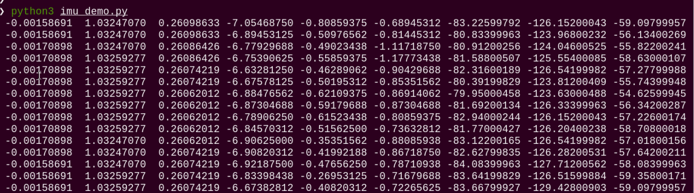

# 2.Raspberry Pi Expansion Board Course

## 2.1 Buzzer Control

### 2.1.1 Introduction

This section demonstrates on how to set the high and low voltage levels of the buzzer, enabling it to make sound after being powered on.

### 2.2 Getting Started

There is an onboard buzzer on the Raspberry Pi expansion board, as shown below: As shown in the figure below:


###  2.3 Enabling and Disabling the Feature

:::{Note}

Command input is case-sensitive and space-sensitive.

:::

(1) To start the ROSMan robot, refer to [3.ROS Robot Motion Basic Control Course-> 3.1 Set Development Environment->3.1.1 Remote Desktop Tool Installation and Connection](), and connect the robot to the VNC remote control software.

(2) Open the command-line terminal , enter the command, and press Enter to navigate to the directory where the feature’s program is located.

```
roscd rosman_tutorial/scripts/board
```

(3) In the command input field, enter the following command to run the program, and press Enter:

```
python3 buzzer_demo.py
```

(4) To exit the feature, press **Ctrl+C** in the terminal. If the shutdown fails, you may repeat this operation until it exits successfully.

###  2.4 Program Outcome

When the program runs, the buzzer on the expansion board will beep once a second.

###  2.5 Program Analysis

The source code for the program is located at: [/ubuntu/home/ros_ws/src/rosman_tutorial/scripts/board/buzzer_demo.py]()

{lineno-start=1}

```
#!/usr/bin/python3
# coding=utf8
import time
from rosman_sdk import Board

board = Board()
print('buzzer di at 1hz')

try:
    while True:
        board.set_buzzer(1900, 0.1, 0.9, 1)
        time.sleep(1)
        board.set_buzzer(2400, 0.1, 0.4, 0)
        time.sleep(2)
except KeyboardInterrupt:
    board.set_buzzer(1900, 0, 0, 1)  # buzzer off
```

This program uses the Board class from the rosman_sdk module. Inside a while loop, it controls the buzzer by repeatedly calling the `set_buzzer()` function to turn it on and off.

Specifically, the program performs the following steps:

(1) Imports the required modules: time and rosman_sdk.

(2) Enters an infinite loop that continues running until a keyboard interrupt (Ctrl+C) is triggered.

(3) In each iteration of the loop, the set_buzzer() method is called to activate the buzzer.

For example, in the line `board.set_buzzer(1900, 0.1, 0.9, 1)`:

The first parameter `1900` sets the frequency.

The second parameter `0.1` defines how long the buzzer stays on, with unit in seconds.

The third parameter `0.9` defines how long it stays off, with unit in seconds.

The fourth parameter `1` specifies the number of repetitions. If set to 0, it will repeat indefinitely.

(4) The program stops when the user presses Ctrl+C, which is handled using a KeyboardInterrupt exception.

## 2.2 RGB Control

### 2.2.1 Introduction

RGB stands for the three color channels, including red, green, and blue. The parameter range for each channel is 0 to 255. By modifying the parameters of RGB, the color of the RGB light can be changed.

### 2.2.2 Getting Started

There is an onboard RGB light on the Raspberry Pi expansion board, as shown below:


### 2.2.3 Enabling and Disabling the Feature

:::{Note}

Command input is case-sensitive and space-sensitive.

:::

(1) To start the ROSMan robot, refer to [3. ROS Robot Motion Basic Control Course->3.1 Set Development Environment->3.1.1 Remote Desktop Tool Installation and Connection](), and connect the robot to the VNC remote control software.

(2) Open the command-line terminal, navigate to the directory where the feature’s program is located.

```
roscd rosman_tutorial/scripts/board
```

(3) In the command input field, enter the following command to run the program, and press Enter:

```
python3 rgb_demo.py
```

(4) To exit the feature, press Ctrl+C in the terminal. If the shutdown fails, you may repeat this operation until it exits successfully.

### 2.2.4 Program Outcome

After the program is executed, the RGB LED on the Raspberry Pi expansion board will cycle through red, green, and blue lights. Each color stays on for 0.3 seconds.

### 2.2.5 Program Analysis

The source code for the program is located at: [/ubuntu/home/ros_ws/src/rosman_tutorial/scripts/board/rgb_demo.py]()

{lineno-start=1}

```
#!/usr/bin/python3
# coding=utf8
import time
from rosman_sdk import Board

board = Board()
board.set_rgb([[1, 0, 0, 0]])
while True:
    try:
        board.set_rgb([[1, 255, 0, 0]])  # 红(red)
        time.sleep(0.3)
        board.set_rgb([[1, 0, 255, 0]])  # 绿(green)
        time.sleep(0.3)
        board.set_rgb([[1, 0, 0, 255]])  # 蓝(blue)
        time.sleep(0.3)
    except KeyboardInterrupt:
        board.set_rgb([[1, 0, 0, 0]])
        break
```

This program uses the Board class from the rosman_sdk module and controls the RGB LED using the set_rgb() function.

Take the line `board.set_rgb([[1, 255, 0, 0]])` as an example:

The first parameter `1` specifies which RGB light to control.

The values `255, 0, 0` represent the RGB color channels. The first value is the red channel (R), the second is the green channel (G), and the third is the blue channel (B).

## 2.3 Button Control

Note: Before using the robot’s system image, make sure to disable the auto-start service before launching the demo program.

### 2.3.1 Introduction

The program reads the logic level of the button pin and prints the button status to the terminal in real time.

### 2.3.2 Getting Started

The Raspberry Pi expansion board comes with a built-in custom button. As shown in the figure below:


### 2.3.3 Enabling and Disabling the Feature

:::{Note}

Command input is case-sensitive and space-sensitive.

:::

(1) To start the ROSMan robot, refer to [3. ROS Robot Motion Basic Control Course->3.1 Set Development Environment->3.1.1 Remote Desktop Tool Installation and Connection](), and connect the robot to the VNC remote control software.

(2) Open the command-line terminal, enter the command, and press Enter to navigate to the directory where the feature’s program is located.

```
roscd rosman_tutorial/scripts/board
```

(3) In the command input field, enter the following command to run the program, and press Enter:

```
python3 button_demo.py
```

(4) To exit the feature, press Ctrl+C in the terminal. If the shutdown fails, you may repeat this operation until it exits successfully.

### 2.3.4 Function Outcome

When the program runs, the terminal will continuously print the button status value key. The value is 0 when the button is pressed and 1 otherwise.

### 2.3.5 Program Analysis

The source code for the program is located at: [/ubuntu/home/ros_ws/src/rosman_tutorial/scripts/board/button_demo.py]()

{lineno-start=1}

```
#!/usr/bin/python3
# coding=utf8
from rosman_sdk import button

while True:
    try:
        print('\rkey: {} '.format(button.get_button_status()), end='', flush=True)  # 打印key状态(print button state)
    except KeyboardInterrupt:
        break
```

This script imports the button module from the rosman_sdk library.

It calls the `button.get_button_status()` function to retrieve the current button state and prints the result using the `print()` function in the format: key: \[status value\].

## 2.4 Read IMU Data

### 2.4.1 Introduction

This program reads the IMU data and prints the information on the terminal.

### 2.4.2 Getting Started

The Raspberry Pi expansion board comes with a built-in IMU sensor. As shown in the figure below:


### 2.4.3 Enabling and Disabling the Feature

(1) To start the ROSMan robot, refer to [3. ROS Robot Motion Basic Control Course->3.1 Set Development Environment->3.1.1 Remote Desktop Tool Installation and Connection](), and connect the robot to the VNC remote control software.

(2) Open the command-line terminal, enter the command, and press Enter to navigate to the directory where the feature’s program is located.

```
roscd rosman_tutorial/scripts/board
```

(3) In the command input field, enter the following command to run the program, and press Enter:

```
python3 imu_demo.py
```

(4) To exit the feature, press **Ctrl+C** in the terminal. If the shutdown fails, you may repeat this operation until it exits successfully.

### 2.4.4 Function Outcome

When the program runs, it continuously prints IMU data to the terminal in real time.



### 2.4.5 Program Analysis

The source code for the program is located at: [/ubuntu/home/ros_ws/src/rosman_tutorial/scripts/board/imu_demo.py]()

{lineno-start=1}

```
#!/usr/bin/python3
# coding=utf8
import time
from rosman_sdk import Board

board = Board()
board.enable_reception()

while True:
    res = board.get_imu()
    if res is not None:
        for item in res:
            print(" {: .8f}".format(item), end='')
        print()
    time.sleep(0.01)
```

This program uses the Board class from the rosman_sdk module. It calls the `get_imu()` function to retrieve imu data and prints the output to the terminal.