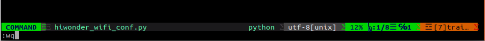

# 3. ROS Robot Motion Basic Control Course

## 3.1 Set Development Enviroment

### 3.1.1 Remote Desktop Tool Installation and Connection

* **Getting Started**

(1) Hardware Preparation

Prepare a laptop. If you are using a desktop computer, make sure to have a wireless network adapter that supports the 5GHz band.

(2) Installing the VNC Remote Tool

VNC (Virtual Network Computing) is a graphical remote desktop control software. By connecting to the Raspberry Pi's Wi-Fi hotspot, you can directly control it from your computer. The steps to install VNC are as follows:

① Double-click the installer [VNC-Viewer-6.17.731-Windows](resources_download.md) located in this section's folder. When prompted, select English as the installation language and click **OK**.


② Click **Next** to continue.


③ Accept the license agreement by checking the box, then click **Next**.


④ Keep the default installation path and click **Next** again. On the next screen, click **Install** to begin the installation.


⑤ Wait for a moment, the setup completion screen will appear. Click **Finish** to exit the installer.


⑥ Once installed, click the VNC icon  to open the program.

(3) Power on

Refer to [1. ROS Robot Introductory Course->1.5 First Start & Examination](1.ROS_Robot_Introductory_Course.md#first-start-examination) for detailed steps. After a few seconds, LED1 on the expansion board will start blinking and the buzzer will beep once, indicating that the device has successfully powered on.

* **Device Connection**

(1) After ROSMan powers on successfully, it defaults to AP mode. In this mode, the robot will broadcast a Wi-Fi hotspot starting with "**WN**". You can search for and connect to this hotspot on your computer, as shown below:


(2) Click to connect, and enter the password: **12345678**.


(3) Once connected, open VNC Viewer. In the address bar, enter the Raspberry Pi's default IP address: 192.168.149.1, then press Enter. If a security warning appears, click **Continue**.  


(4) In the login window, enter the following credentials:  

Username: pi

Password: raspberrypi

Check **Remember password**, then click **OK**. You should now see the Raspberry Pi desktop remotely.


(5) As shown in the figure below. If you encounter a black screen with only a mouse pointer, try rebooting the Raspberry Pi.


* **Interface Overview**

After successfully connecting to ROSMan via VNC, you will see the following desktop interface:


The table below describes the commonly used functions:

<table  class="docutils-nobg" border="1">
<colgroup>
<col style="width: 25%" />
<col style="width: 75%" />
</colgroup>
<tbody>
<tr>
<td style="text-align: center;"><strong>Icon</strong></td>
<td style="text-align: center;"><strong>Function</strong></td>
</tr>
<tr>
<td style="text-align: center;"></td>
<td style="text-align: left;"><p>Application Menu – Click to access various installed applications.</p>
<p></p></td>
</tr>
<tr>
<td style="text-align: center;"></td>
<td style="text-align: left;">The default system browser.</td>
</tr>
<tr>
<td style="text-align: center;"></td>
<td style="text-align: left;">File Manager</td>
</tr>
<tr>
<td style="text-align: center;"></td>
<td style="text-align: left;">LXTerminal – A command-line terminal for general system operations.</td>
</tr>
<tr>
<td style="text-align: center;"></td>
<td style="text-align: left;">Terminator Terminal – Provides access to the Docker environment, you can run Docker-related commands here.</td>
</tr>
<tr>
<td style="text-align: center;"></td>
<td style="text-align: left;">Recycle Bin – Retrieve recently deleted files.</td>
</tr>
<tr>
<td style="text-align: center;"></td>
<td style="text-align: left;">ROSMan PC Software – Used for action editing, coordinate configuration, and more.</td>
</tr>
<tr>
<td style="text-align: center;"></td>
<td style="text-align: left;">Color Model Tuning Tool</td>
</tr>
<tr>
<td style="text-align: center;"></td>
<td style="text-align: left;">Quick Calibration Tool for Auto Shooting and Line-following</td>
</tr>
<tr>
<td style="text-align: center;"></td>
<td style="text-align: left;">Language Switcher</td>
</tr>
<tr>
<td style="text-align: center;"></td>
<td style="text-align: left;">Mobile App Gait Debugger</td>
</tr>
</tbody>
</table>

### 3.1.2 System Directory Brief Instructions

Once the robot is connected to VNC, the system will display as follow:


* **Program Structure Instruction**

(1) Click the black terminal  and enter the command.

```
ls
```


| **Directory Name** |                **Function**                 |
| :----------------: | :-----------------------------------------: |
|       rosman       |     Contains related PC-side shortcuts      |
|       docker       | Shared folder with Docker for file transfer |
|    wifi_manager    |     Contains Wi-Fi configuration files      |

(2) Click the red terminal  and enter the command.

```
ls
```


| **Directory Name** |                   **Function**                   |
| :----------------: | :----------------------------------------------: |
|       ros_ws       |    Contains all function program source files    |
|       share        | Shared folder with the host PC for file transfer |
|      software      |  Contains files related to the PC-side software  |
|    Third_party     |        Contains third-party library files        |

(3) Next, enter the command to navigate to the tools directory:

```
cd software
```

(4) Then enter the command to list all folders and files in the directory. Focus on the directories highlighted in the red box below.

```
ls
```


|  **Directory/File Name**  |           **Description**            |
| :-----------------------: | :----------------------------------: |
|     rosman_controller     |          Motion controller           |
|         lab_tool          |   Color threshold adjustment tool    |
|    walking_controller     |           Gait controller            |
|        servo_tool         |         Servo debugging tool         |
|        Calibration        |       Vision calibration tool        |
|         labelimg          |        Image annotation tool         |
|     conllect_pictrue      |        Image collection tool         |
| language_setting_software |          Language Switcher           |
|   walking_offset_adjust   | Mobile app parameter tuning software |

(5) First, enter the command to go back to the previous directory. Then, enter the command to navigate into the workspace directory.

```
cd ..
```

```
cd ros_ws/
```

(6) Then enter the command to list all folders and files in the directory.

```
ls
```

| **Directory/File Name** |                       **Description**                        |
| :---------------------: | :----------------------------------------------------------: |
|          build          | Build space, stores cache files generated during compilation |
|          devel          |        Contains compiled target files and executables        |
|          logs           |                 Folder for storing log files                 |
|           src           |           Source code folder for function packages           |
|         command         |                Commonly used command scripts                 |

(7) Enter the command to navigate into the source code folder where the function packages are stored, then use ls to list the files in that directory. In this section, the items highlighted in the red box are detailed.

```
cd src/
```

```
ls
```


|     **File Name**     |                   **Description**                   |
| :-------------------: | :-------------------------------------------------: |
|      rosman_app       |  Directory for mobile app-based gameplay features   |
|    rosman_bringup     |         Directory for startup launch files          |
|  rosman_calibration   |           Directory for calibration files           |
|     rosman_driver     | Directory for control files and low-level libraries |
|    rosman_example     |           Directory for gameplay scripts            |
|   rosman_interfaces   |     Directory for ROS message type definitions      |
|  rosman_peripherals   |       Directory for peripheral-related files        |
|  rosman_simulations   |           Directory for simulation files            |
|    rosman_tutorial    |       Directory for sample code and tutorials       |
|      third_party      |              Third-party ROS packages               |
|     large_models      |     Configuration files related to large models     |
| large_models_examples |      Example scripts for large model features       |

(8) Let's take the rosman_app program directory as an example. After entering this directory and typing ls, you will see two subdirectories: launch and scripts. The launch directory contains the launch files, while the scripts directory holds the source code for the gameplay features.

```
cd rosman_app
```

```
ls
```

launch file:


Scripts:


### 3.1.3 Introduction to Docker Container and How to Access

* **Introduction to Docker**

Docker is an open-source platform and tool that helps you package, distribute, and run applications in containers. A container is a lightweight, standalone, and executable software package that includes everything needed to run an application: code, runtime, system tools, libraries, and settings. Docker allows developers to bundle applications with their dependencies—not just the app itself—so they can be deployed quickly and consistently across different environments.

Technically, Docker leverages Linux containerization technology to ensure higher isolation between applications. This enables multiple containers to run on the same physical machine while remaining completely independent from each other.

In summary, Docker can be understood as a tool that improves application portability and ease of management, greatly simplifying software development and deployment.


<p style="text-align:center">Docker Logo</p>

For further learning about Docker, you may visit official Docker resources and websites for more information.

Official Website: http://www.docker.com

Chinese Website: https://www.docker-cn.com

Docker Hub (Image Repository):

* **Docker Command**

:::{Note}

The product is already inside the container when shipped, so there is no need to enter it again. This lesson is for informational purposes only.

:::

All functionalities and programs of this product are designed to run inside Docker containers. To help users get started quickly, the following section introduces commonly used Docker commands.

(1) Powering on the robot, refer to [3. ROS Robot Motion Basic Control Course -\> 3.1.1 Remote Desktop Tool Installation and Connection](3.ROS_Robot_Motion_Basic_Control_Course.md#remote-desktop-tool-installation-and-connection), and connect the robot to the VNC remote control software.


(2) Click the terminal icon  in the system desktop to open the LX terminal.


This is the command-line interface of the Raspberry Pi.

<p id="view_containers"></p>

* **View Containers**

**The system is preset to enter the container at startup. The following is for your understanding.**

Command syntax: **docker ps \[OPTIONS\]**

Common options:

1.  -a: Lists all containers, including running and exited

2.  -l: Shows the most recently created container

3.  -n=?: Shows the most recent n containers

4.  -q: Quiet mode, only shows container IDs

This command displays all running and previously run containers. Output includes the container id for container ID, imag for image name, created for creation time, and status for current status.

```
docker ps -a
```


* **Enter a Container**

**The system is preset to enter the container at startup. The following is for your understanding.**

Use the container ID obtained in section "**[View Containers](#view_containers)**" to enter the container that contains the functional programs.

**docker exec -it -u ubuntu -w /home/ubuntu 82df /bin/bash** You can shorten the container ID as long as it remains unique.


* **Exit a Container**

There are two ways to exit:

(1) Enter the command directly in the terminal and press Enter — this will stop the container and exit.

```
exit
```


(2) Use the shortcut key combination Ctrl + P + Q — this will detach from the container without stopping it. You can then enter a command in the terminal to check the running containers.

```
docker ps
```


* **Using Convenient Tools (Must Read)**

Each time you want to enter the container, you normally have to type a command into the Terminator terminal, which can be quite inconvenient. To streamline this process, you can configure Terminator to automatically enter the container.


(1) Right-click inside the Terminator window and select "**Preference**".


(2) Go to Profiles → Command.


(3) Check the box and enter the following command in the input field: host + && docker exec -it -u ubuntu -w /home/ubuntu puppypi /bin/zsh **Note:** puppypi is the name of the container that contains the feature programs.


(4) Click Close. From now on, every time you open a terminal window, it will automatically enter the container where the feature programs are installed.


### 3.1.4 Network Configuration

* **Overview**

The robot supports two network configuration modes:

**AP Mode (Direct Connection):** The controller creates a hotspot that your phone can connect to directly, but no Internet access in this mode.

**STA Mode (LAN Connection):** The controller connects to a specified Wi-Fi network, and Internet access is available in this mode.

By default, the robot starts in AP direct connection mode. Regardless of whether the user chooses AP direct connection or STA LAN mode, the robot's features and functions remain the same.

:::{Note}

We recommend starting with the AP direct connection mode to quickly explore and experience the robot's functions. You can switch to LAN mode later based on your specific needs.

:::

* **LAN Mode**

:::{Note}

If you want to configure the robot to use LAN Mode via your smartphone, make sure to enable the location service on your phone beforehand.

:::

You cannot switch to LAN mode directly through the system network settings, as the Wi-Fi has been specially configured. You must follow the designated steps in [Switching Network Configuration via Config File](#switching_network_configuration) to complete the network setup.

(1) Switching via Mobile App

:::{Note}

Location services must be enabled on your phone when using LAN mode.

:::

This section uses the Android version of the app as an example, but the process also applies to iOS.

① Before getting started, make sure your phone is connected to a Wi-Fi network—here we use **"hiwonder_5G"** as an example.


② Open the WonderNex app and select ROSMan on the main screen.


③ After the connection is established, return to the app and tap the "**+**" button in the bottom right corner. Select **LAN Mode**, and follow the on-screen instructions to connect to a Wi-Fi network via your phone's settings.


④ When prompted, enter the password for the Wi-Fi network you want the robot to connect to, then tap **Next**. Make sure the password is correct—incorrect input will cause the connection to fail.


⑤ Follow the instructions to return to your phone's settings and connect to a hotspot that starts with "**WN**".


⑥ After connecting to the hotspot, go back to the app. The app will automatically begin the connection process. If a prompt appears asking whether to join the network, tap the button to join.


:::{Note}

Once LAN mode is successfully set up, the "**WN**"-prefixed Wi-Fi network will no longer appear.

:::

⑦ Wait a few moments for the screen to return to the device list. The robot will appear with a name starting with **"ROSMan"**.


⑧ Long-press the "**ROSMan**" icon in the app to view the robot's assigned IP address and device ID.


:::{Note}

If you want to switch back to direct connection mode, long-press the robot icon and select Direct Connection Mode. The blue indicator light will start blinking, indicating that the switch was successful.

:::


Once the LAN mode is set up, connect your computer to the same network. Then, use the remote desktop tool to search for the robot using its IP address and establish a connection.

<p id="switching_network_configuration"></p>

(2) Switching Network Configuration via Config File

① Power on the robot and connect it to the remote control software VNC.

② Click the icon  at the top of the system interface to open the terminal.

③ Enter the following command and press Enter to go to the configuration directory:

```
cd wifi_manager
```

④ Then enter the following command and press Enter to open the configuration file:

```
vim wifi_conf.py
```


⑤ First, set the value of HW_WIFI_MODE to 2. 1 stands for Direct Connection Mode, while 2 stands for LAN Mode.


⑥ Next, modify HW_WIFI_STA_SSID and HW_WIFI_STA_PASSWORD to the Wi-Fi name and password of your router.

:::{Note}

It's recommended to use a 5G Wi-Fi signal for faster transmission. If you experience lag with a standard Wi-Fi connection, consider switching to a 5G network.

:::


⑦ After confirming the input is correct, press ESC, then type :wq to save and exit the file.



⑧ Restart the robot's Wi-Fi service using the following command:

```
sudo systemctl restart wifi.service
```

To switch back to Direct Connection Mode in the future, repeat the above steps to edit the config file, save the changes and restart.

## 3.2 PC Software Introduction

This section provides an overview of the ROSMan PC software to help you quickly become familiar with its features and usage.

(1) Power on the robot and connect it to the remote control tool VNC.

(2) Double-click the icon  to open the PC software.


The main interface of the software is divided into the following sections:


**①: Servo Control Area**

In this section, you can manually adjust servo positions by moving the corresponding sliders. Each slider controls a specific servo, and modifying its value changes the servo's angle or position.

|                           **Icon**                           |                         **Function**                         |
| :----------------------------------------------------------: | :----------------------------------------------------------: |
|  | Indicates the servo ID number, for example, 1 is the servo's ID here. |
|  |   Adjust the servo position, with a range from 0 to 1000.    |
|  |  Adjust the servo deviation, with a range from -125 to 125.  |
|  | Lock the servo. After pressing this button, action groups cannot be executed, and the corresponding servo will no longer respond to control commands. |

**②: Action Group Detail List**

This section displays the details of the current action group, including the execution time for each action and the values of all involved servos.


|                           **Icon**                           |                         **Function**                         |
| :----------------------------------------------------------: | :----------------------------------------------------------: |
|  |              Indicates the action group number.              |
|  |  Indicates the execution time for the corresponding action.  |
|  | Displays the servo's value in the current action. You can double-click a value  to directly modify it. |
|  |        Right-click to delete all actions in the list.        |
|  | Right-click to mirror the selected action, swapping left and right actions. |
|  | Right-click to mirror all actions in the list, swapping left and right actions. |

**③: Action Group Settings Area**

|                           **Icon**                           |                         **Function**                         |
| :----------------------------------------------------------: | :----------------------------------------------------------: |
|  | Duration of Action Execution: Click the time value icon to modify the duration. **Note:** You must click the Update Action button for the change to take effect. The valid time range is 20–30000 ms. |
|  | Display the total time required to execute all actions in the action group. |
|  | Click this button will make the robot's joints relax, allowing you to manually pose the robot into the desired position. |
|  | Read the current servo angles. Must be used in conjunction with the "**Manual**" button. |
|  | Add the current servo values from the Servo Control Area as a new action to the last row of the Action Details List. |
|  |   Delete the selected action from the Action Details List.   |
|  | Replace the selected angle values and duration values in the Action Details List. The angle values will be replaced with those in the Servo Control Area, and the duration will be replaced by the value in "**Duration(ms)**". |
|  | Insert a new action above the selected action. The inserted action's running time is determined by the value set in the "Duration" field, and the angle values are taken from the current servo values in the servo control area. |
|  | Move the selected action one row up in the action list. The original row above will move down. |
|  | Move the selected action one row down in the action list. The original row below will move up. |
|  |    Click to run the actions in Action Details List once.     |
|  |  If "**Loop**" is checked, the robot will repeat the sequence.   |
|  | Click and select an action group file to load its data into the Action Details List. |
|  | Save the actions currently in the Action Details List to a specified location. |
|  | After opening an action group, click this button to open another action group file. The two action groups will then be merged into a new one. |
|  | Show saved action groups in the PC software. **Note:** To be executable on the robot, the corresponding code must be modified. |
|  |           Execute the selected action group once.            |
|  |           Stop the currently running action group.           |
|  | Save the current action group and overwrites the existing file. |
|  |                    Close the PC Software.                    |

:::{Note}

All action group files are saved to the path: /software/ROSMan_controller/ActionGroups

:::

**④: Servo Settings (For Reference)**

In this section, you can manually adjust servo positions by moving the corresponding sliders. Each slider controls a specific servo, and modifying its value changes the servo's angle or position.

|                           **Icon**                           |                         **Function**                         |
| :----------------------------------------------------------: | :----------------------------------------------------------: |
|  |   Click to automatically read the saved deviation values.    |
|  | Click to upload the adjusted deviation values from the software to the robot. |
|  | Click to reset all servo in the Servo Control Area to position 500. When clicking this button, keep an eye on the robot, as it will lean backward when returning servos to the central position. |

:::{Note}

The robot has already been calibrated for deviation before shipping.

:::

<p id="anchor_3_3"></p>

## 3.3 Action Editing

### 3.3.1 Action Editing

* **Objective**

Edit a "**Greeting**" action group which consists of 7 individual actions.

* **Editing**

(1) Action Design

① Power on the robot and connect it to the remote control tool VNC.

② Double-click the icon  to open the PC software.


③ Before the robot executes the action group, ensure you are holding the robot. Once the robot has started successfully, click on "**Open action file**".


Open the file "**stand.d6a**" as shown below.


Place the robot on a flat surface. Then click-on the triangle button in front of the action list, and the robot will execute "**stand**" action group.


④ Modify the values of servo ID 14 and ID 16 as shown in the red box below. Set the "**Duration**" to 1000 ms, then click the "**Add Action**" button in the action editing area to complete the addition of the second action—raising the left arm.


⑤ Set the time to 200 ms again, then click the "**Add Action**" button in the action editing area to add a transition movement.


⑥ Next, modify the value of servo ID 20 as shown in the red box below, set the duration to 1000ms, and configure the robot to swing its right arm forward.


⑦ Repeat step ⑤, add another transition movement.


⑧ Then, modify the value of servo ID 20 again as shown in the red box below, set the duration, and configure the robot to retract its right arm.


⑨ Finally, modify the servo values one more time as shown in the red box, set the duration, and configure the robot to return its right arm to the initial position.


(2) Save Edited Action

For facilitating the consequent debugging and management convenience, it is advisable to save this action. Click on "**Save action file**", choose the path where you want to save it (e.g., **/home/ubuntu/software/ROSMan_controller/ActionGroups/**), and enter the name for the action group. For example, 2. Finally, click on "**Save**".


### 3.3.2 Action Files Integration

* **Objective**

Integrating action files is to integrate two actions to form a new action group.

In this section, you will learn to integrate two action group files, **"go_forward.d6a"** and **"2.d6a",** for example.

:::{Note}

The action group **"2.d6a"** is created in [3.3 Action Editing](#anchor_3_3) .

:::

* **Editing**

(1) Power on the robot and connect it to the remote control tool VNC.

(2) Double-click the icon  to open the PC software.


(3) Click-on "**Integrate file**" button.


(4) Double-click the file **"forward.d6a"** to open it.


(5) The parameters of Action Group Forward are displayed in the Action Details List.


(6) Again to click-on "**Integrate file**" button and select the file "**2.d6a**". Now the two action files are integrated.


(7) You'll see the action group details showing parameters for the "**Forward**" and "**Greeting**" action groups.


(8) Click the designated button to have the robot return to the pose of the first action.


(9) Then click "**Run**" to execute the newly combined action group. The robot will first walk forward and then wave hand.


(10) Click the "**Save action file**" button, enter a name for the new action group (e.g., "**3**"), and click "**Save**" to store it for future debugging.


## 3.4 Serial Bus Servo Control

:::{Note}

Prior to start this routine, it is necessary to enable the auto-start service.

:::

###  3.4.1 Introduction to Serial Bus Servo

The servo serves as the main control component. The ROSMan is outfitted with a set of 20 bus serial servos, including HX-35H, HX-35HM and HX-12H serial bus servos. Next, we will introduce these three types of servos one by one to provide users with a preliminary understanding of the servos used in the robot.

* **Working Principle**

The internal components of a servo typically include a casing, a reduction gear set, a motor, a potentiometer, and control circuitry. Communication via an asynchronous serial bus involves serially connected data lines that are parallel in the circuit, with the main controller needing only to send corresponding commands to the servo for control. In serial communication, each communication session must be packaged and parsed according to a specific format.

The data frame format used typically includes the frame header, ID number, data length, instruction, parameters, and checksum fields. The frame header, or start bit, marks the beginning of a new data transmission; the ID number distinguishes different devices; the data length specifies the length of the data to be sent, where the data length (Length) plus 3 equals the total length of the instruction packet from the frame header to the checksum; the instruction field is used for various control commands for the servo, such as position and speed control; and the checksum is used to verify data integrity.

When performing serial communication, the bus servo sends a request to the main control board, along with the corresponding parameters (such as position). The command packet contains the target servo's ID, and only the servo with the matching ID will execute the command and return the execution result and related status information encapsulated in feedback to the main control board. The main control board then parses the command and performs the corresponding action.

The bus servo leverages this feature to achieve linked control and data exchange among multiple servos, significantly enhancing the system's scalability and flexibility, thus playing a crucial role in the components of the robot.

Regarding the bus servo communication protocol, please refer to the relevant document in [3. ROS Robot Motion Basic Control Course](3.ROS_Robot_Motion_Basic_Control_Course.md).

* **Parameters**

There are a total of 14 HX-35H servos on the robot, primarily used at the joints of the lower limbs (10 servos) and the torso and arms (4 servos). The specific parameters of this servo are shown in the table below:

| **Name**                     | HX-35H serial bus high voltage servo | **Control method**           | UART serial command              |
| ---------------------------- | ------------------------------------ | ---------------------------- | -------------------------------- |
| **Brand**                    | Hiwonder                             | **Communication baud rate**  | 115200                           |
| **Weight**                   | 52g                                  | **Storage**                  | save data when power off         |
| **Dimension**                | 15.2 x 24.7 x 35mm                   | **Servo ID**                 | can be set to 0-253.1 by default |
| **Working voltage**          | Rated 11.1V，9.6-12.6V               | **Angle read back function** | support                          |
| **Rotation torque**          | 0.18sec/60°11.1V                     | **Protection**               | avoid stalling and overheat      |
| **Rotation torque**          | 35kg.cm 11.1V                        | **Data feedback**            | temperature, voltage, position   |
| **Rotation range**           | 0-1000 corresponding to 0°~240°      | **Working mode**             | servo mode and gear motor mode   |
| **No-load current**          | 100mA                                | **Gear type**                | metal gear                       |
| **Stall current**            | 3A                                   | **Servo wire length**        | 20cm                             |
| **Servo accuracy**           | 0.3°                                 | **Connector**                | 5264-3P                          |
| **Controllable angle range** | 0-1000,corresponding to 0-240°       | **Applicable to**            | joints of bionic robots          |

The HX-35HM bus servo integrates servo drive, motor, and bus servo signals into one unit, and it is controlled by serial commands. There are 2 of these servos on the robot, primarily used at the connection between the torso and the lower limbs. The specific parameters of this servo are shown in the table below

| **Name**                     | HX-35HM Magnetic Encoder Bus Servo   | **Control method**           | UART serial command               |
| ---------------------------- | ------------------------------------ | ---------------------------- | --------------------------------- |
| **Brand**                    | Hiwonder                             | **Communication baud rate**  | 115200                            |
| **Weight**                   | 72g                                  | **Storage**                  | Save data when power off          |
| **Dimension**                | 45.2 x 24.7 x 35mm                   | **Servo ID**                 | Can be set to 0~253, 1 by default |
| **Working voltage**          | Rated 11.1V，9.6-12.6V               | **Angle read back function** | Support                           |
| **Rotation torque**          | 0.19sec/60°11.1V                     | **Protection**               | Avoid stalling and overheat       |
| **Rotation torque**          | 35kg.cm 11.1V                        | **Data feedback**            | Temperature, voltage, position    |
| **Rotation range**           | 0-1000 corresponding to 0°~240°      | **Working mode**             | Servo mode and gear motor mode    |
| **No-load current**          | 100mA                                | **Gear type**                | Metal gear                        |
| **Stall current**            | 3A                                   | **Servo wire length**        | 20cm                              |
| **Servo accuracy**           | 0.3°                                 | **Connector**                | 5264-3P                           |
| **Controllable angle range** | 0-1500 corresponding to 0-360°       | **Applicable to**            | Joints of bionic robots           |
| **Name**                     | HX-12H serial bus high voltage servo | **Control method**           | UART serial command               |
| **Brand**                    | Hiwonder                             | **Communication baud rate**  | 115200                            |
| **Weight**                   | 36.3g                                | **Storage**                  | Save data when power off          |
| **Dimension**                | 35.19 x 26.19 x 27.20mm              | **Servo ID**                 | Can be set to 0~253, 1 by default |
| **Working voltage**          | Rated 11.1V，9.6-12.6V               | **Angle read back function** | Support                           |
| **Rotation torque**          | 0.2sec/60°11.1V                      | **Protection**               | Avoid stalling and overheat       |
| **Rotation torque**          | 12kg.cm 11.V                         | **Data feedback**            | Temperature, voltage, position    |
| **Rotation range**           | 0~1000, corresponding to 0~240°      | **Working mode**             | Servo mode and gear motor mode    |
| **No-load current**          | 300mA                                | **Gear type**                | Metal gear                        |
| **Stall current**            | 1.3A                                 | **Servo wire length**        | 20cm                              |
| **Servo accuracy**           | 0.3°                                 | **Connector**                | 5264-3P                           |
| **Controllable angle range** | 0~1000, corresponding to 0~240°      | **Applicable to**            | Joints of bionic robots           |

According to the communication protocol, a command containing the servo ID, rotation angle, and time is sent to control the bus servo.

### 3.4.2 Project Process

According to the communication protocol, a command containing the servo ID, rotation angle, and time is sent to control the bus servo.

The source code for this program is located at:

[/home/ubuntu/ros_ws/src/rosman_tutorial/scripts/serial_servo/serial_servo_move_demo.py](../_static/source_code/serial_servo.zip)

{lineno-start=1}

```
#!/usr/bin/env python3
# encoding: utf-8
# 驱动id23的舵机在400-600范围转动(Drive the servos 2 and 3 to rotate in the range of 400 to 600)
import time
from rosman_sdk import Board

servo_control = Board()
print('id23 serial servo move between 400 - 600')

while True:
    try:
        servo_id = 23  # 舵机id(0-253)(servo ID (0-253))
        position = 400  # 位置(0-1000)(position (0-1000))
        duration = 0.5  # 时间(0.02-30s)(time (0.02-30))
        servo_control.bus_servo_set_position(duration, [[servo_id, position]])
        time.sleep(duration)  
        
        position = 600
        duration = 0.5
        servo_control.bus_servo_set_position(duration, [[servo_id, position]])
        time.sleep(duration)
    except KeyboardInterrupt:
        position = 500
        duration = 0.5
        servo_control.bus_servo_set_position(duration, [[servo_id, position]])
        break
```

### 3.4.3 Operation Steps

(1) To start the ROSMan robot, refer to 5. ROS Robot Motion Control/ 1. Basic Control Course/ Lesson 1 Set Development Environment/1.1 Remote Desktop Tool Installation and Connection, and connect the robot to the VNC remote control software.

(2) Open the command-line terminal , enter the command to disable the auto-start service, and press Enter.

```
~/.stop_ros.sh
```

(3) Then enter the command in the terminal and press Enter to run the program file.

```
python3 /home/ubuntu/ros_ws/src/rosman_tutorial/scripts/serial_servo/serial_servo_move_demo.py
```

(4) To exit the feature, press Ctrl+C in the terminal. If the program does not close successfully, try pressing Ctrl+C again.

### 3.4.4 Project Outcome

When the feature starts, the servo 23 on the robot's head will rotate left and right.

### 3.4.5 Program Analysis

The source code is located at: [/home/ubuntu/ros_ws/src/rosman_tutorial/scripts/serial_servo/serial_servo_move_demo.py](../_static/source_code/serial_servo.zip)

* **Import the Necessary Libraries**

First to import the necessary libraries.

{lineno-start=4}

```
import time
from rosman_sdk import Board
```

* **Main Program**

The main program controls the servo ID 23 by calling a function.

{lineno-start=10}

```
while True:
    try:
        servo_id = 23  # 舵机id(0-253)(servo ID (0-253))
        position = 400  # 位置(0-1000)(position (0-1000))
        duration = 0.5  # 时间(0.02-30s)(time (0.02-30))
        servo_control.bus_servo_set_position(duration, [[servo_id, position]])
        time.sleep(duration)  
        
        position = 600
        duration = 0.5
        servo_control.bus_servo_set_position(duration, [[servo_id, position]])
        time.sleep(duration)
    except KeyboardInterrupt:
        position = 500
        duration = 0.5
        servo_control.bus_servo_set_position(duration, [[servo_id, position]])
        break
```

By using the bus_servo_set_position function from the Board library, the bus servo can be controlled. Take the code `servo_control.bus_servo_set_position(duration, [[servo_id, position]])` as an example:

(1) duration refers to the rotation time in milliseconds, which is 500 ms in this case.

(2) servo_id specifies the ID number of the bus servo, which is ID 23 here.

(3) position indicates the target position. This parameter is derived from angle conversion, so it corresponds to the servo's rotation angle. In this example, the position is set to 400.

## 3.5 Read Serial Bus Servo Status

:::{Note}

A detailed introduction to the servo can be found in [Appendix->Servo Information](resources_download.md).

:::

### 3.5.1 Project Process

According to the communication protocol, a command containing the servo ID, voltage, and temperature is sent to control the bus servo.

The source code for this program is located at:

[/home/ubuntu/ros_ws/src/rosman_tutorial/scripts/serial_servo/set_serial_servo_status.py](../_static/source_code/serial_servo.zip)

### 3.5.2 Operation Steps

(1) To start the ROSMan robot, refer to [3. ROS Robot Motion Basic Control Course -\> 3.1.1 Remote Desktop Tool Installation and Connection](3.ROS_Robot_Motion_Basic_Control_Course.md#remote-desktop-tool-installation-and-connection), and connect the robot to the VNC remote control software.

(2) Open the command-line terminal, enter the command to disable the auto-start service, and press Enter.

```
~/.stop_ros.sh
```

(3) Then enter the command in the terminal and press Enter to run the program file.

:::{Note}

Only one servo can be connected to the expansion board at a time. Do not daisy-chain or connect multiple servos to the expansion board simultaneously.

:::

```
python3 /home/ubuntu/ros_ws/src/rosman_tutorial/scripts/serial_servo/set_serial_servo_status.py
```
(4) To exit the feature, press Ctrl+C in the terminal. If the program does not close successfully, try pressing Ctrl+C again.

### 3.5.3 Project Outcome

After the program starts, the terminal will print out the status information of the bus servo that is individually connected to the expansion board.


| **Variable Name** |              **Description**               |
| :---------------: | :----------------------------------------: |
|        id         |              Servo ID number               |
|        dev        |           Servo deviation value            |
|    angle_range    |   Rotation position range from 0 to 1000   |
|   voltage_range   | Operating voltage range from 4500 to 14000 |
| temperature_warn  |       Temperature warning threshold        |
|       lock        |                Lock status                 |

### 3.5.4 Program Analysis

The source code of the program is located at: [/home/ubuntu/ros_ws/src/rosman_tutorial/scripts/serial_servo/set_serial_servo_status.py](../_static/source_code/serial_servo.zip)

* **Import the Necessary Libraries**

First to import the necessary libraries.

{lineno-start=4}

```
from rosman_sdk import Board
```

* **Main Program**

The main program calls specific functions to retrieve the status information of the servo that is individually connected to the expansion board. This information is then printed in the terminal.

{lineno-start=9}

```
print('只能连接一个舵机进行操作！')
print('set serial servo status')

def get_status():
    servo_id = servo_control.bus_servo_read_id()[0]
    dev = servo_control.bus_servo_read_offset(servo_id)
    angle_range = servo_control.bus_servo_read_angle_limit(servo_id)
    vin_range = servo_control.bus_servo_read_vin_limit(servo_id)
    temperature_warn = servo_control.bus_servo_read_temp_limit(servo_id)
    torque_state = servo_control.bus_servo_read_torque_state(servo_id)
    print('*******current status**********')
    print('id:%s'%(str(servo_id).ljust(3)))
    print('dev:%s'%(str(dev).ljust(4)))
    print('angle_range:%s'%(str(angle_range).ljust(4)))
    print('voltage_range:%s'%(str(vin_range).ljust(5)))
    print('temperature_warn:%s'%(str(temperature_warn).ljust(4)))
    print('lock:%s'%(str(torque_state).ljust(4)))
    print('*******************************')
```

The functions used in the main program and their respective purposes are listed below:

|               **Function Name**               |                 **Description**                 |
| :-------------------------------------------: | :---------------------------------------------: |
|    servo_control.bus_servo_read_id()\[0\]     |           Obtain the ID of the servo            |
|     servo_control.bus_servo_read_offset()     |     Obtain the deviation value of the servo     |
|  servo_control.bus_servo_read_angle_limit()   | Obtain the rotation position range of the servo |
|   servo_control.bus_servo_read_vin_limit()    | Obtain the operating voltage range of the servo |
|   servo_control.bus_servo_read_temp_limit()   |    Obtain the temperature limit of the servo    |
| servo_control.bus_servo_read_torque_state（） |   Obtain the current lock status of the servo   |

## 3.6 Action Group Calling

### 3.6.1 Project Process

Call the action group execution function and pass the required parameters to the action group file to enable the robot to carry out the action group.

The source code for this program is located at:

[/home/ubuntu/ros_ws/src/rosman_tutorial/scripts/gait_control/run_action_demo.py](../_static/source_code/gait_control.zip)

### 3.6.2 Operation Steps

(1) To start the ROSMan robot, refer to [3.ROS Robot Motion Basic Control Course -\> 3.1.1 Remote Desktop Tool Installation and Connection](3.ROS_Robot_Motion_Basic_Control_Course.md#remote-desktop-tool-installation-and-connection), and connect the robot to the VNC remote control software.

(2) Then enter the command in the terminal  and press Enter to run the program file.

```
python3 ~/ros_ws/src/rosman_tutorial/scripts/gait_control/run_action_demo.py
```

(3) To exit the feature, press Ctrl+C in the terminal. If the program does not close successfully, try pressing Ctrl+C again.

### 3.6.3 Project Outcome

After running the program, the robot will shake its head first, then shoot the ball using its left foot and right foot.

### 3.6.4 Program Analysis

The source code for the program is located at: [/home/ubuntu/ros_ws/src/rosman_tutorial/scripts/gait_control/run_action_demo.py](../_static/source_code/gait_control.zip)

* **Import the Necessary Libraries**

First to import the necessary libraries.

{lineno-start=4}

```
import time
import rospy
from rosman_kinematics.motion_manager import MotionManager
```

* **Main Program**

To execute a predefined motion, call the action file generated by the PC Software. The parameter should be the path where the action group is stored. Then, use the runAction function from the servo control library to run the action group.  

For example: **motion_manager.runAction('left_shot')**, where 'left_shot' is the name of the action group.

{lineno-start=8}

```
rospy.init_node('run_action_demo')

# 调用上位机生成的动作, 参数为动作组存储的路径(call the action generated by PC software, and the parameter is the path for storing action group)
motion_manager = MotionManager('/home/ubuntu/software/rosman_controller/ActionGroups')

# 单个舵机运行(run a single servo)
motion_manager.set_servos_position(500, [[23, 300]])
time.sleep(0.5) 

# 多个舵机运行(run multiple servos)
motion_manager.set_servos_position(500, [[23, 500], [24, 500]])
time.sleep(0.5)

# 执行动作组，会阻塞直到运行完，所以不用加延时等待(Execute the action group, and it will be blocked until finishing running. Therefore, no need to add delay)
motion_manager.run_action('left_shot')
motion_manager.run_action('right_shot')
```