# 4. ROS Robot Motion Advanced Control Course

## 4.1 Coordinate System Establishing

### 4.1.1 Introduction to Coordinate System

The description of a robot's pose and coordinate transformations serves as the fundamental basis for conducting both robot kinematic and dynamic analyses. When it comes to controlling a robot's motion, you can input parameters such as the robot's foothold coordinates and pose. By employing inverse kinematics, you can calculate the rotational angles for all the servos, thereby achieving the desired control over the robot's movement.

The origin of the world coordinate system is typically defined at the point where the vertical line from the waist coordinate system's origin intersects with the ground when the robot is in its initial position. This coordinate system adheres to the right-hand rule. In the context of the world coordinate system, position, velocity, and orientation are referred to as absolute position, absolute velocity, and absolute orientation, respectively. In contrast, the local coordinate system, while similar in nature, offers greater flexibility when compared to the world coordinate system.

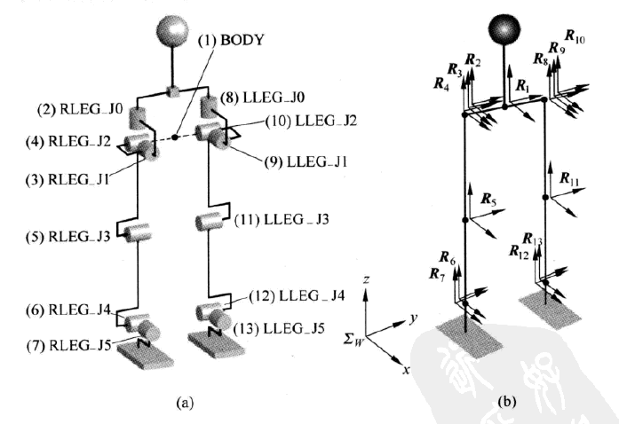

### 4.1.2 Pose Representation

The configuration of a robot's joints conveys its position and orientation. In a spatial coordinate system (OXYZ), any rigid body can be precisely and uniquely described by its positional and orientational attributes.

- Position: This comprises the x, y, and z coordinates.

- Orientation: This involves the angles rx, ry, and rz, which specify the angles between the rigid body and the OX, OY, and OZ axes, respectively.

Assuming the base coordinate system is OXYZ and the robot's coordinate system is O'X'Y'Z'. In robotics, any point in space must be explicitly defined using these six parameters: (x, y, z, rx, ry, rz). Even if the (x, y, z) coordinates are identical, distinct (rx, ry, rz) values indicate that the robot reaches the same point but with varying orientations.

The position of a rigid body can be represented by a 3x1 matrix, which designates the center O' of the rigid body coordinate system in the base coordinate system as shown below:

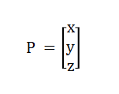

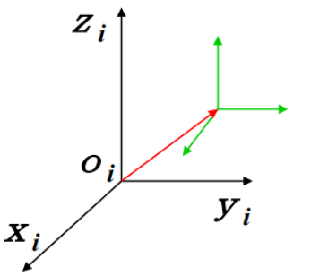

The orientation of a rigid body can be represented by a 3x3 matrix, depicting the orientation of the rigid body coordinate system in the base coordinate system as follows:

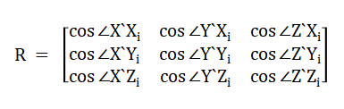

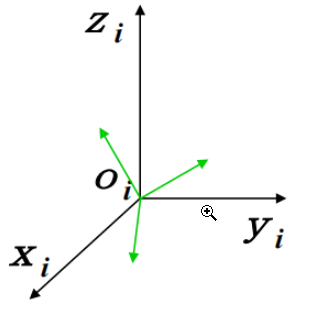

### 4.1.3 Homogeneous Coordinate Transformation Matrices

Homogeneous transformation matrices in three-dimensional space are expressed in a 4x4 matrix form:

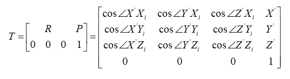

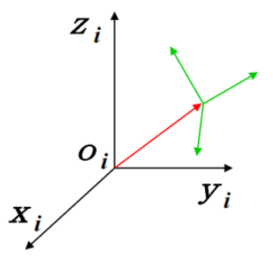

 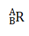represents a 3x3 rotation matrix, and 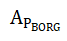 represents a 3x1 translation vector.

Common geometric transformations are primarily linear, encompassing translation, rotation, scaling, and more. However, in the realm of robotics, the most prevalent transformations involve translation and rotation. In this context, we will examine these two transformations within the framework of homogeneous coordinate systems. These transformations are conducted in the Cartesian coordinate system, with the three-dimensional Cartesian coordinate system adhering to the right-hand rule.

* **Translation Transformation**

Consider a point P in three-dimensional space with Cartesian coordinates (x, y, z). When we translate point P by tx units along the X-axis, ty units along the Y-axis, andtz units along the Z-axis, we arrive at point P\`. Its new coordinates become (x', y', z'). This translation can be mathematically represented using a homogeneous coordinate transformation matrix as follows:

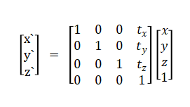

* **Rotation Transformation**

Rotation transformations in three-dimensional space can be broken down into rotations around the X-axis, Y-axis, and Z-axis. The direction of rotation adheres to the right-hand rule, where the thumb points along the axis of rotation, and the direction in which the other fingers curl indicates the positive direction of rotation.

(1) Rotation Around the X-axis

When a point P (x, y, z) undergoes a rotation of α around the X-axis, it becomes point P\`（x\`,y\`,z\`）. As the rotation occurs around the X-axis, x' remains the same as x. In essence, point P undergoes a two-dimensional rotation within the YOZ plane. Consequently, we have the following equations:

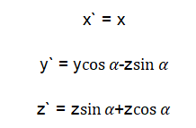

This transformation can be mathematically represented using homogeneous coordinate transformation as follows:

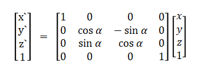

(2) Rotation Around the Y-axis

When a point P (x, y, z) undergoes a rotation of θ around the Y-axis, it becomes point P\`（x\`,y\`,z\`）. Given that the rotation is about the Y-axis, y' remains the same as y. Essentially, point P experiences a two-dimensional rotation within the ZOX plane. Therefore, we have the following equations:

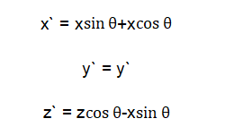

This transformation can be mathematically represented using homogeneous coordinate transformation as follows:

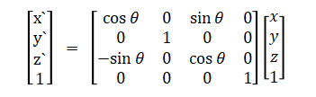

(3) Rotation Around the Z-axis

When a point P (x, y, z) undergoes a rotation of γ around the Z-axis, it becomes point P\`（x\`,y\`,z\`）. Given that the rotation takes place around the Z-axis, z' remains the same as z. Essentially, point P undergoes a two-dimensional rotation within the XOY plane. Therefore, we have the following equations:

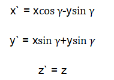

This transformation can be mathematically represented using homogeneous coordinate transformation as follows:

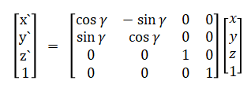

##  4.2 Inverse Kinematics Analysis

### 4.2.1 Robot Kinematics

Robotics kinematics can be categorized into two main components: forward kinematics and inverse kinematics. Forward kinematics involves computing the position of a robot's end effector based on the angles of its individual joints. In contrast, inverse kinematics focuses on determining the rotational angles of all relevant joints in the lower and upper body in order to move the robot's end effector (including hands and lifted feet) to a specific set of coordinates.

In practical applications, utilizing forward kinematics alone doesn't directly provide information about where the robot's end effector should be positioned. Therefore, we commonly employ inverse kinematics control, which calculates the joint angles necessary to achieve a desired position for the robot's end effector.

### 4.2.2 Existence and Multi-Solution Problem in Inverse Kinematics

Generally, the solutions for forward kinematics are unique and easy to obtain, while inverse kinematics often present multiple solutions and involve more intricate analysis. Due to the complexity and diversity of inverse kinematics problems in robotics, it is challenging to establish a universal analytical algorithm. Inverse kinematics problems encompass the questions of solution existence and uniqueness.

The region where solutions exist in inverse kinematics is typically referred to as the robot's workspace. The workspace represents the set of target points that the robot's end effector can reach.

Therefore, the existence of solutions in robot inverse kinematics hinges on the following: for a given robot's end effector position, there must be at least one set of joint variables that can reach it. If the given robot's end effector position falls outside the workspace, there is no solution for inverse kinematics.

For inverse kinematics solutions, it's not just about meeting position requirements; posture must also satisfy the criteria to be considered an inverse kinematics solution.

When inverse kinematics only consider position requirements, it's common to encounter situations with multiple solutions. In such cases, our approach involves first obtaining all of these solutions and then selecting the most suitable one based on specific constraints, such as setting an expected value and choosing the solution closest to that expected value.

### 4.2.3 Inverse Kinematics Calculation

In order to describe the rotation and translation relationships between adjacent coordinate systems, Denavit and Hartenberg introduced the DH (Denavit-Hartenberg) method in 1955. This method employs the product of 4x4 homogeneous transformation matrices, each characterized by four parameters. It is used to establish coordinate systems affixed to the robot's links or body based on the coordinate system of the previous link. As long as the robot's links are interconnected, the DH method can be applied in most scenarios. By taking the base coordinate system (x<sub>0</sub>y<sub>0</sub>z<sub>0</sub>) as the reference point, it allows you to systematically determine the origins and orientations of any subsequent link coordinate system (x<sub>i</sub>y<sub>i</sub>z<sub>i</sub>) or the end-effector coordinate system (x<sub>n</sub>y<sub>n</sub>z<sub>n</sub>).

| **Parameters** | **Description**  |
|:--------------:|:----------------:|
|       ai       |   Link length    |
|       αi       | Link twist angle |
|       di       |  Joint distance  |
|       θi       |   Joint angle    |

If the coordinate axis xi intersects perpendicularly with the coordinate axis zi-1 as shown in the diagram below, then the transformation relationship between the two coordinate systems can be represented with just four parameters (link length ai, link twist angle αi, joint distance di, and joint angle θi).

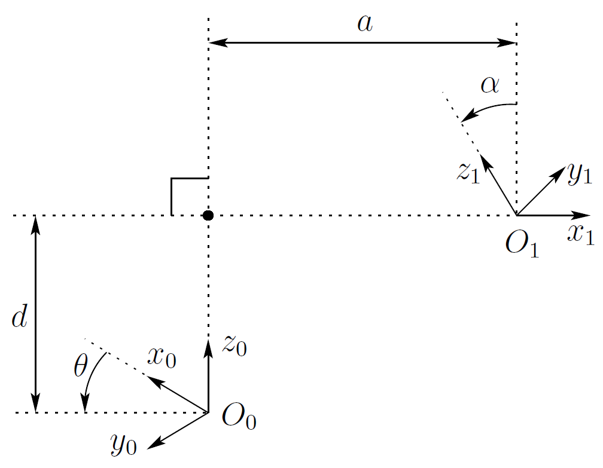

If the coordinate system {x1y1z1} intersects perpendicularly with the coordinate system {x0y0z0}, then the homogeneous transformation matrix from {x1y1z1} to {x0y0z0} is

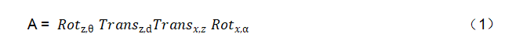

(1) Formula (1) can be written as:


As x1 intersects perpendicularly with z0, the below formula can be generated

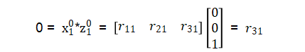

Since r31 = 0, it is sufficient to prove the existence of a unique link twist angle α and joint angle θ such that:

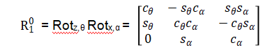

Hence, there exists a unique θ and α that satisfy:

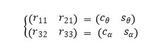

It is easily deduced that:

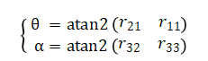

According to the properties of rotation matrices, we can derive:

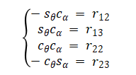

It can be seen that the rotational transformation relationship from coordinate system {x<sub>1</sub>y<sub>1</sub>z<sub>1</sub>} to coordinate system {x<sub>0</sub>y<sub>0</sub>z<sub>0</sub>} can be expressed using θ and α.

If x1 intersects with z0, then the coordinates of the origin of frame {x<sub>1</sub>y<sub>1</sub>z<sub>1</sub>} in the {x<sub>0</sub>y<sub>0</sub>z<sub>0</sub>} frame (i.e., the translation vector) are given by:

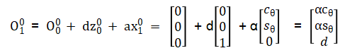

In summary, the homogeneous transformation from coordinate frame {x<sub>1</sub>y<sub>1</sub>z<sub>1</sub>} to frame {x<sub>0</sub>y<sub>0</sub>z<sub>0</sub>} can be fully described using just four parameters: the link length a, the link twist angle α, the joint offset d, and the joint angle θ.

## 4.3 Bipedal Gait Analysis

### 4.3.1 Introduction to Bipedal Gait

Bipedal gait refers to a walking pattern that uses two legs, which is a typical form of locomotion in humans and some animals, such as birds and certain primates. Unlike humans, humanoid bipedal robots do not walk effortlessly. Their movements must be decomposed into various stages and precisely controlled. Through gait planning, the robot can perform walking motions similar to those of a human.

The table below lists some commonly used terms related to bipedal gait:

| **Key Concepts** | **Definition** |
|:--:|:--:|
| Gait | In humanoid robotics, gait planning is similar to trajectory planning in robotic arms. However, while robotic arm trajectory planning typically involves working in either joint space or Cartesian space and converting between them using forward or inverse kinematics, humanoid gait planning is more complex. This is because humanoid robots lack a fixed base, and the transformation between joint space and Cartesian space must account for the floating base of the robot. Therefore, gait planning in humanoid robots refers to the combined planning of the robot's center of mass (CoM) trajectory and joint trajectories. |
| Static Walking | A type of walking where the robot maintains static equilibrium at all times. This means the projection of the robot's CoM onto the ground always remains within the support polygon formed by the feet. |
| Dynamic Walking | A type of walking where the robot maintains dynamic balance. During some phases of the gait, the projection of the CoM may fall outside the support polygon, but the robot remains stable due to its momentum and planned dynamics. |
| Single Support Phase | A walking phase where only one foot is in contact with the ground. The robot behaves like an inverted pendulum during this period. |
| Double Support Phase | A transitional phase where both feet are in contact with the ground. In human gait, the double support phase typically accounts for 8% to 25% of a full walking cycle. Humanoid robots alternate between single and double support phases during walking. In running, the robot alternates between single support and aerial (flight) phases. |
| Step | One step is defined as the movement from one foot making contact with the ground to the opposite foot making contact. It includes one double support phase and one single support phase. Two steps make up one gait cycle (stride). |
| Stride | A full walking cycle that begins and ends with the same foot contacting the ground. During this phase, each leg takes a step forward in turn. It consists of two steps, including two single support phases and two double support phases. |
| Step Height | The vertical displacement of the robot's body during a gait cycle. |
| Step Length | The horizontal distance between two successive placements of the same foot—effectively, the distance covered in a full stride. |

### 4.3.2 Explanation of Bipedal Gait 

In bipedal walking, based on the number of supporting legs, the gait cycle is divided into the Single Support Phase (SSP) and the Double Support Phase (DSP). The Single Support Phase refers to when the robot's entire weight is supported by only one leg, while the Double Support Phase means both legs are in contact with the ground supporting the robot's body.

Double support is the most stable posture during standing, whereas single support is relatively unstable. Without meeting certain conditions, the robot is likely to lose balance and fall during single support. If the Zero Moment Point (ZMP) lies within the support foot's sole during single support, the robot can still maintain full-body balance.

The diagram below shows the robot's bipedal joints:

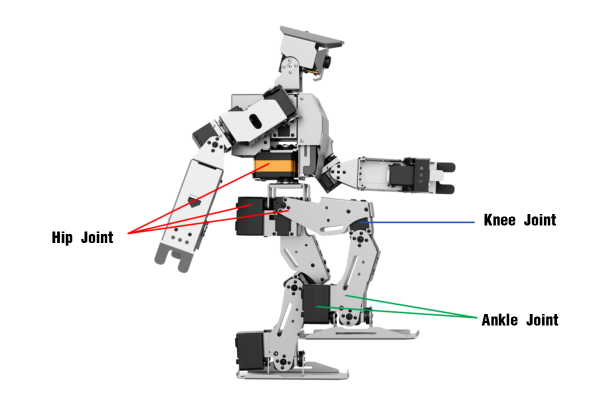

| **Joint Types** | **Function** |
|:--:|:--:|
| Hip Joint | Used to swing the leg forward, enabling stepping and allowing the upper body to lean forward or backward, which helps maintain balance during walking. |
| Knee Joint | Adjusts the height of the center of mass and controls the swing leg's clearance to adapt to varying terrain. |
| Ankle Joint | Works in coordination with the hip joint to move the supporting leg and upper body, and also adjusts the foot's contact with the ground. |

Generally, during bipedal walking, the feet alternate stepping forward continuously. Within one gait cycle, the robot is in double support phase at the beginning and end, while it is in single support phase during the walking process.

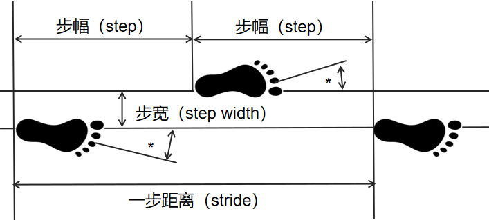

Based on timing during walking, bipedal gait actions (step) can be categorized into three types:

Initiation Step: Starts from a standing posture and ends in a walking-ready posture.

① Cyclic Step: Starts from a walking-ready posture and ends in the walking-ready posture of the opposite foot.

② Termination Step: Starts from a walking-ready posture and ends in an upright standing posture.

<p id="anchor_4_4"></p>

## 4.4 Walking Control

This section introduces the ROSMan gait computer software to help users quickly become familiar with controlling gait parameters.

### 4.4.1 Introduction to PC Software

(1) To start the ROSMan robot, refer to [3. ROS Robot Motion Basic Control Course -\> 3.1.1 Remote Desktop Tool Installation and Connection](3.ROS_Robot_Motion_Basic_Control_Course.md#remote-desktop-tool-installation-and-connection), and connect the robot to the VNC remote control software.

(2) Open the command line terminal , enter the following command, and press Enter to switch to the gait computer software directory:

```
cd software/walking_controller/
```

(3) Then, enter the command below and press Enter to launch the gait computer software:

```
python3 main.py
```

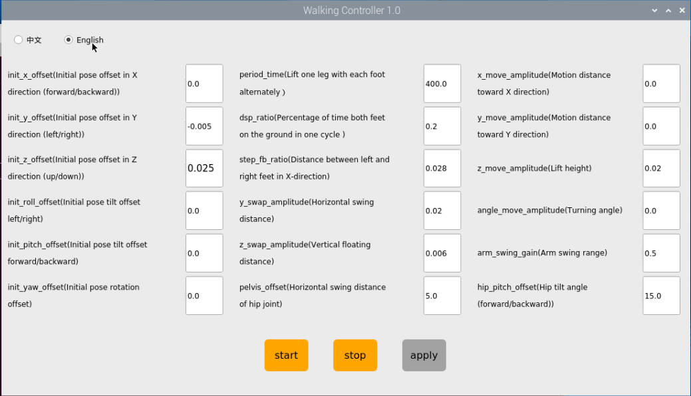

The main interface of the ROSMan gait computer software is divided into the following areas:

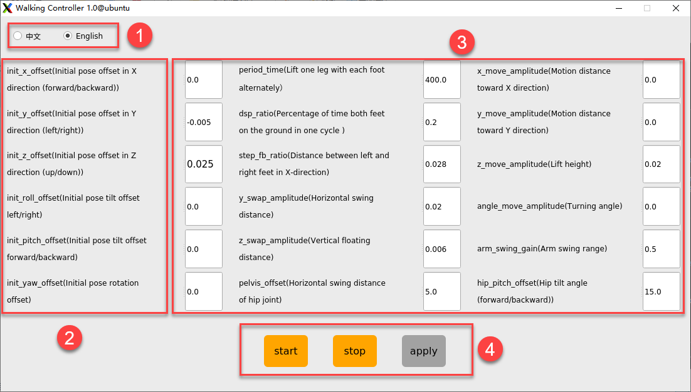

**Language Switch (Chinese/English)**

**Initial attitude parameter settings** (factory defaults are pre-set, this section is for reference only)

| **Parameter** | **Description** |
|:--:|:--:|
| init_x_offset | Initial pose offset in the X direction (forward/backward) |
| init_y_offset | Initial pose offset in the Y direction (left/right) |
| init_z_offset | Initial pose offset in the Z direction (up/down) |
| init_roll_offset | Initial roll angle offset (left/right tilt) |
| init_pitch_offset | Initial pitch angle offset (forward/backward tilt) |
| init_yaw_offset | Initial yaw angle offset (rotation around the vertical axis) |

**Posture Adjustment Parameters**

| **Parameter** | **Description** |
|:--:|:--:|
| period_time | Cycle time for lifting each leg once, both left and right legs |
| dsp_ratio | Double support phase ratio, percentage of time both feet are on the ground |
| step_fb_ratio | Step distance along the X-axis, with unit in meters |
| y_swap_amplitude | Side-to-side swing distance, with unit in meters |
| z_swap_amplitude | Vertical oscillation distance, with unit in meters |
| pelvis_offset | Pelvis sway offset to the left and right, with unit in meters |
| x_move_amplitude | Forward/backward movement amplitude along the X-axis, with unit in meters |
| y_move_amplitude | Sideways movement amplitude along the Y-axis, with unit in meters |
| z_move_amplitude | Foot lift height, with unit in meters |
| angle_move_amplitude | Hip rotation angle, with unit in meters |
| arm_swing_gain | Arm swing amplitude, with unit in meters |
| hip_pitch_offset | Forward/backward tilt angle of the hip |

 **Posture Parameter Execution**

| **Icon** | **Function** |
|:--:|:--:|
|  | Click this button to start the walking motion. Make sure to click "**Apply**" first. |
|  | Click this button to stop the walking motion. |
|  | Click this button to apply the modified parameters. |

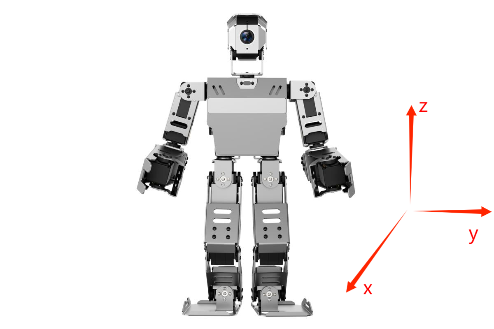

### 4.4.2 PC Software Parameter Adjustment

Each parameter has a defined range. Exceeding this range may damage the robot's servos. Here is an example of modifying the x_move_amplitude parameter to adjust the robot's movement distance along the X-axis:

(1) Change the value. A negative number indicates movement in the opposite direction. The larger the absolute value, the bigger the step. For example, set it to 0.03 with unit in meters.

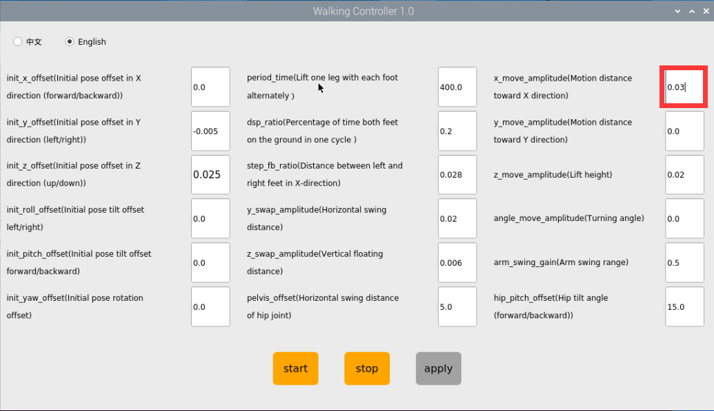

(2) After modifying the value, click the button  to activate the changes.

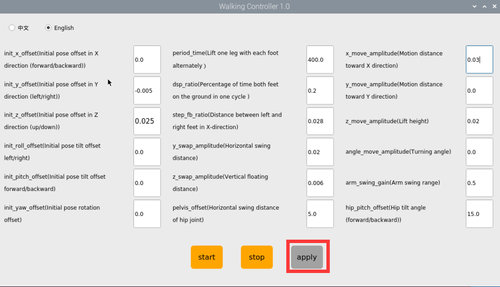

(3) Then click the  button to run the gait. You'll see the robot take larger forward steps.

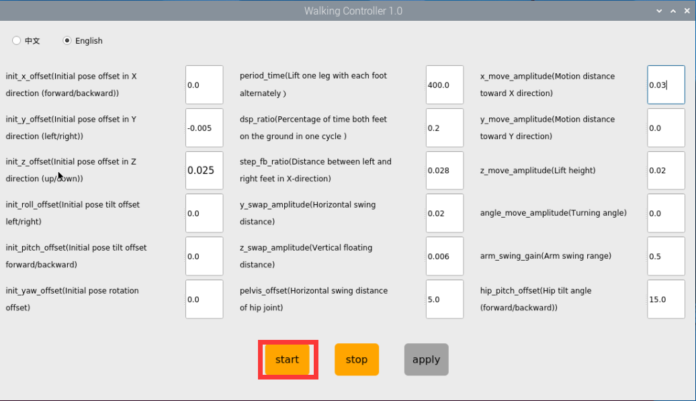

(4) To stop the motion, simply click the  button.

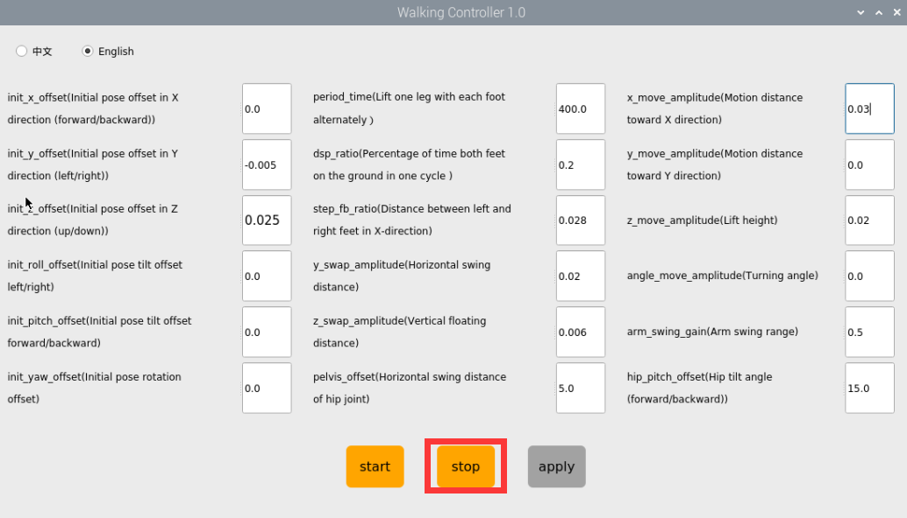

### 4.4.3 Running the Program

In the program, you can control the robot's posture by setting parameters such as speed, step size in the X and Y directions, and rotation amplitude.

The source code for the program is located at: [/home/ubuntu/ros_ws/src/rosman_tutorial/scripts/gait_control/simple_gait_control_demo.py](../_static/source_code/gait_control.zip)

(1) To navigate to the program directory, enter the following command in the terminal and press Enter:

```
roscd rosman_tutorial/scripts/gait_control/
```

(2) Then, enter the command below and press Enter to open the file:

```
vim simple_gait_control_demo.py
```

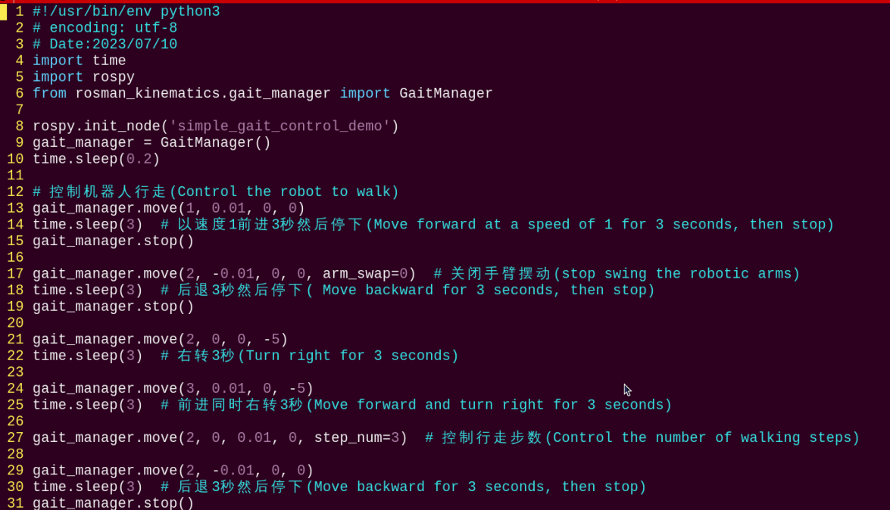

(3) Press the key **i** to enter edit mode.

```
i
```

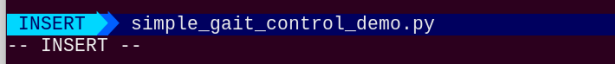

(4) Modify the value of x_amplitude to change the robot's step size in the X direction. The greater the value, the higher the step frequency. In this example, change it to 0.02. x_amplitude must be within the range of -0.2 to 0.2.

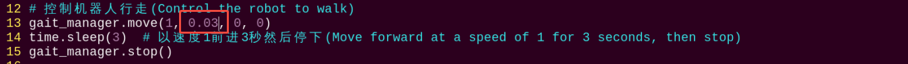

(5) After editing, press Esc, type the following command, and press Enter to save and exit.

```
:wq
```

(6) Then, enter the command below and press Enter to open the file:

```
python3 simple_gait_control_demo.py
```

Once the program starts, you'll notice the robot taking larger forward steps.

(7) To exit the feature, press Ctrl+C in the terminal. If the program does not close successfully, try pressing Ctrl+C again.

### 4.4.4 Program Brief Analysis

This program primarily utilizes a gait control method. The core function used is gait_manager.move(), which is defined in the gait_manager.py file located at:  [/home/ubuntu/ros_ws/src/rosman_driver/rosman_kinematics/src/rosman_kinematics/gait_manager.py](../_static/source_code/rosman_kinematics.zip)

(1) To navigate to the program directory, enter the following command in the terminal and press Enter:

```
roscd rosman_kinematics/src/rosman_kinematics/
```

(2) Then enter the following command and press Enter to open the file gait_manager.py.

```
vim gait_manager.py
```

(3) The `move()` function used in the gait control routine takes the following parameters:

{lineno-start=198}

```
    def move(self, step_velocity, x_amplitude, y_amplitude, rotation_angle, arm_swap=30, step_num=0):
        '''
        param step_velocity: 速度选择分三档分别为 1，2，3, 4速度由快到慢(Speed selection, which can be 1, 2, or 3. 4 is the slowest speed)
        param x_amplitude: x方向步幅(m)(Step length in the x direction in meters)
        param y_amplitude: y方向步幅(m)(Step length in the y direction in meters)
        param rotation_angle: 旋转幅度(deg)(Rotation angle in degrees)
        param arm_swap: 手臂摆动幅度(deg)， 默认30, 当为0时不会给手臂发送指令(Amplitude of arm swing in degrees. Default is 30. If it is set to 0, no command will be sent to the arms)
        '''
        if 0 < step_velocity < 5:
            self.set_step(self.dsp_ratio[step_velocity - 1], x_amplitude, y_amplitude, rotation_angle, self.get_gait_param(), arm_swap, step_num)

```

`step_velocity`: Step speed, with four levels (1 to 4). A larger number indicates slower speed.

`x_amplitude`: Step size in the X direction with unit in meters.

`y_amplitude`: Step size in the Y direction with unit in meters.

`rotation_angle`: Rotational angle (deg).

`arm_swap`: Swing angle of the arms (deg), which is defaulted to 30. If set to 0, the robot will not send motion commands to the arms.

`step_num`: Number of steps. Specifies how many steps the robot will take.

## 4.5 Gait Cycle Adjustment

This section focuses on adjusting the gait cycle through the ROSMan gait control software and program. It aims to help you quickly get familiar with controlling gait-related parameters.

### 4.5.1 PC Software Parameter Adjustment

Each parameter has a defined range. Exceeding this range may damage the robot's servos. For more details about the ROSMan gait computer software and gait parameters, please refer to the course:  

[4.4 Walking Control](#anchor_4_4)

As an example, here we modify the parameter period_time to adjust the robot's gait cycle:

(1) To start the ROSMan robot, refer to [3.ROS Robot Motion Basic Control Course -\> 3.1.1 Remote Desktop Tool Installation and Connection](3.ROS_Robot_Motion_Basic_Control_Course.md#remote-desktop-tool-installation-and-connection), and connect the robot to the VNC remote control software.

(2) Open the command line terminal, enter the following command, and press Enter to switch to the gait computer software directory:

```
cd software/walking_controller/
```

(3) Then, enter the command below and press Enter to launch the gait computer software:

```
python3 main.py
```

(4) Modify the value. Increasing this value decreases the stepping frequency, resulting in a slower walking speed. Here, set it to 500.

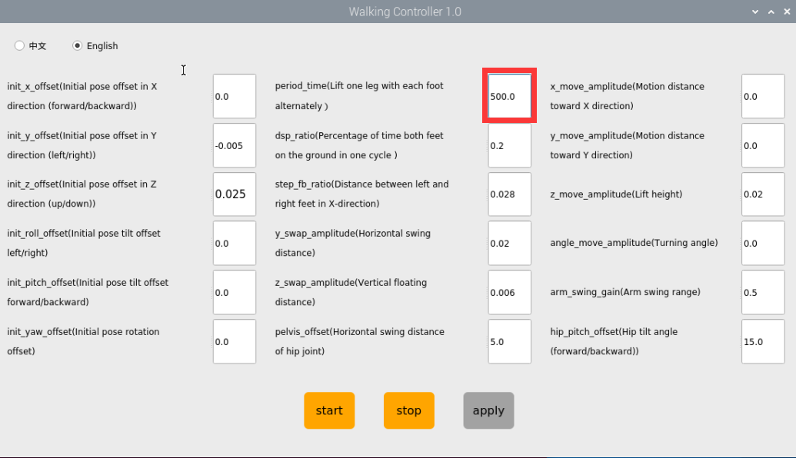

(5) After modifying the value, click the button  to activate the changes.

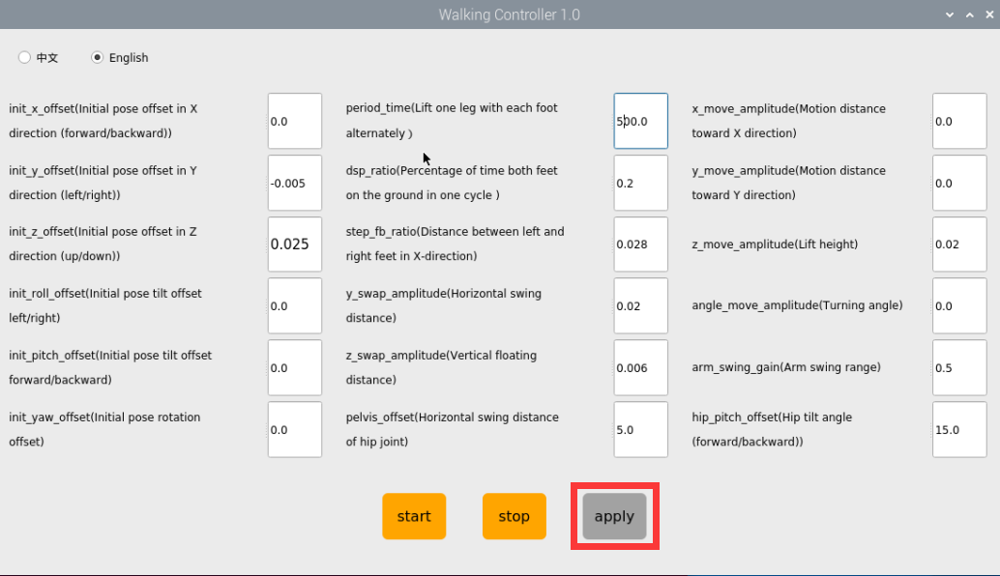

(6) Then click the  button to begin running the gait. You should observe the robot stepping in place at a slower pace.

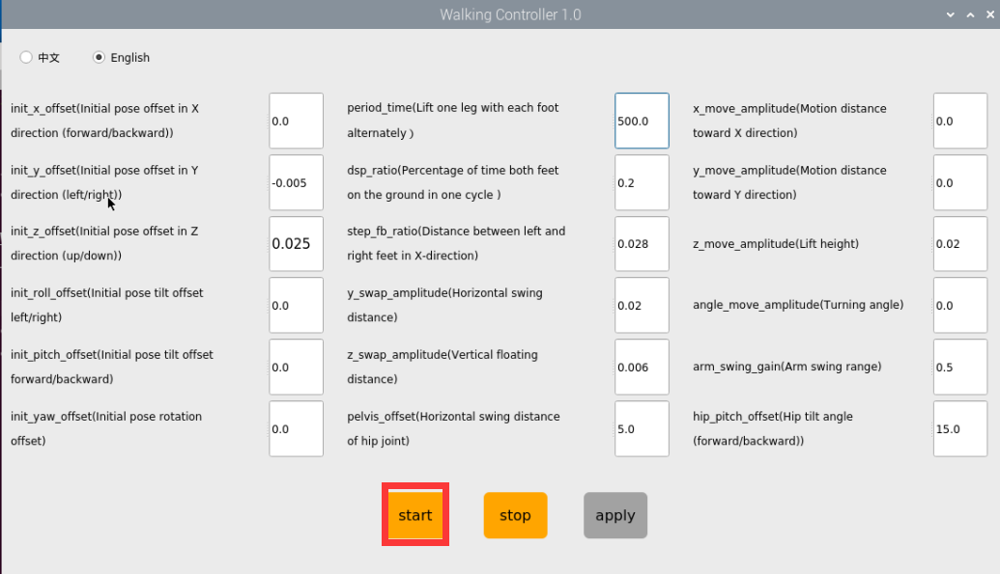

(7) To stop the motion, simply click the  button.

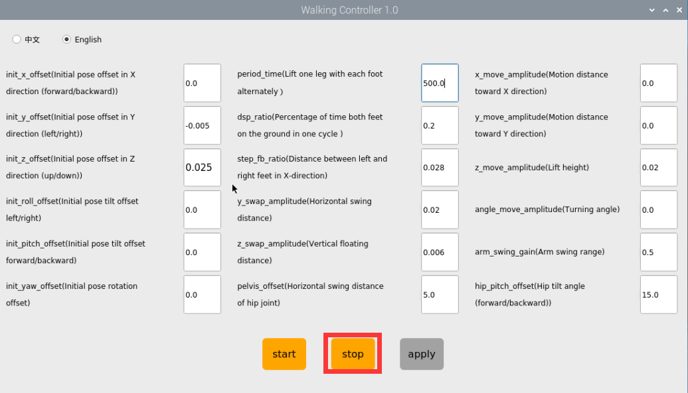

### 4.5.2 Running the Program

In the program, you can control the robot's posture by setting parameters such as speed, step size in the X and Y directions, and rotation amplitude.

The source code for the program is located at: [/home/ubuntu/ros_ws/src/rosman_tutorial/scripts/gait_control/gait_control_demo.py](../_static/source_code/gait_control.zip)

(1) To navigate to the program directory, enter the following command in the terminal and press Enter:

```
roscd rosman_tutorial/scripts/gait_control/
```

(2) Then, enter the command below and press Enter to open the file:

```
vim gait_control_demo.py
```

(3) Press the key **i** to enter edit mode.

```
i
```

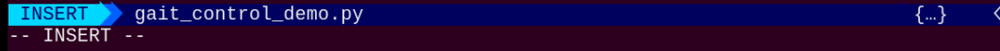

(4) To adjust the gait frequency of the robot, modify the period_time parameter, which controls the leg-lifting cycle of both the left and right legs. In this example, change it to 500.

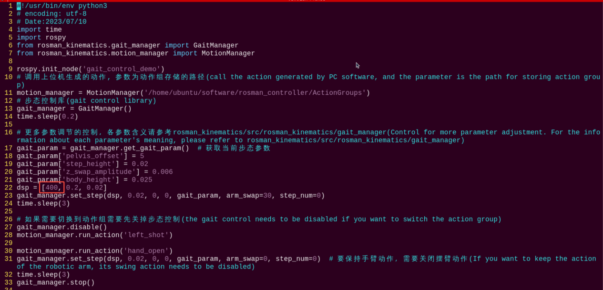

(5) After editing, press Esc, type the following command, and press **Enter** to save and exit.

```
:wq
```

(6) Then, enter the command below and press Enter to open the file:

```
python3 gait_control_demo.py
```

Once the program starts, you'll notice that the robot walks at a slower step frequency.

(7) To exit the feature, press Ctrl+C in the terminal. If the program does not close successfully, try pressing Ctrl+C again.

### 4.5.3 Program Brief Analysis

This program primarily utilizes a gait control method. The core function used is gait_manager.move(), which is defined in the **gait_manager.py** file located at:  [/home/ubuntu/ros_ws/src/rosman_driver/rosman_kinematics/src/rosman_kinematics/gait_manager.py](../_static/source_code/rosman_kinematics.zip)

(1) To navigate to the program directory, enter the following command in the terminal and press Enter:

```
roscd rosman_kinematics/src/rosman_kinematics/
```

(2) Then enter the following command and press Enter to open the file `gait_manager.py`.

```
vim gait_manager.py
```

(3) The `set_step()` function is used to configure gait parameters for the robot. Its parameters are as follows:

{lineno-start=165}

```
    def set_step(self, step_velocity, x_amplitude, y_amplitude, rotation_angle, walking_param=None, arm_swap=30, step_num=0):
        '''
        以设置参数行走
        param step_velocity: 列表形式包含三个参数(a list containing three parameters)[period_time, dsp_ratio, y_swap_amplitude], 即周期(ms), 占地时间比例， 左右摆动幅度(m)(which are gait period (ms), percentage of time when both feet are on the ground (0-1), and swing amplitude in meters)
        param x_amplitude: x方向步幅(m)(step length in the x direction in meters)
        param y_amplitude: y方向步幅(m)(step length in the y direction in meters)
        param rotation_angle: 旋转幅度(deg)(rotation angle in degrees)
        param walking_param: 其他参数(other gait parameters)
        param arm_swap: 手臂摆动幅度(deg)， 默认30, 当为0时不会给手臂发送指令(amplitude of arm swing in degrees. Default is 30. If it is set to 0, no command will be sent to the arms)
        param step_num: 步数(number of steps to take)
        '''
        try:
            self.update_param(step_velocity, x_amplitude, y_amplitude, rotation_angle, walking_param, arm_swap, step_num)
            if step_num != 0:
                res = rospy.ServiceProxy('walking/get_param', GetWalkingParam)()
                self.walking_param = res.parameters
                rospy.ServiceProxy('walking/command', SetWalkingCommand)('start')
                while not self.is_walking:
                    time.sleep(0.01)
                while self.is_walking:
                    time.sleep(0.01)
                self.state = 'step_walking'
            else:
                if self.state != 'walking':
                    if step_num == 0:
                        self.state = 'walking'
                        res = rospy.ServiceProxy('walking/get_param', GetWalkingParam)()
                        self.walking_param = res.parameters
                        rospy.ServiceProxy('walking/command', SetWalkingCommand)('start')
        except BaseException as e:
            print(e)
            return
```

① `step_velocity`: A list containing the following elements.  

`period_time`: Duration of a full gait cycle (i.e., one step with each leg), in milliseconds (ms).  

`dsp_ratio`: Ratio of the gait cycle where both feet are on the ground (range: 0–1).  

`y_swap_amplitude`: Lateral sway amplitude while walking, in meters (m).

② `x_amplitude`: Step length in the X direction, representing how far the robot moves forward or backward per step, in meters (m).

③ `y_amplitude`: Step length in the Y direction, representing lateral movement per step, in meters (m).

④ `rotation_angle`: Rotation angle per step, in degrees. A positive value causes the robot to turn in place.

⑤ `walking_param`: Additional parameters.

⑥ `arm_swap`: Arm swing amplitude during walking, in degrees(°). Default is 30. If set to 0, no commands will be sent to the arms.

⑦ `step_num`: Number of steps. Specifies how many steps the robot will take.

## 4.6 Step Height Adjustment

This section focuses on adjusting the foot lift height through the ROSMan gait control software and program. It aims to help you quickly get familiar with adjusting foot height and related parameters.

### 4.6.1 PC Software Parameter Adjustment

Each parameter has a defined range. Exceeding this range may damage the robot's servos. For more details about the ROSMan gait computer software and gait parameters, please refer to the course:  [4.4 Walking Control](#anchor_4_4)

Let's take **"step_height"** as an example to adjust the robot's foot lift height during walking:

(1) To start the ROSMan robot, refer to [3.ROS Robot Motion  Basic Control Course -\> 3.1.1 Remote Desktop Tool Installation and Connection](3.ROS_Robot_Motion_Basic_Control_Course.md#remote-desktop-tool-installation-and-connection), and connect the robot to the VNC remote control software.

(2) Open the command line terminal, enter the following command, and press Enter to switch to the gait computer software directory:

```
cd software/walking_controller/
```

(3) Then, enter the command below and press Enter to launch the gait computer software:

```
python3 main.py
```

(4) Modify the value. Larger values result in a higher lift (unit: meters). Here, it is set to 0.01.

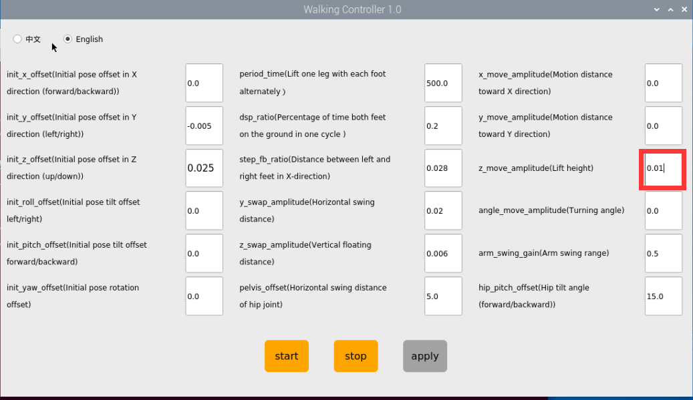

(5) After modifying the value, click the button  to activate the changes.

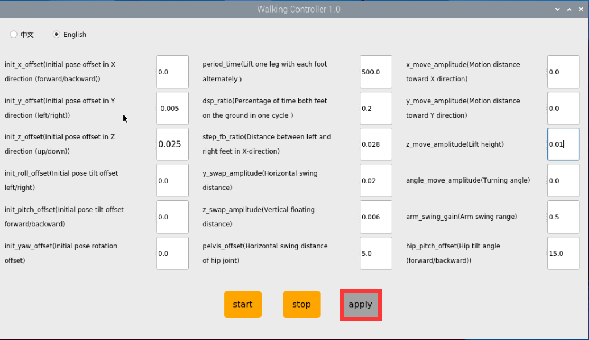

(6) Then click the  button to begin running the program. You should observe the robot's leg lift height has decreased.


(7) To stop the motion, simply click the  button.


### 4.6.2 Running the Program

In the program, you can control the robot's posture by setting parameters such as speed, step size in the X and Y directions, and rotation amplitude.

The source code for the program is located at: [/ros_ws/src/rosman_tutorial/scripts/gait_control/gait_control_demo.py](../_static/source_code/gait_control.zip)

(1) To navigate to the program directory, enter the following command in the terminal and press Enter:

```
roscd rosman_tutorial/scripts/gait_control/
```

(2) Then, enter the command below and press Enter to open the file:

```
vim gait_control_demo.py
```

(3) Press i to enter edit mode.

```
i
```

(4) By adjusting the robot's foot lift height using the "step_height" parameter, you can change how high the robot lifts its legs while walking. A larger value results in a higher step (unit: meters). In this example, change it to 0.01.

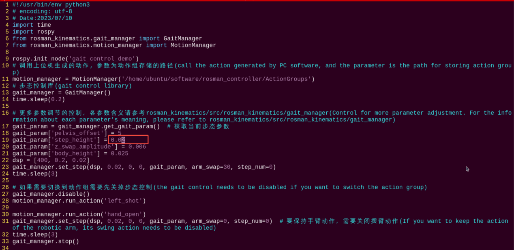

(5) After editing, press **Esc**, type the following command, and press Enter to save and exit.

```
:wq
```

(6) Then, enter the command below and press Enter to open the file:

```
python3 gait_control_demo.py
```

Once the program starts, you'll notice the robot's step height has decreased.

(7) To exit the feature, press **Ctrl+C** in the terminal. If the program does not close successfully, try pressing **Ctrl+C** again.

* **Program Brief Analysis**

This program primarily utilizes a gait control method. The function gait_manager.set_step() is used for gait control. It is implemented in the file gait_manager.py located at [ros_ws/src/rosman_driver/rosman_kinematics/src/rosman_kinematics/gait_manager.py](../_static/source_code/rosman_kinematics.zip).

(1) To navigate to the program directory, enter the following command in the terminal and press Enter:

```
roscd rosman_kinematics/src/rosman_kinematics/
```

(2) Then enter the following command and press Enter to open the file **gait_manager.py**.

```
vim gait_manager.py
```

(3) The `set_step()` function is used to configure gait parameters for the robot. Its parameters are as follows:

{lineno-start=165}

```
    def set_step(self, step_velocity, x_amplitude, y_amplitude, rotation_angle, walking_param=None, arm_swap=30, step_num=0):
        '''
        以设置参数行走
        param step_velocity: 列表形式包含三个参数(a list containing three parameters)[period_time, dsp_ratio, y_swap_amplitude], 即周期(ms), 占地时间比例， 左右摆动幅度(m)(which are gait period (ms), percentage of time when both feet are on the ground (0-1), and swing amplitude in meters)
        param x_amplitude: x方向步幅(m)(step length in the x direction in meters)
        param y_amplitude: y方向步幅(m)(step length in the y direction in meters)
        param rotation_angle: 旋转幅度(deg)(rotation angle in degrees)
        param walking_param: 其他参数(other gait parameters)
        param arm_swap: 手臂摆动幅度(deg)， 默认30, 当为0时不会给手臂发送指令(amplitude of arm swing in degrees. Default is 30. If it is set to 0, no command will be sent to the arms)
        param step_num: 步数(number of steps to take)
        '''
        try:
            self.update_param(step_velocity, x_amplitude, y_amplitude, rotation_angle, walking_param, arm_swap, step_num)
            if step_num != 0:
                res = rospy.ServiceProxy('walking/get_param', GetWalkingParam)()
                self.walking_param = res.parameters
                rospy.ServiceProxy('walking/command', SetWalkingCommand)('start')
                while not self.is_walking:
                    time.sleep(0.01)
                while self.is_walking:
                    time.sleep(0.01)
                self.state = 'step_walking'
            else:
                if self.state != 'walking':
                    if step_num == 0:
                        self.state = 'walking'
                        res = rospy.ServiceProxy('walking/get_param', GetWalkingParam)()
                        self.walking_param = res.parameters
                        rospy.ServiceProxy('walking/command', SetWalkingCommand)('start')
        except BaseException as e:
            print(e)
            return
```

① `step_velocity`: A list containing the following elements.  

`period_time`: Duration of a full gait cycle (i.e., one step with each leg), in milliseconds (ms).  

`dsp_ratio`: Ratio of the gait cycle where both feet are on the ground (range: 0–1).  

`y_swap_amplitude`: Lateral sway amplitude while walking, in meters (m).

② `x_amplitude`: Step length in the X direction, representing how far the robot moves forward or backward per step, in meters (m).

③ `y_amplitude`: Step length in the Y direction, representing lateral movement per step, in meters (m).

④ `rotation_angle`: Rotation angle per step, in degrees. A positive value causes the robot to turn in place.

⑤ `walking_param`: Additional parameters.

⑥ `arm_swap`: Arm swing amplitude during walking, in degrees(°). Default is 30. If set to 0, no commands will be sent to the arms.

⑦ `step_num`: Number of steps. Specifies how many steps the robot will take.

## 4.7 Other Parameters Adjustment

This section focuses on using the ROSMan gait computer software and program calls to adjust the robot's posture parameters, helping you quickly become familiar with controlling the robot's posture.

### 4.7.1 PC Software Parameter Adjustment

Each parameter has a defined range. Exceeding this range may damage the robot's servos. For more details about the ROSMan gait computer software and gait parameters, please refer to the course: [4.4 Walking Control](#anchor_4_4)

For example, modify the parameters "x_move_amplitude" and "angle_move_amplitude" to adjust the robot's movement distance along the X-axis and its turning angle.

(1) To start the ROSMan robot, refer to [3.ROS Robot Motion  Basic Control Course -\> 3.1.1 Remote Desktop Tool Installation and Connection](3.ROS_Robot_Motion_Basic_Control_Course.md#remote-desktop-tool-installation-and-connection), and connect the robot to the VNC remote control software.

(2) Open the command line terminal, enter the following command, and press Enter to switch to the gait computer software directory:

```
cd software/walking_controller/
```

(3) Then, enter the command below and press Enter to launch the gait computer software:

```
python3 main.py
```

(4) Changing the value of "x_move_amplitude" to a positive number makes the robot move forward, while a negative number makes it move backward. The larger the absolute value of the number, the bigger the step length (unit: meters). Here, it is set to 0.03. Modify the value of "angle_move_amplitude": a positive number turns the robot to the right, while a negative number turns it to the left. The larger the absolute value, the greater the turning angle (unit: radians). Here, it is set to 0.04.

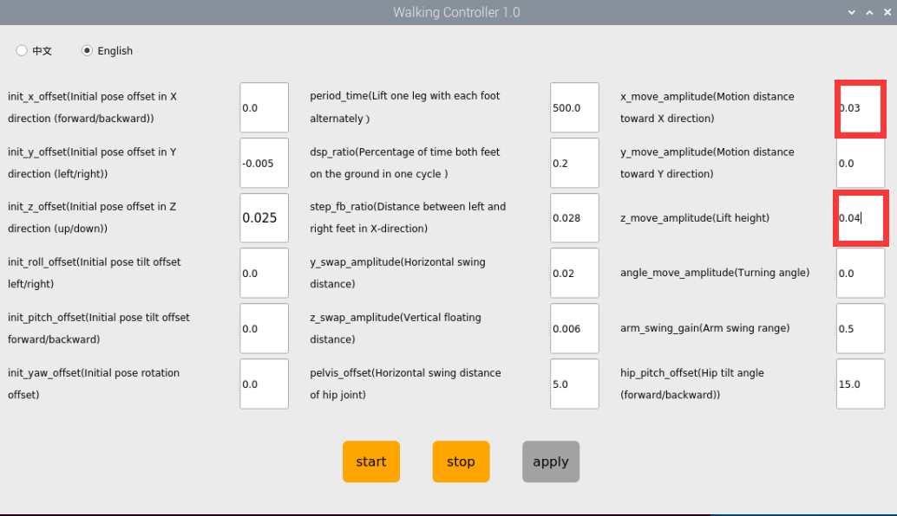

(5) After modifying the value, click the button  to activate the changes.

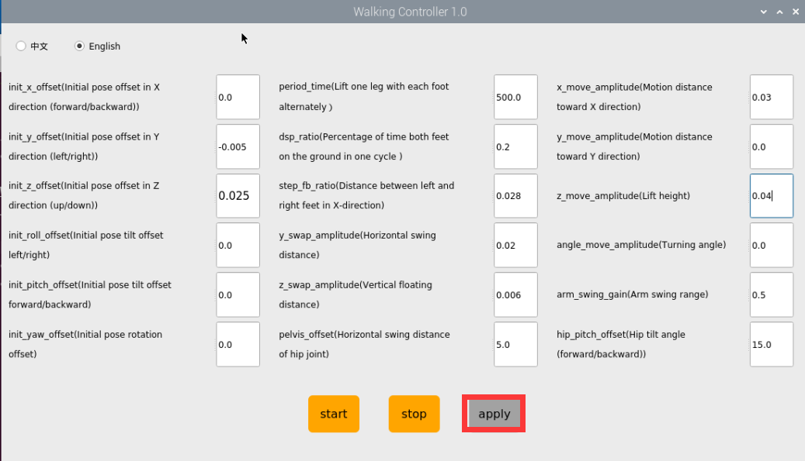

(6) Then click the  button to begin running the gait. You should observe the robot stepping in place at a slower pace.

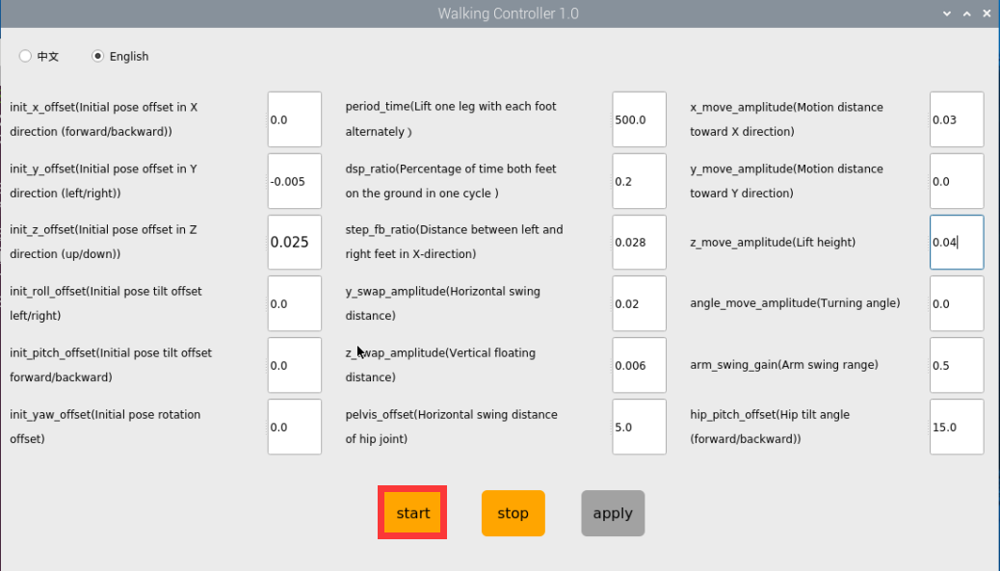

(7) To stop the motion, simply click the  button.


(8) After starting execution, the robot walks diagonally forward to the right.

### 4.7.2 Running the Program

In the program, you can control the robot's posture by setting parameters such as speed, step size in the X and Y directions, and rotation amplitude.

The source code for the program is located at: [/ros_ws/src/rosman_tutorial/scripts/gait_control/gait_control_demo.py](../_static/source_code/gait_control.zip)

(1) To navigate to the program directory, enter the following command in the terminal and press Enter:

```
roscd rosman_tutorial/scripts/gait_control/
```

(2) Then, enter the command below and press Enter to open the file:

```
vim gait_control_demo.py
```

(3) Press the key **i** to enter edit mode.

```
i
```

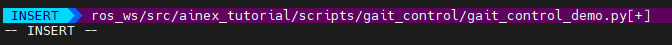

(4) Modify the robot's X-direction movement distance and turning angle by adjusting the parameters "x_move_amplitude" and "angle_move_amplitude." Set the X-direction movement distance to 0.01—larger values result in bigger forward steps. For the turning angle, set it to 8—higher values produce greater rotation angles.

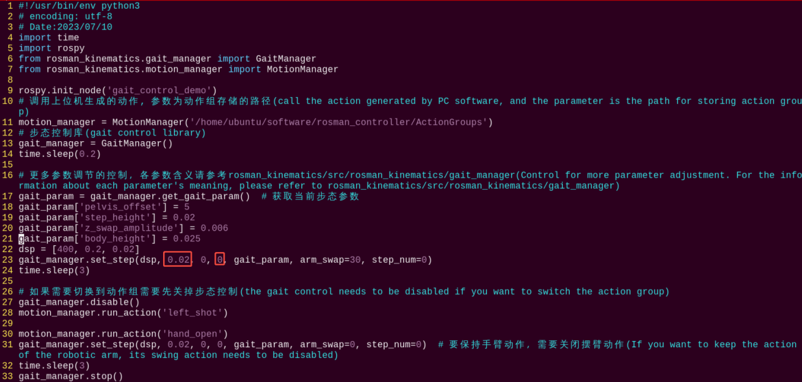

(5) After editing, press Esc, type the following command, and press Enter to save and exit.

```
:wq
```

(6) Then, enter the command below and press Enter to open the file:

```
python3 gait_control_demo.py
```

Once the program starts, you will see the robot walk diagonally forward to the right.

(7) To exit the feature, press **Ctrl+C** in the terminal. If the program does not close successfully, try pressing **Ctrl+C** again.

(8) This method can also be used to adjust other parameters as needed.

### 4.7.3 Program Brief Analysis

This program primarily utilizes a gait control method. The function gait_manager.set_step() is used for gait control. It is implemented in the file **gait_manager.py** located at `ros_ws/src/rosman_driver/rosman_kinematics/src/rosman_kinematics`.

(1) To navigate to the program directory, enter the following command in the terminal and press Enter:

```
roscd rosman_kinematics/src/rosman_kinematics/
```

(2) Then enter the following command and press Enter to open the file **gait_manager.py**.

```
vim gait_manager.py
```

(3) The `set_step()` function is used to configure gait parameters for the robot. Its parameters are as follows:

{lineno-start=165}

```
    def set_step(self, step_velocity, x_amplitude, y_amplitude, rotation_angle, walking_param=None, arm_swap=30, step_num=0):
        '''
        以设置参数行走
        param step_velocity: 列表形式包含三个参数(a list containing three parameters)[period_time, dsp_ratio, y_swap_amplitude], 即周期(ms), 占地时间比例， 左右摆动幅度(m)(which are gait period (ms), percentage of time when both feet are on the ground (0-1), and swing amplitude in meters)
        param x_amplitude: x方向步幅(m)(step length in the x direction in meters)
        param y_amplitude: y方向步幅(m)(step length in the y direction in meters)
        param rotation_angle: 旋转幅度(deg)(rotation angle in degrees)
        param walking_param: 其他参数(other gait parameters)
        param arm_swap: 手臂摆动幅度(deg)， 默认30, 当为0时不会给手臂发送指令(amplitude of arm swing in degrees. Default is 30. If it is set to 0, no command will be sent to the arms)
        param step_num: 步数(number of steps to take)
        '''
        try:
            self.update_param(step_velocity, x_amplitude, y_amplitude, rotation_angle, walking_param, arm_swap, step_num)
            if step_num != 0:
                res = rospy.ServiceProxy('walking/get_param', GetWalkingParam)()
                self.walking_param = res.parameters
                rospy.ServiceProxy('walking/command', SetWalkingCommand)('start')
                while not self.is_walking:
                    time.sleep(0.01)
                while self.is_walking:
                    time.sleep(0.01)
                self.state = 'step_walking'
            else:
                if self.state != 'walking':
                    if step_num == 0:
                        self.state = 'walking'
                        res = rospy.ServiceProxy('walking/get_param', GetWalkingParam)()
                        self.walking_param = res.parameters
                        rospy.ServiceProxy('walking/command', SetWalkingCommand)('start')
        except BaseException as e:
            print(e)
            return
```

① `step_velocity`: A list containing the following elements.  

`period_time`: Duration of a full gait cycle (i.e., one step with each leg), in milliseconds (ms).  

`dsp_ratio`: Ratio of the gait cycle where both feet are on the ground (range: 0–1).  

`y_swap_amplitude`: Lateral sway amplitude while walking, in meters (m).

② `x_amplitude`: Step length in the X direction, representing how far the robot moves forward or backward per step, in meters (m).

③ `y_amplitude`: Step length in the Y direction, representing lateral movement per step, in meters (m).

④ `rotation_angle`: Rotation angle per step, in degrees. A positive value causes the robot to turn in place.

⑤ `walking_param`: Additional parameters. Default to None.

⑥ `arm_swap`: Arm swing amplitude during walking, in degrees(°). Default is 30. If set to 0, no commands will be sent to the arms.

⑦ `step_num`: Number of steps. Specifies how many steps the robot will take.

## 4.8 Gait & Action Group Switching

### 4.8.1 Introduction

Action group files cannot be executed while gait control is active. To run an action group file, you need to disable gait control first.

The source code for this program is located at: [/ros_ws/src/rosman_tutorial/scripts/gait_control/ gait_control_demo.py](../_static/source_code/gait_control.zip)

### 4.8.2 Enabling and Disabling the Feature

(1) To navigate to the program directory, enter the following command in the terminal and press Enter:

```
roscd rosman_tutorial/scripts/gait_control/
```

(2) Then, enter the command below and press Enter to open the file:

```
vim gait_control_demo.py
```

(3) Press the key **i** to enter edit mode.

```
i
```


(4) To execute an action group file, you must call the gait_manager.disable() function to disable gait control. If this line is commented out, the action group file will not run.

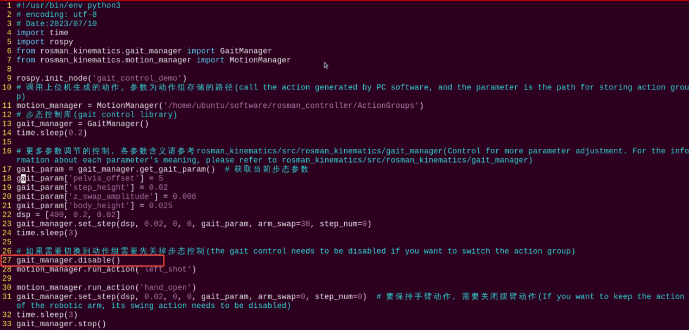

(5) Locate the line containing gait_manager.disable() and add a \# in front of it to comment it out.

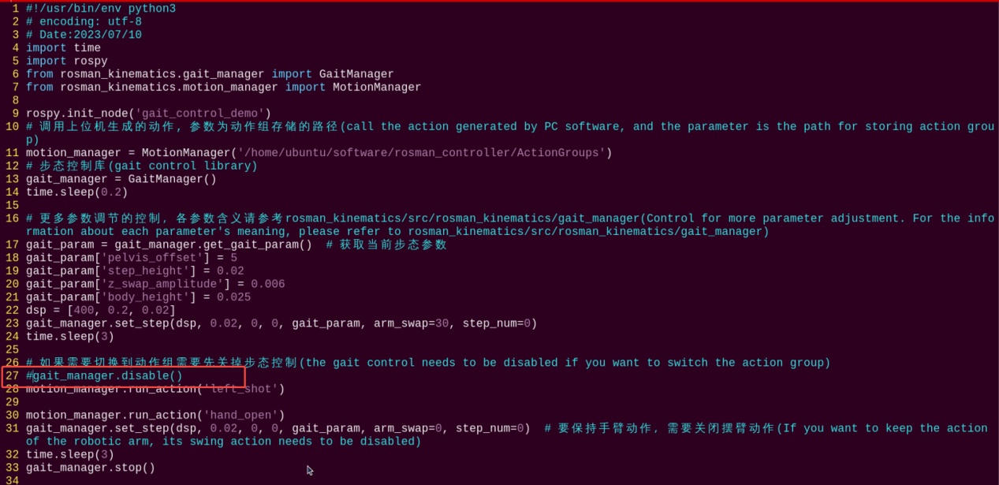

(6) After editing, press **Esc**, type the following command, and press **Enter** to save and exit.

```
:wq
```

(7) Then, enter the command below and press **Enter** to open the file:

```
python3 gait_control_demo.py
```

(8) To exit the feature, press **Ctrl+C** in the terminal. If the program does not close successfully, try pressing Ctrl+C again.

### 4.8.3 Project Outcome

After the program starts, the robot moves forward for 3 seconds at speed 1, then moves backward for another 3 seconds. The action groups left_shot and hand_open will not be executed. To enable the action group execution, simply uncomment the corresponding lines in the code.