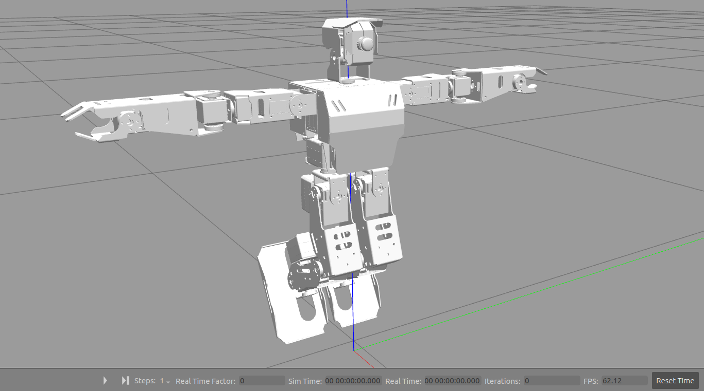

# 5. ROS Robot Simulation Model & URDF

## 5.1 Introduction to URDF Models and Getting Started

### 5.1.1 URDF Model Introduction

The Unified Robot Description Format (URDF) is an XML file format widely used in ROS (Robot Operating System) to comprehensively describe all components of a robot.

Robots are typically composed of multiple links and joints. A link is defined as a rigid object with certain physical properties, while a joint connects two links and constrains their relative motion.

By connecting links with joints and imposing motion restrictions, a kinematic model is formed. The URDF file specifies the relationships between joints and links, their inertial properties, geometric characteristics, and collision models.

### 5.1.2 Comparison between xacro and URDF Model

The URDF model serves as a description file for simple robot models, offering a clear and easily understandable structure. However, when it comes to describing complex robot structures, using URDF alone can result in lengthy and unclear descriptions.

To address this limitation, the xacro model extends the capabilities of URDF while maintaining its core features. The xacro format provides a more advanced approach to describe robot structures. It greatly improves code reusability and helps avoid excessive description length.

For instance, when describing the two legs of a humanoid robot, the URDF model would require separate descriptions for each leg. On the other hand, the xacro model allows for describing a single leg and reusing that description for the other leg, resulting in a more concise and efficient representation.

### 5.1.3 Basic Syntax of URDF Model

* **XML Basic Syntax**

The URDF model is written using XML standard. 

(1) Elements:

An element can be defined as desired using the following formula:

```xml
<element>
</element>
```

(2) Properties:

Properties are included within elements to define characteristics and parameters. Please refer to the following formula to define an element with properties:

```xml
<element
property_1="property value1"
property_2="property value2">
</element>
```

(3) Comments:

Comments have no impact on the definition of other properties and elements. Please use the following formula to define a comment:

```xml
<!-- comment content -->
```

* **Link**

The Link element describes the visual and physical properties of the robot's rigid component. The following tags are commonly used to define the motion of a link:


(1) \<visual\>：Describe the appearance of the link, such as size, color and shape.

(2) \<inertial\>：Describe the inertia parameters of the link, which will used in dynamics calculation.

(3) \<collision\>：Describe the collision inertia property of the link.

Each tag contains the corresponding child tag. The functions of the tags are listed below.

| Tag      | Function                                                     |
| :------- | :----------------------------------------------------------- |
| origin   | Describe the pose of the link. It contains two parameters, including xyz and rpy. Xyz describes the pose of the link in the simulated map. Rpy describes the pose of the link in the simulated map. |
| mess     | Describe the mess of the link                                |
| inertia  | Describe the inertia of the link. As the inertia matrix is symmetrical, these six parameters need to be input, ixx, ixy, ixz, iyy, iyz and izz, as properties. These parameters can be calculated. |
| geometry | Describe the shape of the link. It uses mesh parameter to load texture file, and em[ploys filename parameters to load the path for texture file. It has three child tags, namely box, cylinder and sphere. |
| material | Describe the material of the link. The parameter name is the required filed. The tag color can be used to change the color and transparency of the link. |

<p id="anchor_6_1_3_joint"></p>

* **Joint**

The "**Joint**" tag describes the kinematic and dynamic properties of the robot's joints, including the joint's range of motion, target positions, and speed limitations. In terms of motion style, joints can be categorized into six types.


The following tags will be used to write joint motion.


(1) `<parent_link>`：Parent link

(2) `<child_link>`：Child link

(3) `<calibration>`：Calibrate the joint angle

(4) `<dynamics>`：Describes some physical properties of motion

(5) `<limit>`：Describes some limitations of the motion

The function of each tag is listed below. Each tag involves one or several child tags.

|        Tag        |                           Function                           |
| :---------------: | :----------------------------------------------------------: |
|      origin       | Describe the pose of the parent link. It involves two parameters, including xyz and rpy. Both xyz and rpy describe the pose of the link in simulated map. |
|       axis        | Control the child link to rotate around any axis of the parent link. |
|       limit       | The motion of the child link is constrained using the lower and upper properties, which define the limits of rotation for the child link. The effort properties restrict the allowable force range applied during rotation (values: positive and negative; units: N). The velocity properties confine the rotational speed, measured in meters per second (m/s). |
|       mimic       |          Describe the relationship between joints.           |
| safety_controller | Describes the parameters of the safety controller used for protecting the joint motion of the robot. |

* **robot Tag**

The complete top tags of a robot, including the <link> and <joint> tags, must be enclosed within the <robot> tag. The format is as follows:


* **gazebo Tag**

This tag is used in conjunction with the Gazebo simulator. Within this tag, you can define simulation parameters and import Gazebo plugins, as well as specify Gazebo's physical properties, and more.


* **Write Simple URDF Model**

(1) Name the model of the robot

To start writing the URDF model, we need to set the name of the robot following this format: "**\<robot name='robot model name'\>**". Lastly, input "**\</robot\>**" at the end to represent that the model is written successfully.


(2) Set links

① To write the first link and use indentation to indicate that it is part of the currently set model. Set the name of the link using the following format: **\<link name="link name"\>**. Finally, conclude with "**\</link\>**" to indicate the successful completion of the link definition.


② Write the link description and use indentation to indicate that it is part of the currently set link, and conclude with "**\</visual\>**". 


③ The "**\<geometry\>**" tag is employed to define the shape of a link. Once the description is complete, include "**\</geometry\>**". Within the "**\<geometry\>**" tag, indentation is used to specify the detailed description of the link's shape. The following example demonstrates a link with a cylindrical shape: "**\<cylinder length='0.01' radius='0.2'/\>**". In this instance, "**length='0.01'**" signifies a length of 0.01 meters for the link, while "**radius='0.2'**" denotes a radius of 0.2 meters, resulting in a cylindrical shape.


④ The "**\<origin\>**" tag is utilized to specify the position of a link, with indentation used to indicate the detailed description of the link's position. The following example demonstrates the position of a link: "**\<origin rpy='0 0 0' xyz='0 0 0' /\>**". In this example, "**rpy**" represents the roll, pitch, and yaw angles of the link, while "**xyz**" represents the coordinates of the link's position. This particular example indicates that the link is positioned at the origin of the coordinate system.


⑤ The "**\<material\>**" tag is used to define the visual appearance of a link, with indentation used to specify the detailed description of the link's color. To start describing the color, include "**\<material\>**", and end with "**\</material\>**" when the description is complete. The following example demonstrates setting a link color to yellow: "**\<color rgba='1 1 0 1' /\>**". In this example, "**rgba='1 1 0 1'**" represents the color threshold for achieving a yellow color.


(3) Set joint

① To write the first joint, use indentation to indicate that the joint belongs to the current model being set. Then, specify the name and type of the joint as follows: "**\<joint name='joint name' type='joint type'\>**". Finally, include "**\</joint\>**" to indicate the completion of the joint definition.

:::{Note}
to learn about the type of the joint, please refer to "[**5.1.3 Basic Syntax of URDF Model -\> joint**](#anchor_6_1_3_joint)". 
:::


② Write the description section for the connection between the link and the joint. Use indentation to indicate that it is part of the currently defined joint. The parent parameter and child parameter should be set using the following format: "**\<parent link='parent link'/\>**", and "**\<child link='child link' /\>**". With the parent link serving as the pivot, the joint rotates the child link.


③ "**\<origin\>**" describes the position of the joint using indention. This example describes the position of the joint: "**\<origin xyz='0 0 0.1' /\>**". xyz is the coordinate of the joint.


④ "**\<axis\>**" describes the position of the joint adopting indention. "**\<axis xyz="0 0 1" /\>**" describes one posture of a joint. Xyz specifies the pose of the joint.


⑤ "**\<limit\>**" imposes restrictions on the joint using indention. The below picture The "**\<limit\>**" tag is used to restrict the motion of a joint, with indentation indicating the specific description of the joint angle limitations. The following example describes a joint with a maximum force limit of 300 Newtons, an upper limit of 3.14 radians, and a lower limit of -3.14 radians. The settings are defined as follows: "**effort='joint force (N)', velocity='joint motion speed', lower='lower limit in radians', upper='upper limit in radians'**".


⑥ "**\<dynamics\>**" describes the dynamics of the joint using indention. "**\<dynamics damping='50' friction='1' /\>**" describes dynamics parameters of a joint.


The complete code is as below:


## 5.2 URDF Model Explanation

###  5.2.1 Import Virtual Machine

(1) Extract and import the virtual machine [AiNex_vm.zip]() stored in the folder [Appendix-> VMware Image->AiNex VM](resources_download.md).


(2) Click-on "**File -\> Open**" in sequence.


(3) Select "**AiNex_vm.ovf**" and click-on "**Open**".


(4) To begin, choose a name, such as "**AiNex_vm**". Next, click on "**Browse**" to specify where the virtual machine will be stored. We suggest saving it on a solid-state drive (SSD) for better performance, as the speed of the storage disk impacts the virtual machine's speed. Finally, click "**Import**" to complete the process.


(5) Click-on "**Power on this virtual machine**", and wait for it to boot up completely.


###  5.2.2 Robot Model Description

(1) To facilitate comprehension, the AiNex robot model can be described as comprising two legs, two arms, a control board, and a camera.


(2) Each leg of the robot consists of 6 joints and 4 links, with each joint corresponding to one servo.


(3) Each robot arm contains 5 joints and 4 links, with each joint corresponding to one servo.


(4) Robot's head is composed of a camera and a joint. The camera can be considered as a link.


###  5.2.3 Open URDF Model File

(1) Open the terminal, and execute the following command "**cd /home/ubuntu/ros_ws/src/ainex_simulations/ainex_description/urdf**" to access URDF model file.

```
cd /home/ubuntu/ros_ws/src/ainex_simulations/ainex_description/urdf
```

(2) Take "**ainex.urdf.xacro**" as example. Execute the command "**vim ainex.urdf.xacro**" to open URDF model using vim.

```
vim ainex.urdf.xacro
```


###  5.2.4 URDF Model Analysis and Understanding

* **URDF Model Structure**

AiNex's URDF model file comprises five individual files: "**ainex.xacro**" "**ainex.urdf.xacro**" "**gazebo.xacro**" "**materials.xacro**" and "**transmissions.xacro**" These five components are integrated through the "**ainex.xacro**" file to create a comprehensive URDF model file. This integration allows for the simultaneous loading of the URDF model and Gazebo parameter settings when using the Gazebo simulator. Using this method, it becomes possible to conduct simulation analyses in Gazebo, covering aspects such as the robot's kinematics, dynamics, and collision detection.


* **ainex.xacro Analysis**

Two files, "**ainex.urdf.xacro**" and "**gazebo.xacro**", are referenced using the \<xacro:include\> tag. The "**ainex.xacro**" file incorporates these two files into a single URDF model.

The "**ainex.urdf.xacro**" file serves as a definition file for the URDF model, encompassing information about the geometric shapes, mass parameters, coordinate systems, and various components of the robot, including links, joints, and sensors.

Conversely, the "**gazebo.xacro**" file contains parameter settings necessary for using this URDF model within the Gazebo simulator. These settings include parameters like friction coefficients, materials, collision detection, and more. These parameters cannot be directly represented in URDF and require the use of Gazebo's extension tags to describe them.


* **ainex.urdf.xacro Analysis**

This code primarily outlines the essential characteristics and structure of the robot model. The file contains the robot's various components, such as joints, sensors, and links, which together constitute the fundamental framework of the robot model. Due to its length, we will break it down into three sections and provide examples for each. These sections primarily encompass the following:

(1) Model Declaration and Property Definition

The "**robot**" tag specifies the robot model's name as "**ainex**" and links to the "**xacro**" library for using xacro features in the code. The "**include**" tag references two other xacro files, "**materials.xacro**" and "**transmissions.xacro**", which define color materials and transmissions, respectively.


"**property**" tag defines various property values, such as motor torque, motor vectors, damping, friction force, and so on.


(2) Link Definition

The "**link**" tag defines a link, in this case, "**r_hip_yaw_link**".

The "**inertial**" tag specifies the inertial parameters of the link, including mass, center of mass, and inertia tensor.

The "**visual**" tag defines the link's visual model, including mesh files and materials.

The "**collision**" tag defines the collision model for the link, using the same mesh files as the visual model.


(3) Joint Definition

The "**joint**" tag defines a joint in the robot model, in this case, "**r_hip_yaw**".

The "**type**" attribute specifies the type of the joint, here it's "revolute" (rotational).

The "**origin**" tag sets the position and orientation of the joint.

The "**parent**" and "**child**" attributes respectively define the parent and child links of the joint.

The "**axis**" tag defines the rotation axis of the joint.

The "**limit**" tag outlines the joint's motion constraints, including maximum and minimum angles, torque, and speed limits.

The "**dynamics**" tag specifies the joint's dynamic parameters, such as damping and friction.


(4) gazebo.xacro Analysis

This is mainly used for creating robot models in the Gazebo simulator. It defines the physical attributes, joint control, sensors, and other details for different robot components, enabling simulation, control, and testing in Gazebo. Since the code is long, we'll break it down into three sections and provide examples for each. These sections primarily include the following:

① Gazebo tag

This section defines two Gazebo plugins: "**gazebo_ros_control**" and "**imu_plugin**" The "**gazebo_ros_control**" plugin enables joint control for the robot, while the "**imu_plugin**" simulates an Inertial Measurement Unit (IMU) sensor


② sensor Tag of gazebo tag

This tag defines a camera sensor attached to a specific Gazebo link (camera_link). The sensor generates images and publishes them to the ROS topic "**/image_raw**," while also sending messages with camera parameters to the ROS topic "**/camera_info**."


③ Other Tags Under the Gazebo Section

These tags describe how different parts of the robot behave in the Gazebo simulator by defining their physical traits. For instance, mu1 and mu2 properties control friction, kp and kd properties manage spring and damping effects in connectors, and the material attribute sets the material of links in the Gazebo simulator. The selfCollide attribute indicates whether self-collisions are allowed for that link


(5) materials.xacro analysis

This "**materials.xacro**" file defines some materials used in the Gazebo simulation environment. Each material has a name and an RGBA color value. In Gazebo, materials are defined in Xacro-format XML files and can be included in other Xacro files using the \<include\> tag. These materials can be applied to various parts of a model, like surfaces, edges, etc., to enhance the model's appearance. Here's an explanation and examples of the code in this file:


In the above code, each material has a name like "**black**", "**blue**", "**green**", etc., which can be referenced in other files. Each material also has an RGBA color value where "**rgba**" stands for red, green, blue, and transparency, with values ranging from 0 to 1.

The code in this file is relatively simple; it merely defines some common colors. In real projects, you might need to define more colors or other attributes.

(6) transmissions.xacro Analysis

The "**transmissions.xacro**" file defines the transmission system within the robot model, including how various joints and motors interact. It uses Xacro language to define different aspects of the transmission system, including transmission types, joints, and motors. During runtime, ROS converts the "**transmissions.xacro**" file into the transmission system of the robot model. It mainly consists of the following two sections

① Define Transmission Template

Xacro employs macros defined by \<xacro:macro\> to create templates for the transmission system. Within this, the \<transmission\> tag defines the type and name of the transmission system, the \<joint\> tag specifies the joint driver interface, and the \<actuator\> tag sets attributes like mechanical reduction ratio.


② Define Transmission in Different Types

We utilize the \<xacro:insert_transmission\> tag in Xacro to create various transmission types, passing different joint names for parameterization. For instance, \<xacro:insert_transmission name="l_hip_roll" /\> generates a transmission system named "**l_hip_roll_tran**." It uses the EffortJointInterface to drive the "**l_hip_roll**" joint and has a mechanical reduction ratio of 1.


## 5.3 Gazebo Introduction

### 5.3.1 Gazebo Introduction

Gazebo is a 3D dynamic simulator capable of accurately and effectively simulating robots in complex indoor and outdoor environments. Similar to how game engines offer high-fidelity visual simulation, Gazebo provides high-fidelity physical simulation. It also offers a comprehensive set of sensor models and a user-friendly interaction method for both users and programmers.

(1) Classic uses of Gazebo:

Testing robot algorithms

Designing robots

Conducting regression tests in real-world scenarios

(2) Key features of Gazebo

Incorporates multiple physics engines

Contains a diverse library of robot models and environments

Offers a variety of sensors

Provides convenient programming and a simple graphical interface

(3) Gazebo Official Recommendation

Gazebo is currently best suited for running on Ubuntu or other Linux distributions. Your computer should have the following capabilities

A dedicated GPU: Nvidia cards typically perform well on Ubuntu.

At least an Intel I5 or equivalent CPU.

A minimum of 500MB of available disk space.

Installation on the most recent version of Ubuntu Trusty is highly recommended.

### 5.3.2 Gazebo System Structure

Gazebo employs a distributed architecture that includes separate libraries for communication, physical simulation, rendering, sensor generation, and the user interface. Additionally, Gazebo offers two executable programs for running simulations:

The server, "**gzserver**," is used for simulating physics, rendering, and sensors.

The client, "**gzclient**," provides a graphical interface for visualizing and interacting with simulations.

The client and server communicate using the Gazebo communication library.

Gazebo's Master is akin to the ROS system's communication mechanism master node, but it operates on topics, offering topic name lookup and management. A single Master can oversee the simulation of multiple physical environments, sensor generation, and graphical interfaces. Gazebo utilizes the following libraries:

* **Communication-related Library**

This library serves as Gazebo's communication and transport mechanism, currently supporting publish/subscribe only. The communication-related library is the foundation for all sub-libraries and is typically included.

Dependencies: Protobuf and boost::ASIO

External interface: Supports communication with Gazebo nodes via named topics.

Internal interface: None.

Broadcast topics: None.

Subscribed topics: None.

* **Library of Physical Environment**

The physics engine library provides a simple and fundamental interface for the essential aspects of simulation, including rigid bodies, collision shapes, and constraints for joints. This interface is embedded with four open-source physics engines: Open Dynamics Engine (ODE), Bullet, Simbody, and Dynamic Animation and Robotics Toolkit (DART).

Model description XML files in the SDF format can be loaded by these physics engines. They offer various implementation algorithms and simulation features.

Dependencies: Depends on the library of the dynamics engine (internal collision detection)

External interface: Offers a straightforward and generic interface for physical simulation

Internal interface: Provides the basic interface for third-party dynamic engine-defined physics libraries

(3) Rendering library

The rendering library utilizes OGRE to provide a straightforward interface for parsing 3D scenes. It includes the simulation of lighting, textures, and skies, with the ability to write plugins for rendering engines.

Dependencies: OGRE

External interface: Permits loading, initialization, and scene creation.

Internal interface: Stores metadata for visualization, invokes OGRE APIs to achieve model rendering

(4) Sensor data generation library

The sensor data generation library allows various types of sensors to monitor updates from the physical environment simulation and generate different data based on the sensor's characteristics.

Dependencies: Rendering library and physics engine library.

External interface: Provides basic sensor initialization and sensor settings.

Internal interface: To be determined (TBD).

(5) GUI

The GUI library uses QT to create graphical widgets for user simulation interaction. Users can control the flow of time by pausing or changing the time step through GUI widgets. They can also modify the scene by adding, altering, or deleting models. Additionally, there are tools for visualizing and recording simulated sensor data.

Dependencies: Rendering library and QT.

External interface: None.

Internal interface: None.

### 5.3.3 Gazebo Coordinate System

Coordinate systems are indispensable for both forward and inverse kinematic analysis. Below, we will use the AiNex robot model in the Gazebo environment as an example to introduce several commonly used coordinate systems.

* **Coordinate System**

The World Coordinate System is a stationary reference coordinate system located '**on the ground**'. It doesn't undergo translation or rotation changes over time. Of course, here 'ground' is a generalized term. For example, if a robot is on a table, the world coordinate system is situated on the table.



* **Joint Coordinate System**

Joint Coordinate System is defined within the leg. Similarly, the establishment of the Joint Coordinate System follows the right-hand rule. Therefore, in the robot model example in the diagram below, the red axis represents the X-axis, the green axis represents the Y-axis, and the blue axis represents the Z-axis.

The number of Joint Coordinate System is not fixed. It primarily depends on the number of legs.


### 5.3.4 Gazebo GUI Introduction

Open the terminal within the Ubuntu system. Execute the following command "**cd /home/ubuntu/ros_ws/src/ainex_simulations/ainex_description/urdf**" to navigate to the folder where URDF models are stored.

```
cd /home/ubuntu/ros_ws/src/ainex_simulations/ainex_description/urdf
```

The simulation interface is as below:


The function of each part is detailed in the table below.

| Name | Function |
|:--:|:--:|
| Menu bar | Configure or modify simulation software parameters and some interactive functions |
| Tool bar | Provide the most commonly used options when interacting with the simulator |
| Timestamp | Enable manipulation of time within the virtual space |
| Action bar | Allow for model manipulation and parameter adjustments |
| Scenario | Serve as the primary area where the simulation model is displayed |

## 5.4 Gazebo Simulation & Motion Planning

:::{Note}

* Before starting the simulation, ensure that your computer has VMware virtual machine installed. If you haven't completed the installation, please refer to the tutorial "**Lesson 2 URDF Model Explanation**" for environment setup.

* All the following operations require coordination with the VM virtual machine, so please make sure to open the virtual machine in advance.

:::

### 5.4.1 Open Terminal within Virtual Machine

(1) Open VMware, and click-on "**Power on this virtual machine**".


(2) Click-on  to open the terminal.


(3) Maximize the terminal window, then right-click on it and choose 'Split Vertically' to create a new terminal. After that, right-click the new terminal and select 'Split Horizontal' to add one more terminal.


### 5.4.2 Execute Running Command

:::{Note}

The following commands need to be executed in sequence.

:::

(1) Three terminals are available.


(2) Execute the command "**roslaunch ainex_gazebo worlds.launch**" on terminal ① to enable the gazebo model.


(3) Run the following command "**python3 software/walking_controller/main.py**" on terminal ② to enable the PC software program. Please note that the PC software will initiated after ROS service is enabled.


(4) Execute this command "**roslaunch ainex_kinematics ainex_controller.launch**" on terminal ③ to initiate ROS service. After this service is enabled successfully, PC software can be opened.


(5) After the above programs and services have completed running, you will see two applications named '**Gazebo**' and '**walking controller**.


### 5.4.3 Start Simulation

(1) Click-on  on Gazebo window to start simulation, then the robot will transform into bending posture from standing posture.


:::{Note}

After starting the simulation, keep an eye on the frame rate (FPS) displayed beneath the Gazebo simulation window. If it drops below '9' FPS, you should consider using a more powerful computer. Otherwise, insufficient computer performance could result in abnormal movements or even falls in the simulation model

:::


(2) Switch to "**walking controller**" window. User can input the motion parameter to control robot's movements on Gazebo. For example, control the robot to go forward in the speed of 0.05m/s.

Input "**0.05**" in the field of "**x_move_amplitude**".


Click-on "**apply**" and "**start**" button in sequence.


If you need to make the robot cease movements, click-on "**stop**" button.

(3) After the parameters are set, you can check the robot's performance on "**gazebo**" window.

