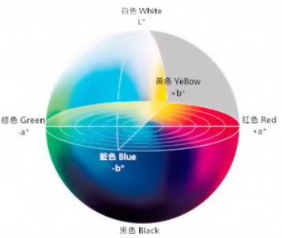
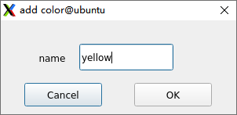
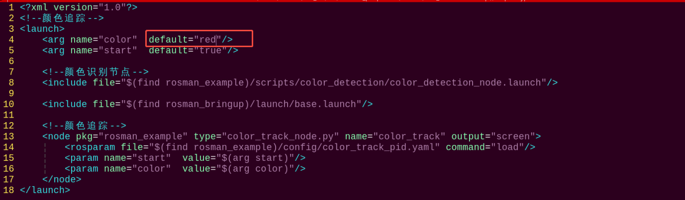

# 6.ROS+OpenCV Vision Recognition & Tracking

## 6.1 Basic Use and Calibration of Camera

### 6.1.1 Camera Calibration

Since the camera lens is both concave and convex, the resulting image can be distorted. However, you can get internal, external and distortion parameters of camera through camera calibration, which can be used to calibrate distorted image and reconstruct 3D scenario.

:::{Note}

* Before performing the calibration process, please make sure to print the chessboard pictures stored in the same directory. Ensure that the resolution of these pictures is not smaller than 640\*480.

* It is crucial to operate the calibration procedure in a well-lit environment. However, be cautious to avoid direct sunlight during the calibration process.

:::

* **Operation Steps**

:::{Note}

 The input command should be case sensitive, and the keywords can be complemented by “Tab” key.

:::

(1) To start the ROSMan robot, refer to [3. ROS Robot Basic Control Course->3.1 Set Development Environment->3.1.1 Remote Desktop Tool Installation and Connection](), and connect the robot to the VNC remote control software.

(2) Then enter the command in the terminal  and press Enter to disable the automatic app startup service, ensuring that the camera is not occupied by the app.

```
~/.stop_ros.sh
```

(3) Run the following command to enable camera calibration service.

```
roslaunch rosman_calibration usb_cam_calibration.launch
```

Before calibration, make sure the chessboard image size and the square edge length value are correct. The size refers to the number of intersection points along the horizontal and vertical directions of the chessboard. As shown below, there are 8 red dots in the horizontal direction and 6 yellow dots in the vertical direction.

 

The square edge length refers to the length of one side of a single square, measured in meters. You can use a ruler to measure the side length of a square. In this example, the measured length is 0.014m, as shown below.


(4) Face the chessboard picture horizontally to the camera, then quickly move and tilt the picture till the parameters of x, y, size and scale at right all turn green. Then click “**calibrate**” to start calculating the calibration.

:::{Note}

When calibrating the camera, make sure the chessboard is placed horizontally. The calibration time depends on the number of calibration images—the more images used, the longer it takes. If the program becomes unresponsive during the process, this is normal. Please be patient and wait for it to complete.

:::

The parameter X represents the left and right movement within the camera's field of view—move the chessboard left or right accordingly. The parameter Y represents the vertical position—move the chessboard up or down. The parameter Size indicates the distance and orientation of the chessboard relative to the camera—move the chessboard closer or farther away. The parameter Skew reflects the tilt of the image—slightly tilt the chessboard at random angles while keeping it in a horizontal position.


(5) Once the adjustments are made, click the **CALIBRATE** button to start the calibration process.


:::{Note}

The calibration time depends on the number of images used. The more images, the longer the process will take.

:::

(6) After calibration is complete, try moving the chessboard in front of the camera to see if the image appears straight. If everything looks correct, click the **COMMIT** button to save the calibration data.

Clicking the **SAVE** button will store the images and calibration data in the **tmp** folder. You can open the folder by entering cd /tmp in the terminal and locating the related files.


### 6.1.2 Basic Uses of Camera

* **Enable Camera Service**

(1) To start the ROSMan robot, refer to [3.ROS Robot Motion Basic Control Course->3.1 Set Development Environment->3.1.1 Remote Desktop Tool Installation and Connection](), and connect the robot to the VNC remote control software.

(2) Then enter the command in the terminal  and press Enter to disable the automatic app startup service, ensuring that the camera is not occupied by the app.

```
~/.stop_ros.sh
```

(3) Run the command and press Enter to enable camera service.

```
roslaunch rosman_peripherals usb_cam.launch
```

* **View with the rqt_image_view Tool**

(1) Open a new terminal and enter the following command to launch the image viewer tool:

```
rqt_image_view
```

If the interface shown below appears, the tool has launched successfully:


(2) When viewing images, make sure to set the selection box highlighted in red to the option shown below:


* **View with a Web Browser**

(1) Then enter the command in the terminal  and press Enter to disable the automatic app startup service, ensuring that the camera is not occupied by the app.

```
rosrun web_video_server web_video_server
```

(2) Next, open any web browser and enter the robot’s IP address **192.168.149.1:8080.**


If the interface shown below appears, the tool has launched successfully:


(3) Select the corresponding image topic to view the camera feed.


When the following image appears, it indicates the stream has been successfully opened:


## 6.2 Color Threshold Adjustment

Various light sources can affect colors differently, leading to discrepancies in recognition. To address this issue, you can utilize LABTOOL to adjust the color threshold, ensuring more accurate and consistent color recognition.

### 6.2.1 Open/ Close LAB TOOL

:::{Note}

* The input command should be case sensitive, and the keywords can be complemented by “Tab” key.

* Please strictly follow the below steps to open LAB TOOL, otherwise the tool cannot be opened.

  :::

(1) To start the ROSMan robot, refer to [3.ROS Robot Motion Basic Control Course->3.1 Set Development Environment->1.1 Remote Desktop Tool Installation and Connection](), and connect the robot to the VNC remote control software.

(2) Double click  to open the color threshold tool.


For the instructions and use of the interface buttons, you can refer to the subsequent content of this document. To close it, click  and select "**Yes**" in the pop-up prompt.


:::{Note}

If you run the program using the following command and see an error message like the one below, it means the auto-start service has not been launched.

```
python3 software/lab_tool/main.py
```


Open a terminal  on the robot and enter the command to start the auto-start service. Then restart the mobile app and wait for the service to fully initialize.

```
sudo systemctl restart start_node.service
```

:::

### 6.2.2 LAB TOOL Interface Introduction

LAB TOOL is divided into two parts, including image display area and recognition adjustment area.


① Image display area: at left is the processed image, and at right is the raw image.

:::{Note}

If the camera returned image doesn’t occur, it is possible that the camera fails to connect. And you need to check the camera wiring.

:::

② Recognition adjustment area: you can adjust the color threshold in this area. The functions of the buttons are listed below.

<table>
<colgroup>
<col style="width: 35%" />
<col style="width: 64%" />
</colgroup>
<tbody>
<tr>
<td style="text-align: center;"><strong>Icon</strong></td>
<td style="text-align: center;"><strong>Function</strong></td>
</tr>
<tr>
<td style="text-align: center;"></td>
<td style="text-align: left;"><p>Slider L, A and B are respectively used to adjust L, A and B components of the camera returned image.</p>
<p>The sliders at left represent “min” value, and the sliders at right represent “max” value.</p></td>
</tr>
<tr>
<td style="text-align: center;"></td>
<td style="text-align: left;">Select the color to be adjusted</td>
</tr>
<tr>
<td style="text-align: center;"></td>
<td style="text-align: left;">Delete the selected color</td>
</tr>
<tr>
<td style="text-align: center;"></td>
<td style="text-align: left;">Add new colors</td>
</tr>
<tr>
<td style="text-align: center;"></td>
<td style="text-align: left;">Save the adjusted value</td>
</tr>
<tr>
<td style="text-align: center;"></td>
<td style="text-align: left;">Switch the language between Chinese and English</td>
</tr>
<tr>
<td style="text-align: center;"></td>
<td style="text-align: left;">Change the camera model. Since the robot only includes one camera, this button has no function in this case</td>
</tr>
<tr>
<td style="text-align: center;"></td>
<td style="text-align: left;">Exit from the LAB TOOL</td>
</tr>
</tbody>
</table>


### 6.2.3 Adjust Color Threshold

(1) Open LABTOOL, and select the color in the drop down menu. Take adjusting red color for example.


(2) Modify all “min” values of L, A and B as 0, and “max” values as 255.


(3) Put the red block within the camera frame. According to the “LAB color space”, adjust L, A and B components to approach the Red zone.



Red is around **“+a”** zone, hence you need to increase A component that is remain “max” value of A component the same and increase “min” value till the red block at left turns white and other area turns black.


(4) Based on the environment, modify the value of “L” and “B”. If it belongs to light red, increase L min value at left. Otherwise, decrease L max value at right. If it belongs to warm tone, increase B min value at left. Otherwise, decrease B max at right.


LAB Threshold Adjustment Parameter

| **Color Component** | **Range** | **Corresponding Color Zone** |
| :-----------------: | :-------: | :--------------------------: |
|          L          |   0~255   |    Black-White（-L ~ +L）    |
|          A          |   0~255   |     Green-Red（-a ~ +a）     |
|          B          |   0~255   |    Blue-Yellow（-b ~ +b）    |

(5) Click “**Save**” to save the adjusted color threshold parameter.


### 6.2.4 Add New Recognition Color

Besides the built-in recognition colors, you can add new colors. For example, yellow.

(1) Open LAB TOOL and click “**Add**” button.


(2) Then fill in “yellow”, and click click “**OK**”.



(3) Select the color you just added in the drop-down menu.


(4) Face the camera to the yellow block. And then drag the slider of L, A and B to adjust the color threshold till the object at left turns white and other area turns black.


:::{Note}

For how to adjust the color threshold, please scroll up to [6.2 Color Threshold Adjustment](). 

:::

(5) Click “**Save**” to save the adjusted color threshold parameter.


## 6.3 Color Recognition

OpenCV will utilized to recognize red, green, and blue objects and the recognition result will be displayed on the live camera feed.

Before starting the feature, please prepare three objects in these color: red, green, and blue.

### 6.3.1 Introduction

Firstly, the program will acquire the RGB image of the camera, scale the image, and perform Gaussian filtering on the image to convert the image color space from RGB into LAB. 

Based on this, color thresholds are used to identify the color of the object within the circle. A mask is then applied to the image, which involves selecting parts of the image, graphics, or objects to globally or locally block out areas in the image for processing.

After masking, morphological operations including opening and closing are performed on the object image to refine the results.

Opening operation: Involves erosion followed by dilation. Effect: Removes small objects, smooths object boundaries, and does not affect object area.

It also helps eliminate small noise and separates connected objects.

Erosion: Removes boundary pixels of an object, causing the edges to shrink inward. This operation can eliminate objects smaller than the structuring element.

Dilation: Expands the boundary pixels of an object by merging surrounding background pixels that are in contact with the object, causing the edges to grow outward.

Finally, the recognition results are overlaid on the return image.

The source code for the program is located at: [ros_ws/src/rosman_example/scripts/color_detection/color_detection.py]()

### 6.3.2 Enabling and Disabling the Feature

:::{Note}

When entering commands, be sure to use correct case and spacing. You can use the Tab key to auto-complete keywords.

:::

(1) To start the ROSMan robot, refer to [3. ROS Robot  Basic Control Course->3.1 Set Development Environment->3.1.1 Remote Desktop Tool Installation and Connection](), and connect the robot to the VNC remote control software.

(2) Open the command-line terminal, enter the command and press Enter to disable ros service.

```
~/.stop_ros.sh
```

(3) Finally, start the color recognition program by entering the following command and pressing Enter.

```
python3 ~/ros_ws/src/rosman_example/scripts/color_detection/color_detection.py
```

(4) To exit the feature, press **Ctrl+C** in the terminal. If the program does not close successfully, try pressing **Ctrl+C** again.

Then, you can restart the robot or run a command to enable the mobile app service. If the mobile app service is not enabled, related features in the app will not function properly. Note: The mobile app service will start automatically when the robot is restarted.

Open a terminal  on the robot and enter the command to start the auto-start service. Then restart the mobile app and wait for the service to fully initialize.

```
sudo systemctl restart start_node.service
```

### 6.3.3 Function Outcome

:::{Note}

After the feature starts, please ensure there is no other object containing the recognition color except the target object within the camera view, otherwise the recognition result will be affected.

:::

After the feature starts, put the objects within the camera’s view. When the robot recognizes the target, the object will be circled in the corresponding color.

### 6.3.4 Program Brief Analysis

The source code for the program is located at: [ros_ws/src/rosman_example/scripts/color_detection/color_detection.py]()

Based on the effects of the feature, the process logic has been outlined as shown in the diagram below:


* **Basic Configuration**

(1) Read Color Threshold Setting File

Acquire the color threshold configuration file through get_yaml_data function.

{lineno-start=531}

```
    lab_config = common.get_yaml_data('/home/ubuntu/software/lab_tool/lab_config.yaml')
```

(2) Acquire the Image

Get the live camera feed using VideoCapture function.

{lineno-start=538}

```
    cap = cv2.VideoCapture(-1)
```

(3) Image Processing

“detect()” function is utilized to process the image.

{lineno-start=363}

```
    def detect(self, bgr_image):
        '''
        颜色检测(color detection)
        :param image: 要进行颜色检测的原图像，格式为bgr，即opencv格式(the original image to perform color detection on, in BGR format which is OpenCV format)
        :return: 返回原图像和检测的物体的信息(return the original image and the information of the detected object)
        '''
        try:
            img_h, img_w = bgr_image.shape[:2]  # 获取原图大小(Get the size of the original image)
            image_draw = bgr_image.copy() 
            
            image_gb = cv2.GaussianBlur(bgr_image, (3, 3), 3)  # 高斯模糊去噪点(Gaussian blur to remove noise)

            # 物体信息列表:颜色, 位置, 大小, 角度(Object information list: color, position, size, and angle)
            object_info_list = []
            center_x = 0
            center_y = 0
            last_process_size = [0, 0]
            for color_info in self.detect_info:  # 遍历颜色列表(traverse through the color list)
                self.image_process_size = color_info.image_process_size
                if self.image_process_size != last_process_size:
                    image_resize = cv2.resize(image_gb, tuple(self.image_process_size), interpolation=cv2.INTER_NEAREST)  # 图像缩放, 加快图像处理速度, 不能太小，否则会丢失大量细节(Image scaling to speed up image processing. Cannot be too small, otherwise a lot of details will be lost)
                    image_lab = cv2.cvtColor(image_resize, cv2.COLOR_BGR2LAB)  # bgr空间转lab空间，方便提取颜色(Convert from BGR color space to LAB color space for easier color extraction)
                
                last_process_size = self.image_process_size
                if color_info.use_name:
                    if color_info.color_name in self.lab_data:  # 如果要识别的颜色在lab里有(If there is color to be recognized in LAB)
                        lower = tuple(self.lab_data[color_info.color_name]['min'])
                        upper = tuple(self.lab_data[color_info.color_name]['max'])
                    else:
                        continue
                else:
                    lower = tuple(color_info.lab_min)
                    upper = tuple(color_info.lab_max)
```

(4) Gaussian Filtering 

Adopt GaussianBlur() function in cv2 library to perform Gaussian filtering on the image to remove the noise from the image.

{lineno-start=373}

```
            image_gb = cv2.GaussianBlur(bgr_image, (3, 3), 3)  # 高斯模糊去噪点(Gaussian blur to remove noise)
```

“bgr_image”: input image

“(3, 3)”: the size of Gaussian convolution kernel, and its height and width must be positive number and odd number.

"3": the standard deviation of the Gaussian kernel in the horizontal direction.

① Scaling

Adopt resize() function in cv2 library to scale the image so as to reduce the computation.

{lineno-start=383}

```
                    image_resize = cv2.resize(image_gb, tuple(self.image_process_size), interpolation=cv2.INTER_NEAREST)  # 图像缩放, 加快图像处理速度, 不能太小，否则会丢失大量细节(Image scaling to speed up image processing. Cannot be too small, otherwise a lot of details will be lost)
```

`image_gb`: input image.`tuple(self.image_process_size)`: the width and height of the resized image in the form of a tuple.`interpolation`: specifies the interpolation method `cv2.INTER_NEAREST`: the nearest-neighbor interpolation.

② Binarization

The `inRange()` function from the cv2 library is used to perform binarization on an image.

{lineno-start=95}

```
        binary = cv2.inRange(lab_image, lower, upper)  # 二值化(binarization)
```

`lab_image`: input image.

`lower`: defines the lower bound of the color threshold.

`upper`: defines the upper bound of the color threshold.

If a pixel's RGB value falls within the specified threshold range, it is set to 1, otherwise, it is set to 0.

(5) Corrosion and Dilation

Perform corrosion and dilation on the image to smooth the contour edge of the image for better searching for the target contour.

{lineno-start=96}

```
        element = cv2.getStructuringElement(cv2.MORPH_RECT, (kernel, kernel))
        eroded = cv2.erode(binary, element)  # 腐蚀(erosion)
        dilated = cv2.dilate(eroded, element)  # 膨胀(dilation)
```

The erode() function is used to perform erosion on the image. The function parameters are as follows:

“binary”: input image.

“element”: defined as getStructuringElement(cv2.MORPH_RECT, (kernel, kernel)), which specifies the structuring element or kernel for the operation. The first argument inside the parentheses defines the kernel shape. The second argument defines the kernel size.

The dilate() function is used to perform dilation on the image. The parameters inside the parentheses are the same as those used in the erode() function.

(6) Acquire the Maximum Contour

Call findContours() function in cv2 library to find the maximum contour of the target color in the image.

{lineno-start=103}

```
        contours = cv2.findContours(binary, cv2.RETR_EXTERNAL, cv2.CHAIN_APPROX_NONE)[-2]  # 找出所有轮廓(find all contours)
```

“binary”: input image.

“cv2.RETR_EXTERNAL”: the contour retrieval mode.

“cv2.CHAIN_APPROX_NONE”: the contour approximation method.

Action Feedback

(7) Circle the Target

Employ drawContours function to circle the target on the live camera feed.

{lineno-start=410}

```
                            cv2.drawContours(image_draw, [corners], -1, (0, 255, 255), 3, cv2.LINE_AA)  # 绘制矩形轮廓(draw the contour of the rectangle)
```

The function parameters are as follows:

“image_draw”: input image.

“\[corners\]”: contour type.

“-1”: draw all the contours within it.

“(0,255,255)”: color.

“2”: line thickness.

## 6.4 Color Positioning & Tracking

:::{Note}

Make sure there are no objects within the camera’s field of view that have the same or similar color as the object to be tracked, as this may affect tracking performance.

:::

When tracking, avoid moving the color block too quickly.

If the color recognition is inaccurate, refer to [6.2 Color Threshold Adjustment]() for calibration.

The robot uses the camera to capture images and track the object. When the target color block is placed within the camera's view, the robot's head will follow its movement.

### 6.4.1 Introduction

Firstly, the program will acquire the RGB image of the camera, scale the image, and perform Gaussian filtering on the image to convert the image color space from RGB into LAB.

Next, the color thresholds configured in [6.2Color Threshold Adjustment]() are used to match the color in the returned video feed. The matched area is then processed using morphological opening operations, and the detected color block is highlighted with a circle on the screen.

**Opening operation**: Involves erosion followed by dilation. Effect: Removes small objects, smooths object boundaries, and does not affect object area. It also helps eliminate small noise and separates connected objects.

**Closing operation**: Involves dilation followed by erosion. Effect: Fills small holes inside objects, connect adjacent objects, and bridge broken contours, while also smoothing boundaries without changing the area.

**Gaussian Blur Processing**: The image is blurred by convolving it with a Gaussian function. Purpose: To reduce noise in the image, improve image clarity and quality, and enhance features such as edges and textures. In addition, Gaussian blur smooths out high-frequency noise and fine details, making the image more uniform and easier to process.

**Erosion**: Removes boundary pixels of an object, causing the edges to shrink inward. This operation can eliminate objects smaller than the structuring element.

**Dilation**: Expands the boundary pixels of an object by merging surrounding background pixels that are in contact with the object, causing the edges to grow outward.

Finally, based on the position of the circle, the center point of the color block is calculated. This allows for determining the positional deviation between the center of the color block and the center of the returned image. Then, a PID algorithm is used to adjust the robot in real time according to the deviation, enabling the gimbal servo to follow the movement of the color block.

### 6.4.2 Enabling and Disabling the Feature

:::{Note}

When entering commands, be sure to use correct case and spacing. You can use the Tab key to auto-complete keywords.

:::

(1) To start the ROSMan robot, refer to [3.ROS Robot Basic Motion Control Course->3.1Set Development Environment->3.1.1 Remote Desktop Tool Installation and Connection](), and connect the robot to the VNC remote control software.

(2) Open the command-line terminal, enter the command and press Enter to disable ros service.

```
~/.stop_ros.sh
```

(3) Entering the following command and press Enter to start the feature.

```
roslaunch rosman_example color_track_node.launch
```

:::{Note}

When the feature is activated, the default tracking color is blue.

:::

(4) To exit the feature, press **Ctrl+C** in the terminal. If the program does not close successfully, try pressing **Ctrl+C** again.

Open a terminal  on the robot and enter the command to start the auto-start service. Then restart the mobile app and wait for the service to fully initialize.

```
sudo systemctl restart start_node.service
```

### 6.4.3 Access Live Camera Feed

:::{Note}

Command input is case-sensitive and space-sensitive.

Before starting the camera feed, make sure the color block positioning and tracking feature is functioning properly; otherwise, the camera feed may fail to launch.

:::

After the feature is activated, you can view the camera feed in a browser by enabling the **“web_video_server”** service.

(1) Next, open any web browser and enter the address **192.168.149.1:8080.**


(2) Select the image corresponding to the relevant node to view it.

### 6.4.4 Project Outcome

After starting the feature, place a blue object in front of the robot. The identified target color will be marked in the camera feed, and the robot’s head will continuously follow the movement of the target block.

### 6.4.5 Feature Extensions

The default tracking color in the program is blue. To change it to red, follow the steps below:

(1) To navigate to the program directory, enter the following command in the terminal and press Enter:

```
cd ~/ros_ws/src/rosman_example/scripts/color_track/
```

(2) Enter the following command to open the launch file:

```
vim color_track_node.launch
```


(3) Press the key **i** to enter edit mode

```
i
```


(4) Locate the line specifying the tracking color as blue, and change it to red.



(5) After editing, press **Esc**, type the following command, and press Enter to save and exit.

```
:wq
```

(6) Entering the following command and press **Enter** to start the feature.

```
roslaunch rosman_example color_track_node.launch
```

Refer to sections [6.4.2 Enabling and Disabling the Feature]() and [6.4.3 Access Live Camera Feed]() in this document. After launching the program, the robot should start tracking the red object.

(7) To exit the feature, press **Ctrl+C** in the terminal. If the program does not close successfully, try pressing **Ctrl+C** again.

### 6.4.6 Program Brief Analysis

The source code for the program is located at: [ros_ws/src/rosman_example/scripts/color_track/color_track_node.py]()

Based on the effects of the feature, the process logic has been outlined as shown in the diagram below:


- **Import the Necessary Libraries**

{lineno-start=6}

```
import time
import rospy
import signal
from std_msgs.msg import String
from rosman_sdk import common, pid
from rosman_example.cfg import PIDConfig
from rosman_example.color_common import Common
from rosman_example.pid_track import PIDTrack
from dynamic_reconfigure.client import Client
from dynamic_reconfigure.server import Server
from rosman_interfaces.srv import SetString
from rosman_interfaces.msg import ObjectsInfo, ColorDetect
```

- **Define Initialization Function**

Initialize the target color, color thresholds, PID parameters, and pan-tilt servo positions.

{lineno-start=21}

```
    def __init__(self, name):
        rospy.init_node(name)
        self.name = name
        self.running = True
        self.load_param = False
        self.have_save = False
        self.object_info = []
        self.image_process_size = [160, 120]
        self.head_pan_range = [125, 875]
        self.head_tilt_range = [315, 625]
        self.head_pan_init = 500   # 左右舵机的初始值(initial values of left and right servos)
        self.head_tilt_init = 500  # 上下舵机的初始值(initial values of up and down servos)
        super().__init__(name, self.head_pan_init, self.head_tilt_init)
```

- **Head Tracking Process**

{lineno-start=93}

```
    def get_color_callback(self, msg):
        if msg.data != []:
            self.object_info = msg.data[0]

    def process(self, center):
        if abs(center.x - center.width/2) < 20:
            center.x = center.width/2
        if abs(center.y - center.height/2) < 20:
            center.y = center.height/2
        rl_dis = self.rl_track.track(center.x, center.width/2)
        ud_dis = self.ud_track.track(center.y, center.height/2)
        self.motion_manager.set_servos_position(20, [[23, int(rl_dis)], [24, int(ud_dis)]])
```

First, calculate whether the deviation between the center point of the detected color object and half of the image width/height is less than 20. If the deviation is less than 20, it means the object is near the center of the screen. In this case, the center point coordinates are adjusted to exactly half the width and height to prevent excessive servo movement. Next, use the track method of the PIDTrack object to calculate the horizontal and vertical offsets (rl_dis and ud_dis). The input is the color object's center coordinates and the target center position, whihc are the half of the image width and height.

Finally, call the set_servos_position method of the motion_manager object. Set the servo angle to 20 degrees and pass in the calculated horizontal and vertical offsets as the target position for the servo.

## 6.5 Tag Recognition

The robot utilizes OpenCV to identify AprilTag labels and show their details.

Before starting the feature, unzip the AprilTag label package in this folder and save the label images to your phone's photo gallery.

AprilTag is a type of visual fiducial marker, similar to QR codes or barcodes, that enables rapid detection and calculation of relative position. It is widely used in various applications such as augmented reality (AR), robotics, and camera calibration.

This lesson will focus on recognizing AprilTag markers and displaying the detection results on the video feed.

### 6.5.1 Introduction

First, subscribe to the topic published by the camera node to obtain the RGB image, then convert it to grayscale and resize it.

Next, call the built-in ROS tag detection node.

Finally, perform camera calibration to display the tag recognition results on the video feed.

### 6.5.2 Enabling and Disabling the Feature

:::{Note}

When entering commands, be sure to use correct case and spacing. You can use the Tab key to auto-complete keywords.

:::

(1) To start the ROSMan robot, refer to [3. ROS Robot Basic Motion Control->3.1 Set Development Environment->3.1.1 Remote Desktop Tool Installation and Connection](), and connect the robot to the VNC remote control software.

(2) Open the command-line terminal, enter the command and press Enter to disable ros service.

```
~/.stop_ros.sh
```

(3) Entering the following command and press Enter to start the feature.

```
roslaunch rosman_example apriltag_detection_node.launch
```

(4) To exit the feature, press **Ctrl+C** in the terminal. If the program does not close successfully, try pressing **Ctrl+C** again.

Open a terminal  on the robot and enter the command to start the auto-start service. Then restart the mobile app and wait for the service to fully initialize.

```
sudo systemctl restart start_node.service
```

### 6.5.3 Access Live Camera Feed

:::{Note}

Before starting the camera feed, ensure that the tag detection feature is running properly, otherwise, the camera feed may fail to start.

:::

After the feature is activated, you can view the camera feed in a browser by enabling the “web_video_server” service.

(1) Next, open any web browser and enter the address **192.168.149.1:8080.**


(2) Select the corresponding image topic to view the camera feed.


(3) Enter the camera feed interface for the tag detection experiment, as shown in the image below:


### 6.5.4 Project Outcome

After starting the feature, place the tag in front of the robot. The camera feed will display the detected tag’s ID number.

### 6.5.5 Program Brief Analysis

The source code for the program is located at: [ros_ws/src/rosman_example/scripts/apriltag_detection/apriltag_detection_node.launch]()

Based on the effects of the feature, the process logic has been outlined as shown in the diagram below:


The tag recognition feature can be enabled by configuring the launch file. The image processing and tag information handling are implemented by calling the apriltag_ros_continuous_node from the third-party package apriltag_ros.

- **Call Camera Node**

{lineno-start=10}

```
    <include file="$(find rosman_peripherals)/launch/usb_cam_with_calib.launch">
        <arg name="camera_name" value="$(arg camera_name)"/>
        <arg name="image_topic" value="$(arg image_topic)"/>
    </include>
```

- **Start Video Streaming over Network**

{lineno-start=15}

```
    <node name="web_video_server" pkg="web_video_server" respawn="true" respawn_delay="2"  type="web_video_server" output="screen"/>
```

- **Configure Parameters**

{lineno-start=17}

```
    <!-- Set parameters -->
    <rosparam command="load" file="$(find rosman_example)/config/settings.yaml" ns="$(arg node_namespace)" />
    <rosparam command="load" file="$(find rosman_example)/config/tags.yaml"     ns="$(arg node_namespace)" />
```

- **Launch Tag Detection Node**

{lineno-start=21}

```
    <node pkg="apriltag_ros" type="apriltag_ros_continuous_node" name="$(arg node_namespace)" clear_params="true" output="screen" launch-prefix="$(arg launch_prefix)" >
        <!-- Remap topics from those used in code to those on the ROS network -->
        <param name="enable_detect" type="bool" value="$(arg enable_detect)"/>
        <param name="publish_tag_detections_image" type="bool" value="true"/>      <!-- default: false -->
        <remap from="image_rect"  to="/$(arg camera_name)/$(arg image_topic)"/>
        <remap from="camera_info" to="/$(arg camera_name)/camera_info"/>
    </node>
</launch>
```
