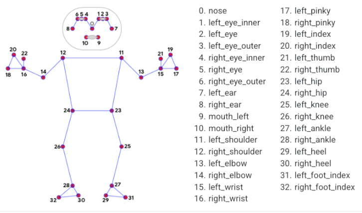
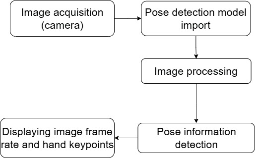
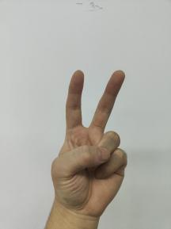

# 7. AI Interaction Course (MediaPipe)

## 7.1 MediaPipe Introduction

### 7.1.1 MediaPipe Description

MediaPipe is an open-source framework designed for building multimedia machine learning pipelines. It supports cross-platform deployment on mobile devices, desktops, and servers, and can leverage mobile GPU acceleration. MediaPipe is compatible with inference engines such as TensorFlow and TensorFlow Lite, allowing seamless integration with models from both platforms. Additionally, it offers GPU acceleration on mobile and embedded platforms.


### 7.1.2 Pros and Cons

* **Pros**

(1) MediaPipe supports various platforms and languages, including iOS, Android, C++, Python, JavaScript, Coral, etc.

(2) Swift running. Models can run in real-time.

(3) Models and codes are with high reuse rate.

* **Cons**

(1) For mobile devices, MediaPipe will occupy 10M or above.

(2) As it greatly depends on `Tensorflow`, you need to alter large amount of codes if you want to change it to other machine learning frameworks, which is not friendly to machine learning developer.

(3) It adopts static image which can improve efficiency, but make it difficult to find out the errors.

### 7.1.3 MediaPipe Workflow

The figure below shows how to use MediaPipe. The solid line represents the part to coded, and the dotted line indicates the part not to coded. MediaPipe can offer the result and the function realization framework quickly.


* **Dependency**

MediaPipe utilizes `OpenCV` to process video, and uses `FFMPEG` to process audio data. Furthermore, it incorporates other essential dependencies, including `OpenGL/Metal`, `Tensorflow`, and `Eigen`.

For seamless usage of MediaPipe, we suggest gaining a basic understanding of `OpenCV`. To delve into `OpenCV`, you can find detailed information in [4. OpenCV Computer Vision Lesson](4.ROS_Robot_Motion_Advanced_Control_Course.md).

* **MediaPipe Solutions**

`Solutions` is based on the open-source pre-constructed sample of `TensorFlow` or `TFLite`. MediaPipe `Solutions` is built upon a framework, which provides 16 `Solutions`, including face detection, Face Mesh, iris, hand, posture, human body and so on.

### 7.1.4 MediaPipe Learning Resources

MediaPipe Official Website: [https://developers.google.com/mediapipe](https://developers.google.com/mediapipe)

MediaPipe Wiki: [http://i.bnu.edu.cn/wiki/index.php?title=Mediapipe](http://i.bnu.edu.cn/wiki/index.php?title=Mediapipe)

MediaPipe github: [https://github.com/google/mediapipe](https://github.com/google/mediapipe)

dlib Official Website: [http://dlib.net/](http://dlib.net/)

dlib github: [https://github.com/davisking/dlib](https://github.com/davisking/dlib)

## 7.2 3D Face Detection

In this program, MediaPipe `Face Mesh` is utilized to detect human face within the camera image.

MediaPipe `Face Mesh` is a powerful model capable of estimating 468 3D facial features, even when deployed on a mobile device. It uses machine learning (ML) to infer 3D facial structure. This model leverages a lightweight architecture and GPU acceleration to deliver critical real-time performance.

Additionally, the `solution` is bundled with a face transformation `module` that bridges the gap between facial landmark estimation and practical real-time augmented reality (AR) applications. It establishes a metric 3D space and uses the screen positions of facial landmarks to estimate face transformations within that space. The face transformation data consists of common 3D primitives, including a facial pose transformation matrix and a triangulated face mesh.

### 7.2.1 Introduction

First, it's important to understand that the machine learning `pipeline` used here, which can be thought of as a linear process, consists of two real-time deep neural network `models` working in tandem: One is a `detector` that processes the full image to locate faces. The other is a face landmark `model` that operates on those locations and uses regression to predict an approximate 3D surface.

For the 3D face landmarks, transfer learning was applied, and a multi-task network was trained. This network simultaneously predicts 3D landmark coordinates on synthetic rendered data and 2D semantic contours on annotated real-world data. As a result, the network is informed by both synthetic and real-world data, allowing for accurate 3D landmark prediction.

The 3D landmark `model` takes cropped video frames as input, without requiring additional depth input. It outputs the positions of 3D points along with a probability score indicating whether a face is present and properly aligned in the input.

After importing the face mesh `model`, the program captures real-time footage from the camera. The image is processed through operations such as flipping and color space conversion. Then, by comparing the face detection confidence to a predefined threshold, it determines whether a face has been successfully detected.

Finally, a 3D mesh is rendered over the detected face in the video feed.

### 7.2.2 Enabling and Disabling the Feature

:::{Note}
When entering commands, be sure to use correct case and spacing. You can use the `Tab` key to auto-complete keywords.
:::

(1) To start the ROSMan robot, refer to [3. ROS Robot Basic Motion  Control Course ->3.1 Set Development Environment -> 3.1.1 Remote Desktop Tool Installation and Connection](3.ROS_Robot_Motion_Basic_Control_Course.md#remote-desktop-tool-installation-and-connection), and connect the robot to the VNC remote control software.

(2) Open the command-line terminal, enter the command and press `Enter` to disable `ros` service.

```
~/.stop_ros.sh
```

(3) Enter the command and press the `Enter` key to access the corresponding feature path.

```
cd ~/ros_ws/src/rosman_example/scripts/mediapipe/mediapipe_example/
```

(4) Entering the following command and press `Enter` to start the feature.

```
python3 face_mesh.py
```

(5) To exit the feature, press **Ctrl+C** in the terminal. If the program does not close successfully, try pressing **Ctrl+C** again.

Open a terminal on the robot and enter the command to start the auto-start service. Then restart the mobile app and wait for the service to fully initialize.

```
sudo systemctl restart start_node.service
```

### 7.2.3 Project Outcome

Once the feature is started, the camera detects a face and displays its 3D contours on the feedback screen.

### 7.2.4 Program Brief Analysis

The source code for the program is located at: [ros_ws/src/rosman_example/scripts/mediapipe/mediapipe_example/face_mesh.py](../_static/source_code/mediapipe_example.zip)

Based on the effects of the feature, the process logic has been outlined as shown in the diagram below:


* **Import Libraries**

Import the necessary libraries.

{lineno-start=3}

```python
import cv2
import mediapipe as mp
import rosman_sdk.fps as fps
```

* **Capture Camera Image**

{lineno-start=12}

```python
cap = cv2.VideoCapture("/dev/usb_cam")
```

When the feature starts, the image captured by the camera is stored in the `cap` variable.

The parameter inside the parentheses indicates the camera interface. You can also use "**0**" to access the default camera. If only one camera is connected to the device, you can use "**0**" or "**-1**" as the camera ID. If multiple cameras are connected, "**0**" represents the first camera, "**1**" the second, and so on.

* **Initialize Face Mesh Model**

Import the `Face Mesh` model from the MediaPipe toolkit.

{lineno-start=15}

```python
with mp_face_mesh.FaceMesh(
    max_num_faces=1,
    min_detection_confidence=0.5,
    min_tracking_confidence=0.5) as face_mesh:
```

The first parameter `max_num_faces` specifies the maximum number of faces to detect, and default is 1.

The second parameter `min_detection_confidence` defines the minimum confidence threshold for face detection (default is 0.5, range: [0.0, 1.0]).

The third parameter `min_tracking_confidence` sets the minimum confidence value for face tracking. A higher value improves stability but may increase latency.

* **Convert Color Space**

{lineno-start=29}

```python
    image = cv2.cvtColor(image, cv2.COLOR_BGR2RGB)
```

Convert the image to `RGB` format using the `cv2.cvtColor()` function.

The first argument, `image`, is the input image.

The second argument, `cv2.COLOR_BGR2RGB`, specifies the conversion from BGR to RGB. To convert to other formats like LAB, you can use `cv2.COLOR_BGR2LAB`.

* **Face Detection**

Use the initialized `Face Mesh` model to detect faces in the frame.

{lineno-start=30}

```python
    results = face_mesh.process(image)
```

* **Draw Face Mesh**

Use the `mp_drawing.draw_landmarks()` function to render the detected 3D face mesh on the image.

{lineno-start=34}

```python
    if results.multi_face_landmarks:
      for face_landmarks in results.multi_face_landmarks:
         mp_drawing.draw_landmarks(
            image=image,
            landmark_list=face_landmarks,
            landmark_drawing_spec=drawing_spec)
```

* **Display the Output**

Use `imshow()` function from `cv2` library to display the camera feed in a designated window.

{lineno-start=44}

```python
    cv2.imshow('MediaPipe Face Mesh', result_image)
```

The first parameter **'MediaPipe Face Mesh'** is the window title. The second parameter `result_image` is the image to be displayed.

## 7.3 Hand Keypoint Detection

In this lesson, MediaPipe's hand detection model is used to display hand keypoints and the connecting lines between them on the returned image.

MediaPipe `Hands` is a high-fidelity hand and finger tracking model. It uses machine learning (ML) to infer 21 3D landmarks of a hand from a single frame.

### 7.3.1 Introduction

First, it's important to understand that MediaPipe's palm detection model utilizes a machine learning `pipeline` composed of multiple `models`, which is a linear model, similar to an assembly line. The model processes the entire image and returns an oriented hand bounding box. The hand landmark `model` then operates on the cropped image region defined by the palm `detector` and returns high-fidelity 3D hand keypoints.

After importing the palm detection `model`, the system captures real-time camera footage. The image is flipped and converted to a different color space, which greatly reduces the need for data augmentation in the hand landmark `model`.

In addition, the `pipeline` implements an intelligent cropping mechanism based on hand landmarks from the previous frame. The palm detection `model` is only invoked to re-localize the hand when the landmark `model` can no longer detect its presence.

Next, the system compares the detection confidence against the model's minimum threshold to determine if hand detection is successful.

Finally, it detects and draws the hand keypoints on the output image.

### 7.3.2 Enabling and Disabling the Feature

:::{Note}
When entering commands, be sure to use correct case and spacing. You can use the `Tab` key to auto-complete keywords.
:::

(1) To start the ROSMan robot, refer to [3. ROS Robot Motion Basic Control Course -\> 3.1.1 Remote Desktop Tool Installation and Connection](3.ROS_Robot_Motion_Basic_Control_Course.md#remote-desktop-tool-installation-and-connection), and connect the robot to the VNC remote control software.

(2) Open the command-line terminal, enter the command and press `Enter` to disable `ros` service.

```
~/.stop_ros.sh
```

(3) To navigate to the program directory, enter the following command in the terminal and press `Enter`:

```
cd ~/ros_ws/src/rosman_example/scripts/mediapipe/mediapipe_example/
```

(4) Entering the following command and press `Enter` to start the feature.

```
python3 hand.py
```

(5) To exit the feature, press **Ctrl+C** in the terminal. If the program does not close successfully, try pressing **Ctrl+C** again.

Open a terminal on the robot and enter the command to start the auto-start service. Then restart the mobile app and wait for the service to fully initialize.

```
sudo systemctl restart start_node.service
```

### 7.3.3 Project Outcome

Once the program starts, if a hand is detected in the camera feed, the system displays hand keypoints and the lines connecting them on the returned image.

### 7.3.4 Program Brief Analysis

[Source Code](../_static/source_code/mediapipe_example.zip)

The source code is located at: [ros_ws/src/rosman_example/scripts/mediapipe/mediapipe_example/hand.py](../_static/source_code/mediapipe_example.zip)

Based on the effects of the feature, the process logic has been outlined as shown in the diagram below:


* **Import Libraries**

Import the necessary libraries.

{lineno-start=1}

```python
#!/usr/bin/env python3
# encoding: utf-8
import cv2
import mediapipe as mp
import rosman_sdk.fps as fps
```

* **Capture Camera Image**

{lineno-start=11}

```python
cap = cv2.VideoCapture("/dev/usb_cam")
```

When the feature starts, the image captured by the camera is stored in the `cap` variable.

The parameter inside the parentheses indicates the camera interface. You can also use "**0**" to access the default camera. If only one camera is connected to the device, you can use "**0**" or "**-1**" as the camera ID. If multiple cameras are connected, "**0**" represents the first camera, "**1**" the second, and so on.

* **Build the Hand Detection Model**

Import the hand detection model from the MediaPipe toolkit.

{lineno-start=14}

```python
with mp_hands.Hands(
    min_detection_confidence=0.5,
    min_tracking_confidence=0.5) as hands:
```

The first parameter `min_detection_confidence` sets the minimum confidence threshold for hand detection, and default is 0.5. Value range: [0.0, 1.0].

The second parameter `min_tracking_confidence` sets the minimum confidence for hand tracking. Setting it to a higher value increases robustness but may introduce more delay.

* **Convert Color Space**

{lineno-start=27}

```python
    image = cv2.cvtColor(image, cv2.COLOR_BGR2RGB)
```

Convert the image to `RGB` format using the `cv2.cvtColor()` function.

The first argument, `image`, is the input image.

The second argument, `cv2.COLOR_BGR2RGB`, specifies the conversion from BGR to RGB. To convert to other formats like LAB, you can use `cv2.COLOR_BGR2LAB`.

* **Hand Detection**

Use the previously imported MediaPipe hand model to detect hands in the image.

{lineno-start=28}

```python
    results = hands.process(image)
```

* **Draw Hand Keypoints**

Use the function `mp_drawing.draw_landmarks()` to draw the detected hand landmarks and connections on the image.

{lineno-start=33}

```python
    if results.multi_hand_landmarks:
      for hand_landmarks in results.multi_hand_landmarks:
        mp_drawing.draw_landmarks(
            image,
            hand_landmarks,
            mp_hands.HAND_CONNECTIONS)
```

* **Display the Output**

Use `imshow()` function from `cv2` library to display the camera feed in a designated window.

{lineno-start=42}

```python
    cv2.imshow('MediaPipe Hands', result_image)
```

The first argument **'MediaPipe Hands'** is the window title. The second argument `result_image` is the image to be displayed.

## 7.4 Body Key Points Detection

In this lesson, MediaPipe's pose detection model is used to detect body landmarks and display them on the video feed.

MediaPipe `Pose` is a high-fidelity body pose tracking model. Powered by `BlazePose`, it infers 33 3D landmarks across the full body from RGB input. This research also supports the `ML Kit Pose Detection API`.



### 7.4.1 Introduction

First, import the pose detection model.

Then, the program applies image preprocessing such as flipping and converting the color space. By comparing against a minimum detection confidence threshold, it determines whether the human body is successfully detected.

Next, it uses a minimum tracking confidence threshold to decide whether the detected pose can be reliably tracked. If not, the model will automatically re-invoke detection on the next input image.

The `pipeline` first identifies the region of interest (`ROI`) containing the person's pose in the frame using a `detector`. The `tracker` then uses the cropped `ROI` image as input to predict pose landmarks and segmentation masks within that area. For video applications, the `detector` is only invoked when necessary—such as for the first frame or when the `tracker` fails to identify a pose from the previous frame. For all other frames, the `ROI` is derived from the previously tracked landmarks.

After importing the MediaPipe pose detection model and obtaining the real-time feed from the camera. Finally, it identifies and draws the body landmarks on the image.

### 7.4.2 Enabling and Disabling the Feature

:::{Note}
When entering commands, be sure to use correct case and spacing. You can use the `Tab` key to auto-complete keywords.
:::

(1) To start the ROSMan robot, refer to [3. ROS Robot Basic Motion  Control Course ->3.1 Set Development Environment -> 3.1.1 Remote Desktop Tool Installation and Connection](3.ROS_Robot_Motion_Basic_Control_Course.md#remote-desktop-tool-installation-and-connection), and connect the robot to the VNC remote control software.

(2) Open the command-line terminal, enter the command and press `Enter` to disable `ros` service.

```
~/.stop_ros.sh
```

(3) To navigate to the program directory, enter the following command in the terminal and press `Enter`:

```
cd ~/ros_ws/src/rosman_example/scripts/mediapipe/mediapipe_example/
```

(4) Entering the following command and press `Enter` to start the feature.

```
python3 pose.py
```

(5) To exit the feature, press **Ctrl+C** in the terminal. If the program does not close successfully, try pressing **Ctrl+C** again.

Open a terminal on the robot and enter the command to start the auto-start service. Then restart the mobile app and wait for the service to fully initialize.

```
sudo systemctl restart start_node.service
```

### 7.4.3 Project Outcome

After the program is launched, the camera performs human pose estimation and displays the detected keypoints and their connections on the video feed.

### 7.4.4 Program Brief Analysis

The source code is located at: [ros_ws/src/rosman_example/scripts/mediapipe/mediapipe_example/pose.py](../_static/source_code/mediapipe_example.zip)

Based on the effects of the feature, the process logic has been outlined as shown in the diagram below:



* **Import Libraries**

Import the necessary libraries.

{lineno-start=3}

```python
import cv2
import mediapipe as mp
import rosman_sdk.fps as fps
```

* **Capture Camera Image**

{lineno-start=11}

```python
cap = cv2.VideoCapture("/dev/usb_cam")
```

When the feature starts, the image captured by the camera is stored in the `cap` variable.

The parameter inside the parentheses indicates the camera interface. You can also use "**0**" to access the default camera. If only one camera is connected to the device, you can use "**0**" or "**-1**" as the camera ID. If multiple cameras are connected, "**0**" represents the first camera, "**1**" the second, and so on.

* **Build Body Pose Detection Model**

Import the pose detection model from the MediaPipe toolkit.

{lineno-start=14}

```python
with mp_pose.Pose(
    min_detection_confidence=0.5,
    min_tracking_confidence=0.5) as pose:
```

The first parameter, `min_detection_confidence`, specifies the minimum confidence threshold for body detection, with a default value of 0.5. Value range: [0.0, 1.0].

The second parameter, `min_tracking_confidence`, specifies the minimum confidence threshold for pose tracking. Setting this value higher improves robustness but increases latency.

* **Convert Color Space**

{lineno-start=27}

```python
    image = cv2.cvtColor(image, cv2.COLOR_BGR2RGB)
```

Convert the image to `RGB` format using the `cv2.cvtColor()` function.

The first argument, `image`, is the input image.

The second argument, `cv2.COLOR_BGR2RGB`, specifies the conversion from BGR to RGB. To convert to other formats like LAB, you can use `cv2.COLOR_BGR2LAB`.

* **Body Pose Detection**

Detect the body pose in the video feed using the previously initialized pose detection model.

{lineno-start=28}

```python
    results = pose.process(image)
```

* **Draw Keypoints**

Use the function `mp_drawing.draw_landmarks()` to draw the detected body keypoints and their connections on the image.

{lineno-start=33}

```python
    mp_drawing.draw_landmarks(
        image,
        results.pose_landmarks,
        mp_pose.POSE_CONNECTIONS)
```

* **Display the Output**

Use `imshow()` function from `cv2` library to display the camera feed in a designated window.

{lineno-start=40}

```python
    cv2.imshow('MediaPipe Pose', result_image)
```

The first argument **'MediaPipe Pose'** is the window title. The second argument `result_image` is the image to be displayed.

## 7.5 Full-Body Holistic Detection

In this lesson, MediaPipe's `holistic` model to display keypoints and their connections for the body, hands, and face in the camera feed.

The `model` integrates several sub-models—including pose estimation, facial landmark detection, and hand tracking—each optimized for its specific domain. Altogether, it generates 543 keypoints that can be used in modern applications such as fitness and sports analysis, gesture control, and sign language recognition.

### 7.5.1 Introduction

The MediaPipe `holistic` detection model integrates separate models for pose, face, and hand tracking into a unified `pipeline`, which is a linear model can be viewed as a processing flow. Each component is optimized for its specific area of detection. The `holistic` model is structured as a multi-stage `pipeline`, using different image resolutions for different regions.

The process begins by importing the MediaPipe `holistic` detection model and capturing real-time video from the camera. Then, the program applies image preprocessing such as flipping and converting the color space. By comparing against a minimum detection confidence threshold, it determines whether the human body is successfully detected.

Using a pose `detector` and pose `model`, the system estimates the full-body posture. Based on the inferred pose landmarks, it identifies and extracts three Regions of Interest (`ROIs`) — one for each hand and one for the face — and re-crops the image to improve the accuracy of the `ROIs`.

* **ROI (Region of Interest)**: In computer vision and image processing, an `ROI` refers to a specific area of an image, such as a rectangle, circle, ellipse, or polygon, that is selected for further analysis or processing.

Then, the full-resolution input frame is cropped based on these `ROIs`, and the face and hand `models` — each tailored to their respective tasks — are applied to estimate the coordinates of the corresponding landmarks. These coordinates are then merged with the pose landmarks to generate a complete set of full-body keypoints.

Finally, all the detected keypoints are visualized and drawn on the video frame.

### 7.5.2 Enabling and Disabling the Feature

:::{Note}
When entering commands, be sure to use correct case and spacing. You can use the `Tab` key to auto-complete keywords.
:::

(1) To start the ROSMan robot, refer to [3. ROS Robot Basic Motion Control Course -> 3.1 Set Development Environment -> 3.1.1 Remote Desktop Tool Installation and Connection](3.ROS_Robot_Motion_Basic_Control_Course.md#remote-desktop-tool-installation-and-connection), and connect the robot to the VNC remote control software.

(2) Open the command-line terminal, enter the command and press `Enter` to disable `ros` service.

```
~/.stop_ros.sh
```

(3) To navigate to the program directory, enter the following command in the terminal and press `Enter`:

```
cd ~/ros_ws/src/rosman_example/scripts/mediapipe/mediapipe_example/
```

(4) Entering the following command and press `Enter` to start the feature.

```
python3 holistic.py
```

(5) To exit the feature, press **Ctrl+C** in the terminal. If the program does not close successfully, try pressing **Ctrl+C** again.

Open a terminal on the robot and enter the command to start the auto-start service. Then restart the mobile app and wait for the service to fully initialize.

```
sudo systemctl restart start_node.service
```

### 7.5.3 Project Outcome

After starting the feature, the camera detects the human body and displays keypoints and connections of the body, hands, and face in the video feed.

### 7.5.4 Program Brief Analysis

The source code is located at: [ros_ws/src/rosman_example/scripts/mediapipe/mediapipe_example/holistic.py](../_static/source_code/mediapipe_example.zip)

Based on the effects of the feature, the process logic has been outlined as shown in the diagram below:


* **Import Libraries**

Import the necessary libraries.

{lineno-start=1}

```python
#!/usr/bin/env python3
# encoding: utf-8
import faulthandler
faulthandler.enable()
import cv2
import sys
import mediapipe as mp
import rosman_sdk.fps as fps
```

* **Capture Camera Image**

{lineno-start=19}

```python
cap = cv2.VideoCapture("/dev/usb_cam")
```

When the feature starts, the image captured by the camera is stored in the `cap` variable.

The parameter inside the parentheses indicates the camera interface. You can also use "**0**" to access the default camera. If only one camera is connected to the device, you can use "**0**" or "**-1**" as the camera ID. If multiple cameras are connected, "**0**" represents the first camera, "**1**" the second, and so on.

* **Build Holistic Detection Model**

Import the `holistic` detection model from the MediaPipe toolkit.

{lineno-start=22}

```python
with mp_holistic.Holistic(
    min_detection_confidence=0.5,
    min_tracking_confidence=0.5) as holistic:
```

The first parameter, `min_detection_confidence`, sets the minimum confidence threshold for detection, defaulting to 0.5. Value range: [0.0, 1.0].

The second parameter, `min_tracking_confidence`, sets the minimum confidence for tracking. Increasing this value can improve robustness at the cost of latency.

* **Convert Color Space**

{lineno-start=35}

```python
    image = cv2.cvtColor(image, cv2.COLOR_BGR2RGB)
```

Convert the image to `RGB` format using the `cv2.cvtColor()` function.

The first argument, `image`, is the input image.

The second argument, `cv2.COLOR_BGR2RGB`, specifies the conversion from BGR to RGB. To convert to other formats like LAB, you can use `cv2.COLOR_BGR2LAB`.

* **Detect Holistic Keypoints**

Use the `holistic` model to detect body, hand, and face keypoints from the image.

{lineno-start=36}

```python
    results = holistic.process(image)
```

* **Draw Keypoints**

Use the `mp_drawing.draw_landmarks()` function to draw the detected keypoints and their connections.

`results.face_landmarks` is used to draw facial keypoints, and `mp_holistic.FACEMESH_CONTOURS` is used to draw the facial mesh.

`connection_drawing_spec` = `mp_drawing_styles` specifies how the connections and landmarks are styled.

{lineno-start=38}

```python
    # Draw landmark annotation on the image.
    image.flags.writeable = True
    image = cv2.cvtColor(image, cv2.COLOR_RGB2BGR)
    mp_drawing.draw_landmarks(
        image,
        results.face_landmarks,
        mp_holistic.FACEMESH_CONTOURS,
        landmark_drawing_spec=None,
        connection_drawing_spec=mp_drawing_styles
        .get_default_face_mesh_contours_style())
    mp_drawing.draw_landmarks(
        image,
        results.pose_landmarks,
        mp_holistic.POSE_CONNECTIONS,
        landmark_drawing_spec=mp_drawing_styles
        .get_default_pose_landmarks_style())
```

* **Display the Output**

Use `imshow()` function from `cv2` library to display the camera feed in a designated window.

{lineno-start=57}

```python
    cv2.imshow('MediaPipe Holistic', result_image)
```

The first argument **'MediaPipe Holistic'** is the window title. The second argument `result_image` is the image to be displayed.

## 7.6 Face Tracking

This feature enables the robot to recognize and track human faces using its onboard camera.

### 7.6.1 Introduction

First, the robot subscribes to the `topic` published by the camera `node` to acquire `RGB` images.

Next, it loads a face detection `model` and processes the facial information within the image, then publishes the results to the `/object/pixel_coords` `topic`.

Finally, by subscribing to the `/object/pixel_coords` `topic`, the robot calculates the offset between the center of the detected face and the center of the image frame, and controls the robot to track the face accordingly.

### 7.6.2 Enabling and Disabling the Feature

:::{Note}
When entering commands, be sure to use correct case and spacing. You can use the `Tab` key to auto-complete keywords.
:::

(1) To start the ROSMan robot, refer to [3. ROS Robot Motion Basic Control Course -> 3.1.1 Remote Desktop Tool Installation and Connection](3.ROS_Robot_Motion_Basic_Control_Course.md#remote-desktop-tool-installation-and-connection), and connect the robot to the VNC remote control software.

(2) Open the command-line terminal, enter the command and press `Enter` to disable `ros` service.

```
~/.stop_ros.sh
```

(3) Entering the following command and press `Enter` to start the feature.

```
roslaunch rosman_example face_track_node.launch
```

(4) To exit the feature, press **Ctrl+C** in the terminal. If the program does not close successfully, try pressing **Ctrl+C** again.

Open a terminal on the robot and enter the command to start the auto-start service. Then restart the mobile app and wait for the service to fully initialize.

```
sudo systemctl restart start_node.service
```

### 7.6.3 Access Live Camera Feed

:::{Note}
Before starting the camera feed, make sure the face tracking feature is functioning properly, otherwise, the camera feed may fail to launch.
:::

After the feature is activated, you can view the camera feed in a browser by enabling the **"web_video_server"** service.

(1) Next, open any web browser and enter the address `192.168.149.1:8080`.


(2) Select the corresponding image `topic` to view the camera feed.


(3) Enter the camera feedback interface of the face detection and tracking feature, as shown in the image below:


### 7.6.4 Program Outcome

Once the feature is started, the robot will automatically adjust the angles of the `pan-tilt servos` based on the detected face position within the camera's field of view, achieving a face-tracking effect. Additionally, the feedback interface will display the detected face along with key facial landmarks.

### 7.6.5 Program Brief Analysis

Based on the effects of the feature, the process logic has been outlined as shown in the diagram below:


Face Detection and Face Tracking. The following program analysis will explain each component in this order.

* **Face Detection**

The face detection functionality is launched via the `face_detect_node.launch` file. This launch file starts the `face_detect_node.py` `node`, which is responsible for detecting faces.The program is stored at: [ros_ws/src/rosman_example/scripts/face_detect/face_detect_node.py](../_static/source_code/face_detect.zip)

(1) Import Libraries

Import the necessary libraries.

{lineno-start=6}

```python
import cv2
import time
import rospy
import signal
import queue
import numpy as np
import mediapipe as mp
from rosman_sdk import common
from threading import RLock
from sensor_msgs.msg import Image
from std_srvs.srv import Empty, EmptyResponse
from rosman_interfaces.msg import ObjectInfo, ObjectsInfo
```

(2) Face Detection Model

The program uses the face detection example from the MediaPipe toolkit, and a minimum confidence value of 0.5 is set. If the detection confidence exceeds this threshold, the face is considered successfully detected. The `mp_face_detection.FaceDetection` `API` from MediaPipe is a commonly used detection method in this context.

{lineno-start=41}

```python
        # 实例化人脸检测(instantiate face detection)
        self.face_detection = mp_face_detection.FaceDetection(min_detection_confidence=rospy.get_param('~confidence', 0.5))
```

(3) Topic Subscription

The `node` subscribes to the `topic` published by the camera `node` to receive real-time image frames for face detection.

{lineno-start=73}

```python
            if self.image_sub is None:
                self.image_sub = rospy.Subscriber('/{}/{}'.format(self.camera['camera_name'], self.camera['image_topic']), Image, self.image_callback)  # 订阅图像
```

* **Face Tracking**

After obtaining real-time images and detecting the face, the program proceeds to the face tracking part.

This functionality is launched via the `face_track_node.launch` file. This launch file starts the `face_track_node.py` `node` to handle face tracking.The program is stored at: [ros_ws/src/rosman_example/scripts/face_track/face_track_node.py](../_static/source_code/face_detect.zip)

{lineno-start=6}

```python
import time
import rospy
import signal
from rosman_sdk import common, pid
from rosman_example.cfg import PIDConfig
from rosman_example.face_common import Common
from rosman_example.pid_track import PIDTrack
from dynamic_reconfigure.client import Client
from dynamic_reconfigure.server import Server
from rosman_interfaces.msg import ObjectsInfo

FACE_TRACK_PID_YAML = '/home/ubuntu/ros_ws/src/rosman_example/config/face_track_pid.yaml'
class FaceTrackNode(Common):
    def __init__(self, name):
        rospy.init_node(name)
        self.name = name
        self.running = True
        self.load_param = False
        self.have_save = False
        self.object_info = []
        self.head_pan_range = [125, 875]
        self.head_tilt_range = [315, 625]
        self.head_pan_init = 500   # 左右舵机的初始值(initial value of the left-right servo)
        self.head_tilt_init = 500  # 上下舵机的初始值(initial value of the up-down servo)
        super().__init__(name, self.head_pan_init, self.head_tilt_init)
```

(1) Servo Initialization

The program sets parameters for controlling the `pan-tilt servos` on the robot's head.

{lineno-start=26}

```python
        self.head_pan_range = [125, 875]
        self.head_tilt_range = [315, 625]
        self.head_pan_init = 500   # 左右舵机的初始值(initial value of the left-right servo)
        self.head_tilt_init = 500  # 上下舵机的初始值(initial value of the up-down servo)
        super().__init__(name, self.head_pan_init, self.head_tilt_init)
```

`head_pan_range` and `head_tilt_range`: Define the control range for the horizontal and vertical directions, with the unit specified in 0.1-degree increments. `head_pan_range` defines the control range for the horizontal `servo`, corresponding to 12.5° to 87.5°. Likewise, `head_tilt_range` defines the vertical `servo's` control range, from 31.5° to 62.5°.

`head_pan_init` and `head_tilt_init` represent the initial positions of the horizontal and vertical `servos`, with the unit specified in 0.1-degree increments. Both initial positions are set to 50.0°

(1) Image Processing

The system determines whether the face position needs to be corrected by checking if the horizontal and vertical deviations of the detected face are less than 20 pixels. If the deviation is less than 20 pixels, the face position is set to the center of the image.

Then, two `PIDTrack` objects, `rl_track` and `ud_track`, are used to perform `PID` control on the horizontal and vertical offsets, respectively, calculating the required adjustments for the `servo` positions. Finally, the method calls the `set_servos_position()` function from the `motion_manager` library, passing the calculated adjustments as parameters to control the head `pan-tilt servos` of the robot and achieve face tracking.

{lineno-start=77}

```python
    def process(self, center):
        if abs(center.x - center.width/2) < 20:
            center.x = center.width/2
        if abs(center.y - center.height/2) < 20:
            center.y = center.height/2
        rl_dis = self.rl_track.track(center.x, center.width/2)
        ud_dis = self.ud_track.track(center.y, center.height/2)
        self.motion_manager.set_servos_position(20, [[23, int(rl_dis)], [24, int(ud_dis)]])
```

## 7.7 Fingertips Trajectories Recognition

The robot uses MediaPipe's hand detection model to recognize palm joints. Once a specific hand gesture is detected, the robot locks onto the fingertip in the image and begins tracking it, drawing the movement trajectory of the fingertip.

### 7.7.1 Project Process

First, the MediaPipe hand detection `model` is called to process the camera feed.

Next, `OpenCV` is used to flip and preprocess the image for better detection of hand features. The processed image is then input into the hand recognition `model` to detect the palm. Based on the connections between hand landmarks, the finger angles are calculated to identify specific gestures.

Finally, once the designated gesture is recognized, the robot starts tracking and locking onto the fingertip, while displaying its movement trajectory in the video feed.

### 7.7.2 Enabling and Disabling the Feature

:::{Note}
When entering commands, be sure to use correct case and spacing. You can use the `Tab` key to auto-complete keywords.
:::

(1) To start the ROSMan robot, refer to [3. ROS Robot Motion Basic Control Course -> 3.1 Set Development Environment -> 3.1.1 Remote Desktop Tool Installation and Connection](3.ROS_Robot_Motion_Basic_Control_Course.md#remote-desktop-tool-installation-and-connection), and connect the robot to the VNC remote control software.

(2) Open the command-line terminal, enter the command and press `Enter` to disable `ros` service.

```
~/.stop_ros.sh
```

(3) Entering the following command and press `Enter` to start the feature.

```
roslaunch rosman_example hand_trajectory_control_node.launch
```

(4) To exit the feature, press **Ctrl+C** in the terminal. If the program does not close successfully, try pressing **Ctrl+C** again.

Open a terminal on the robot and enter the command to start the auto-start service. Then restart the mobile app and wait for the service to fully initialize.

```
sudo systemctl restart start_node.service
```

### 7.7.3 Access Live Camera Feed

:::{Note}
Before starting the camera feed, make sure the Fingertip Trajectory feature is running properly. Otherwise, the camera feed may fail to launch.
:::

After the feature is activated, you can view the camera feed in a browser by enabling the **"web_video_server"** service.

(1) Next, open any web browser and enter the address `192.168.149.1:8080`.


(2) Select the corresponding image `topic` to view the camera feed.


(3) Enter the camera feedback interface for the Fingertip Trajectory Tracking feature, as shown in the image below:


### 7.7.4 Project Outcome

After launching the feature, place your hand within the camera's detection range. Once the robot detects the hand, it connects the key points of the hand in the image. When the robot recognizes a gesture with only the index finger extended, it enters the Fingertip Trajectory Recognition mode and starts drawing the fingertip's path on the screen.

The robot calculates the direction and angle of the trajectory based on the starting point. When the gesture changes to an open palm with all five fingers extended, the robot stops drawing the trajectory and moves three steps in the direction indicated by the line (left, right, forward, or backward).

### 7.7.5 Program Brief Analysis

Based on the effects of the feature, the process logic has been outlined as shown in the diagram below:


* **Gesture Recognition**

This feature consists of two main parts — gesture recognition and trajectory recognition. Therefore, the following analysis will be explained in that order.

The gesture recognition function is launched through the `hand_gesture_detect_node.launch` file. This launch file starts the `hand_gesture_detect_node.py` `node` to perform gesture recognition.
The program is stored at: [ros_ws/src/rosman_example/scripts/hand_gesture_detect/hand_gesture_detect_node.py](../_static/source_code/hand_gesture_detect.zip)

(1) Build Hand Detection Model

Import the hand recognition example from the MediaPipe toolkit to build the hand detection model. The `mp.solutions.hands.Hands` refers to a commonly used hand landmark detection model in the MediaPipe framework.

{lineno-start=105}

```python
        self.hand_detector = mp.solutions.hands.Hands(
            static_image_mode=False,
            max_num_hands=1,
            min_tracking_confidence=0.05,
            min_detection_confidence=0.6
        )
```

①  `static_image_mode`: Specifies the input image processing mode. Default is `False`, which treats input as a video stream. After detecting the first image, the model only tracks landmarks in subsequent frames. Detection is only re-triggered when tracking fails, reducing computation and latency.

If set to `True`, all input images are processed individually. This is suitable for a batch of unrelated static images.

②  `max_num_hands`: Sets the maximum number of hands to detect simultaneously. In this case, the maximum is set to 1.

③  `min_tracking_confidence`: Defines the minimum confidence value (range 0.0–1.0) for the landmark tracking model. This parameter is ignored if `static_image_mode=True`.

④  `min_detection_confidence`: Sets the minimum confidence value (range 0.0–1.0) for the hand detection model. Detections above this threshold are considered successful.

(2) Capture the Camera Feed

The real-time camera feed is obtained by subscribing to the camera `topic`.

{lineno-start=118}

```python
        self.camera = rospy.get_param('/camera')
        rospy.Subscriber('/{}/{}'.format(self.camera['camera_name'], self.camera['image_topic']), Image, self.image_callback)  # 订阅图像(subscribe to image)  # 摄像头订阅(subscribe to camera
```

(3) Hand Keypoint Detection

Based on the previously built hand model, the program detects hand keypoints in the image.

{lineno-start=153}

```python
                        results = self.hand_detector.process(image_flip)
```

(4) Draw Hand Keypoints

{lineno-start=155}

```python
                            for hand_landmarks in results.multi_hand_landmarks:
                                self.drawing.draw_landmarks(
                                    bgr_image,
                                    hand_landmarks,
                                    mp.solutions.hands.HAND_CONNECTIONS)
```

① `bgr_image`: the input image.

② `hand_landmarks`: the detected hand landmark coordinates.

③ `mp.solutions.hands.HAND_CONNECTIONS`: the predefined set of landmark connections used to draw the hand skeleton.

(5) Gesture Recognition

The system determines the hand gesture by analyzing the angles between key points on the hand.

{lineno-start=160}

```python
                                landmarks = get_hand_landmarks(image_flip, hand_landmarks.landmark)
                                angle_list = (hand_angle(landmarks))
                                gesture = (h_gesture(angle_list))
                                index_finger_tip = landmarks[8].tolist()
```

It calculates the bending angles of each finger based on the connections between hand keypoints.

{lineno-start=27}

```python
def hand_angle(landmarks):
    """
    计算各个手指的弯曲角度(calculate the bending angle of each finger)
    :param landmarks: 手部关键点(the key points of the hand)
    :return: 各个手指的角度(each finger's angle)
    """
    angle_list = []
    # thumb 大拇指
    angle_ = vector_2d_angle(landmarks[3] - landmarks[4], landmarks[0] - landmarks[2])
    angle_list.append(angle_)
    # index 食指
    angle_ = vector_2d_angle(landmarks[0] - landmarks[6], landmarks[7] - landmarks[8])
    angle_list.append(angle_)
    # middle 中指
    angle_ = vector_2d_angle(landmarks[0] - landmarks[10], landmarks[11] - landmarks[12])
    angle_list.append(angle_)
    # ring 无名指
    angle_ = vector_2d_angle(landmarks[0] - landmarks[14], landmarks[15] - landmarks[16])
    angle_list.append(angle_)
    # pink 小拇指
    angle_ = vector_2d_angle(landmarks[0] - landmarks[18], landmarks[19] - landmarks[20])
    angle_list.append(angle_)
    angle_list = [abs(a) for a in angle_list]
    return angle_list

```

Using the calculated finger angles, the system recognizes the gesture.

{lineno-start=52}

```python
def h_gesture(angle_list):
    """
    通过二维特征确定手指所摆出的手势(Determine the gesture made by the fingers based on the two-dimensional features)
    :param angle_list: 各个手指弯曲的角度(the angles of each finger's bending)
    :return : 手势名称字符串(gesture name string)
    """
    thr_angle = 65.
    thr_angle_thumb = 53.
    thr_angle_s = 49.
    gesture_str = "none"
    if (angle_list[0] > thr_angle_thumb) and (angle_list[1] > thr_angle) and (angle_list[2] > thr_angle) and (
            angle_list[3] > thr_angle) and (angle_list[4] > thr_angle):
        gesture_str = "fist"
    elif (angle_list[0] < thr_angle_s) and (angle_list[1] < thr_angle_s) and (angle_list[2] > thr_angle) and (
            angle_list[3] > thr_angle) and (angle_list[4] > thr_angle):
        gesture_str = "hand_heart"
    elif (angle_list[0] < thr_angle_s) and (angle_list[1] < thr_angle_s) and (angle_list[2] > thr_angle) and (
            angle_list[3] > thr_angle) and (angle_list[4] < thr_angle_s):
        gesture_str = "nico-nico-ni"
    elif (angle_list[0] < thr_angle_s) and (angle_list[1] > thr_angle) and (angle_list[2] > thr_angle) and (
            angle_list[3] > thr_angle) and (angle_list[4] > thr_angle):
        gesture_str = "hand_heart"
    elif (angle_list[0] > 5) and (angle_list[1] < thr_angle_s) and (angle_list[2] > thr_angle) and (
            angle_list[3] > thr_angle) and (angle_list[4] > thr_angle):
        gesture_str = "one"
    elif (angle_list[0] > thr_angle_thumb) and (angle_list[1] < thr_angle_s) and (angle_list[2] < thr_angle_s) and (
            angle_list[3] > thr_angle) and (angle_list[4] > thr_angle):
        gesture_str = "two"
    elif (angle_list[0] > thr_angle_thumb) and (angle_list[1] < thr_angle_s) and (angle_list[2] < thr_angle_s) and (
            angle_list[3] < thr_angle_s) and (angle_list[4] > thr_angle):
        gesture_str = "three"
    elif (angle_list[0] > thr_angle_thumb) and (angle_list[1] > thr_angle) and (angle_list[2] < thr_angle_s) and (
            angle_list[3] < thr_angle_s) and (angle_list[4] < thr_angle_s):
        gesture_str = "OK"
    elif (angle_list[0] > thr_angle_thumb) and (angle_list[1] < thr_angle_s) and (angle_list[2] < thr_angle_s) and (
            angle_list[3] < thr_angle_s) and (angle_list[4] < thr_angle_s):
        gesture_str = "four"
    elif (angle_list[0] < thr_angle_s) and (angle_list[1] < thr_angle_s) and (angle_list[2] < thr_angle_s) and (
            angle_list[3] < thr_angle_s) and (angle_list[4] < thr_angle_s):
        gesture_str = "five"
    elif (angle_list[0] < thr_angle_s) and (angle_list[1] > thr_angle) and (angle_list[2] > thr_angle) and (
            angle_list[3] > thr_angle) and (angle_list[4] < thr_angle_s):
        gesture_str = "six"
    else:
        "none"
```

* **Trajectory Recognition**

After detecting the hand gesture, the system proceeds to recognize the fingertip trajectory associated with that gesture and executes different actions accordingly.

The trajectory recognition feature is launched through the file `hand_trajectory_control_node.launch`. This launch file starts the `hand_trajectory_control_node.py` `node`, which performs fingertip trajectory tracking.
The program is stored at: [ros_ws/src/rosman_example/scripts/hand_trajectory_control/hand_trajectory_control_node.py](../_static/source_code/hand_gesture_detect.zip)

(1) Tracking Index Fingertip

When gesture **"1"** is recognized, the system starts tracking the index fingertip and records its movement trajectory.

{lineno-start=68}

```python
            if gesture == "one":  # 检测食指手势， 开始指尖追踪(Detect index finger, and start fingertip tracking)
                self.count += 1
                if self.count > 5:
                    self.count = 0
                    self.state = State.TRACKING
                    self.points_list = []
```

(2) Draw Fingertip Trajectory

By calling the `line()` function from the `cv2` library, the system draws the fingertip trajectory on the camera feed.

{lineno-start=55}

```python
    def draw_points(self, img, points, thickness=4, color=(255, 255, 0)):
        points = np.array(points).astype(dtype=np.int64)
        if len(points) > 2:
            for i, p in enumerate(points):
                if i + 1 >= len(points):
                    break
                cv2.line(img, p, points[i + 1], color, thickness)
```

The parameters of the `line()` function are as follows:

① The first parameter `img` is the input image.

② The second parameter `p` is the starting point of the line.

③ The third parameter `points[i + 1]` is the ending point of the line.

④ The fourth parameter `color` defines the color of the line.

⑤ The fifth parameter `thickness` sets the thickness of the line. The default value is 1.

(3) Clear Trajectory

When gesture **"5"** is recognized, the recorded trajectory is cleared.

{lineno-start=88}

```python
        if gesture == "five":
            left_and_right = [0]
            up_and_down = [0]
            if len(self.points_list) > 5:
                for i in self.points_list:
                    if int(i[0]) - self.last_point[0] > 0:
                        left_and_right.append(1)
                    else:
                        left_and_right.append(-1)
                    if int(i[1]) - self.last_point[1] > 0:
                        up_and_down.append(1)
                    else:
                        up_and_down.append(-1)
                    self.last_point = [int(i[0]), int(i[1])]
                self.left_and_right = sum(left_and_right)
                self.up_and_down = sum(up_and_down)
                line = cv2.fitLine(np.array(self.points_list), cv2.DIST_L2, 0, 0.01, 0.01)
                self.angle = int(abs(math.degrees(math.acos(line[0][0]))))
                self.buzzer_pub.publish(BuzzerState(freq=1900, on_time=0.1, off_time=0.01, repeat=1))
            
            self.state = State.NULL
            self.points_list = []
            self.draw_points(image, self.points_list)
        self.result_publisher.publish(cv2_image2ros(cv2.cvtColor(image, cv2.COLOR_RGB2BGR), self.name))
```

(4) Execute Feedback Actions

Based on the direction and angle of the drawn trajectory, the robot moves forward, backward, left, or right.

{lineno-start=113}

```python
    def run(self):
        while self.running:
            if self.angle is not None:
                print('>>>>>>', self.angle)
                if 90 >= self.angle > 60:
                    if self.up_and_down > 0:
                        print('go')
                        self.gait_manager.move(2, 0.01, 0, 0, step_num=3)
                    else:
                        print('back')
                        self.gait_manager.move(2, -0.01, 0, 0, step_num=3)
                    time.sleep(0.3)
                elif 30 > self.angle >= 0:
                    if self.left_and_right > 0:
                        print('right')
                        self.gait_manager.move(2, 0, 0.01, 0, step_num=3)
                    else:
                        print('left')
                        self.gait_manager.move(2, 0, -0.01, 0, step_num=3)
                    time.sleep(0.3)
                self.angle = None
            else:
                time.sleep(0.01)

        rospy.signal_shutdown('shutdown')
```

If the trajectory angle is between 60° and 90°, the system determines the vertical direction of the trajectory. Depending on the result, the robot takes three steps forward or backward.

Similarly, if the angle is between 0° and 30°, the system checks the horizontal direction. It then controls the robot to turn left or right accordingly.

## 7.8 Gesture Control

### 7.8.1 Introduction

The camera captures the live feed, which is then processed using `OpenCV` with operations such as blurring, erosion, and dilation. Next, the processed image is fed into a hand recognition model to detect the palm. Once detected, the palm is annotated with key points at each joint, and lines are drawn to connect them.

The lines represent finger bones, while the key points indicate joints or fingertips. Based on the connections and key points, gesture recognition is performed. The angles of each finger are calculated to determine whether they are bent or extended. Finally, the robot responds with different actions according to the recognized gestures.

### 7.8.2 Enabling and Disabling the Feature

:::{Note}
When entering commands, be sure to use correct case and spacing. You can use the `Tab` key to auto-complete keywords.
:::

(1) To start the ROSMan robot, refer to [3. ROS Robot Basic Motion Control Course -> 3.1 Set Development Environment -> 3.1.1 Remote Desktop Tool Installation and Connection](3.ROS_Robot_Motion_Basic_Control_Course.md#remote-desktop-tool-installation-and-connection), and connect the robot to the VNC remote control software.

(2) Open the command-line terminal, enter the command and press `Enter` to disable `ros` service.

```
~/.stop_ros.sh
```

(3) Entering the following command and press `Enter` to start the feature.

```
roslaunch rosman_example hand_gesture_control_node.launch
```

(4) To exit the feature, press **Ctrl+C** in the terminal. If the program does not close successfully, try pressing **Ctrl+C** again.

(5) When disabled the feature, open a terminal on the robot and enter the command to start the auto-start service. Then restart the mobile app and wait for the service to fully initialize.

```
sudo systemctl restart start_node.service
```

### 7.8.3 Access Live Camera Feed

:::{Note}
Before starting the camera feed, make sure the Gesture Control feature is running properly. Otherwise, the camera feed may fail to launch.
:::

After the feature is activated, you can view the camera feed in a browser by enabling the **"web_video_server"** service.

(1) Next, open any web browser and enter the address `192.168.149.1:8080`.


(2) Select the corresponding image `topic` to view the camera feed.


(3) Enter the camera feed interface for the gesture control, as shown in the image below:


### 7.8.4 Project Outcome

After launching the feature, make a specific gesture within the camera's field of view. Once the gesture is recognized, the buzzer will emit a short **"beep"** sound. At the same time, the robot will perform a corresponding feedback action. In addition, the live feed will display the key points of the detected hand.

The table below shows the details of the recognizable gestures:

| **Gesture** | **Description** | **Example**                                                                      | **Feedback Action** |
|:---|:---|:---------------------------------------------------------------------------------|:---|
| one | 1 |              | Greet |
| two | 2 |             | Twist |

### 7.8.5 Program Analysis

The program is stored at: [ros_ws/src/rosman_example/scripts/hand_trajectory_control/hand_gesture_control_node.py](../_static/source_code/hand_gesture_control.zip)

Based on the effects of the feature, the process logic has been outlined as shown in the diagram below:


* **Gesture Recognition**

This feature consists of two main parts — gesture recognition and gesture control. Therefore, the following analysis will be explained in that order.

The gesture recognition function is launched through the `hand_gesture_detect_node.launch` file. This launch file starts the `hand_gesture_detect_node.py` `node` to perform gesture recognition.

The program is stored at: [ros_ws/src/rosman_example/scripts/hand_gesture_detect/hand_gesture_detect_node.py](../_static/source_code/hand_gesture_detect.zip)

(1) Build Hand Detection Model

Import the hand recognition example from the MediaPipe toolkit to build the hand detection model.

{lineno-start=105}

```python
        self.hand_detector = mp.solutions.hands.Hands(
            static_image_mode=False,
            max_num_hands=1,
            min_tracking_confidence=0.05,
            min_detection_confidence=0.6
        )

```

① `static_image_mode`: Specifies the input image processing mode. Default is `False`, which treats input as a video stream. After detecting the first image, the model only tracks landmarks in subsequent frames. Detection is only re-triggered when tracking fails, reducing computation and latency.

If set to `True`, all input images are processed individually. This is suitable for a batch of unrelated static images.

②  `max_num_hands`: Sets the maximum number of hands to detect simultaneously.

③  `min_tracking_confidence`: Defines the minimum confidence value (range 0.0–1.0) for the landmark tracking model. This parameter is ignored if `static_image_mode=True`.

④ `min_detection_confidence`: Sets the minimum confidence value (range 0.0–1.0) for the hand detection model. Detections above this threshold are considered successful.

(2) Capture the Camera Feed

The real-time camera feed is obtained by subscribing to the camera `topic`.

{lineno-start=118}

```python
        self.camera = rospy.get_param('/camera')
        rospy.Subscriber('/{}/{}'.format(self.camera['camera_name'], self.camera['image_topic']), Image, self.image_callback)  # 订阅图像(subscribe to image)  # 摄像头订阅(subscribe to camera)
```

(3) Hand Keypoint Detection

Based on the previously built hand model, the program detects hand keypoints in the image.

{lineno-start=153}

```python
                        results = self.hand_detector.process(image_flip)
```

(4) Draw Hand Keypoints

{lineno-start=155}

```python
                            for hand_landmarks in results.multi_hand_landmarks:
                                self.drawing.draw_landmarks(
                                    bgr_image,
                                    hand_landmarks,
                                    mp.solutions.hands.HAND_CONNECTIONS)
```

① `bgr_image`: the input image.

② `hand_landmarks`: the detected hand landmark coordinates.

③ `mp.solutions.hands.HAND_CONNECTIONS`: the predefined set of landmark connections used to draw the hand skeleton.

(5) Gesture Recognition

The system determines the hand gesture by analyzing the angles between key points on the hand.

{lineno-start=160}

```python
                                landmarks = get_hand_landmarks(image_flip, hand_landmarks.landmark)
                                angle_list = (hand_angle(landmarks))
                                gesture = (h_gesture(angle_list))
                                index_finger_tip = landmarks[8].tolist()
```

It calculates the bending angles of each finger based on the connections between hand keypoints.

{lineno-start=27}

```python
def hand_angle(landmarks):
    """
    计算各个手指的弯曲角度(calculate the bending angle of each finger)
    :param landmarks: 手部关键点(the key points of the hand)
    :return: 各个手指的角度(each finger's angle)
    """
    angle_list = []
    # thumb 大拇指
    angle_ = vector_2d_angle(landmarks[3] - landmarks[4], landmarks[0] - landmarks[2])
    angle_list.append(angle_)
    # index 食指
    angle_ = vector_2d_angle(landmarks[0] - landmarks[6], landmarks[7] - landmarks[8])
    angle_list.append(angle_)
    # middle 中指
    angle_ = vector_2d_angle(landmarks[0] - landmarks[10], landmarks[11] - landmarks[12])
    angle_list.append(angle_)
    # ring 无名指
    angle_ = vector_2d_angle(landmarks[0] - landmarks[14], landmarks[15] - landmarks[16])
    angle_list.append(angle_)
    # pink 小拇指
    angle_ = vector_2d_angle(landmarks[0] - landmarks[18], landmarks[19] - landmarks[20])
    angle_list.append(angle_)
    angle_list = [abs(a) for a in angle_list]
    return angle_list
```

Using the calculated finger angles, the system recognizes the gesture.

{lineno-start=52}

```python
def h_gesture(angle_list):
    """
    通过二维特征确定手指所摆出的手势(Determine the gesture made by the fingers based on the two-dimensional features)
    :param angle_list: 各个手指弯曲的角度(the angles of each finger's bending)
    :return : 手势名称字符串(gesture name string)
    """
    thr_angle = 65.
    thr_angle_thumb = 53.
    thr_angle_s = 49.
    gesture_str = "none"
    if (angle_list[0] > thr_angle_thumb) and (angle_list[1] > thr_angle) and (angle_list[2] > thr_angle) and (
            angle_list[3] > thr_angle) and (angle_list[4] > thr_angle):
        gesture_str = "fist"
    elif (angle_list[0] < thr_angle_s) and (angle_list[1] < thr_angle_s) and (angle_list[2] > thr_angle) and (
            angle_list[3] > thr_angle) and (angle_list[4] > thr_angle):
        gesture_str = "hand_heart"
    elif (angle_list[0] < thr_angle_s) and (angle_list[1] < thr_angle_s) and (angle_list[2] > thr_angle) and (
            angle_list[3] > thr_angle) and (angle_list[4] < thr_angle_s):
        gesture_str = "nico-nico-ni"
    elif (angle_list[0] < thr_angle_s) and (angle_list[1] > thr_angle) and (angle_list[2] > thr_angle) and (
            angle_list[3] > thr_angle) and (angle_list[4] > thr_angle):
        gesture_str = "hand_heart"
    elif (angle_list[0] > 5) and (angle_list[1] < thr_angle_s) and (angle_list[2] > thr_angle) and (
            angle_list[3] > thr_angle) and (angle_list[4] > thr_angle):
        gesture_str = "one"
    elif (angle_list[0] > thr_angle_thumb) and (angle_list[1] < thr_angle_s) and (angle_list[2] < thr_angle_s) and (
            angle_list[3] > thr_angle) and (angle_list[4] > thr_angle):
        gesture_str = "two"
    elif (angle_list[0] > thr_angle_thumb) and (angle_list[1] < thr_angle_s) and (angle_list[2] < thr_angle_s) and (
            angle_list[3] < thr_angle_s) and (angle_list[4] > thr_angle):
        gesture_str = "three"
    elif (angle_list[0] > thr_angle_thumb) and (angle_list[1] > thr_angle) and (angle_list[2] < thr_angle_s) and (
            angle_list[3] < thr_angle_s) and (angle_list[4] < thr_angle_s):
        gesture_str = "OK"
    elif (angle_list[0] > thr_angle_thumb) and (angle_list[1] < thr_angle_s) and (angle_list[2] < thr_angle_s) and (
            angle_list[3] < thr_angle_s) and (angle_list[4] < thr_angle_s):
        gesture_str = "four"
    elif (angle_list[0] < thr_angle_s) and (angle_list[1] < thr_angle_s) and (angle_list[2] < thr_angle_s) and (
            angle_list[3] < thr_angle_s) and (angle_list[4] < thr_angle_s):
        gesture_str = "five"
    elif (angle_list[0] < thr_angle_s) and (angle_list[1] > thr_angle) and (angle_list[2] > thr_angle) and (
            angle_list[3] > thr_angle) and (angle_list[4] < thr_angle_s):
        gesture_str = "six"
    else:
        "none"
```

(6) Publish Gesture Information

The recognized hand data is published to the **"points"** `topic`.

{lineno-start=122}

```python
        self.result_publisher = rospy.Publisher('~image_result', Image, queue_size=1)  # 图像处理结果发布(publish image processing result)
```

* **Gesture Control**

The gesture recognition function is launched through the `hand_gesture_control_node.launch` file. This launch file starts the `hand_gesture_control_node.py` `node` to perform gesture control.
The program is stored at: [ros_ws/src/rosman_example/scripts/hand_trajectory_control/hand_gesture_control_node.py](../_static/source_code/hand_gesture_control.zip)

(1) Subscribe to Gesture Information

Subscribe to the `/hand_gesture_detect/points` `topic` to receive gesture data in the `multi_callback` callback function. Record gesture information for gestures 1, 2, 3, 4, and 5.

{lineno-start=34}

```python
    def get_hand_points_callback(self, msg):
        if self.action_finish:
            if msg.label == 'one':
                self.gesture_list[0] += 1
            elif msg.label == 'two':
                self.gesture_list[1] += 1
            elif msg.label == 'three':
                self.gesture_list[2] += 1
            elif msg.label == 'four':
                self.gesture_list[3] += 1
            elif msg.label == 'five':
                self.gesture_list[4] += 1

            self.count += 1
            if self.count > 2:
                self.count = 0
                gesture_list  = np.array(self.gesture_list)
                self.gesture_list = [0, 0, 0, 0, 0]
                if np.amax(gesture_list) > 1:
                    self.gesture = np.argmax(gesture_list) + 1
                    self.buzzer_pub.publish(BuzzerState(freq=1900, on_time=0.1, off_time=0.01, repeat=1))
                    self.action_finish = False
```

(2) Execute Gesture Response

Based on the received gesture information, execute the corresponding action group for gestures 1 and 2. Gestures 3, 4, and 5 are currently commented out — you can uncomment them and add corresponding actions as needed.

{lineno-start=57}

```python
    def run(self):
        while self.running:
            if self.gesture is not None:
                print('>>>>>>', self.gesture)
                if self.gesture == 1:
                    self.motion_manager.run_action('greet')
                elif self.gesture == 2:
                    self.motion_manager.run_action('twist')
                # elif self.gesture == 3:
                    # self.motion_manager.run_action('three')
                # elif self.gesture == 4:
                    # self.motion_manager.run_action('four')
                # elif self.gesture == 5:
                    # self.motion_manager.run_action('twist')
                self.gesture = None
                time.sleep(0.5)
                self.action_finish = True
            else:
                time.sleep(0.01)

        rospy.signal_shutdown('shutdown')
```