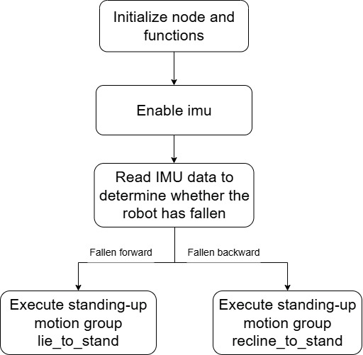
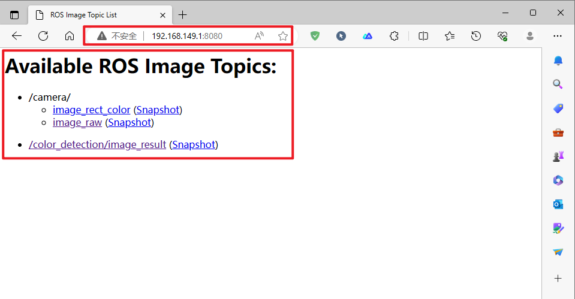
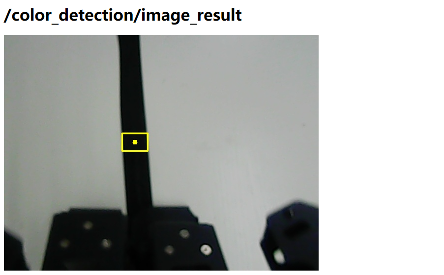
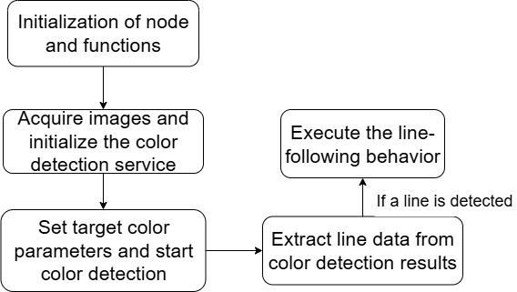
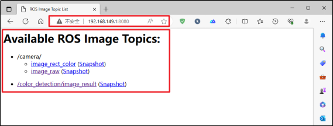
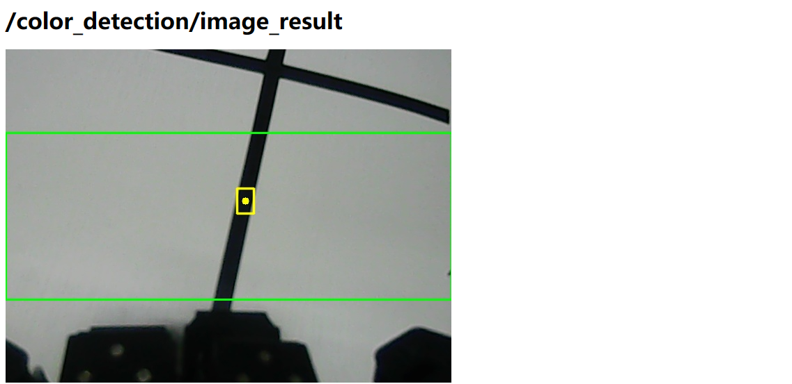
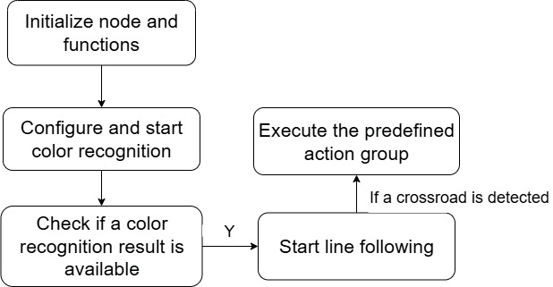
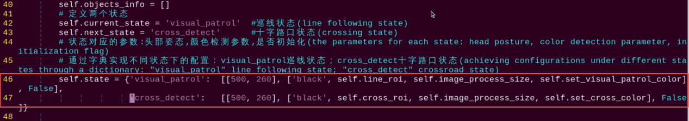
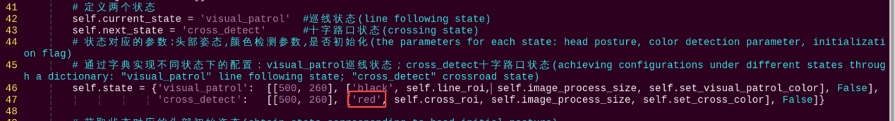

# 8.AI Autonomous Patrolling

## 8.1 Autonomous Getting Up

This feature enables the robot to detect when it has fallen using the `QMI8658` and `QMC6309` sensors on the Raspberry Pi expansion board and then perform a stand-up action accordingly.

### 8.1.1 Project Process

First, the robot reads the x, y, and z axis data from the `QMI8658` and `QMC6309` sensors on the expansion board to determine whether it is in a fallen state.

Then, based on the fall status, it determines whether the robot has fallen forward or backward. After a short delay, if the sensor data confirms a fallen state, the robot will execute a motion sequence to stand up. Different stand-up actions are triggered based on the direction of the fall.

The source code for this program is located at: [/home/ubuntu/ros_ws/src/rosman_example/scripts/fall_rise/fall_rise_node.py]()

### 8.1.2 Enabling and Disabling the Feature

:::{Note}
*   Command input is case-sensitive and space-sensitive.
*   Since this feature conflicts with system services, please make sure to disable the system services before starting the feature. If you need to restart the system services after ending the feature, follow the steps provided in the experiment instructions.
:::

(1) To start the ROSMan robot, refer to [3. ROS Robot Basic Motion Control Course->3.1 Set Development Environment->3.1.1 Remote Desktop Tool Installation and Connection](), and connect the robot to the VNC remote control software.

(2) Open the command-line terminal, enter the command and press Enter to disable ros service.

```
~/.stop_ros.sh
```

(3) Then enter the command in this directory to start the feature.

```
roslaunch rosman_example fall_rise_node.launch
```

:::{Note}
When running this feature, please place the robot on a flat, open, and non-slip surface.
:::

(4) To stop this feature, simply press **Ctrl+C** in the terminal. If the feature does not exit immediately, press **Ctrl+C** multiple times.

(5) When disabled the feature, open a terminal on the robot and enter the command to start the auto-start service. Then restart the mobile app and wait for the service to fully initialize.

```
sudo systemctl restart start_node.service
```

### 8.1.3 Project Outcome

After starting this feature, lay the robot flat facing up or down on a flat surface. The robot will use both arms to push itself up until it returns to a standing posture.

### 8.1.4 Program Brief Analysis

[Source Code]()

The source code of the program is located at: [/home/ubuntu/ros_ws/src/rosman_example/scripts/fall_rise/fall_rise_node.py]()

The flowchart below outlines the logic of the program based on this file.



* **Subscribe to imu Topic**

This program enables the `imu` service and uses a callback function to subscribe to `imu` topic data:

{lineno-start=}

```python
    # 开始服务回调(enable service callback)
    def start_srv_callback(self, msg):
        with self.lock:
            if self.imu_sub is None:
                # 订阅imu话题(subscribe to IMU topic)
                self.imu_sub = rospy.Subscriber('/imu', Imu, self.imu_callback)
            self.start = True
        common.loginfo('%s start' % self.name)
        return EmptyResponse()
```
`rospy.Subscriber('/imu, Imu, self.imu_callback)`

The first argument `'/imu'` is the topic name.

The second argument `Imu` is the message type.

The third argument `self.imu_callback` is the callback function triggered when a message is received.

* **imu Callback Function**

{lineno-start=113}

```python
    # IMU回调函数(IMU callback function)
    def imu_callback(self, msg):
        #转化为角度值(convert to angle value)
        angle = abs(int(math.degrees(math.atan2(msg.linear_acceleration.y, msg.linear_acceleration.z)))) 
        print(angle)
        # 根据状态计数(count based on the state)
        if self.state == 'stand':
            if angle < 30:
                self.count_lie += 1
            else:
                self.count_lie = 0
            if angle > 150:
                self.count_recline += 1
            else:
                self.count_recline = 0
            # 根据计数判断是否进入起立状态(determine whether to enter the standing up state based on the count)
            if self.count_lie > 100:
                self.count_lie = 0
                self.state = 'lie_to_stand'
            elif self.count_recline > 100:
                self.count_recline = 0
                self.state = 'recline_to_stand'
            time.sleep(0.01)
        # 显示图像(display image)
        if self.debug:
            image = self.image.copy()
            # 通过图像显示角度(display angle through image)
            point = self.rotate_point(self.point1, [self.point2], 90 - angle)[0]
            cv2.line(image, tuple(self.point1), tuple(point), (255, 255, 255), 1, cv2.LINE_AA)
            cv2.putText(image, str(angle), (225, image.shape[0] - 20), cv2.FONT_HERSHEY_SIMPLEX, 1, (255, 255, 255), 2)
            cv2.imshow('image', image)
            key = cv2.waitKey(1)
```
The angle between the y-axis and z-axis of the `imu` is calculated using: `angle=abs(int(math.degrees(math.atan2(msg.linear_acceleration.y,msg.linear_acceleration.z))))`

Based on the angle, the robot's posture is determined as either: **"lie_to_stand"** (fallen forward), or **"recline_to_stand"** (fallen backward). The result is stored in the variable `self.state`.

To visualize the robot’s angle data, set `self.debug` to `True`.

{lineno-start=29}

```
        self.debug = False
```

* **Main Function Feedback**

{lineno-start=146}

```python
    # 主循环函数(main loop function)
    def run(self):
        while self.running:
            if self.start:  
                # 如果不是站立状态,进行起立(If it is not in the standing up state, perform standing up)
                if self.state != 'stand':
                    # 蜂鸣器提示(buzzer sounds)
                    self.buzzer_pub.publish(BuzzerState(freq=1900, on_time=0.1, off_time=0.01, repeat=1))
                    time.sleep(1)
                    self.gait_manager.disable()  # 停止步态(stop gait)
                    # 根据状态选择起立动作(select standing up action based on the state)
                    if self.state == 'lie_to_stand':
                        common.loginfo('lie_to_stand')
                        self.motion_manager.run_action(self.lie_to_stand_action_name)
                    elif self.state == 'recline_to_stand':
                        common.loginfo('recline_to_stand')
                        self.motion_manager.run_action(self.recline_to_stand_action_name)
                    time.sleep(0.5)
                    self.state = 'stand'  # 起立后切换到站立状态(switch to standing state after raising up)
                else:
                    time.sleep(0.01)
            else:
                time.sleep(0.01)

        rospy.signal_shutdown('shutdown')
```
The program uses `self.state` to check whether the robot is in a standing position. If the robot is not standing, it performs the appropriate recovery movement according to its posture—either **"lie_to_stand"** or **"recline_to_stand"**—to complete the fall recovery.

## 8.2 Intelligent Line Following

In this feature, the robot follows a pre-laid black line using its camera to detect the line.

### 8.2.1 Project Process

First, the robot captures the current image through its camera and subscribes to the `/object/pixel_coords` topic to obtain the color recognition results, filtering out the information related to the black line.

Next, three `ROIs` (Regions of Interest) are defined to detect the black line and extract its position and width.

The source code for this program is located at: [/home/ubuntu/ros_ws/src/rosman_example/scripts/visual_patrol/visual_patrol.py]()

An `ROI` (Region of Interest) is a specific area in an image selected for processing. By focusing the algorithm on this area, image processing can be made faster and more accurate.

Once the black line parameters are obtained, the line-following function is called to control the robot’s movement based on the line’s position and width. During this process, the robot dynamically adjusts its gait, speed, and other parameters in real time according to the line data received from the camera.

### 8.2.2 Enabling and Disabling the Feature

:::{Note}
*   Command input is case-sensitive and space-sensitive.
*   Since this feature conflicts with system services, please make sure to disable the system services before starting the feature. If you need to restart the system services after ending the feature, follow the steps provided in the experiment instructions.
:::

(1) To start the ROSMan robot, refer to [3. ROS Robot Basic Motion Course->3.1 Set Development Environment->3.1.1 Remote Desktop Tool Installation and Connection](), and connect the robot to the VNC remote control software.

(2) Open the command-line terminal, enter the command and press Enter to disable ros service.

```
~/.stop_ros.sh
```
(3) Then enter the command in this directory to start the feature.

```
roslaunch rosman_example visual_patrol_node.launch
```

(4) To exit the feature, press **Ctrl+C** in the terminal. If the feature does not exit immediately, press **Ctrl+C** multiple times.

(5) When disabled the feature, open a terminal on the robot and enter the command to start the auto-start service. Then restart the mobile app and wait for the service to fully initialize.

```
sudo systemctl restart start_node.service
```

### 8.2.3 Access Live Camera Feed (Optional)

:::{Note}
*   Command input is case-sensitive and space-sensitive.
*   Before starting the camera feed, make sure the Intelligent Line Following feature is running properly. Otherwise, the camera feed may fail to launch.
:::

After the feature is activated, you can view the camera feed in a browser by enabling the **"web_video_server"** service.

(1) After the program starts successfully, open the system browser and enter `192.168.149.1:8080` in the address bar. Press Enter to access the web_video_server backend.

```
192.168.149.1:8080
```


(2) Then, click the **/color_detection/image_result** button to open the camera feed interface for the Intelligent Line Following feature, as shown in the figure below.



### 8.2.4 Project Outcome

You can use electrical tape to lay out black lines on the ground. Once the robot is placed on the black line and the feature is activated, it will move forward following the direction of the black line.

### 8.2.5 Program Brief Analysis

[Source Code]()

The source code of the program is located at: [/home/ubuntu/ros_ws/src/rosman_example/scripts/visual_patrol/visual_patrol_node.py]()

The flowchart below outlines the logic of the program based on this file.



* **Program Initialization**

First, Python libraries and ROS-related modules need to be imported. The `VisualPatrolNode` class is then defined, inheriting from the `Common` class. Within the constructor `__init__`, variable initialization and node startup are performed. The main steps include:

(1) Importing necessary libraries, such as: `rospy` for creating ROS nodes and handling ROS messages, `signal` for handling Unix signals, and the visual patrol module from `rosman_example.visual_patrol`.

{lineno-start=6}

```python
import time
import rospy
import signal
from std_msgs.msg import String
from rosman_sdk import common
from rosman_example.color_common import Common
from rosman_example.visual_patrol import VisualPatrol
from rosman_interfaces.srv import SetString
from rosman_interfaces.msg import ObjectsInfo, ColorDetect
```
(2) Defining constants, including the initial position of the head servo.

{lineno-start=32}

```python
        self.head_pan_init = 500   # 左右舵机的初始值(initial value of the left-right servo)
        self.head_tilt_init = 260  # 上下舵机的初始值(initial value of the up-down servo)
        super().__init__(name, self.head_pan_init, self.head_tilt_init)
```
(3) Initializing the ROS node, as well as setting initial values for state and flag variables.

(4) Calling the general visual patrol logic handler to create an instance of the line-following controller.

{lineno-start=35}

```python
        # 创建巡线控制实例(create line following control instance)
        self.visual_patrol = VisualPatrol(self.gait_manager)
```
(5) Subscribing to the `/object/pixel_coords` topic to receive color detection results.

These results are processed by the `get_color_callback` function, which includes logic for obtaining the detected line color.

{lineno-start=40}

```python
        # 订阅颜色识别结果(subscribe to color recognition result)
        rospy.Subscriber('/object/pixel_coords', ObjectsInfo, self.get_color_callback)
```
(6) Initializing the color setting service, where the `set_color_srv_callback` function is used to define the detection color, detection type, and detection region.

{lineno-start=42}

```python
        # 初始化设置颜色服务(initialize color setting service)
        rospy.Service('~set_color', SetString, self.set_color_srv_callback)  
```
* **Main Function**

The main function runs the `VisualPatrolNode` node and uses the `run()` function as the main loop. Within this loop, it continuously obtains color detection results and calls the following functions to implement the intelligent line-following feature:

{lineno-start=98}

```python
    def run(self):
        while self.running:
            if self.start:
                # 获取识别结果(obtain recognition result)
                line_data = None
                # stairs_data = None
                for object_info in self.objects_info:
                    if object_info.type == 'line':
                        line_data = object_info
                # 如果有识别结果,巡线控制(If there is recognition result, control line following)
                if line_data is not None:
                    self.visual_patrol.process(line_data.x, line_data.width)
                time.sleep(0.01)
            else:
                time.sleep(0.01)
        # 退出前动作(action before exiting)
        self.init_action(self.head_pan_init, self.head_tilt_init)
        self.stop_srv_callback(None)
        rospy.signal_shutdown('shutdown')
```
(1) First, the program retrieves the color detection results through the `get_color_callback` function. These results are stored in `self.objects_info`, from which line data is extracted for decision-making.

{lineno-start=92}

```python
    # 发布颜色识别参数(publish color recognition parameter)
    def get_color_callback(self, msg):
        # 获取颜色识别结果(obtain color recognition result)
        self.objects_info = msg.data
```
(2) Then, it calls the `self.visual_patrol.process()` function from the imported `VisualPatrol` module to perform the line-following behavior.

* **Color Recognition**

(1) Image and Object Pose Publishing

The color detection function is instantiated as `self.detect`, and two publishers are defined: `self.image_pub` for publishing images and `self.color_info_pub` for publishing object pose messages.The program is located at:

[ros_ws/src/rosman_example/scripts/color_detection/color_detection_node.py]()

{lineno-start=42}

```python
        # 实例化颜色识别类(instantiate color recognition class)
        self.detect = ColorDetection(lab_config['lab']['Mono'], ColorsDetect(), debug=self.enable_roi)

        # 检测图像发布(publish detected image)
        self.image_pub = rospy.Publisher('~image_result', Image, queue_size=1)

        # 物体位姿发布(publish object position and posture)
        self.color_info_pub = rospy.Publisher('/object/pixel_coords', ObjectsInfo, queue_size=1)
```
(2) Color Detection

{lineno-start=130}

```python
    def run(self):
        while self.running:
            time_start = time.time()
            image = self.image_queue.get(block=True)
            with self.lock:
                if self.start_detect:  # 如果开启检测(if enable detection)
                    frame_result, poses = self.detect.detect(image)  # 颜色检测(color detection)
                    colors_info = []
                    for p in poses:
                        color_info = ObjectInfo()
                        color_info.label = p[0]
                        color_info.type = p[1]
                        color_info.x = p[2][0]
                        color_info.y = p[2][1]
                        color_info.width = p[3][0]
                        color_info.height = p[3][1]
                        color_info.radius = p[4]
                        color_info.angle = p[5]
                        color_info.left_point = p[6]
                        color_info.right_point = p[7]
                        colors_info.append(color_info)
                    self.color_info_pub.publish(colors_info)  # 发布位姿(publish posture)
                    time_d = 0.03 - (time.time() - time_start)
                    if time_d > 0:
                        time.sleep(time_d)
                else:
                    frame_result = image
                    time.sleep(0.03)
                ros_image = common.cv2_image2ros(frame_result, self.name)  # opencv格式转为ros(convert OpenCV to ROS)
                self.image_pub.publish(ros_image)  # 发布图像(publish image)
                if self.enable_display:
                    cv2.imshow('color_detection', frame_result)
                    key = cv2.waitKey(1)
                    if key != -1:
                        self.running = False
```
The function `self.detect.detect(image)` is used to perform color detection. It returns the processed image frame (`frame_result`) and object pose data (`poses`).

For a detailed explanation of the color detection process, refer to: [6. ROS+OpenCV Vision Recognition & Tracking->6.3 Color Recognition]()

Next, the values from the `poses` message are assigned to a list named `colors_info`. The `colors_info` list is then published to the `/object/pixel_coords` topic as object pose messages.

The processed image (`frame_result`) is converted from OpenCV format to ROS format using the function `cv2_image2ros(frame_result, self.name)`. Finally, the ROS image (`ros_image`) is published to the `~image_result` topic.

{lineno-start=158}

```python
                ros_image = common.cv2_image2ros(frame_result, self.name)  # opencv格式转为ros(convert OpenCV to ROS)
                self.image_pub.publish(ros_image)  # 发布图像(publish image)
                if self.enable_display:
                    cv2.imshow('color_detection', frame_result)
                    key = cv2.waitKey(1)
                    if key != -1:
                        self.running = False
```
* **Intelligent Line Following**

[Source Code]()

The intelligent line following feature is launched through the **visual_patrol_node.launch** file. This launch file starts the `visual_patrol_node.py` node to perform intelligent line following.

The program is located at: [ros_ws/src/rosman_example/scripts/visual_patrol/visual_patrol_node.py]()

`line_roi` refers to the color recognition regions used during the intelligent line-following process. There are three detection regions set up for line following, which are checked sequentially. Once a region detects the line, the detection process immediately stops and does not proceed to check the next region.

{lineno-start=19}

```
    line_roi = [(7 / 12, 8 / 12, 1 / 4, 3 / 4),
                (6 / 12, 7 / 12, 1 / 4, 3 / 4),
                (5 / 12, 6 / 12, 1 / 4, 3 / 4)
                ]
```

Each detection region is defined by four parameters: `y_min`, `y_max`, `x_min`, and `x_max`. During detection, only the area between these minimum and maximum values is analyzed. For example, the first region is defined as (7/12, 8/12, 1/4, 3/4). Given an image size of 640×480 pixels, the detection area corresponds to (7/12 * 480, 8/12 * 480, 1/4 * 640, 3/4 * 640), which translates to Y: 280–360 pixels and X: 160–480 pixels.

(1) Initialization Definitions

{lineno-start=26}

```python
    def __init__(self, name):
        rospy.init_node(name)
        self.name = name
        self.running = True
        self.objects_info = []
        # 初始化头部位置
        self.head_pan_init = 500   # 左右舵机的初始值(initial value of the left-right servo)
        self.head_tilt_init = 260  # 上下舵机的初始值(initial value of the up-down servo)
        super().__init__(name, self.head_pan_init, self.head_tilt_init)
        # 创建巡线控制实例(create line following control instance)
        self.visual_patrol = VisualPatrol(self.gait_manager)
        # 设置退出处理函数(set exit processing function)
        signal.signal(signal.SIGINT, self.shutdown)

        # 订阅颜色识别结果(subscribe to color recognition result)
        rospy.Subscriber('/object/pixel_coords', ObjectsInfo, self.get_color_callback)
        # 初始化设置颜色服务(initialize color setting service)
        rospy.Service('~set_color', SetString, self.set_color_srv_callback)  
        self.motion_manager.run_action('walk_ready')     # 播放准备姿势动作(play ready posture action)
        # 如果自动开始参数为真,启动节点(If the autonomous start parameter is ture, enable node)
        if rospy.get_param('~start', True):
            # 通知颜色识别准备，此时只显示摄像头原画(Notify the color recognition to prepare, at this time only display the camera original image)
            target_color = rospy.get_param('~color', 'black')  # 设置识别黑色(set to recognize black)
            self.enter_func(None)
            self.set_color_srv_callback(String(target_color))  
            self.start_srv_callback(None)  # 开启颜色识别(enable color recognition)
            common.loginfo('start track %s lane' % target_color)
```
Initialize the initial positions of the two head servos, `self.head_pan_init` and `self.head_tilt_init`.

Create an instance of the line-following control class: `self.visual_patrol = VisualPatrol(self.gait_manager)`. The line-following logic is implemented by calling a common line-following logic handler.

## 8.3 Crossroad Identification

This feature enables the robot to perform a predefined action group when it detects a crossroad during line following.

### 8.3.1 Project Process

The crossroad detection is encapsulated as a separate state, allowing smooth switching between it and the line-following state, making the behavior more modular.

During state transitions, the head posture and color detection parameters are adjusted to ensure smooth switching. Gait parameters are configured to achieve optimal movement performance in different states.

When the robot approaches a crossroad and detects it, it will slow down and execute a hand-raising action group, thus completing the crossroad recognition.

The source code for this program is located at: [/home/ubuntu/ros_ws/src/rosman_example/scripts/cross_detect/cross_detect_node.py]()

### 8.3.2 Enabling and Disabling the Feature

:::{Note}
*   Command input is case-sensitive and space-sensitive.
*   Since this feature conflicts with system services, please make sure to disable the system services before starting the feature. If you need to restart the system services after ending the feature, follow the steps provided in the experiment instructions.
:::

(1) To start the ROSMan robot, refer to [ROS Robot Motion Basic Control Course->3.1 Set Development Environment->3.1.1 Remote Desktop Tool Installation and Connection](), and connect the robot to the VNC remote control software.

(2) Open the command-line terminal, enter the command and press Enter to disable ros service.

```
~/.stop_ros.sh
```
(3) Then enter the command in this directory to start the feature.

```
roslaunch rosman_example cross_detect_node.launch
```

(4) To exit the feature, press **Ctrl+C** in the terminal. If the feature does not exit immediately, press **Ctrl+C** multiple times.

(5) When disabled the feature, open a terminal on the robot and enter the command to start the auto-start service. Then restart the mobile app and wait for the service to fully initialize.

```
sudo systemctl start start_node.service
```

### 8.3.3 Access Live Camera Feed (Optional)

:::{Note}
*   Command input is case-sensitive and space-sensitive.
*   Before starting the camera feed, make sure the Intelligent Line Following feature is running properly. Otherwise, the camera feed may fail to launch.
:::

After the feature is activated, you can view the camera feed in a browser by enabling the **"web_video_server"** service.

(1) After the program starts successfully, open the system browser and enter `192.168.149.1:8080` in the address bar. Press Enter to access the web_video_server backend.

```
192.168.149.1:8080
```


(2) Then, click the **/color_detection/image_result** button to open the camera feed interface for the Intelligent Line Following feature, as shown in the figure below.



### 8.3.4 Project Outcome

:::{Note}
The default target color for detection is black. If you need to detect a different color, please refer to the instructions of section [Change the Default Detection Color]() in this document.
:::

You can lay down a black cross-shaped line using electrical tape. Then place the robot on the black line — the robot will follow the black path. When it detects the crossroad, it will slow down and raise its hand as a signal.

### 8.3.5 Program Brief Analysis

The source code for this program is located at: [/home/ubuntu/ros_ws/src/rosman_example/scripts/cross_detect/cross_detect_node.py]()

The flowchart below outlines the logic of the program based on this file.



* **Program Initialization**

{lineno-start=6}

```python
	import time
import rospy
import signal
from rosman_sdk import common
from rosman_example.color_common import Common
# 导入巡线十字检测需要的模块
from rosman_example.visual_patrol import VisualPatrol
from rosman_interfaces.msg import ObjectsInfo, ColorDetect, ColorsDetect

class CrossDetectNode(Common):
    # 按顺序检测三个roi，如果检测到黑线立刻跳出(check three ROIs in order, and immediately exit if a black line is detected)
    # y_min, y_max, x_min, x_max分别表示占图像的比例, 即实际大小为y_min*height(y_min, y_max, x_min, and x_max represent respectively the proportion of the image occupied. The actual size is y_min*height)
    # 3个线条检测区，从上到下(three line detection region from top to bottom)
    line_roi = [(5 / 12, 6 / 12, 1 / 4, 3 / 4),
                (6 / 12, 7 / 12, 1 / 4, 3 / 4),
                (7 / 12, 8 / 12, 1 / 4, 3 / 4)
                ]
    # 1个十字检测区域(one cross detection region)
    cross_roi = [1 / 4, 3 / 4, 0, 1]
    # 进入十字检测的图像阈值，视情况调整(Enter the image threshold for cross detection, and adjust based on the actual situation)
    enter_cross_detect_y = 240 / 480
    # 下采样后图像大小，可调整检测精度(Size of the image after down-sampling, and the detection accuracy can be adjusted)
    image_process_size = [160, 120]
    # 抬手动作名称(name of the action for raising up the hand)
    raise_right_hand_action_name = 'raise_right_hand'

    def __init__(self, name):
        # 初始化ROS节点(initialize ROS node)
        rospy.init_node(name)
        self.name = name
        # 是否继续运行的标志(flag used to indicate whether the program should continue running)
        self.running = True
        self.count = 0
        # 存储检测到的对象信息(store information about detected objects)
        self.objects_info = []
        # 定义两个状态  
        self.current_state = 'visual_patrol'  #巡线状态(line following state)
        self.next_state = 'cross_detect'      #十字路口状态(crossing state)
        # 状态对应的参数:头部姿态,颜色检测参数,是否初始化(the parameters for each state: head posture, color detection parameter, initialization flag)
	        # 通过字典实现不同状态下的配置：visual_patrol巡线状态；cross_detect十字路口状态(achieving configurations under different states through a dictionary: "visual_patrol" line following state; "cross_detect" crossroad state)
        self.state = {'visual_patrol':  [[500, 260], ['black', self.line_roi, self.image_process_size, self.set_visual_patrol_color], False],
                      'cross_detect':   [[500, 260], ['black', self.cross_roi, self.image_process_size, self.set_cross_color], False]}
```
First, Python libraries and ROS-related modules need to be imported. The `CrossDetectNode` class is then defined, inheriting from the `Common` class. Within the constructor `__init__`, variable initialization and node startup are performed. The main steps include:

(1) Importing necessary libraries, such as: `rospy` for creating ROS nodes and handling ROS messages, `signal` for handling Unix signals, and the visual patrol module from `rosman_example.visual_patrol`.

(2) Defining constants, including names of action groups to be executed, image processing dimensions, and the target colors for detection under different states.

(3) Initializing the ROS node, as well as setting initial values for state and flag variables.

(4) Initializing the gait manager (`gait_manager`) and motion manager (`motion_manager`), as well as the visual line-following node (`visual_patrol`).

(5) Subscribing to the `/object/pixel_coords` topic to receive color detection results.

The `get_color_callback` function is used to handle these results, extracting information for both the line-following color and the crossroad detection color.

* **Main Function**

The main function runs the `CrossDetectNode` node and calls `run()` as the main loop to manage state transitions and invoke the following functions to implement crossroad detection:

{lineno-start=181}

```python
	    def run(self):
        while self.running:
            if self.start:
                line_data = None
                cross_data = None
                for object_info in self.objects_info:
                    print(object_info.type)
                    if object_info.type == 'line':
                        line_data = object_info
                    if object_info.type == 'cross':
                        cross_data = object_info
                
                if self.current_state == 'visual_patrol':
                    if line_data is not None:
                        self.visual_patrol.process(line_data.x, line_data.width)
                elif self.current_state == 'cross_detect':
                    if self.exit_cross_detect():
                        self.current_state = 'visual_patrol'
                        self.next_state = 'cross_detect'
                        self.state[self.current_state][2] = False
                
                if self.next_state == 'cross_detect':
                    if self.enter_cross_detect(cross_data):
                        self.current_state = 'cross_detect'
                        self.next_state = 'visual_patrol'
                
                self.state_init(self.current_state, self.next_state)

                time.sleep(0.01)
            else:
                time.sleep(0.01)

        self.init_action(self.head_pan_init, self.head_tilt_init)
        self.stop_srv_callback(None)
        rospy.signal_shutdown('shutdown')
```
(1) The program first obtains color recognition results through the `get_color_callback` function, extracting data for both the line and the crossroad to facilitate decision-making.

(2) By default, the initial state of the program is set to **"visual_patrol"**, which represents the line-following state. In this state, the `VisualPatrol` module is used to execute the line-following function. During line following, the system continuously checks specific conditions to determine whether the robot has reached a crossroad.

(3) If the conditions are met, the state switches to **“crossing the crossroad”**. In this state, the robot raises its right hand and walks across the crossroad using a predefined gait. Once it finishes crossing, the state switches back to line-following mode to continue the line following.

* **Enter Crossroad**

{lineno-start=140}

```python
	    # 进入十字检测的条件(the condition for entering cross detection)
    def enter_cross_detect(self, cross_data):
        # 根据十字区域检测结果判断(determine based on the cross region detection result)
        if cross_data is not None:
            
            if max(cross_data.y, cross_data.left_point[1], cross_data.right_point[1]) > self.enter_cross_detect_y * cross_data.height:
                self.count += 1
                print(self.count)
                if self.count > 2:
                    self.count = 0
                    self.gait_manager.stop()
                    common.loginfo('cross detect')
                    return True
            else:
                self.count = 0
        else:
            self.count = 0
        return False
```
During line following, when the robot approaches a crossroad, the `enter_cross_detect` function is used to determine whether the conditions for entering the crossroad have been met. Specifically, it checks whether the maximum value among `cross_data.y`, `cross_data.left_point[1]`, and `cross_data.right_point[1]` is greater than `enter_cross_detect_y` * `cross_data.height`.

Here, `enter_cross_detect_y` is a predefined threshold. Multiplying it by `cross_data.height` helps compare the vertical position of the detected points relative to the entire frame.

If the maximum height exceeds this threshold, a counter is incremented. When the counter exceeds 2 for two consecutive frames, the gait manager stops, and the robot transitions to the **"cross detect"** state — i.e., it begins crossing the crossroad.

* **Exit Crossroad**

{lineno-start=159}

```python
	    # 退出十字检测后的动作(the action after exiting the cross detection)
    def exit_cross_detect(self):
        # 播放动作(play action)
        # 更新步态(update gait)
        # 进入巡线状态(enter line following state)
        self.gait_manager.disable()
        self.motion_manager.run_action(self.raise_right_hand_action_name)
        walking_param = self.gait_manager.get_gait_param()
        walking_param['body_height'] = 0.015
        walking_param['pelvis_offset'] = 7
        walking_param['step_height'] = 0.02
        walking_param['hip_pitch_offset'] = 10
        walking_param['z_swap_amplitude'] = 0.006
        self.gait_manager.set_step([600, 0.2, 0.04], 0.02, 0, 0, walking_param, 0, 4)
        self.motion_manager.run_action('stand')
        return True
```
After entering the crossroad, the robot first executes the **"raise_right_hand"** action group to raise its right hand. Then, it proceeds forward using a predefined gait. Once the robot has successfully crossed the crossroad, it runs the **"stand"** action group to return to a standing posture, and the state is switched back to **"visual_patrol"** to resume line following.

### 8.3.6 Feature Extensions

* **Change the Default Detection Color**

The program comes with three built-in color options: black, red, and white. By default, black is used for line following. To change the detection color for the Crossroad Identification feature to red, follow the steps below:

(1) First, navigate to the directory where the behavior script is located. If you're not already in that directory, run the following command:

```
cd /home/ubuntu/ros_ws/src/rosman_example/scripts/cross_detect/
```

(2) Use the `vim` editor to open the feature’s program:

```
vim cross_detect_node.py
```

(3) Type **47** and press **Shift + G** to quickly jump to line 47, which is near the section you need to modify. You'll see that the program uses a dictionary to configure parameters for different states.



(4) Press the key **i** to enter insert mode. Locate the keys **"visual_patrol"** and **"cross_detect"** in the dictionary.

```
i
```

The **"visual_patrol"** key sets the color used for line following. The **"cross_detect"** key sets the color used for crossroad detection. To change the crossroad detection color to red, modify the value for the **"cross_detect"** key to **"red"**. To switch to green, change the value to **"green"**.

```
red
```


(5) After editing, press **Esc** to exit insert mode, then enter the following command to save and exit: First type a colon using English input, then type **wq**.

```
:wq
```

* **Add New Detection Color**

In addition to the three built-in basic colors, you can also set other colors for line following. First, refer to the tutorial in [6. ROS+OpenCV Vision Recognition & Tracking->6.2 Color Threshold Adjustment](), and add your custom color.

Then, update the values of the **"visual_patrol"** and **"cross_detect"** keys in [ Change the Default Detection Color]() in this document to your custom color name.

## 8.4 TOF-Based Autonomous Obstacle Avoidance

In this feature, the robot will execute a predefined gait when it detects an obstacle using the `TOF` module during movement.

### 8.4.1 Module Introduction

This feature uses the `VL53L0X` ranging chip, with a maximum detection range of up to 2 meters. It enables ROSMan to perceive its surroundings accurately, allowing it to quickly and precisely calculate the distance to objects. This helps ROSMan effectively avoid obstacles and interact with the environment in a more natural and intelligent way.

| Model | TOF200C | Distance Measurement Chip | VL53LOX |
|:---:|:---:|:---:|:---:|
| Measurement Range | 2M (Max) | Measurement Blind Zone | 0-3CM |
| Communication Module | IIC Mode | Development Examples/Software | Provides Arduino/STM32 Examples |
| Operating Voltage | 3.0V-5V (DC) | Operating Current | 40mA (Max) |
| Operating Temperature | -20℃ to 70℃ | Storage Temperature | -20℃ to 80℃ |

### 8.4.2 Project Process

(1) Initialization: Start the node, initialize the laser distance sensor, and set the robot to a ready-to-walk posture.

(2) Continuous Distance Measurement: Continuously obtain the distance to obstacles ahead and filter the data by averaging the most recent 5 valid measurements.

(3) Obstacle Avoidance Decision: Execute different actions based on the measured distance.

① Safe distance (>250mm): Move forward straight.

② Medium distance obstacle (150-250mm): Turn right to avoid.

③ Dangerous distance (<150mm): Move backward.

(4) State Memory: Record the previous distance value. When leaving the obstacle zone, perform an additional turn to ensure safety.

(5) Safe Shutdown: On receiving a termination signal, stop all movements and power down the sensor.

The source code for this program is located at: [/home/ubuntu/ros_ws/src/rosman_example/scripts/obstacle_avoidance/obstacle_avoidance_node.py]()

### 8.4.3 Enabling and Disabling the Feature

:::{Note}
*   Command input is case-sensitive and space-sensitive.
*   Since this feature conflicts with system services, please make sure to disable the system services before starting the feature. If you need to restart the system services after ending the feature, follow the steps provided in the experiment instructions.
:::

(1) To start the ROSMan robot, refer to [3. ROS Robot Motion Basic Control Course->3.1 Set Development Environment->3.1.1 Remote Desktop Tool Installation and Connection](), and connect the robot to the VNC remote control software.

(2) Open the command-line terminal, enter the command and press Enter to disable ros service.

```
~/.stop_ros.sh
```
(3) Then enter the command in this directory to start the feature.

```
roslaunch rosman_example obstacle_avoidance_node.launch
```

(4) To exit the feature, press **Ctrl+C** in the terminal. If the feature does not exit immediately, press **Ctrl+C** multiple times.

(5) After stopping the feature, you need to restart the system services; otherwise, the ROSMan mobile app may malfunction. Open a terminal on the robot and enter the command to start the auto-start service. Then restart the mobile app and wait for the service to fully initialize.

```
sudo systemctl restart start_node.service
```

### 8.4.4 Project Outcome

After starting the feature:

(1) If the distance between the `TOF` sensor and the object ahead is greater than or equal to 25 cm, it is considered that there is no obstacle in front, and the robot will move straight forward.

(2) If the distance is less than or equal to 25 cm, it is considered an obstacle, and the robot will turn right to avoid it.

(3) If the distance is less than or equal to 15 cm, it is considered too close to the obstacle, and the robot will move backward directly to keep a safe distance.

### 8.4.5 Program Brief Analysis

[Source Code]()

The source code for this program is located at: [/home/ubuntu/ros_ws/src/rosman_example/scripts/obstacle_avoidance/obstacle_avoidance_node.py]()

* **Initialization and Sensor Setup**

{lineno-start=5}

```python
import time
import math
import rospy
import signal
import threading
import numpy as np
import pandas as pd
from rosman_sdk import VL53L0X
from rosman_kinematics.gait_manager import GaitManager
from rosman_kinematics.motion_manager import MotionManager

# Create a VL53L0X object
tof = VL53L0X.VL53L0X()

# Start ranging
tof.start_ranging(VL53L0X.VL53L0X_BETTER_ACCURACY_MODE)
```
(1) Import necessary ROS and data processing libraries.

(2) Initialize the `VL53L0X` laser distance sensor.

(3) Start the sensor in high-precision ranging mode.

* **Program Control and Signal Handle**

{lineno-start=27}

```python
running = True
thread_running = True
def shutdown(signum, frame):
    global thread_running
    print("Shutdown obstacle_avoidance_node")
    thread_running = False

signal.signal(signal.SIGINT, shutdown)
```
(1) Define global control variables.

(2) Set up a signal handler function to safely terminate the program upon receiving a `SIGINT` signal (e.g., **Ctrl+C**).

* **Obstacle Avoidance Logic**

{lineno-start=38}

```python
#执行动作组线程
def run():
    global distance, last_distance, running
    while thread_running:
        if distance >= 0:
            if distance > 250 or distance < 100: # 检测距离大于250mm时               
                if 100 <= last_distance <= 250: # 如果上次距离大于350mm, 说明是刚转到检测不到障碍物，但是没有完全转正
                    last_distance = distance
                    gait_manager.move(2, 0, 0, 8, step_num=4) # 右转
                else:
                    last_distance = distance
                    gait_manager.move(2, 0.01, 0, 0) # 直走
            elif 150 < distance <= 250: # 检测距离在150-350mm时
                last_distance = distance
                gait_manager.move(2, 0, 0, 8, step_num=4) # 右转
            else:
                last_distance = distance
                gait_manager.move(2, -0.01, 0, 0) # 后退
            time.sleep(timing/1000000.00)
        else:
            time.sleep(0.01)
    
    running = False
```
(1) Obstacle Avoidance Decision: Execute different actions based on the measured distance.

① Safe distance (>250mm): Move forward straight.

② Medium distance obstacle (150-250mm): Turn right to avoid.

③ Dangerous distance (<150mm): Move backward.

* **ROS Node Initialization and Motion Control**

{lineno-start=62}

```python
rospy.init_node('obstacle_avoidance_node', anonymous=True)
gait_manager = GaitManager()
motion_manager = MotionManager()
motion_manager.run_action('walk_ready') # 初始姿态

#启动动作的线程
threading.Thread(target=run, daemon=True).start()
```
(1) Initialize the ROS node.

(2) Create gait manager and motion manager instances.

(3) Set the robot’s initial posture to walking preparation state.

(4) Start the obstacle avoidance logic thread.

* **Main Loop and Data Processing**

{lineno-start=70}

```python
distance_data = []
while running:
    dist = tof.get_distance() # 获取测距

    if dist < 30 or dist == 8190:
        dist = 0
    distance_data.append(dist)
    data = pd.DataFrame(distance_data)
    data_ = data.copy()
    u = data_.mean()
    std = data_.std()
    data_c = data[np.abs(data - u) <= std]
    d = data_c.mean()[0]

    if len(distance_data) == 5:
        distance_data.remove(distance_data[0])
        if math.isnan(d):
            distance = 0
        else:
            distance = int(d)
        print ("%d mm" % distance)
    time.sleep(timing/1000000.00)
    if not thread_running:
        break
gait_manager.stop()
tof.stop_ranging()  # 关闭测距
```
(1) Continuously read sensor data.

(2) Use a sliding window of 5 data points to store recent distance readings.

(3) Apply statistical filtering to remove outliers and improve data reliability.

(4) Calculate and update the effective distance value.