# 9. AI All-round Project

## 9.1 Auto Shooting

This feature enables the robot to detect the position of a ball, track it until within a certain range, and then perform a kicking action.

### 9.1.1 Introduction

The robot first subscribes to a ROS topic from the color recognition node to receive ball information. In the callback function, it obtains data such as the ball's pixel coordinates.

Next, a PID algorithm is used to control the head servo so that it aligns with the ball's position, calculating the horizontal and vertical offset of the ball relative to the head. Based on the head's offset values, the robot's body movement is controlled to gradually approach the ball while keeping it centered in the head's view.

When the ball is within range, if it is located to the left of the head, the robot kicks it with the left foot; if it's on the right, it uses the right foot. If the ball is not detected, the robot enters a ball-searching mode and scans a predefined area to locate the ball.

<p id="anchor_9_1_2"></p>

### 9.1.2 Enabling and Disabling the Feature

:::{Note}
* Command input is case-sensitive and space-sensitive.
* Since this feature conflicts with system services, please make sure to disable the system services before starting the feature. If you need to restart the system services after ending the feature, follow the steps provided in the experiment instructions.
:::

(1) To start the ROSMan robot, refer to [3. ROS Robot Motion Basic Control Course -> 3.1 Set Development Environment -> 3.1.1 Remote Desktop Tool Installation and Connection](3.ROS_Robot_Motion_Basic_Control_Course.md#remote-desktop-tool-installation-and-connection), and connect the robot to the VNC remote control software.

(2) Open the command-line terminal, enter the command and press Enter to disable ros service.

```
~/.stop_ros.sh
```

(3) Then enter the command in this directory to start the feature.

```
roslaunch rosman_example kick_ball_node.launch
```

(4) To exit the feature, press **Ctrl+C** in the terminal. If the feature does not exit immediately, press **Ctrl+C** multiple times.

(5) When disabled the feature, open a terminal on the robot and enter the command to start the auto-start service. Then restart the mobile app and wait for the service to fully initialize.

```
sudo systemctl restart start_node.service
```

### 9.1.3 Access Live Camera Feed (Optional)

:::{Note}
* Command input is case-sensitive and space-sensitive.
* Before starting the camera feed, make sure the Auto Shooting feature is functioning properly, otherwise, the camera feed may fail to launch.
:::

(1) After the program starts successfully, open the system browser and enter `192.168.149.1:8080` in the address bar. Press **Enter** to access the **web_video_server** backend.


(2) Then, click the `/color_detection/image_result` button to open the camera feed interface for the Intelligent Line Following feature, as shown in the figure below.

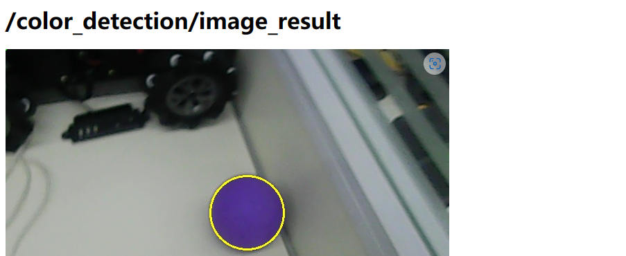

### 9.1.4 Project Outcome

:::{Note}
Please place the robot and the ball on a flat surface during operation. By default, the program is set to recognize blue balls. If you wish to change the recognized color, refer to the instructions of [9.1.6 Feature Extensions -> Change the Default Detection Color](#anchor_9_1_6) in this document.
:::

Place a blue ball within the robot's camera view. Once the ball is detected, the robot will adjust its position and move toward it. When the ball is within the preset kicking range, if the ball is on the left side of the robot, it will execute the left-foot kicking action group. If the ball is on the right, it will perform the right-foot kicking action.

### 9.1.5 Program Brief Analysis

The source code of the program is located at: [/home/ubuntu/ros_ws/src/rosman_example/scripts/kick_ball/kick_ball_node.py](../_static/source_code/kick_ball.zip)

Based on the effects of the feature, the process logic has been outlined as shown in the diagram below:

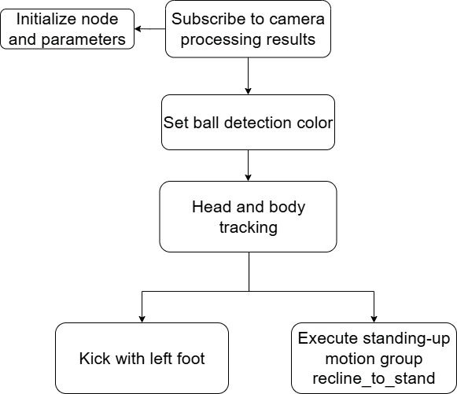

* **Import the necessary libraries**

Import the required modules for operating PuppyPi, including those for control services, large language model integration, and voice processing.

{lineno-start=19}

```python
    # 左右踢球的动作名(action names for kicking the ball left and right)
    left_shot_action_name = 'left_shot'
    right_shot_action_name = 'right_shot'
```

(1) import `math`: Provides a range of mathematical functions and constants used for calculations.

(2) import `rospy`: Enables ROS (Robot Operating System) communication.

(3) import `std_msgs`: Supplies standard message types such as `Float64` and `String`.

(4) Additionally, import the following custom libraries: `rosman_interfaces.msg`: Includes message types related to color detection, used for PID-based tracking.

(5) `rosman_example.approach_object`: Contains logic for handling object-approaching behavior.

* **Initialization Settings**

Define Action Names for Kicking Actions

{lineno-start=23}

```python
    # 图像处理大小(image processing size)
    image_process_size = [160, 120]
```

Configure Image Dimensions

{lineno-start=26}

```python
    def __init__(self, name):
        rospy.init_node(name)
        self.name = name
        self.running = True
        # 存储检测结果(store detection result)
        self.objects_info = []
        self.count_miss = 0
        # 找球相关标志位(flag related to find ball)
        self.start_index = 0
        self.start_find_ball = False
        # 初始化头部位置(initialize head position)
        self.head_pan_init = 500  # 左右舵机的初始值(initial value of left-right servo)
        self.head_tilt_init = 300 # 上下舵机的初始值(initial value of up-down servo)
        self.head_time_stamp = rospy.get_time()
        # 初始化父类(initialize parent class)
        super().__init__(name, self.head_pan_init, self.head_tilt_init)
        self.calib_config = common.get_yaml_data('/home/ubuntu/ros_ws/src/rosman_example/config/calib.yaml')
        # 存放检测结果(store detection result)
        self.rl_dis = None
        self.ud_dis = None
        # 初始化接近控制(initialize approaching control)
        self.approach_object = ApproachObject(self.gait_manager, step_mode=0)
        self.approach_object.update_gait(dsp=[400, 0.2, 0.02])
        self.approach_object.update_stop_count(0)
        self.approach_object.update_gait_range(x_range=[-0.013, 0.013])
        self.approach_object.update_approach_stop_value(30, 0, 3)
        signal.signal(signal.SIGINT, self.shutdown)
```

(1) In the `__init__` constructor, perform variable initialization and ROS node setup. This includes initializing storage for detection results, setting flags related to ball tracking, assigning initial values to the head position variables `head_pan_init` and `head_tilt_init`, and calling the constructor of the parent class.

{lineno-start=54}

```python
        # 头部的pid追踪(head PID tracking)
        self.head_pan_range = [125, 875]  # 左右转动限制在这个范围， 125为右(limit the left and right rotation in this range, with 125 as right)
        self.head_tilt_range = [260, 500]  # 上下限制在这个范围， 250为下(limit the up and down in this range, with 250 as down)
        self.pid_rl = pid.PID(0.1, 0.0, 0.001)
        self.pid_ud = pid.PID(0.1, 0.0, 0.001)
        self.head_pan_init = 500  # 左右舵机的初始值(initial value of left-right servo)
        self.head_tilt_init = 300 # 上下舵机的初始值(initial value of up-down servo)
        self.rl_track = PIDTrack(self.pid_rl, self.head_pan_range, self.head_pan_init)
        self.ud_track = PIDTrack(self.pid_ud, self.head_tilt_range, self.head_tilt_init)
```

(2) Initialize Parameters Related to Approach Control

Set the PID tracking parameters for the head servos, define the motion range limits for the horizontal and vertical servos, and configure the PID controller parameters for both axes.

{lineno-start=64}

```python
        # 躯体的追踪参数(body tracking parameter)
        self.yaw_stop = 40  # 躯体停止转动时头部左右舵机脉宽值和中位500的差值(When body stops rotating, the difference between the pulse width of the left and right head servo and the neutral position 500)
        
        # 找球时头部经过的5个位置，左右舵机，上下舵机，时间ms(When searching for the ball, the robot head will pass through 5 positions, with specific pulse width values and time (in milliseconds) for the left-right and up-down servos at each position)
        # left_down, left_up, center_up, right_up, right_down
        self.find_ball_position = [[650, 300, 1000], 
                                   [650, 500, 1000], 
                                   [500, 500, 1000], 
                                   [350, 500, 1000],
                                   [350, 300, 1000]
                                   ]
```

(3) Define the offset between the head servo pulse width and the center position (500) when the robot body stops rotating during tracking.

{lineno-start=67}

```python
        # 找球时头部经过的5个位置，左右舵机，上下舵机，时间ms(When searching for the ball, the robot head will pass through 5 positions, with specific pulse width values and time (in milliseconds) for the left-right and up-down servos at each position)
        # left_down, left_up, center_up, right_up, right_down
        self.find_ball_position = [[650, 300, 1000], 
                                   [650, 500, 1000], 
                                   [500, 500, 1000], 
                                   [350, 500, 1000],
                                   [350, 300, 1000]
                                   ]
```

(4) Configure the head movement trajectory in ball-searching mode, moving through five preset positions.

{lineno-start=76}

```python
        # 订阅颜色识别结果(subscribe color recognition result)
        rospy.Subscriber('/object/pixel_coords', ObjectsInfo, self.get_color_callback)
        rospy.Service('~set_color', SetString, self.set_color_srv_callback)  # 设置颜色(set color)
        # 初始化站姿(initialize standing posture)
        self.motion_manager.run_action('walk_ready')
        # 是否自动开始(whether to start automatically)
        if rospy.get_param('~start', True):
            # 通知颜色识别准备，此时只显示摄像头原画(Notify the color recognition to prepare, at this time only display the camera original image)
            target_color = rospy.get_param('~color', 'blue')  # 设置识别蓝色(set to recognize blue)
            self.enter_func(None)
            self.set_color_srv_callback(String(target_color))  
            self.start_srv_callback(None)  # 开启颜色识别(enable color recognition)
            common.loginfo('start kick %s ball' % target_color)
```

(5) Subscribe to the color detection results for tracking the target ball, initialize the robot's standing posture, and call the `start_srv_callback()` function to activate color recognition.

* **Main Function**

The main function runs the `KickBallNode` node and then calls the `run()` function as the main loop. Within the main loop, the system determines the current state to perform color recognition, ball searching, and body tracking, enabling the robot to autonomously track and kick the ball.

{lineno-start=162}

```python
    def run(self):
        while self.running:
            # 状态判断(determine state)
            if self.start:
                ball_data = None 
                # 在检测到的对象中查找球(search for the ball in the detected objects)
                for object_info in self.objects_info:
                    if object_info.type == 'circle':
                        ball_data = object_info
                # 如果识别到球就进行躯体追踪(If no ball is recognized, perform body tracking)
                if self.rl_dis is not None:
                    self.body_track_process(self.rl_dis, self.ud_dis, ball_data)
                    self.rl_dis = None
                    self.count_miss = 0
                    self.start_find_ball = False
                # 如果未识别到球(if the ball is not recognized)
                else:
                    # 如果未开始找球(if it has not started to find the ball)
                    if not self.start_find_ball:
                        self.count_miss += 1    # 未识别计数加1(increase the count by 1)
                         # 超过阈值则开始找球(If it is greater than the threshold, the robot starts to find the ball)
                        if self.count_miss > 100:
                            self.count_miss = 0
                            self.start_find_ball = True
                            self.start_index = 0
                        time.sleep(0.01)
                    # 如果已开始找球(if it has already started finding ball)
                    else:
                        self.find_ball_process()   # 进行找球过程(perform the process of finding ball)
                time.sleep(0.01)
            else:
                time.sleep(0.02)

        self.init_action(self.head_pan_init, self.head_tilt_init)
        self.stop_srv_callback(None)
        rospy.signal_shutdown('shutdown')
```

Initially, the robot uses the color recognition results to search for a ball labeled as **"circle"** among the detected objects. If the ball is found, it proceeds with body tracking to approach and kick the ball. If no ball is detected, a counter begins incrementing. Once the count exceeds 100 cycles, the robot enters ball-searching mode, during which it moves the head servos and the body to locate the ball. After kicking the ball, the robot resets the head servo positions. Pressing "**Ctrl+C**" will terminate the program.

* **Color Service Callback Function**

{lineno-start=96}

```python
    # 设置颜色服务回调(set color service callback)
    def set_color_srv_callback(self, msg):
        # 设置追踪颜色(set color to be tracked)
        param = ColorDetect()
        param.color_name = msg.data
        param.detect_type = 'circle'
        param.use_name = True
        param.image_process_size = self.image_process_size
        param.min_area = 20
        param.max_area = self.image_process_size[0]*self.image_process_size[1]
        self.detect_pub.publish([param])
        
        common.loginfo('%s set_color' % self.name)
        return [True, 'set_color']
```

(1) A callback function named `set_color_srv_callback` is defined to set color detection parameters using the `ColorDetect` class. The tracking type is set as `param.detect_type = 'circle'`, and `param.max_area` is used to control the image processing size and the detection area.

(2) The list containing the color detection parameters is then published through the `detect_pub` publisher using `self.detect_pub.publish([param])`.

* **Obtain Color Recognition Results**

{lineno-start=111}

```python
    def get_color_callback(self, msg):
        # 获取颜色识别结果(obtain color recognition result)
        self.objects_info = msg.data
        # 获取识别结果，根据结果计算距离(Obtain recognition result, and calculate distance based on the result)
        for object_info in self.objects_info:
            if object_info.type == 'circle':
                object_info.x = object_info.x - self.calib_config['center_x_offset']
                self.rl_dis, self.ud_dis = self.head_track_process(object_info)
```

The `get_color_callback` function receives a message (`msg`) and extracts the color recognition result from it. If an object of type **'circle'** is detected in the result, the x-coordinate is adjusted, and the `head_track_process` function is called to calculate the distance.

* **Head Tracking with PID**

{lineno-start=120}

```python
    # 头部PID跟踪(head PID tracking)
    def head_track_process(self, object_info):
        # 头部追踪(head tracking)
        if abs(object_info.x - object_info.width/2) < 10:
            object_info.x = object_info.width/2
        if abs(object_info.y - object_info.height/2) < 10:
            object_info.y = object_info.height/2
        rl_dis = self.rl_track.track(object_info.x, object_info.width/2)
        ud_dis = self.ud_track.track(object_info.y, object_info.height/2)
        self.motion_manager.set_servos_position(20, [[23, int(rl_dis)], [24, int(ud_dis)]])
```

(1) This process is used to control the robot's head to track the target object. Adjusting the position of the target object:

① If the target's x-coordinate minus half its width is less than 10, the x-coordinate is set to half the width to ensure the target is horizontally centered.

② If the target's y-coordinate minus half its height is less than 10, the y-coordinate is set to half the height to ensure the target is vertically centered.

(2) The `rl_track` PID controller tracks the x-coordinate minus half the width to compute horizontal displacement (`rl_dis`).

(3) The `ud_track` PID controller tracks the y-coordinate minus half the height to compute vertical displacement (`ud_dis`).

(4) The `motion_manager.set_servos_position` function is then called to set the positions of the head servos. 20 represents the movement duration in milliseconds, and `[[23, int(rl_dis)], [24, int(ud_dis)]]` specifies the target servo positions, where 23 and 24 are the IDs for the horizontal and vertical head servos, respectively, and `rl_dis` and `ud_dis` are the computed position offsets converted to integers.

* **Body Tracking**

{lineno-start=132}

```python
    # 躯体追踪(body tracking)
    def body_track_process(self, rl_dis, ud_dis, ball_data):                                                
        # 左右根据头部左右舵机位置值进行调整(adjust left and right based on the position value of the left and right head servos)
        if ball_data is not None:
            yaw_stop = 500 + math.copysign(self.yaw_stop, rl_dis - 500)
            yaw_stop_ = (yaw_stop - rl_dis)/9
            if 15 < abs(yaw_stop - rl_dis) < 27:
                yaw_stop_ = math.copysign(4, yaw_stop - rl_dis)
            if self.approach_object.process(500 - ud_dis, 0, yaw_stop_, self.head_tilt_range[0], 0, 0, ball_data.width, ball_data.height):           
                self.gait_manager.disable()
                if rl_dis > 500:
                    self.motion_manager.run_action(self.left_shot_action_name)  # 左脚踢(kick with left foot)
                else:
                    self.motion_manager.run_action(self.right_shot_action_name)  # 右脚踢(kick with right foot)
    # 找球过程(the process of finding the ball)
```

(1) If `ball_data` is not empty when a ball is detected:

① Adjust based on the left-right servo displacement value (`rl_dis`) of the head. The value of `yaw_stop` is offset from 500 depending on `rl_dis`.

② `yaw_stop_` is a fine-tuned version of `yaw_stop`, adjusted further based on the difference between `yaw_stop` and `rl_dis`. If the absolute difference falls between 15 and 27, `yaw_stop_` is set to ±4 accordingly.

(2) Call the `process` method of `approach_object`, passing in parameters such as 500 - `ud_dis`, the x-axis offset of the center, `yaw_stop_`, the head tilt range, and the ball's width and height.

(3) If `approach_object.process` returns true, disable the gait manager (`gait_manager`) to stop the robot's current walking behavior.

(4) Then, based on the value of `rl_dis`, execute the corresponding shot action. If `rl_dis > 500`, perform the left shot action (`left_shot_action_name`). Otherwise, perform the right shot action (`right_shot_action_name`).

* **Ball Searching**

{lineno-start=146}

```python
    # 找球过程(the process of finding the ball)
    def find_ball_process(self):
        # 根据预设的扫描点进行找球(find ball based on the preset scanning points)
        if rospy.get_time() > self.head_time_stamp:
            if self.start_index > len(self.find_ball_position) - 1:
                self.start_index = 0
            rl_dis = self.find_ball_position[self.start_index][0]
            ud_dis = self.find_ball_position[self.start_index][1]
            self.rl_track.update_position(rl_dis)  # pid的输出值要跟着更新(update output value of PID)
            self.ud_track.update_position(ud_dis)
            self.motion_manager.set_servos_position(self.find_ball_position[self.start_index][2], [[23, rl_dis], [24, ud_dis]])

            self.gait_manager.move(2, 0, 0, 5)  # 右转(turn right)
            self.head_time_stamp = rospy.get_time() + self.find_ball_position[self.start_index][2]/1000.0
            self.start_index += 1
```

(1) Check whether the current time exceeds the last ball search timestamp (`head_time_stamp`). If it does, proceed with the ball search process.

(2) Verify whether the current `start_index` exceeds the length of the `find_ball_position` list minus one. If so, reset `start_index` to 0 to restart the search from the beginning.

(3) Retrieve the current left-right (`rl_dis`) and up-down (`ud_dis`) angles from the `find_ball_position` list. Update the head servo positions via `rl_track` and `ud_track` to adjust the head's posture for ball searching. Use the `gait_manager` to trigger a right-turn walking action.

(4) While the robot is turning, the head servos follow the predefined trajectory in `self.find_ball_position` to search for the ball.

For more information on color recognition, please refer to [6. ROS+OpenCV Vision Recognition & Tracking -> 6.3 Color Recognition](6.ROS+OpenCV_Vision_Recognition_Tracking.md#color-recognition).

<p id="anchor_9_1_6"></p>

### 9.1.6 Feature Extensions

* **Change the Default Detection Color**

The program supports multiple built-in colors including blue, red, and green. Since blue and purple share similar color thresholds, blue is set as the default detection color. **Here, let's take changing the target ball color from blue to green as an example. Follow the steps below:**

(1) Enter the following command to navigate to the program directory:

```
roscd rosman_example/scripts/kick_ball/
```

(2) Use the `vim` editor to open the launch file:

```
vim kick_ball_node.launch
```

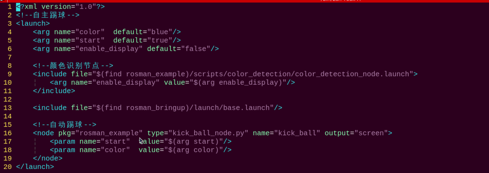

(3) Press the key **i** to enter edit mode, then change **"blue"** to **"green"**. To change to red, simply replace it with **"red"**.

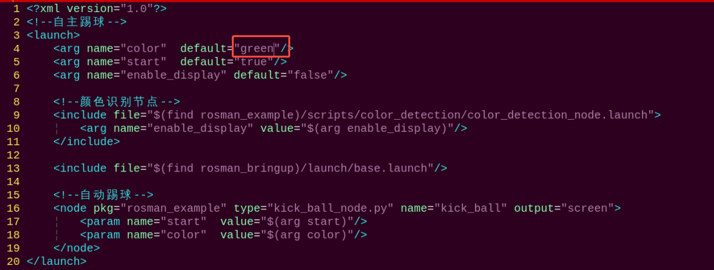

(4) Press **Esc** to exit insert mode, then type the following command to save and exit. First type a colon using English input, then type **wq**.

```
:wq
```

(5) You can refer to [9.1.2 Enabling and Disabling the Feature](#anchor_9_1_2) in this document to verify the changes.

* **Add New Detection Color**

In addition to the three built-in basic colors, you can also configure other recognizable colors. First, refer to the tutorial in [6. ROS+OpenCV Vision Recognition & Tracking -> 6.2 Color Threshold Adjustment](6.ROS+OpenCV_Vision_Recognition_Tracking.md#color-threshold-adjustment), and add your custom color. Then, as shown in [9.1.6 Feature Extensions -> Change the Default Detection Color](#anchor_9_1_6), modify the color parameter in the function `rospy.get_param('~color', 'blue')` to your newly defined color.

## 9.2 Autonomous Stair Climbing

This feature enables the robot to autonomously climb up and down stairs by recognizing red lines on the steps using its onboard camera.

### 9.2.1 Introduction

First, the program subscribes to the color recognition node to detect the stair area in the image and obtain the position and angle of the red line on the step.

Next, based on whether the robot is going upstairs or downstairs, different stop conditions are set. Using the robot's visual coordinate system and kinematic model, it navigates to the target position for stair climbing.

Finally, when the stop condition is met, the robot executes a complete climbing-up or climbing-down action, enabling fully autonomous stair navigation.

This process highlights the deep integration of machine vision and motion control. Through feedback mechanisms, the system achieves closed-loop control for decision-making and navigation. At its core, the activity relies on visual recognition results to plan an optimal motion trajectory and implement well-defined stopping strategies, ensuring the robot completes stair-climbing tasks with precision and stability.

### 9.2.2 Enabling and Disabling the Feature

:::{Note}
* Command input is case-sensitive and space-sensitive.
* The default program is for ascending the step. To switch to descending, please refer to the instructions in [9.2.6 Feature Extensions -\> Switch to Step Descent](#anchor_9_2_6) of this document.
* The default detection color is red. To change the target color, please follow the instructions in [9.2.6 Feature Extensions -\> Change Step Detection Color](#anchor_9_2_6_2) of this document.
* Since this feature conflicts with system services, please make sure to disable the system services before starting the feature. If you need to restart the system services after ending the feature, follow the steps provided in the experiment instructions.
* Place the robot on a flat and smooth surface to avoid falling during movement.
* The step height should be 2 cm, and red tape must be applied to both the front and back edges of the step.
:::

(1) To start the ROSMan robot, refer to [3. ROS Robot Motion Basic Control Course -> 3.1 Set Development Environment -> 3.1.1 Remote Desktop Tool Installation and Connection](3.ROS_Robot_Motion_Basic_Control_Course.md#remote-desktop-tool-installation-and-connection), and connect the robot to the VNC remote control software.

(2) Open the command-line terminal, enter the command and press Enter to disable ros service.

```
~/.stop_ros.sh
```

(3) Then enter the command in this directory to start the feature.

:::{Note}
Please adjust the red line color threshold before starting this feature.
:::

```
roslaunch rosman_example climb_stairs_node.launch
```

(4) To exit the feature, press **Ctrl+C** in the terminal. If the feature does not exit immediately, press **Ctrl+C** multiple times.

(5) When disabled the feature, open a terminal on the robot and enter the command to start the auto-start service. Then restart the mobile app and wait for the service to fully initialize.

```
sudo systemctl restart start_node.service
```

### 9.2.3 Access Live Camera Feed (Optional)

:::{Note}
* Command input is case-sensitive and space-sensitive.
* Before starting the camera feed, make sure the Autonomous Stair Climbing feature is functioning properly, otherwise, the camera feed may fail to launch.
:::

After the feature is activated, you can view the camera feed in a browser by enabling the **"web_video_server"** service.

(1) After the program starts successfully, open the system browser and enter `192.168.149.1:8080` in the address bar. Press **Enter** to access the **web_video_server** backend.


(2) Then, click the `/color_detection/image_result` button to open the camera feed interface for the intelligent detection feature, as shown in the figure below.


### 9.2.4 Project Outcome

:::{Note}
* Place the robot on a flat and smooth surface to avoid falling during movement.
* The step height should be 2 cm, and red tape must be applied to both the front and back edges of the step.
:::

Using the default **"climb stairs"** mode as an example, place the step within the camera's field of view. The robot will adjust its position based on the detected red line and slowly approach the step. Once the robot is at a certain distance from the step, it will execute an action sequence to lift its foot and step up.

### 9.2.5 Program Brief Analysis

The source code for this program is located at: [/home/ubuntu/ros_ws/src/rosman_example/scripts/climb_stairs/climb_stairs_node.py](../_static/source_code/climb_stairs.zip)

Based on the effects of the feature, the process logic has been outlined as shown in the diagram below:

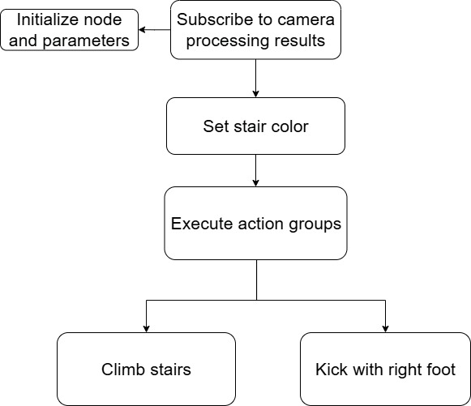

* **Import Libraries and ROS Modules**

The required Python libraries and ROS-related modules are imported. `rospy` and `signal` are used for ROS node initialization and shutdown handling. The `common` module serves as a base class and encapsulates some common utility methods. The `color_common` module provides functions for color detection. The `approach_object` module defines the `ApproachObject` class, as well as the `SetString`, `ObjectsInfo`, and `ColorDetect` ROS service and message types.

{lineno-start=6}

```python
import time
import rospy
import signal
from rosman_sdk import common
from rosman_example.color_common import Common
from rosman_example.approach_object import ApproachObject
from rosman_interfaces.srv import SetString
from rosman_interfaces.msg import ObjectsInfo, ColorDetect
```

* **Define Callback Functions and Service Handlers**

(1) `set_color_srv_callback`: Sets the target color to be detected.

(2) `get_color_callback`: Receives stair detection results.

{lineno-start=106}

```python
    def set_color_srv_callback(self, msg):
        # 设置颜色(set color)
        stairs_param = self.set_stairs_color(msg.data)
        self.detect_pub.publish([stairs_param])
        common.loginfo('%s set_color' % self.name)
        
        return [True, 'set_color']

    def get_color_callback(self, msg):
        # 获取颜色识别结果(obtain color recognition result)
        self.objects_info = msg.data
```

(3) The stair climbing and descending processing functions are also defined:

① `climb_stairs_process`: Handles the logic for climbing up the step.

② `descend_stairs_process`: Handles the logic for stepping down.

{lineno-start=118}

```python
    def climb_stairs_process(self, stairs_data):
        # 上阶梯处理(up steps processing)
        if self.approach_object.process(max(stairs_data.y, stairs_data.left_point[1], stairs_data.right_point[1]), stairs_data.x, stairs_data.angle, 
                                        self.climb_stairs_x_stop*stairs_data.height, self.climb_stairs_y_stop*stairs_data.width, self.climb_stairs_yaw_stop, stairs_data.width, stairs_data.height):
            self.gait_manager.disable()  # 关闭步态控制(close gait control)
            common.loginfo('climb_stairs')
            self.motion_manager.run_action(self.climb_stairs_action_name)  # 执行上台阶动作(execute up-steps action)
            return True
        else:
            return False
```

(4) The `ClimbStairsNode` node is launched, and the `run()` method serves as the main loop, which checks the current state and calls the appropriate stair climbing or descending function accordingly.

{lineno-start=140}

```python
    def run(self):
        while self.running:
            if self.start:
                # 设置颜色识别参数(set color recognition parameter)
                if self.state[self.current_state][2] == False:
                    self.state[self.current_state][2] = True
                    self.init_action(self.state[self.current_state][0][0], self.state[self.current_state][0][1])  # 头部姿态(head posture)
                    param = self.state[self.current_state][1][3](self.state[self.current_state][1][0],
                                                                 self.state[self.current_state][1][1],
                                                                 self.state[self.current_state][1][2])
                    self.detect_pub.publish([param])  # 颜色检测设置(color detection settings)

                # 获取识别结果(obtain recognition result)
                stairs_data = None
                for object_info in self.objects_info:
                    if object_info.type == 'side':
                        stairs_data = object_info
                # 处理对应的上下阶梯逻辑(process corresponding up and down steps logic)
                if stairs_data is not None and self.current_state == 'climb_stairs':
                    if self.climb_stairs_process(stairs_data):
                        self.running = False
                    else:
                        time.sleep(0.8)

                if stairs_data is not None and self.current_state == 'descend_stairs':
                    if self.descend_stairs_process(stairs_data):
                        self.running = False
                    else:
                        time.sleep(0.8)
            else:
                time.sleep(0.01)
        # 退出处理(exit processing)
        self.init_action(self.head_pan_init, self.head_tilt_init)
        self.stop_srv_callback(None)
        rospy.signal_shutdown('shutdown')
```

<p id="anchor_9_2_6"></p>

### 9.2.6 Feature Extensions

* **Switch to Step Descent**

By default, the program is set to the stair climbing mode. In the code, the two available states are defined on line **53**: **"climb_stairs"** for going up and **"descend_stairs"** for going down. To switch between the two modes, simply change the robot's state setting in the code.

(1) Enter the following command to navigate to the program directory:

```
roscd rosman_example/scripts/climb_stairs/
```

(2) Use the `vim` editor to open the launch file:

```
vim climb_stairs_node.py
```

(3) Type **53** and press **Shift + G** to quickly jump to line 53, which is near the section you need to modify.

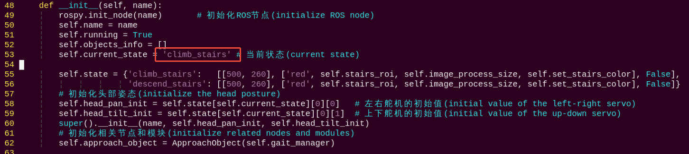

(4) Next, press the key **i** to enter edit mode. Find the line `self.current_state = 'climb_stairs'` to change **'climb_stairs'** to **'descend_stairs'** to switch the mode. **'climb_stairs'** indicates stair climbing mode, while **'descend_stairs'** indicates stair descending mode.

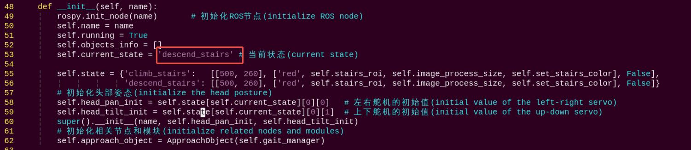

(5) Press **Esc** to exit insert mode, then type the following command to save and exit: First type a colon using English input, then type **wq**.

```
:wq
```

<p id="anchor_9_2_6_2"></p>

* **Change Step Detection Color**

By default, the program uses red (**"red"**) as the target color for both stair climbing and descending detection.

The keys **"climb_stairs"** and **"descend_stairs"** represent climbing up and down the stairs, respectively. To change the detection color for either action, simply modify the color parameter associated with the corresponding key in the program. Here's an example of changing the stair climbing color to yellow:

(1) Enter the following command to navigate to the program directory:

```
roscd rosman_example/scripts/climb_stairs/
```

(2) Use the `vim` editor to open the launch file:

```
vim climb_stairs_node.py
```

(3) Type **55** and press **Shift + G** to quickly jump to line 55, which is near the section you need to modify.

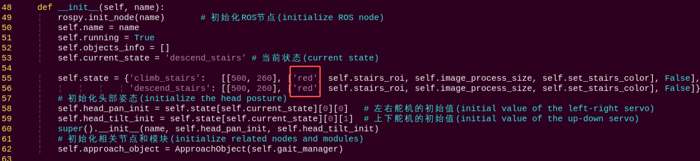

(4) Press the key **i** to enter insert mode. Locate the keys **"climb_stairs"** and **"descend_stairs"** in the dictionary along with their respective color values. **"climb_stairs"** represents the color for stair climbing, while **"descend_stairs"** represents the color for stair descending. Change the color value for **"climb_stairs"** from **"red"** to **"yellow"**. To switch to green, change the value to **"green"**.

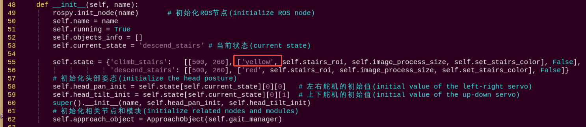

(5) Press **Esc** to exit insert mode, then type the following command to save and exit: First type a colon using English input, then type **wq**.

```
:wq
```

* **Add New Detection Color**

In addition to the three built-in basic colors, you can also configure other recognizable colors. First, refer to the tutorial in [6.ROS+OpenCV Vision Recognition & Tracking -\> 6. 2 Color Threshold Adjustment](6.ROS+OpenCV_Vision_Recognition_Tracking.md#color-threshold-adjustment), and add your custom color. Then, as shown in [9.2.6 Feature Extensions -\> Change Step Detection Color](#anchor_9_2_6_2), replace the color value in the dictionary with the name of your custom color.

## 9.3 Autonomous Hurdling

This feature enables the robot to gradually approach a railing detected by the camera and perform a crossing action once it reaches a certain distance.

### 9.3.1 Introduction

First, the code defines the states for the hurdling task, including color detection parameter settings and initial head posture. Then, within the loop, the head posture and color detection parameters are updated according to the hurdling state to obtain the color detection results for the hurdle.

After receiving the color detection results, the robot uses an approach algorithm based on the detected hurdle position to move closer to the hurdle.

When close enough, the robot stops motion control and plays the predefined hurdling action to complete the hurdle crossing. If unsuccessful, it continues to attempt detection and approach until success or exit.

### 9.3.2 Enabling and Disabling the Feature

:::{Note}
* Command input is case-sensitive and space-sensitive.
* Since this feature conflicts with system services, please make sure to disable the system services before starting the feature. If you need to restart the system services after ending the feature, strictly follow the steps provided in the experiment instructions.
* Place the robot on a flat and smooth surface to avoid falling during movement.
* Please ensure the hurdle height is kept at 5 cm and the width within 2 cm. By default, the program detects blue-colored hurdles. If you wish to switch to white or red, please refer to [9.3.6 Feature Extensions -> Change the Default Detection Color](#anchor_9_3_6) in this document.
:::

(1) To start the ROSMan robot, refer to [3. ROS Robot Motion  Basic Control Course -\> 3.1.1 Remote Desktop Tool Installation and Connection](3.ROS_Robot_Motion_Basic_Control_Course.md#remote-desktop-tool-installation-and-connection), and connect the robot to the VNC remote control software.

(2) Open the command-line terminal, enter the command and press Enter to disable ros service.

```
~/.stop_ros.sh
```

(3) Then enter the command in this directory to start the feature.

```
roslaunch rosman_example hurdles_node.launch
```

(4) To exit the feature, press **Ctrl+C** in the terminal. If the feature does not exit immediately, press **Ctrl+C** multiple times.

(5) When disabled the feature, open a terminal on the robot and enter the command to start the auto-start service. Then restart the mobile app and wait for the service to fully initialize.

```
sudo systemctl restart start_node.service
```

### 9.3.3 Access Live Camera Feed (Optional)

:::{Note}
* Command input is case-sensitive and space-sensitive.
* Before starting the camera feed, make sure the Autonomous Hurdling feature is functioning properly, otherwise, the camera feed may fail to launch.
:::

After the feature is activated, you can view the camera feed in a browser by enabling the **"web_video_server"** service.

(1) After the program starts successfully, open the system browser and enter `192.168.149.1:8080` in the address bar. Press **Enter** to access the **web_video_server** backend.


(2) Then, click the `/color_detection/image_result` button to open the camera feed interface for the intelligent detection feature, as shown in the figure below.

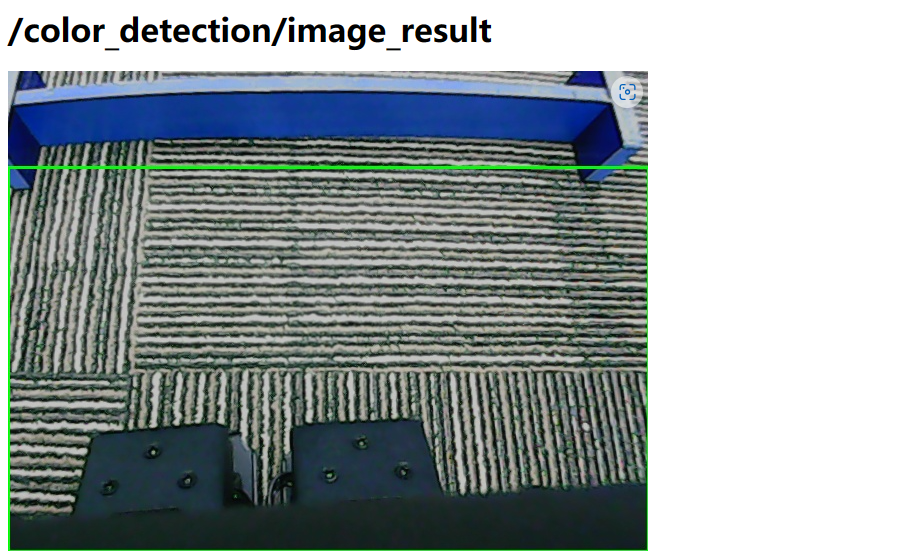

### 9.3.4 Project Outcome

Place the hurdle within the robot's camera detection range. Once the hurdle is detected, the robot will adjust its position to approach it. When it reaches an appropriate position, it will automatically perform the hurdling action.

### 9.3.5 Program Brief Analysis

The source code of the program is located at: [/home/ubuntu/ros_ws/src/rosman_example/scripts/hurdles/hurdles_node.py](../_static/source_code/hurdles.zip)

Based on the effects of the feature, the process logic has been outlined as shown in the diagram below:

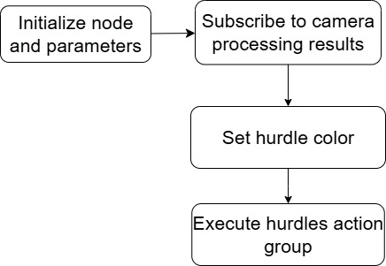

* **Import Required Libraries**

Import the necessary Python libraries and ROS modules, and define the `HurdlesNode` class as a subclass of `Common`. In the constructor `__init__`, variables are initialized and the node is started, including:

(1) Defining constants such as color parameters, ROI areas, and image processing dimensions.

(2) Initializing the ROS node, services, publishers, and subscribers.

(3) Initializing the gait manager (`gait_manager`) and motion manager (`motion_manager`).

(4) Defining the initial head positions: `head_pan_init` and `head_tilt_init`.

(5) Starting the gait manager, motion playback, and other related components.

{lineno-start=1}

```python
#!/usr/bin/env python3
# encoding: utf-8
# @data:2023/07/04
# @author:aiden
# 跨栏(hurdling)
import time
import rospy
import signal
from rosman_sdk import common
from rosman_example.color_common import Common
from rosman_example.approach_object import ApproachObject
from rosman_interfaces.srv import SetString
from rosman_interfaces.msg import ObjectsInfo, ColorDetect

class HurdlesNode(Common):
    #  定义跨栏颜色识别的ROI区域(define the ROI (Region of Interest) for color recognition in hurdles task)
    hurdles_roi = [1 / 5, 1, 0, 1]
    #  定义跨栏动作的名称(define the action name for hurdling)
    hurdles_action_name = 'hurdles'
    # 定义颜色识别的图像处理分辨率(define the image processing resolution for color recognition)
    image_process_size = [160, 120]
    # 定义跨栏时的机器人停止条件(define the stop condition for the robot during hurdling)
    hurdles_x_stop = 395/480
    hurdles_y_stop = 0.5
    hurdles_yaw_stop = 0

    def __init__(self, name):
        # 初始化节点(initialization of the node)
        rospy.init_node(name)
        self.name = name
        self.running = True
        self.objects_info = []
        self.current_state = 'hurdles'
        # 定义状态机,包括初始头部姿态,颜色识别参数,是否完成(define the state machine, including the initial head posture, color recognition parameters, and whether it is completed)
        self.state = {'hurdles': [[500, 260], ['blue', self.hurdles_roi, self.image_process_size, self.set_hurdles_color], False]}
        # 获取状态机中的初始头部姿态(get the initial head posture from the state machine)
        self.head_pan_init = self.state[self.current_state][0][0]   # 左右舵机的初始值(the initial value of the left-right servo)
        self.head_tilt_init = self.state[self.current_state][0][1]  # 上下舵机的初始值(the initial value of the up-down servo)
        # 初始化父类,设置初始头部姿态(initialize the parent class and set the initial head posture)
        super().__init__(name, self.head_pan_init, self.head_tilt_init)
        # 创建接近对象实例(create an instance for target approaching)
        self.approach_object = ApproachObject(self.gait_manager)
        # 更新ApproachObject对象的接近停止条件(update the approach stop conditions of the ApproachObject object)
        # x_approach_value: 接近目标中心x轴距离的阈值,单位厘米(the threshold of the x-axis distance to approach the target center in units of cm)
```

* **Parameter Initialization**

Within the `HurdlesNode` class, in addition to inheriting from the `Common` class, several initialization parameters are defined:

{lineno-start=15}

```python
class HurdlesNode(Common):
    #  定义跨栏颜色识别的ROI区域(define the ROI (Region of Interest) for color recognition in hurdles task)
    hurdles_roi = [1 / 5, 1, 0, 1]
    #  定义跨栏动作的名称(define the action name for hurdling)
    hurdles_action_name = 'hurdles'
    # 定义颜色识别的图像处理分辨率(define the image processing resolution for color recognition)
    image_process_size = [160, 120]
    # 定义跨栏时的机器人停止条件(define the stop condition for the robot during hurdling)
    hurdles_x_stop = 395/480
    hurdles_y_stop = 0.5
    hurdles_yaw_stop = 0
```

(1) Defines the ROI for hurdle color recognition, which assists in identifying the hurdle obstacle in subsequent detection steps.

```
hurdles_roi = [1 / 5, 1, 0, 1]
```

(2) Specifies the name of the motion group used for hurdling as `hurdles`.

```
hurdles_action_name = 'hurdles'
```

(3) Defines the image processing resolution for color recognition, setting the pixel range of the x and y axes to `[160×120]`.

```
image_process_size = [160, 120]
```

(4) Defines the thresholds for the robot to stop when approaching a hurdle:

```
hurdles_x_stop = 395/480
```

```
hurdles_y_stop = 0.5
```

```
hurdles_yaw_stop = 0
```

These values represent the normalized ratios along each axis, rather than actual pixel coordinates. After detecting the hurdle, these ratios are used to compute the robot's final stopping position.

{lineno-start=34}

```python
        # 定义状态机,包括初始头部姿态,颜色识别参数,是否完成(define the state machine, including the initial head posture, color recognition parameters, and whether it is completed)
        self.state = {'hurdles': [[500, 260], ['blue', self.hurdles_roi, self.image_process_size, self.set_hurdles_color], False]}
```

(5) In the initialization function `__init__(self, name)`, the current robot state is configured. As shown in the diagram referenced above, the state is defined using `self.state`, with the following parameters: **'hurdles'**: name of the state. `[500, 260]`: initial positions for the left and right servos. **'blue'**: target hurdle color. `self.hurdles_roi`: ROI used for detecting the hurdle. `self.image_process_size`: resolution used for color detection. The variable `self.hurdles_color` indicates the color set for the hurdle, while False represents the current hurdle status — i.e., whether the robot is actively in the hurdling state.

* **Define Callback Functions and Service Callback Functions**

(1) `get_color_callback`: Receives the result of color recognition.

(2) `set_color_srv_callback`: Service callback function to set the target color for recognition.

{lineno-start=79}

```python
    def set_color_srv_callback(self, msg):
        # 设置颜色服务回调函数(set color service callback function)
         # 生成颜色识别参数(generate color recognition parameter)
        hurdles_param = self.set_hurdles_color(msg.data)
        # 发布设置的颜色识别参数(publish the set color recognition parameters)
        self.detect_pub.publish([hurdles_param])
        common.loginfo('%s set_color' % self.name)

        return [True, 'set_color']

    def get_color_callback(self, msg):
        # 获取颜色识别结果(obtain color recognition result)
        self.objects_info = msg.data
```

(3) In the `get_color_callback` function, the parameter `hurdles_param` for color recognition is defined and published to the master node. The target color is then printed using the custom logging tool `common.loginfo`. The function returns whether the color has been successfully calibrated and the corresponding target color.

(4) The `set_color_srv_callback` function receives the result of color recognition and stores it in `self.objects_info`. For detailed data structure, refer to the data field in the corresponding message type `msg.data`.

(5) Define the hurdling processing function:

① `hurdles_process`: The main function for hurdling.

{lineno-start=96}

```python
        # 调用接近对象的过程函数,控制机器人移动(call the process function for approaching object to control the robot to move)
        if self.approach_object.process(max(hurdles_data.y, hurdles_data.left_point[1], hurdles_data.right_point[1]), hurdles_data.x, hurdles_data.angle, 
                                   self.hurdles_x_stop*hurdles_data.height, self.hurdles_y_stop*hurdles_data.width, self.hurdles_yaw_stop, hurdles_data.width, hurdles_data.height):
            self.gait_manager.disable()  # 如果接近成功,停止运动,播放动作(If approaching successfully, stop moving and play action)
            common.loginfo('hurdles')
            self.motion_manager.run_action(self.hurdles_action_name)
            return True
        return False
```

(6) Within this function, the custom library `self.approach_object` is called. It is defined as `ApproachObject` and is specifically used to execute the robot's motion group to reach the target point.

* **Hurdling Logic and Motion Execution**

The main function runs the `HurdlesNode` node and calls the `run()` method as the main loop to handle state evaluation and trigger the appropriate functions to complete the hurdling behavior.

(1) When the target hurdle color is recognized, the program calls `hurdles_process` to perform the hurdling action as described in the previous section.

(2) After the hurdling action is completed, the main loop exits.

{lineno-start=105}

```python
    def run(self):
        while self.running:
            if self.start:  # 如果打开start开关(if turn on start)
                if self.state[self.current_state][2] == False:  # 如果当前状态尚未完成(if the current state is not completed)
                    self.state[self.current_state][2] = True
                    self.init_action(self.state[self.current_state][0][0], self.state[self.current_state][0][1])  # 头部姿态(head posture)
                    # 生成颜色识别参数(generate color recognition parameter)
                    param = self.state[self.current_state][1][3](self.state[self.current_state][1][0],
                                                                 self.state[self.current_state][1][1],
                                                                 self.state[self.current_state][1][2])
                    self.detect_pub.publish([param])  # 发布颜色识别参数(publish color recognition parameter)

                # 获取识别结果(obtain recognition result)
                hurdles_data = None
                for object_info in self.objects_info:
                    if object_info.type == 'side':
                        hurdles_data = object_info
                # 如果有识别结果,并且是在跨栏状态(If there is recognition result, and it is in the state of hurdling)
                if hurdles_data is not None and self.current_state == 'hurdles':
                    if self.hurdles_process(hurdles_data):   # 调用跨栏处理函数(call hurdling processing function)
                        self.running = False
                    else:
                        time.sleep(0.8)
                time.sleep(0.01)
            else:
                time.sleep(0.01)
        # 退出前动作(action before exiting)
        self.init_action(self.head_pan_init, self.head_tilt_init)
        self.stop_srv_callback(None)
        rospy.signal_shutdown('shutdown')
```

(3) Within the hurdling motion group, the program continuously monitors the variables stored in `self.state`, such as the current state parameter `current_state`, to determine whether the current motion group has completed. It also retrieves and processes the color recognition parameters and determines the robot's next state. The robot's posture is initialized using `self.init_action`, with `self.current_state[0][0]` passed as the argument. For example, the hurdling state uses **'hurdles'**: `[[500, 260]]` as the corresponding initialization parameter.

(4) The `self.objects_info` variable holds the type of object currently detected. For example, if the current state is `side`, it means a sideline has been detected, which will trigger the execution of the hurdling motion group.

<p id="anchor_9_3_6"></p>

### 9.3.6 Feature Extensions

* **Change the Default Detection Color**

The program comes with several built-in color recognition options: black, red, white, yellow, and blue. By default, the recognition color is set to blue. **To change the hurdle recognition color to yellow, follow these steps:**

(1) Enter the following command to navigate to the program directory:

```
roscd rosman_example/scripts/hurdles/
```

(2) Use the `vim` editor to open the launch file:

```
vim hurdles_node.py
```

(3) Type **35** and press **Shift + G** to quickly jump to line 35, which is near the section you need to modify.

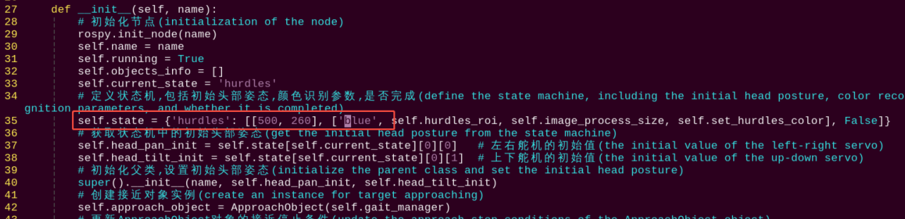

(4) Press the key **i** to enter insert mode. You will see a dictionary entry with a key named **"hurdles"**, which specifies the color for hurdle recognition. Locate the color value assigned to **"hurdles"** (e.g., **"blue"**) and change it to **"yellow"**.

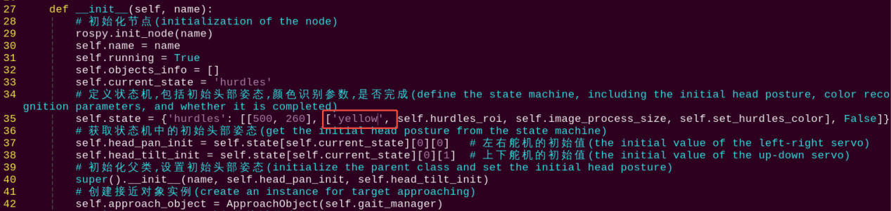

(5) Press **Esc** to exit insert mode, then type the following command to save and exit: First type a colon using English input, then type **wq**.

```
:wq
```

* **Add New Detection Color**

In addition to the three built-in basic colors, you can also configure other recognizable colors. First, refer to the tutorial in [6. ROS+OpenCV Vision Recognition & Tracking -\> 6.2 Color Threshold Adjustment](6.ROS+OpenCV_Vision_Recognition_Tracking.md#color-threshold-adjustment), and add your custom color. Then, as shown in [9.3.6 Feature Extensions -> Change the Default Detection Color](#anchor_9_3_6), modify the color parameter in the `hurdles` key to the value of the custom color.

## 9.4 Autonomous Low Attitude Passage

This feature enables the robot to identify a target doorway during line following using the camera. When the robot gets close enough, it will lower its body and crawl through the doorway.

### 9.4.1 Introduction

The program uses two states: `visual_patrol` and `crawl_under`, representing line following and low attitude passage respectively. The robot switches between these states to perform different functions.

By subscribing to the `/object/pixel_coords` topic, it obtains color recognition results and filters the information, allowing the robot to recognize and follow black lines. During line following, the robot periodically raises its head to check the distance to the target doorway. Once the preset distance is reached, it switches to the `crawl_under` state.

Upon entering the `crawl_under` state, the robot lowers its posture through a control module and starts a timer to ensure it passes through the doorway within the set time. After the time expires, the robot returns to its normal height.

### 9.4.2 Enabling and Disabling the Feature

:::{Note}
* Command input is case-sensitive and space-sensitive.
* Since this feature conflicts with system services, please make sure to disable the system services before starting the feature. If you need to restart the system services after ending the feature, strictly follow the steps provided in the experiment instructions.
* The program defaults to recognizing black lines and green door frames. If you need to detect white or red, please refer to [9.4.6 Feature Extensions -> Change the Default Detection Color](#anchor_9_4_6) in this document to switch the detection color.
:::

(1) To start the ROSMan robot, refer to [3. ROS Robot Motion  Basic Control Course -> 3.1 Set Development Environment -> 3.1.1 Remote Desktop Tool Installation and Connection](3.ROS_Robot_Motion_Basic_Control_Course.md#remote-desktop-tool-installation-and-connection), and connect the robot to the VNC remote control software.

(2) Open the command-line terminal, enter the command and press Enter to disable ros service.

```
~/.stop_ros.sh
```

(3) Then enter the command in this directory to start the feature.

```
roslaunch rosman_example crawl_under_node.launch
```

(4) To exit the feature, press **Ctrl+C** in the terminal. If the feature does not exit immediately, press **Ctrl+C** multiple times.

(5) When disabled the feature, open a terminal on the robot and enter the command to start the auto-start service. Then restart the mobile app and wait for the service to fully initialize.

```
sudo systemctl restart start_node.service
```

### 9.4.3 Access Live Camera Feed (Optional)

:::{Note}
* Command input is case-sensitive and space-sensitive.
* Before starting the camera feed, make sure the Autonomous Low Attitude Passage feature is functioning properly, otherwise, the camera feed may fail to launch.
:::

After the feature is activated, you can view the camera feed in a browser by enabling the **"web_video_server"** service.

(1) After the program starts successfully, open the system browser and enter `192.168.149.1:8080` in the address bar. Press **Enter** to access the **web_video_server** backend.

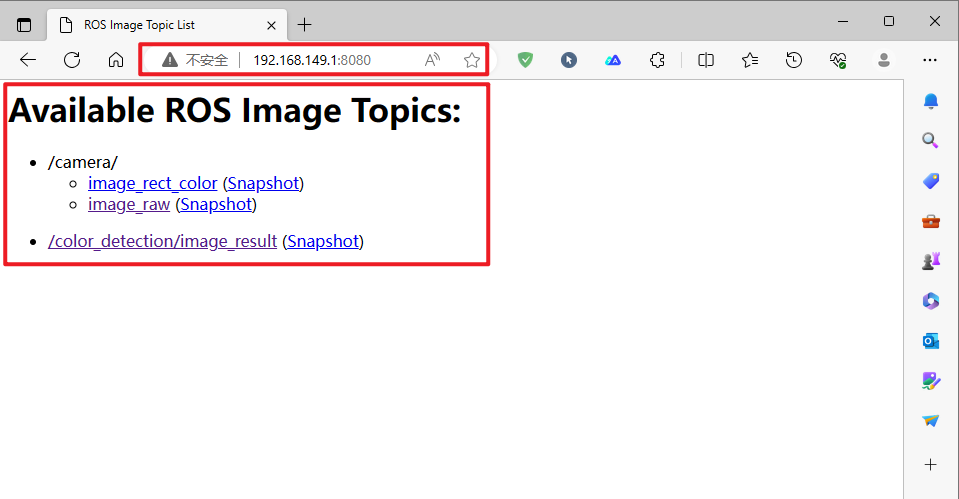

(2) Then, click the `/color_detection/image_result` button to open the camera feed interface for the Intelligent Line Following feature, as shown in the figure below.

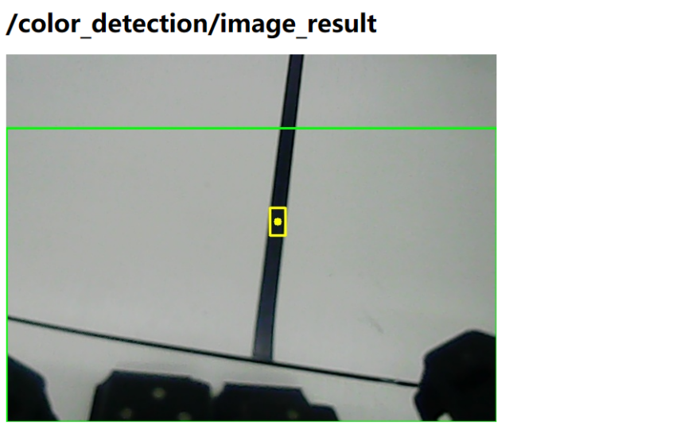

### 9.4.4 Project Outcome

You can use electrical tape to lay out black lines on the ground. Once the robot is placed on the black line, it will move forward following the direction of the black line.

When the green door frame is detected, the robot lowers its body and continues line following. After passing through the frame, it returns to a standing posture and resumes line following.

### 9.4.5 Program Brief Analysis

The source code of the program is located at: [/home/ubuntu/ros_ws/src/rosman_example/scripts/crawl_under/crawl_under_with_visual_patrol_node.py](../_static/source_code/crawl_under.zip)

Based on the effects of the feature, the process logic has been outlined as shown in the diagram below:

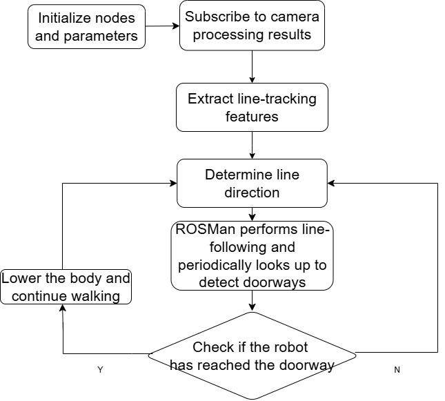

* **Program Initialization**

{lineno-start=6}

```python
import time
import rospy
import signal
from rosman_sdk import misc, common
from rosman_example.color_common import Common
from rosman_example.visual_patrol import VisualPatrol
from rosman_interfaces.msg import ObjectsInfo, ColorDetect, ROI

class CrawlUnderVisualPatrol(Common):
    # 按顺序检测三个roi，如果检测到黑线立刻跳出(check three ROIs in order, and immediately exit if a black line is detected)
    # y_min, y_max, x_min, x_max分别表示占图像的比例, 即实际大小为y_min*height(y_min, y_max, x_min, and x_max represent respectively the proportion of the image occupied. The actual size is y_min*height)
    line_roi = [(5 / 12, 6 / 12, 1 / 4, 3 / 4),
                (6 / 12, 7 / 12, 1 / 4, 3 / 4),
                (7 / 12, 8 / 12, 1 / 4, 3 / 4)
                ]

    # y_min, y_max, x_min, x_max分别表示占图像的比例(y_min, y_max, x_min, and x_max represent respectively the proportions of the image)
    door_roi = [1 / 5, 1, 0, 1]

    # 这里通过一个比例来设置阈值,表示当门的位置低于图像高度的240/480 = 0.5,(set a threshold through a proportion, which indicating when the door position is below 240/480 = 0.5 (that is 50%) of the image height)
    # 即50%时,就认为门足够低,可以进入低空状态了。(The door is considered low enough, and the robot can enter the low-altitude state)
    enter_crawl_under_y = 240 / 480

    # 图像处理时缩放到这个分辨率(When process the image, scale it to this resolution)
    image_process_size = [160, 120]
```

(1) First, Python libraries and ROS-related modules need to be imported. The `CrawlUnderVisualPatrol` class is then defined, inheriting from the `Common` class. Within the constructor `__init__`, variable initialization and node startup are performed. The main steps include:

① Importing library files, such as the `rospy` library for creating ROS nodes and handling ROS messages, the `signal` library for handling Unix signals, the `rosman_interfaces.msg` library which includes color detection processing and ROI region definition, and the `rosman_example.visual_patrol` library for line following.

② Defining constants, including names of picking action groups to be executed, image processing dimensions, and the target colors for detection under different states.

③ Initializing the ROS node, as well as setting initial values for state and flag variables.

④ Initializing the gait manager (`gait_manager`) and motion manager (`motion_manager`), as well as the visual line-following node (`visual_patrol`).

⑤ Subscribing to the `/object/pixel_coords` topic to receive color detection results.

(2) Use `get_color_callback` to obtain the color recognition results, which include both the black line for line following and the green color for detecting the door frame.

* **Main Function**

{lineno-start=188}

```python
    def run(self):
        while self.running:
            if self.state:
                # 获取识别结果(obtain recognition result)
                line_data = None
                door_data = None
                for object_info in self.objects_info:
                    if object_info.type == 'line':
                        if self.head_state == 'drop':
                            line_data = object_info
                    if object_info.type == 'side':
                        if self.head_state == 'raise':
                            door_data = object_info
                
                # 不同阶段处理(different phrase processing)
                if self.current_state == 'visual_patrol':
                    if line_data is not None:
                        self.visual_patrol.process(line_data.x, line_data.width)
                elif self.current_state == 'crawl_under':
                    if self.exit_crawl_under(line_data):
                        self.current_state = 'visual_patrol'
                        self.next_state = 'crawl_under'
                        self.state[self.current_state][2] = False
                 # 根据下一个状态进行处理(process based on the next state)
                if self.next_state == 'crawl_under':
                    if self.enter_crawl_under(door_data):
                        self.current_state = 'crawl_under'
                        self.next_state = 'visual_patrol'
                        self.state[self.current_state][2] = False
                # 状态初始化(initialize state)
                self.state_init(self.current_state, self.next_state)

                time.sleep(0.01)
            else:
                time.sleep(0.01)
        
        self.init_action(self.head_pan_init, self.head_tilt_init)
        self.stop_srv_callback(None)        # 停止运行(stop running)
        rospy.signal_shutdown('shutdown')
```

(1) The program first determines whether the door frame or the black line is detected based on the results obtained from `get_color_callback`. Depending on the detection result, the robot will perform the corresponding action—either **"drop"** to lower its head or **"raise"** to lift its head.

(2) If the current state is `visual_patrol`, meaning the robot is in the line-following mode, it will call the `self.visual_patrol.process` method to execute line following.

(3) When the robot approaches the doorway and the conditions are met, it switches to the `crawl_under` state, which initiates the low-attitude passage. In this state, the robot will lower its body height and move forward for a set period of time. After passing through the doorway, it stands back up and returns to the line-following state.

* **Doorway Detection and Low-Attitude Passage**

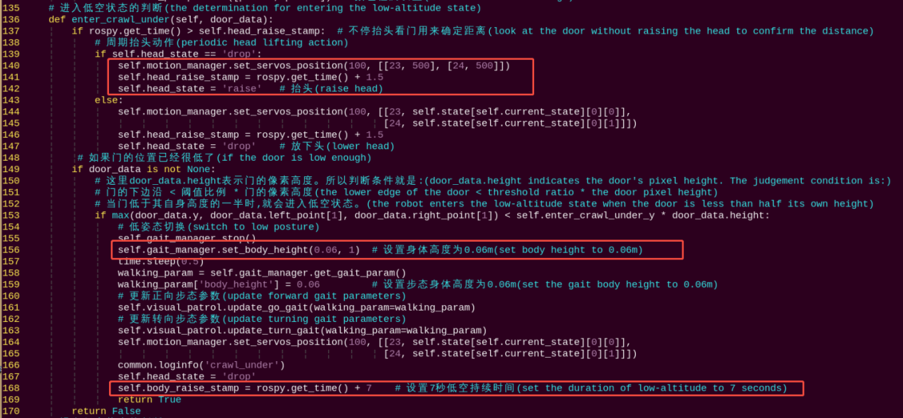

(1) While following the line, the robot repeatedly performs head-lowering and head-raising actions. Specifically, the head-raising action is triggered by calling the `self.motion_manager.set_servos_position` function, which controls servos 23 and 24 to rotate to position 500. Each action lasts 1.5 seconds and helps determine the distance to the doorway.

(2) When the bottom edge of the doorway is detected to be below a predefined threshold, the robot decides to enter the low-attitude passage mode. It lowers its body height to 0.6 meters and continues moving forward using a predefined gait for the next 7 seconds.

* **Exit the State**

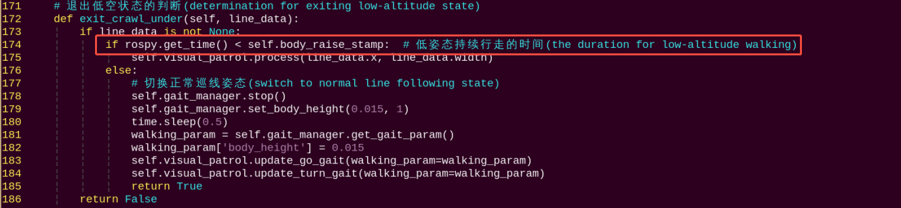

(1) After 7 seconds of low-attitude passage, the program re-invokes the `self.visual_patrol.process` method, returning the robot to its normal line-following mode by reinitializing the state.

<p id="anchor_9_4_6"></p>

### 9.4.6 Feature Extensions

* **Change the Default Detection Color**

The program supports four built-in colors: black, green, red, and white. By default, black is used for line following and green is used for detecting doorways. **To change the line-following color to red, follow these steps:**

(1) Enter the following command to navigate to the program directory:

```
roscd rosman_example/scripts/crawl_under/
```

(2) Use the `vim` editor to open the feature's program:

```
vim crawl_under_with_visual_patrol_node.py
```

(3) Type **44** and press **Shift + G** to quickly jump to line 44, which is near the section you need to modify. You'll see that the program uses a dictionary to configure parameters for different states.

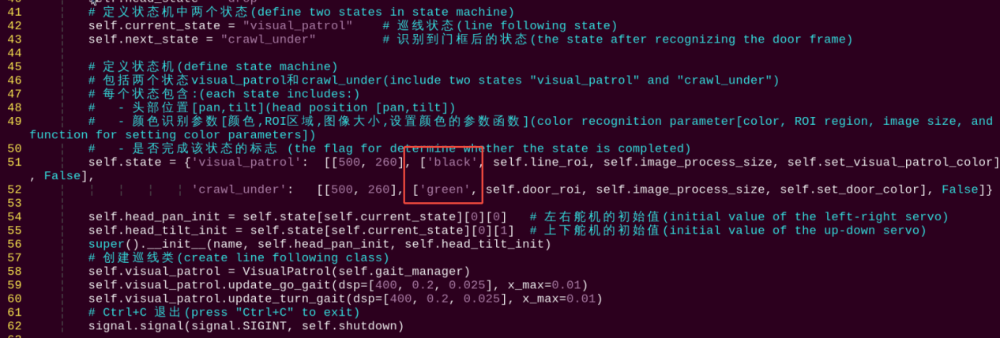

(4) In the dictionary, the key `visual_patrol` represents the color used for line following. The key `crawl_under` represents the color used for doorway detection. Press the key **i** to enter insert mode, and change the color value of `visual_patrol` from **"black"** to **"red"**. To change it to white, replace it with **"white"**.

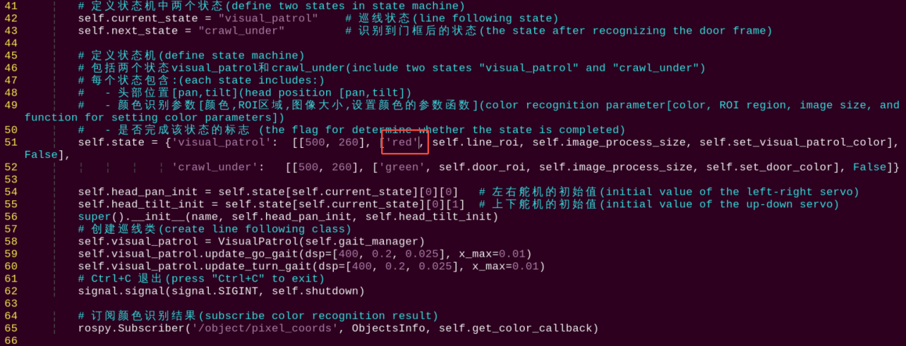

(5) Press **Esc** to exit insert mode, then type the following command to save and exit: First type a colon using English input, then type **wq**.

```
:wq
```

* **Add New Detection Color**

In addition to the three built-in basic colors for line-following, you can also configure other recognizable colors. First, refer to the tutorial in [6. ROS+OpenCV Vision Recognition & Tracking -> 6.2 Color Threshold Adjustment](6.ROS+OpenCV_Vision_Recognition_Tracking.md#color-threshold-adjustment), and add your custom color. Then, as shown in [9.4.6 Feature Extensions -> Change the Default Detection Color](#anchor_9_4_6), replace the color value of **"visual_patrol"** and **"crawl_under"** keys in the dictionary with the name of your custom color.

## 9.5 Comprehensive Practical

This task begins in the line-following mode. The robot adjusts its walking path by recognizing the preset black line and its region. When the robot approaches the marker for the staircase, it performs a preparatory action to begin climbing.

The robot then adjusts its position and posture to climb the stairs. After successfully climbing, it re-enters line-following mode. Upon detecting the marker for descending stairs, it begins preparation. It adjusts its position and orientation to walk down the stairs. After descending, the robot resumes line-following mode. When the robot encounters a hurdle, it must adjust its gait using inverse kinematics to step over the obstacle. Crossing the hurdle may require multiple attempts or positional adjustments. After each successful crossing, the robot returns to line-following mode.

### 9.5.1 Project Process

The robot first enters the line-following mode. During the line-following process, the program continuously checks for task indicator markers, such as color cues for stair climbing, stair descending, or hurdle crossing. Once a relevant marker is detected, the program updates the `current_state` based on the identified task type and prepares to transition into the corresponding task execution state.

### 9.5.2 Enabling and Disabling the Feature

:::{Note}
* Command input is case-sensitive and space-sensitive.
* Since this feature conflicts with system services, please make sure to disable the system services before starting the feature. If you need to restart the system services after ending the feature, strictly follow the steps provided in the experiment instructions.
* Place the robot on a flat and smooth surface to avoid falling during movement.
* Please ensure the hurdle height is kept at 5 cm and the width within 2 cm. By default, the program detects blue-colored hurdles. If you wish to switch to white or red, please refer to [9.5.6 Feature Extensions -> Change the Default Step Detection Color](#anchor_9_5_6) in this document.
:::

(1) To start the ROSMan robot, refer to [3. ROS Robot Motion Basic Control Course -\> 3.1.1 Remote Desktop Tool Installation and Connection](3.ROS_Robot_Motion_Basic_Control_Course.md#remote-desktop-tool-installation-and-connection), and connect the robot to the VNC remote control software.

(2) Open the command-line terminal, enter the command and press Enter to disable ros service.

```
~/.stop_ros.sh
```

(3) Then enter the command in this directory to start the feature.

```
roslaunch rosman_example
```

(4) To exit the feature, press **Ctrl+C** in the terminal. If the feature does not exit immediately, press **Ctrl+C** multiple times.

(5) When disabled the feature, open a terminal on the robot and enter the command to start the auto-start service. Then restart the mobile app and wait for the service to fully initialize.

```
sudo systemctl start start_node.service
```

### 9.5.3 Access Live Camera Feed (Optional)

:::{Note}
* Command input is case-sensitive and space-sensitive.
* Before starting the camera feed, make sure the Autonomous Hurdling feature is functioning properly, otherwise, the camera feed may fail to launch.
:::

After the feature is activated, you can view the camera feed in a browser by enabling the **"web_video_server"** service.

(1) After the program starts successfully, open the system browser and enter `192.168.149.1:8080` in the address bar. Press **Enter** to access the **web_video_server** backend.

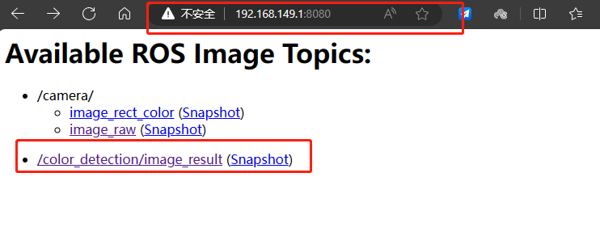

(2) Then, click the `/color_detection/image_result` button to open the camera feed interface for the intelligent detection feature, as shown in the figure below.

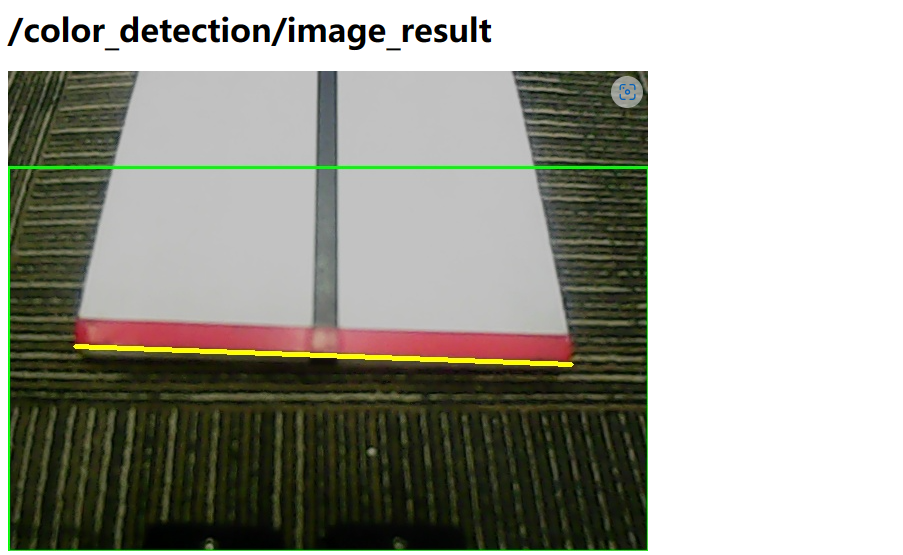

### 9.5.4 Project Outcome

The robot is able to accurately follow the predefined black line path and automatically switch to stair-climbing, stair-descending, or hurdle-crossing tasks upon recognizing specific color markers. When encountering stairs or obstacles, the robot performs stable ascending, descending, or crossing movements and safely returns to the line-following state.

### 9.5.5 Program Brief Analysis

The source code of the program is located at: [/home/ubuntu/ros_ws/src/rosman_example/scripts/combination/combination_node.py](../_static/source_code/combination.zip)

Based on the effects of the feature, the process logic has been outlined as shown in the diagram below:

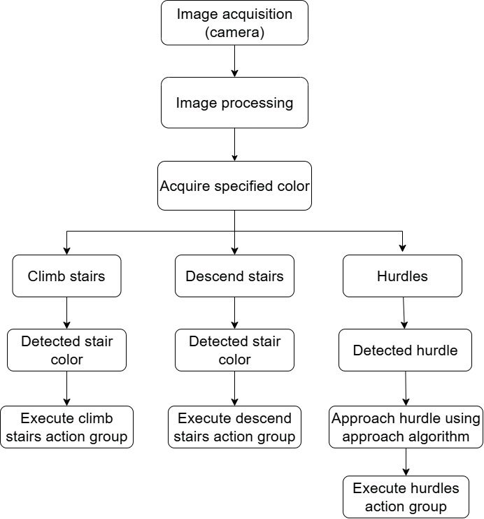

* **Import Required Libraries**

Import the necessary Python libraries and ROS modules, and define the `HurdlesNode` class as a subclass of `Common`. In the constructor `__init__`, variables are initialized and the node is started, including:

(1) Defining constants such as color parameters, ROI areas, and image processing dimensions.

(2) Initializing the ROS node, services, publishers, and subscribers.

(3) Initializing the gait manager (`gait_manager`) and motion manager (`motion_manager`).

(4) Defining the initial head positions: `head_pan_init` and `head_tilt_init`.

(5) Starting the gait manager, motion playback, and other related components.

{lineno-start=6}

```python
import time
import rospy
import signal
from rosman_sdk import misc, common
from rosman_example.color_common import Common
from rosman_example.visual_patrol import VisualPatrol
from rosman_example.approach_object import ApproachObject
from rosman_interfaces.srv import SetString
from rosman_interfaces.msg import ObjectsInfo, ColorDetect, ROI

class CombinationNode(Common):
    # 按顺序检测三个roi，如果检测到黑线立刻跳出(check three ROIs in order, and immediately exit if a black line is detected)
    # y_min, y_max, x_min, x_max分别表示占图像的比例, 即实际大小为y_min*height(y_min, y_max, x_min, and x_max represent respectively the proportion of the image occupied. The actual size is y_min*height)
    line_roi = [(5 / 12, 6 / 12, 1 / 4, 3 / 4),
                (6 / 12, 7 / 12, 1 / 4, 3 / 4),
                (7 / 12, 8 / 12, 1 / 4, 3 / 4)
                ]

    stairs_roi = [1 / 5, 1, 0, 1]
    hurdles_roi = [1 / 5, 1, 0, 1]

    # 所需动作的名称(the name of required action)
    hurdles_action_name = 'hurdles'
    climb_stairs_action_name = 'climb_stairs'
    descend_stairs_action_name = 'descend_stairs'

    # 图像处理时缩放到这个分辨率， 不建议修改(When process the image, scale it to this resolution. Do not suggest to modify)
    image_process_size = [160, 120]
```

* **Parameter Initialization**

The following initialization parameters are defined:

{lineno-start=35}

```python
    enter_climb_stairs_y = 280 / 480  # 当检测到的标识像素坐标y值占图像的比例大于此值时进入此阶段(When the detected object's y-coordinate in the image is greater than this value, it enters this phrase)
    climb_stairs_x_stop = 0.5  # 当检测到的标识像素坐标x值占图像的比例在此值附近(范围可在ApproachObject里设置)时停止前后移动(When the detected object's x-coordinate in the image is within a certain range (specified in the ApproachObject function) based on the proportion of the image, the robot will stop moving forward or backward)
    climb_stairs_y_stop = 375 / 480  # 当检测到的标识像素坐标y值占图像的比例在此值附近(范围可在ApproachObject里设置)时停止横向移动(When the detected object's y-coordinate in the image is within a certain range (specified in the ApproachObject function) based on the proportion of the image, the robot will stop moving left or right)
    climb_stairs_yaw_stop = 0  # 当检测到的标识角度在此值附近(范围可在ApproachObject里设置)时停止旋转移动(When the detected object's orientation angle is within a certain range (specified in the ApproachObject function), the robot will stop rotating)

    enter_descend_stairs_y = 280/480
    descend_stairs_x_stop = 0.5
    descend_stairs_y_stop = 390 / 480
    descend_stairs_yaw_stop = 0

    enter_hurdles_y = 300 / 480
    hurdles_x_stop = 0.5
    hurdles_y_stop = 340/480
    hurdles_yaw_stop = 0
```

(1) `enter_climb_stairs_y = 280/480`: Determines the vertical position in the image at which the robot starts preparing to climb the stairs. When the vertical coordinate of the target object exceeds this threshold, the robot begins the stair-climbing routine.

(2) `climb_stairs_x_stop = 0.5`: Specifies the horizontal stop position. A value of 0.5 means the robot should stop near the center of the image.

(3) `climb_stairs_y_stop = 375/480`: Sets the vertical stopping position to ensure accurate stair-climbing alignment.

(4) `climb_stairs_yaw_stop = 0`: A value of 0 indicates the robot should face the target directly.

(5) `enter_descend_stairs_y = 280/480`: Used to determine the starting position for the robot to approach the descending stairs. When the vertical coordinate of the target object exceeds this threshold, the robot begins the stair-descending routine.

(6) `descend_stairs_x_stop = 0.5`: Specifies the horizontal stop position. A value of 0.5 means the robot should stop near the center of the image.

(7) `descend_stairs_y_stop = 375/480`: Vertical stop position for precise alignment before descending.

(8) `descend_stairs_yaw_stop = 0`: Indicates that the robot should face the target directly.

(9) Hurdle Parameters: `enter_hurdles_y = 340/480`: When the vertical position of the hurdle marker exceeds this value, the robot enters the hurdle preparation state.

(10) `hurdles_x_stop = 0.5`: Horizontal stop position at the center to align the robot with the hurdle.

(11) `hurdles_y_stop = 410/480`: Vertical stop position when approaching the hurdle, ensuring the robot can cross it successfully.

(12) `hurdles_yaw_stop = 0`: Controls the robot's yaw angle to ensure it faces the obstacle directly in preparation for crossing.

{lineno-start=50}

```python
    def __init__(self, name):
        rospy.init_node(name)
        self.name = name
        self.count = 0
        self.running = True
        self.objects_info = []

        self.current_state = "visual_patrol"
        self.next_state = "hurdles1"
        self.line_color = 'black'
        self.state = {'visual_patrol':  [[500, 260], [self.line_color, self.line_roi, self.image_process_size, self.set_visual_patrol_color], False],
                      'climb_stairs':   [[500, 260], ['red', self.stairs_roi, self.image_process_size, self.set_stairs_color], False],
                      'descend_stairs': [[500, 260], ['red', self.stairs_roi, self.image_process_size, self.set_stairs_color], False],
                      'hurdles1': [[500, 260], ['blue', self.hurdles_roi, self.image_process_size, self.set_hurdles_color], False],
                      'hurdles2': [[500, 260], ['blue', self.hurdles_roi, self.image_process_size, self.set_hurdles_color], False]}
        
        self.head_pan_init = self.state[self.current_state][0][0]   # 左右舵机的初始值(initial values of left and right servos)
        self.head_tilt_init = self.state[self.current_state][0][1]  # 上下舵机的初始值(initial value of up and down servos)
        super().__init__(name, self.head_pan_init, self.head_tilt_init)

        self.approach_object = ApproachObject(self.gait_manager)
        self.visual_patrol = VisualPatrol(self.gait_manager)
        # 减小巡线步幅，提高其他标志检测稳定性(Decrease the stride of line following, improving the stability of other flag detection)
        self.visual_patrol.update_go_gait(dsp=[330, 0.2, 0.02], x_max=0.01)
        self.visual_patrol.update_turn_gait(dsp=[400, 0.2, 0.023], x_max=0.01)

        signal.signal(signal.SIGINT, self.shutdown)
        
        # 订阅颜色识别结果(subscribe to color recognition result)
        rospy.Subscriber('/object/pixel_coords', ObjectsInfo, self.get_color_callback)
        rospy.Service('~set_color', SetString, self.set_color_srv_callback)  # 设置颜色
        rospy.Service('~set_line_color', SetString, self.set_line_color_srv_callback)
        self.motion_manager.run_action('walk_ready')
```

(13) In the initialization function `__init__(self, name)`, `current_state` and `next_state` are set to define the robot's current and expected operational states. A dictionary named `state` is used to configure each state with the necessary parameters, including the initial head position, target color for recognition, image processing size, and the corresponding color setup function. Configure Robot Movement and Visual Line Following:

① Initialize the `ApproachObject` and `VisualPatrol` classes to control the robot's movement and visual recognition.

② Adjust the robot's stride length and turning speed during patrol to improve its responsiveness and stability in changing environments.

③ If the parameter `start` is set to **True**, perform pre-start preparations and initiate the robot's task by calling the `start_srv_callback` function.

* **Set Line Following Color**

{lineno-start=99}

```python
    def set_visual_patrol_color(self, color, roi, image_process_size):
        # 设置巡线颜色(set the color of line to be followed)
        line_param = ColorDetect()
        line_param.color_name = color
        line_param.use_name = True
        line_param.detect_type = 'line'
        line_param.image_process_size = image_process_size
        line_param.line_roi.up.y_min = int(roi[0][0] * image_process_size[1])
        line_param.line_roi.up.y_max = int(roi[0][1] * image_process_size[1])
        line_param.line_roi.up.x_min = int(roi[0][2] * image_process_size[0])
        line_param.line_roi.up.x_max = int(roi[0][3] * image_process_size[0])

        line_param.line_roi.center.y_min = int(roi[1][0] * image_process_size[1])
        line_param.line_roi.center.y_max = int(roi[1][1] * image_process_size[1])
        line_param.line_roi.center.x_min = int(roi[1][2] * image_process_size[0])
        line_param.line_roi.center.x_max = int(roi[1][3] * image_process_size[0])

        line_param.line_roi.down.y_min = int(roi[2][0] * image_process_size[1])
        line_param.line_roi.down.y_max = int(roi[2][1] * image_process_size[1])
        line_param.line_roi.down.x_min = int(roi[2][2] * image_process_size[0])
        line_param.line_roi.down.x_max = int(roi[2][3] * image_process_size[0])

        line_param.min_area = 1
        line_param.max_area = image_process_size[0] * image_process_size[1]
        
        return line_param
```

(1) `color`: The name of the color to detect.

(2) `roi`: Region of Interest, defines the position and size of the image areas to focus on. Here, it specifies three vertical regions (top, middle, bottom) for line detection.

(3) `image_process_size`: The resolution used for image processing.

(4) Initialize the `ColorDetect` class to store color detection settings and configure the color and detection type:

① `color_name` is set to the passed-in color.

② `use_name` indicates detection by color name.

③ `detect_type` is set to **'line'**, meaning the detection target is line-shaped.

(5) Configure the ROI (Region of Interest): Using the input `roi` array and `image_process_size`, calculate and set the four boundaries (`minY`, `maxY`, `minX`, `maxX`) for each sub-region (top, middle, bottom). These boundaries specify the exact areas in the image where line detection will be performed.

(6) Set area limits: `min_area` and `max_area` define the acceptable size range for detected lines, filtering out objects that are too small or too large. The minimum area is set to 1, and the maximum area equals the product of the image processing resolution.

* **Set Step Marker Color**

{lineno-start=126}

```python
    def set_stairs_color(self, color, roi, image_process_size):
        # 设置台阶标志颜色(set the color of the step flag)
        stairs_param = ColorDetect()
        stairs_param.color_name = color
        stairs_param.detect_type = 'side'
        stairs_param.use_name = True
        stairs_param.image_process_size = image_process_size
        stairs_param.roi.y_min = int(roi[0] * image_process_size[1])
        stairs_param.roi.y_max = int(roi[1] * image_process_size[1])
        stairs_param.roi.x_min = int(roi[2] * image_process_size[0])
        stairs_param.roi.x_max = int(roi[3] * image_process_size[0])
        stairs_param.min_area = 10*20
        stairs_param.max_area = image_process_size[0]*image_process_size[1]
        
        return stairs_param
```

(1) Create an instance of the `ColorDetect` class. Set the color name to be recognized.

(2) Calculate and set the detection regions in the image based on the given `roi` and `image_process_size`.

(3) Define the minimum and maximum acceptable target area sizes to filter recognized objects that meet the criteria.

(4) Use color and shape recognition to locate the step position and perform corresponding climbing or descending actions accordingly.

* **Set Hurdle Marker Color**

{lineno-start=142}

```python
    def set_hurdles_color(self, color, roi, image_process_size):
        # 设置台阶标志颜色(set the color of the step flag)
        hurdles_param = ColorDetect()
        hurdles_param.color_name = color
        hurdles_param.detect_type = 'side'
        hurdles_param.use_name = True
        hurdles_param.image_process_size = image_process_size
        hurdles_param.roi.y_min = int(roi[0] * image_process_size[1])
        hurdles_param.roi.y_max = int(roi[1] * image_process_size[1])
        hurdles_param.roi.x_min = int(roi[2] * image_process_size[0])
        hurdles_param.roi.x_max = int(roi[3] * image_process_size[0])
        hurdles_param.min_area = 10 * 20
        hurdles_param.max_area = image_process_size[0] * image_process_size[1]

        return hurdles_param
```

(1) `color_name` is set to the passed-in color.

(2) `use_name` indicates recognition by color name.

(3) Set `detect_type` to **'side'**, which is used for identifying edge lines or obstacle contours relevant to hurdling.

(4) Calculate the four boundary values (`minY`, `maxY`, `minX`, `maxX`) of the detection area based on the input `roi` and image processing size, specifying the exact image region for detection.

(5) Recognize and locate hurdles of the specified color, and adjust the robot's gait accordingly to cross over the hurdle.

* **Execution Process**

{lineno-start=280}

```python
                # 当前阶段处理完成，回到巡线(The current processing is completed, and return to line following)
                if self.current_state == 'visual_patrol':
                    if line_data is not None:
                        self.visual_patrol.process(line_data.x, line_data.width)
                elif self.current_state == 'climb_stairs':
                    if self.exit_climb_stairs(side_data):
                        self.current_state = 'visual_patrol'
                        self.next_state = 'descend_stairs'
                        self.state[self.current_state][2] = False  # 重新初始化当前阶段(initialize current phrase again)
                        common.loginfo('exit climb_stairs ---> enter visual_patrol')
                    else:
                        time.sleep(0.8)
                elif self.current_state == 'descend_stairs':
                    if self.exit_descend_stairs(side_data):
                        self.current_state = 'visual_patrol'
                        self.next_state = 'hurdles1'
                        self.state[self.current_state][2] = False
                        common.loginfo('exit descend_stairs ---> enter visual_patrol')
                    else:
                        time.sleep(0.8)
                elif self.current_state == 'hurdles1':
                    if self.exit_hurdles(side_data):
                        self.current_state = 'visual_patrol'
                        self.next_state = 'hurdles2'
                        self.state[self.current_state][2] = False
                        common.loginfo('exit hurdles1 ---> enter visual_patrol')
                    else:
                        time.sleep(0.8)
                elif self.current_state == 'hurdles2':
                    if self.exit_hurdles(side_data):
                        self.current_state = 'visual_patrol'
                        self.next_state = 'climb_stairs'
                        self.state[self.current_state][2] = False
                        common.loginfo('exit hurdles2 ---> enter visual_patrol')
                    else:
                        time.sleep(0.8)
```

{lineno-start=317}

```python
                # 是否退出巡线，进入下一阶段(whether to exit the line following to enter the next phrase)
                if self.next_state == 'climb_stairs':
                    if self.enter_climb_stairs(side_data):
                        self.current_state = 'climb_stairs'
                        self.next_state = 'visual_patrol'
                        common.loginfo('exit visual_patrol ---> enter climb_stairs')
                elif self.next_state == 'descend_stairs':
                    if self.enter_descend_stairs(side_data):
                        self.current_state = 'descend_stairs'
                        self.next_state = 'visual_patrol'
                        common.loginfo('exit visual_patrol ---> enter descend_stairs')
                elif self.next_state == 'hurdles1':
                    if self.enter_hurdles(side_data):
                        self.current_state = 'hurdles1'
                        self.next_state = 'visual_patrol'
                        common.loginfo('exit visual_patrol ---> enter hurdles1')
                elif self.next_state == 'hurdles2':
                    if self.enter_hurdles(side_data):
                        self.current_state = 'hurdles2'
                        self.next_state = 'visual_patrol'
                        common.loginfo('exit visual_patrol ---> enter hurdles2')

                self.state_init(self.current_state, self.next_state)

                time.sleep(0.01)  # 防止空载(prevent the robot from running without load)
            else:
                time.sleep(0.01)
        
        self.init_action(self.head_pan_init, self.head_tilt_init)
        self.stop_srv_callback(None)
        rospy.signal_shutdown('shutdown')
```

(1) Data Acquisition: Traverse `self.objects_info` to classify and store detected object types, distinguishing between `line` (line) and `side` (side) data.

(2) Visual Line Following: If line data exists, call `self.visual_patrol.process()` to execute the visual patrol line-following routine.

(3) Climb Stairs (`climb_stairs`): Upon completing the climb stairs task, update the state to visual patrol and set the `next_state` to descend stairs.

(4) Descend Stairs (`descend_stairs`): Upon completing the descend stairs task, update the state to visual patrol and set the `next_state` to hurdles.

(5) Hurdles 1 (`hurdles1`) and Hurdles 2 (`hurdles2`): During hurdle tasks, update the state based on whether the robot successfully crossed the obstacle, and transition to the next planned state accordingly.

(6) State Entry Conditions: Check the current `next_state` to determine if a new state should be entered, such as climbing stairs or other tasks.

<p id="anchor_9_5_6"></p>

### 9.5.6 Feature Extensions

* **Change the Default Step Detection Color**

The program comes with several built-in color recognition options: black, red, white, yellow, and blue. By default, the recognition color is set to blue. To change the hurdle recognition color to green, follow these steps:

(1) Enter the following command to navigate to the program directory:

```
roscd rosman_example/scripts/combination/
```

(2) Use the `vim` editor to open the launch file:

```
vim combination_node.py
```

(3) Type **61** and press **Shift + G** to quickly jump to line 61, which is near the section you need to modify.

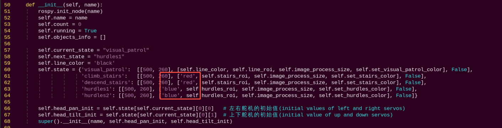

(4) Press the key **i** to enter insert mode. You will see a dictionary entry with a key named **"climb_stairs"**, which specifies the color for hurdle recognition. Locate the color value assigned to **"hurdles"** (e.g., **"blue"**) and change it to **"green"**.

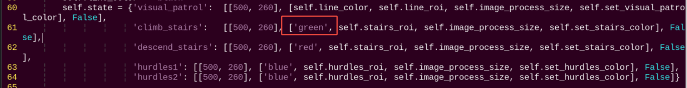

(5) Press **Esc** to exit insert mode, then type the following command to save and exit: First type a colon using English input, then type **wq**.

```
:wq
```

* **Add New Detection Color**

In addition to the three built-in basic colors, you can also configure other recognizable colors. First, refer to the tutorial in [6. ROS+OpenCV Vision Recognition & Tracking -> 6.2 Color Threshold Adjustment](6.ROS+OpenCV_Vision_Recognition_Tracking.md#color-threshold-adjustment), and add your custom color. Then, as shown in [9.5.6 Feature Extensions -> Change the Default Step Detection Color](#anchor_9_5_6), modify the color parameter in the `hurdles` key to the value of the custom color.